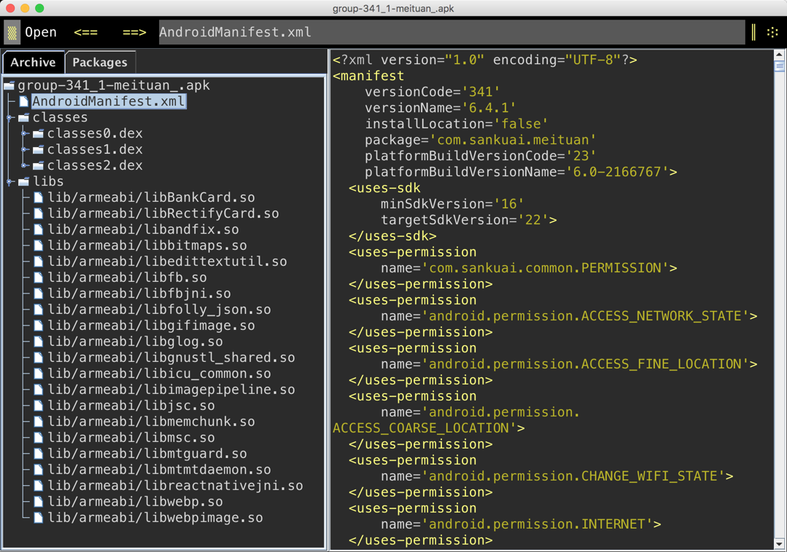
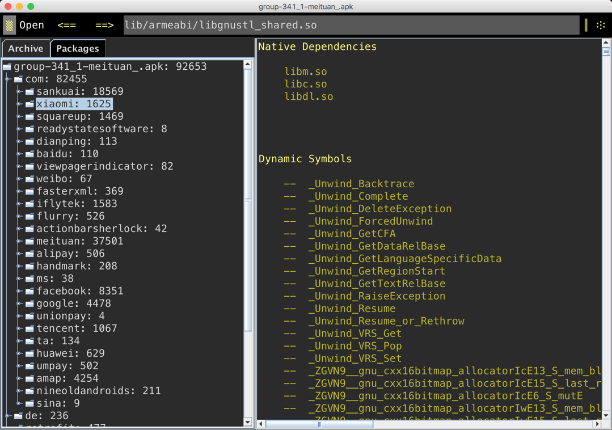
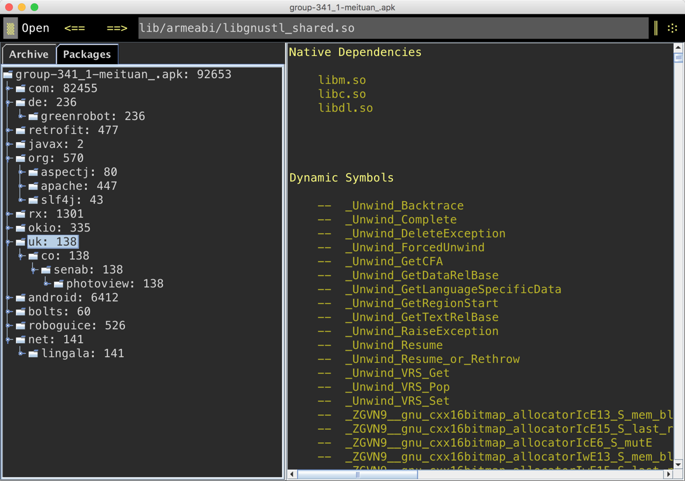

App应用本质上是一个apk包, 即一个zip包, 可以直接显示其中的内容. 通过apk文件, 我们可以获知apk的版本信息, so库和第三方库, 并了解一些主流公司的应用框架. 分析工具主要是ApkTool和[ClassyShark](https://github.com/google/android-classyshark), 本人比较喜欢Shark工具. 我使用ClassyShark分析一下美团的框架, 也可以按照这个原理, 分析其他App的基本架构.

让我们看看, 有什么好玩且有用的架构信息?

<!-- more -->
> 更多: http://www.wangchenlong.org/

---

# 框架

美团的编译版本非常新, 紧跟时代, 23版本(Android 6.0).
但是TargetSdkVersion仍然是22版本(Android 5.1), 推荐使用5.1.
最低版本是16(Android 4.1), 4.1以下的手机无法运行.

使用MultiDex, 而且竟然有三个, 说明方法非常之多, 可能引入了大量第三方库.

---

# 方法

文件非常之多, 共有9万多个, 使用了大量的主流开源库, 非常易于管理.
我来介绍一下这些库, 不认识的朋友最好学习一下, 这些都是非常流行的开源库.

## com
sankuai, 美团的核心类;
xiaomi, 小米推送(xiaomi);
squareup, Squareup的EventBus(otto), okhttp, picasso;
readystatesoftware, 状态栏沉浸效果库;
dianping, 大众点评, 已经合并一家, 东西也得用;
baidu, 百度地图;
viewpagerindicator, viewpager的滚动效果, 早期实现toolbar效果的方式;
weibo, 新浪微博;
fasterxml, 即jackson, json解析库; 
iflytek, 科大讯飞的语音集成;
flurry, 统计库;
actionbarsherlock, actionBar的Tab效果, 和viewpagerindicator一起用.
meituan, 美团的核心类;
alipay, 支付宝;
handmark, 下拉刷新;
ms, Square的TextView文字扩展库, ExpandableTextView;
facebook, 图片处理库, 美团有大量的图片需求;
google, Gson解析库, ZXing二维码识别库, Dagger依赖注入;
unionpay, 银联支付;
tencent, 腾讯的QQ和微信;
ta, utdid2, 消息推送;
huawei, 华为手机的推送机制;
umpay, 联动优势支付;
amap, 高德地图;
nineoldandroids, ListView项的左右删除;
sina, 新浪登录;

## 其他

de.greenrobot, EventBus, 又一个, 看来代码开发还很混乱, 没有统一;
retrofit, 网络库, 2.x版本, 升级很及时;
javax, java注释, 配合dagger2使用;
org, apache的一些库;
rx, rxjava异步请求处理;
okio, square的存储数据读写库;
uk, photoview实现图片放大缩小功能;
android, 这个才是android提供的支持库;
bolts, 异步task关联库.
roboguice, Google Guice, Google的依赖注入库, 和Dagger2重复;
net, lingala, 处理zip压缩的库.

---

# 总结

美团是一个技术非常Open的公司, 使用主流的开源框架, 减少开发成本. 
这些开源库, 我也均有涉猎, 都是非常优秀的库, 不了解的朋友可以学习一下.
虽然方法很多, 但是使用开源库, 会大大减少开发成本, 增强应用稳定性.
[Dagger](http://www.wangchenlong.org/2016/03/16/1602/use-dagger-first/)+[Retrofit](http://www.wangchenlong.org/2016/03/16/1602/use-retrofit-first/)+RxJava的业内标配, 美团也有所涉猎, 非常不错.

> 备注:
[ClassyShark](https://github.com/google/android-classyshark)是查看Apk信息的软件, 功能非常强大, 省去反编译的步骤. 主要功能: 查看MultiDex的dex信息, 使用的NativeLibrary, 类和方法的数量统计.

---
通过分析App的开源库, 是不是感觉架构其实也不是那么难, 多涉猎些东西, 使用起来才会得心应手. 武器库里多些趁手的武器, 打仗才会无往不胜.

OK, that's all! Enjoy it.

---

**生活**

> 有技术又要有生活, 美让生活更精彩!

女生, 让自己更职业受欢迎! 男生, 送给心中女神或未来女友! [好物](http://s.click.taobao.com/t?e=m%3D2%26s%3DYP1A9x0y5JkcQipKwQzePOeEDrYVVa64K7Vc7tFgwiHjf2vlNIV67kQWqc2Cz%2FyXgL3PGTnk8MZ1lK%2FY7wPaoHeQQxhDmA6IAe67oaxDEWp4DvOxtwmulw7xj6wcTA8j6o2k%2BacbIDj65kFcG2Yt8DM15gorQ8UE&pvid=12_117.73.144.43_401_1458429238541)

---

> 原始地址: 
> http://www.wangchenlong.org/2016/03/17/1602/analyze-app-framework/
> 欢迎Follow我的[GitHub](https://github.com/SpikeKing), 关注我的[简书](http://www.jianshu.com/users/e2b4dd6d3eb4/latest_articles), [微博](http://weibo.com/u/2852941392), [CSDN](http://blog.csdn.net/caroline_wendy), [掘金](http://gold.xitu.io/#/user/56de98c2f3609a005442ec58), [Slides](https://slides.com/spikeking). 
> 我已委托“维权骑士”为我的文章进行维权行动. 未经授权, 禁止转载, 授权或合作请留言.

