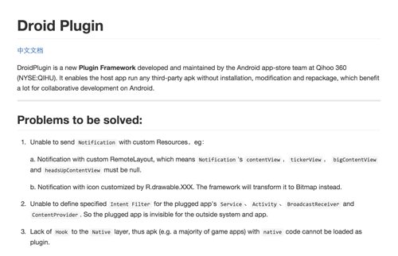
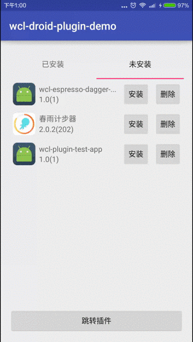

随着应用的体积越来越大, 插件化也逐渐受到关注, [参考](http://geek.csdn.net/news/detail/49303). 应用插件化把模块完全解耦, 使用下载更新的方式, 扩展应用, 是平台化类应用的必然选择. 国内很多公司实现了各式各样的方法, 奇虎360的DroidPlugin是比较有意思的一个, 使用预占位的方式注册四大组件, 实现热更新, [参考](http://blog.csdn.net/yzzst/article/details/48093567), 也可以直接读源码理解实现逻辑.

<!-- more -->
> 更多: http://www.wangchenlong.org/



Talk is cheap, show you the code! 如何把DroidPlugin用起来呢? 这是我比较关注的事情, 开源的Demo写的如此悲伤, 我来重新梳理一下, 又添加了几个功能测试. 引入DroidPlugin作为Submodule的依赖.

本文源码的Github[下载地址](https://github.com/SpikeKing/wcl-droid-plugin-demo) 和 [测试Apk](https://github.com/SpikeKing/wcl-plugin-test-app).

> 使用方法, 生成测试apk, 和其他若干apk, 放入Download文件夹下.
> adb命令: ``adb push app-debug.apk /sdcard/Download/app-debug.apk``
> 确保Download文件夹下, 有``.apk``后缀名的文件.

主要
(1) 插件安装后, 可以直接启动, 不需要任何冗余操作.
(2) 宿主的权限要多于插件的权限, 否则会权限不足.
(3) 宿主和插件, 可以通过隐式Intent进行通信.



# 主页

使用TabLayout+ViewPager的架构, 包含两个页面, 一个是安装\删除页面, 另一个是启动\卸载页面. 为了测试和插件的Intent通信, 增加跳转功能和显示信息功能.

```Java
/**
 * 主页面, 使用TabLayout+ViewPager.
 * 子页面, 使用RecyclerView.
 *
 * @author wangchenlong
 */
public class MainActivity extends AppCompatActivity {

    @Bind(R.id.main_tl_tabs) TabLayout mTlTabs; // Tabs
    @Bind(R.id.main_vp_container) ViewPager mVpContainer; // ViewPager
    @Bind(R.id.main_b_goto) Button mBGoto; // 跳转插件的按钮

    @Override
    protected void onCreate(Bundle savedInstanceState) {
        super.onCreate(savedInstanceState);
        setContentView(R.layout.activity_main);
        ButterKnife.bind(this);

        PagerAdapter adapter = new PagerAdapter(getSupportFragmentManager());
        mVpContainer.setAdapter(adapter);
        mTlTabs.setupWithViewPager(mVpContainer);
        mBGoto.setOnClickListener(this::gotoPlugin);

        Intent intent = getIntent();
        if (intent != null && intent.getStringExtra(PluginConsts.MASTER_EXTRA_STRING) != null) {
            String words = "say: " + intent.getStringExtra(PluginConsts.MASTER_EXTRA_STRING);
            Toast.makeText(this, words, Toast.LENGTH_SHORT).show();
        }
    }

    // 跳转控件
    private void gotoPlugin(View view) {
        if (isActionAvailable(view.getContext(), PluginConsts.PLUGIN_ACTION_MAIN)) {
            Intent intent = new Intent(PluginConsts.PLUGIN_ACTION_MAIN);
            intent.putExtra(PluginConsts.PLUGIN_EXTRA_STRING, "Hello, My Plugin!");
            startActivity(intent);
        } else {
            Toast.makeText(view.getContext(), "跳转失败", Toast.LENGTH_SHORT).show();
        }
    }

    // Action是否允许
    public static boolean isActionAvailable(Context context, String action) {
        Intent intent = new Intent(action);
        return context.getPackageManager().resolveActivity(intent, 0) != null;
    }
}
```

ViewPager适配器
```Java
/**
 * ViewPager的适配器
 * <p>
 * Created by wangchenlong on 16/1/8.
 */
public class PagerAdapter extends FragmentPagerAdapter {

    private static final String[] TITLES = {
            "已安装",
            "未安装"
    };

    public PagerAdapter(FragmentManager fm) {
        super(fm);
    }

    @Override public Fragment getItem(int position) {
        if (position == 0) {
            return new StartFragment(); // 已安装页
        } else {
            return new StoreFragment(); // 想要安装页
        }
    }

    @Override public int getCount() {
        return TITLES.length;
    }

    @Override
    public CharSequence getPageTitle(int position) {
        return TITLES[position];
    }
}
```

# 加载页
显示Download文件夹下的Apk信息. 使用RecyclerView实现apk列表, 复用Adapter, 标志位(ApkOperator.TYPE_STORE)区分页面. 使用Rx异步扫描Download文件夹, 添加至列表. 接收服务连接状态, 成功则自动显示Apk.
```Java
/**
 * 安装Apk的页面, 使用RecyclerView.
 * <p>
 * Created by wangchenlong on 16/1/8.
 */
public class StoreFragment extends Fragment {

    @Bind(R.id.list_rv_recycler) RecyclerView mRvRecycler;

    private ApkListAdapter mStoreAdapter; // 适配器

    // 服务连接
    private ServiceConnection mServiceConnection = new ServiceConnection() {
        @Override public void onServiceConnected(ComponentName name, IBinder service) {
            loadApks();
        }

        @Override public void onServiceDisconnected(ComponentName name) {

        }
    };

    @Nullable @Override
    public View onCreateView(LayoutInflater inflater, ViewGroup container, Bundle savedInstanceState) {
        View view = inflater.inflate(R.layout.fragment_list, container, false);
        ButterKnife.bind(this, view);
        return view;
    }

    @Override public void onViewCreated(View view, Bundle savedInstanceState) {
        super.onViewCreated(view, savedInstanceState);
        LinearLayoutManager llm = new LinearLayoutManager(view.getContext());
        llm.setOrientation(LinearLayoutManager.VERTICAL);
        mRvRecycler.setLayoutManager(llm);

        mStoreAdapter = new ApkListAdapter(getActivity(), ApkOperator.TYPE_STORE);
        mRvRecycler.setAdapter(mStoreAdapter);

        if (PluginManager.getInstance().isConnected()) {
            loadApks();
        } else {
            PluginManager.getInstance().addServiceConnection(mServiceConnection);
        }
    }

    // 加载Apk
    private void loadApks() {
        // 异步加载, 防止Apk过多, 影响速度
        Observable.just(getApkFromDownload())
                .subscribeOn(Schedulers.newThread())
                .observeOn(AndroidSchedulers.mainThread())
                .subscribe(mStoreAdapter::setApkItems);
    }

    // 从下载文件夹获取Apk
    private ArrayList<ApkItem> getApkFromDownload() {
        File files = Environment.getExternalStoragePublicDirectory(Environment.DIRECTORY_DOWNLOADS);
        PackageManager pm = getActivity().getPackageManager();
        ArrayList<ApkItem> apkItems = new ArrayList<>();
        for (File file : files.listFiles()) {
            if (file.exists() && file.getPath().toLowerCase().endsWith(".apk")) {
                final PackageInfo info = pm.getPackageArchiveInfo(file.getPath(), 0);
                apkItems.add(new ApkItem(pm, info, file.getPath()));
            }
        }
        return apkItems;
    }

    @Override
    public void onDestroyView() {
        super.onDestroyView();
        ButterKnife.unbind(this);
        PluginManager.getInstance().removeServiceConnection(mServiceConnection);
    }
}
```
适配器, 负责列表显示, 操作交由ViewHolder进行处理.
```Java
/**
 * 启动的适配器
 * <p>
 * Created by wangchenlong on 16/1/13.
 */
public class ApkListAdapter extends RecyclerView.Adapter<ApkItemViewHolder> {

    private ArrayList<ApkItem> mApkItems;
    private Activity mActivity;
    private int mType; // 类型

    public ApkListAdapter(Activity activity, int type) {
        mActivity = activity;
        mApkItems = new ArrayList<>();
        mType = type;
    }

    public void setApkItems(ArrayList<ApkItem> apkItems) {
        mApkItems = apkItems;
        notifyDataSetChanged();
    }

    public void addApkItem(ApkItem apkItem) {
        mApkItems.add(apkItem);
        notifyItemInserted(mApkItems.size() + 1);
    }

    public void removeApkItem(ApkItem apkItem) {
        mApkItems.remove(apkItem);
        notifyDataSetChanged();
    }

    public ApkItem getApkItem(int index) {
        return mApkItems.get(index);
    }

    public int getCount() {
        return mApkItems.size();
    }

    @Override public ApkItemViewHolder onCreateViewHolder(ViewGroup parent, int viewType) {
        View view = LayoutInflater.from(parent.getContext()).inflate(R.layout.apk_item, parent, false);
        return new ApkItemViewHolder(mActivity, view, mType, this::removeApkItem);
    }

    @Override public void onBindViewHolder(ApkItemViewHolder holder, int position) {
        holder.bindTo(mApkItems.get(position));
    }

    @Override public int getItemCount() {
        return mApkItems.size();
    }
}
```
> 注意, 在设置Item时, 需要刷新列表, 使用notifyDataSetChanged或notifyItemInserted.

ViewHolder, 控制列表点击事件, 根据页面类型, 修改调用方法.
```Java
/**
 * Apk的列表, 参考: R.layout.apk_item
 * <p>
 * Created by wangchenlong on 16/1/13.
 */
public class ApkItemViewHolder extends RecyclerView.ViewHolder {

    @Bind(R.id.apk_item_iv_icon) ImageView mIvIcon; // 图标
    @Bind(R.id.apk_item_tv_title) TextView mTvTitle; // 标题
    @Bind(R.id.apk_item_tv_version) TextView mTvVersion; // 版本号
    @Bind(R.id.apk_item_b_do) Button mBDo; // 确定按钮
    @Bind(R.id.apk_item_b_undo) Button mBUndo; // 取消按钮

    private ApkItem mApkItem; // Apk项
    private Context mContext; // 上下文
    private ApkOperator mApkOperator; // Apk操作
    private int mType; // 类型

    /**
     * 初始化ViewHolder
     *
     * @param activity Dialog绑定Activity
     * @param itemView 项视图
     * @param type     类型, 加载或启动
     * @param callback 删除Item的调用
     */
    public ApkItemViewHolder(Activity activity, View itemView
            , int type, ApkOperator.RemoveCallback callback) {
        super(itemView);
        ButterKnife.bind(this, itemView);
        mContext = activity.getApplicationContext();
        mApkOperator = new ApkOperator(activity, callback); // Apk操作
        mType = type; // 类型
    }

    // 绑定ViewHolder
    public void bindTo(ApkItem apkItem) {
        mApkItem = apkItem;

        mIvIcon.setImageDrawable(apkItem.icon);
        mTvTitle.setText(apkItem.title);
        mTvVersion.setText(String.format("%s(%s)", apkItem.versionName, apkItem.versionCode));

        // 修改文字
        if (mType == ApkOperator.TYPE_STORE) {
            mBUndo.setText("删除");
            mBDo.setText("安装");
        } else if (mType == ApkOperator.TYPE_START) {
            mBUndo.setText("卸载");
            mBDo.setText("启动");
        }

        mBUndo.setOnClickListener(this::onClickEvent);
        mBDo.setOnClickListener(this::onClickEvent);
    }

    // 点击事件
    private void onClickEvent(View view) {
        if (mType == ApkOperator.TYPE_STORE) {
            if (view.equals(mBUndo)) {
                mApkOperator.deleteApk(mApkItem);
            } else if (view.equals(mBDo)) {
                // 安装Apk较慢需要使用异步线程
                new InstallApkTask().execute();
            }
        } else if (mType == ApkOperator.TYPE_START) {
            if (view.equals(mBUndo)) {
                mApkOperator.uninstallApk(mApkItem);
            } else if (view.equals(mBDo)) {
                mApkOperator.openApk(mApkItem);
            }
        }
    }

    // 安装Apk的线程, Rx无法使用.
    private class InstallApkTask extends AsyncTask<Void, Void, String> {
        @Override
        protected void onPostExecute(String v) {
            Toast.makeText(mContext, v, Toast.LENGTH_LONG).show();
        }

        @Override
        protected String doInBackground(Void... params) {
            return mApkOperator.installApk(mApkItem);
        }
    }
}
```

> 注意, 安装Apk使用异步线程(AsyncTask), 不能使用Rx.

# 启动页
启动页面, 显示已安装的Apk, 包含启动和卸载功能. 与安装页不同, 额外增加一个接收器, 负责接收安装成功之后的广播, 用于更新列表.
```Java
/**
 * 启动Apk页面
 * <p>
 * Created by wangchenlong on 16/1/13.
 */
public class StartFragment extends Fragment {

    @Bind(R.id.list_rv_recycler) RecyclerView mRvRecycler;

    private ApkListAdapter mApkListAdapter; // 适配器
    private InstallApkReceiver mInstallApkReceiver; // Apk安装接收器

    // 服务连接
    private final ServiceConnection mServiceConnection = new ServiceConnection() {
        @Override public void onServiceConnected(ComponentName name, IBinder service) {
            loadApks();
        }

        @Override public void onServiceDisconnected(ComponentName name) {

        }
    };

    @Nullable @Override
    public View onCreateView(LayoutInflater inflater, ViewGroup container, Bundle savedInstanceState) {
        View view = inflater.inflate(R.layout.fragment_list, container, false);
        ButterKnife.bind(this, view);
        return view;
    }

    @Override public void onViewCreated(View view, Bundle savedInstanceState) {
        super.onViewCreated(view, savedInstanceState);
        LinearLayoutManager llm = new LinearLayoutManager(view.getContext());
        llm.setOrientation(LinearLayoutManager.VERTICAL);
        mRvRecycler.setLayoutManager(llm);

        mApkListAdapter = new ApkListAdapter(getActivity(), ApkOperator.TYPE_START);
        mRvRecycler.setAdapter(mApkListAdapter);

        mInstallApkReceiver = new InstallApkReceiver();

        mInstallApkReceiver.registerReceiver(this.getActivity());

        if (PluginManager.getInstance().isConnected()) {
            loadApks();
        } else {
            PluginManager.getInstance().addServiceConnection(mServiceConnection);
        }
    }

    @Override
    public void onDestroyView() {
        super.onDestroyView();
        ButterKnife.unbind(this);
        mInstallApkReceiver.unregisterReceiver(this.getActivity());
    }

    // 加载Apk
    private void loadApks() {
        // 异步加载, 防止Apk过多, 影响速度
        Observable.just(getApkFromInstall())
                .subscribeOn(Schedulers.newThread())
                .observeOn(AndroidSchedulers.mainThread())
                .subscribe(mApkListAdapter::setApkItems);
    }

    // 获取安装中获取Apk
    private ArrayList<ApkItem> getApkFromInstall() {
        ArrayList<ApkItem> apkItems = new ArrayList<>();
        try {
            final List<PackageInfo> infos = PluginManager.getInstance().getInstalledPackages(0);
            if (infos == null) {
                return apkItems;
            }
            final PackageManager pm = getActivity().getPackageManager();
            // noinspection all
            for (final PackageInfo info : infos) {
                apkItems.add(new ApkItem(pm, info, info.applicationInfo.publicSourceDir));
            }
        } catch (RemoteException e) {
            e.printStackTrace();
        }

        return apkItems;
    }

    // 安装Apk接收器
    private class InstallApkReceiver extends BroadcastReceiver {

        // 注册监听
        public void registerReceiver(Context context) {
            IntentFilter filter = new IntentFilter();
            filter.addAction(PluginManager.ACTION_PACKAGE_ADDED);
            filter.addAction(PluginManager.ACTION_PACKAGE_REMOVED);
            filter.addDataScheme("package");
            context.registerReceiver(this, filter);
        }

        // 关闭监听
        public void unregisterReceiver(Context context) {
            context.unregisterReceiver(this);
        }

        @Override
        public void onReceive(Context context, Intent intent) {
            // 监听添加和删除事件
            if (PluginManager.ACTION_PACKAGE_ADDED.equals(intent.getAction())) {
                try {
                    PackageManager pm = getActivity().getPackageManager();
                    String pkg = intent.getData().getAuthority();
                    PackageInfo info = PluginManager.getInstance().getPackageInfo(pkg, 0);
                    mApkListAdapter.addApkItem(new ApkItem(pm, info, info.applicationInfo.publicSourceDir));
                } catch (Exception e) {
                    e.printStackTrace();
                }
            } else if (PluginManager.ACTION_PACKAGE_REMOVED.equals(intent.getAction())) {
                String pkg = intent.getData().getAuthority();
                int num = mApkListAdapter.getCount();
                ApkItem removedItem = null;
                for (int i = 0; i < num; i++) {
                    ApkItem item = mApkListAdapter.getApkItem(i);
                    if (TextUtils.equals(item.packageInfo.packageName, pkg)) {
                        removedItem = item;
                        break;
                    }
                }
                if (removedItem != null) {
                    mApkListAdapter.removeApkItem(removedItem);
                }
            }
        }
    }
}
```

> 复用Adapter和ViewHolder, 代码简介之道.

# 方法类
四大方法, 安装\删除\启动\卸载, 在删除和卸载时, 均会提示Dialog. 注意的是安装Apk, 耗时较长, 需要使用异步线程.
```Java
/**
 * Apk操作, 包含删除\安装\卸载\启动Apk
 * <p>
 * Created by wangchenlong on 16/1/13.
 */
public class ApkOperator {

    public static final int TYPE_STORE = 0; // 存储Apk
    public static final int TYPE_START = 1; // 启动Apk

    private Activity mActivity;       // 绑定Dialog
    private RemoveCallback mCallback; // 删除Item的回调

    public ApkOperator(Activity activity, RemoveCallback callback) {
        mActivity = activity;
        mCallback = callback;
    }

    // 删除Apk
    public void deleteApk(final ApkItem item) {
        AlertDialog.Builder builder = new AlertDialog.Builder(mActivity);
        builder.setTitle("警告");
        builder.setMessage("你确定要删除" + item.title + "么？");
        builder.setNegativeButton("删除", (dialog, which) -> {
            if (new File(item.apkFile).delete()) {
                mCallback.removeItem(item);
                Toast.makeText(mActivity, "删除成功", Toast.LENGTH_SHORT).show();
            } else {
                Toast.makeText(mActivity, "删除失败", Toast.LENGTH_SHORT).show();
            }
        });
        builder.setNeutralButton("取消", null);
        builder.show();
    }

    /**
     * 安装Apk, 耗时较长, 需要使用异步线程
     *
     * @param item Apk项
     * @return [0:成功, 1:已安装, -1:连接失败, -2:权限不足, -3:安装失败]
     */
    public String installApk(final ApkItem item) {
        if (!PluginManager.getInstance().isConnected()) {
            return "连接失败"; // 连接失败
        }

        if (isApkInstall(item)) {
            return "已安装"; // 已安装
        }

        try {
            int result = PluginManager.getInstance().installPackage(item.apkFile, 0);
            boolean isRequestPermission = (result == PluginManager.INSTALL_FAILED_NO_REQUESTEDPERMISSION);
            if (isRequestPermission) {
                return "权限不足";
            }
        } catch (RemoteException e) {
            e.printStackTrace();
            return "安装失败";
        }

        return "成功";
    }

    // Apk是否安装
    private boolean isApkInstall(ApkItem apkItem) {
        PackageInfo info = null;
        try {
            info = PluginManager.getInstance().getPackageInfo(apkItem.packageInfo.packageName, 0);
        } catch (RemoteException e) {
            e.printStackTrace();
        }
        return info != null;
    }

    // 卸载Apk
    public void uninstallApk(final ApkItem item) {
        AlertDialog.Builder builder = new AlertDialog.Builder(mActivity);
        builder.setTitle("警告");
        builder.setMessage("警告，你确定要卸载" + item.title + "么？");
        builder.setNegativeButton("卸载", (dialog, which) -> {
            if (!PluginManager.getInstance().isConnected()) {
                Toast.makeText(mActivity, "服务未连接", Toast.LENGTH_SHORT).show();
            } else {
                try {
                    PluginManager.getInstance().deletePackage(item.packageInfo.packageName, 0);
                    mCallback.removeItem(item);
                    Toast.makeText(mActivity, "卸载完成", Toast.LENGTH_SHORT).show();
                } catch (RemoteException e) {
                    e.printStackTrace();
                }
            }
        });
        builder.setNeutralButton("取消", null);
        builder.show();
    }

    // 打开Apk
    public void openApk(final ApkItem item) {
        PackageManager pm = mActivity.getPackageManager();
        Intent intent = pm.getLaunchIntentForPackage(item.packageInfo.packageName);
        intent.addFlags(Intent.FLAG_ACTIVITY_NEW_TASK);
        mActivity.startActivity(intent);
    }

    // 删除Item回调, Adapter调用删除Item
    public interface RemoveCallback {
        void removeItem(ApkItem apkItem);
    }
}
```

# 互动Apk

为了测试DroidPlugin的一些特性, 又写了一个[测试Apk](https://github.com/SpikeKing/wcl-plugin-test-app).
测试插件和宿主的通信, 插件类的生命周期.

```Java
public class MainActivity extends AppCompatActivity {

    private static final String TAG = "DEBUG-WCL: " + MainActivity.class.getSimpleName();

    @Bind(R.id.main_b_goto_master) Button mBGotoMaster;

    @Override
    protected void onCreate(Bundle savedInstanceState) {
        super.onCreate(savedInstanceState);
        setContentView(R.layout.activity_main);
        ButterKnife.bind(this);

        Intent intent = getIntent();
        if (intent != null && intent.getStringExtra(PluginConsts.PLUGIN_EXTRA_STRING) != null) {
            String words = "say: " + intent.getStringExtra(PluginConsts.PLUGIN_EXTRA_STRING);
            Toast.makeText(this, words, Toast.LENGTH_SHORT).show();
        }

        mBGotoMaster.setOnClickListener(this::gotoMaster);

        Log.d(TAG, "onCreate"); // 测试生命周期
    }

    @Override protected void onDestroy() {
        super.onDestroy();
        Log.d(TAG, "onDestroy"); // 测试生命周期
    }

    // 跳转控件
    private void gotoMaster(View view) {
        if (isActionAvailable(view.getContext(), PluginConsts.MASTER_ACTION_MAIN)) {
            Intent intent = new Intent(PluginConsts.MASTER_ACTION_MAIN);
            intent.putExtra(PluginConsts.MASTER_EXTRA_STRING, "Hello, My Master!");
            startActivity(intent);
        } else {
            Toast.makeText(view.getContext(), "跳转失败", Toast.LENGTH_SHORT).show();
        }
    }

    // Action是否允许
    public static boolean isActionAvailable(Context context, String action) {
        Intent intent = new Intent(action);
        return context.getPackageManager().resolveActivity(intent, 0) != null;
    }
}
```

有时间可以再试试其他公司的插件化.

OK, that's all! Enjoy it.

---

**生活**

> 有技术又要有生活, 美让生活更精彩!

[](http://s.click.taobao.com/t?e=m%3D2%26s%3D8i0Flhyf1gMcQipKwQzePOeEDrYVVa64K7Vc7tFgwiHjf2vlNIV67tcy0Em%2BHXdDPx3RkWSJTux1lK%2FY7wPaoHeQQxhDmA6IAe67oaxDEWp4DvOxtwmul7QjEVeo0%2FYmgE9V3e8PmOyIiYuNitTbzwyW7mQwqx7e&pvid=12_117.73.144.43_401_1458429238541)

女生, 让自己更职业受欢迎! [好物](http://s.click.taobao.com/t?e=m%3D2%26s%3D8i0Flhyf1gMcQipKwQzePOeEDrYVVa64K7Vc7tFgwiHjf2vlNIV67tcy0Em%2BHXdDPx3RkWSJTux1lK%2FY7wPaoHeQQxhDmA6IAe67oaxDEWp4DvOxtwmul7QjEVeo0%2FYmgE9V3e8PmOyIiYuNitTbzwyW7mQwqx7e&pvid=12_117.73.144.43_401_1458429238541)

---

> 原始地址: 
> http://www.wangchenlong.org/2016/03/18/1602/apply-droid-plugin/
> 欢迎Follow我的[GitHub](https://github.com/SpikeKing), 关注我的[简书](http://www.jianshu.com/users/e2b4dd6d3eb4/latest_articles), [微博](http://weibo.com/u/2852941392), [CSDN](http://blog.csdn.net/caroline_wendy), [掘金](http://gold.xitu.io/#/user/56de98c2f3609a005442ec58), [Slides](https://slides.com/spikeking). 
> 我已委托“维权骑士”为我的文章进行维权行动. 未经授权, 禁止转载, 授权或合作请留言.

