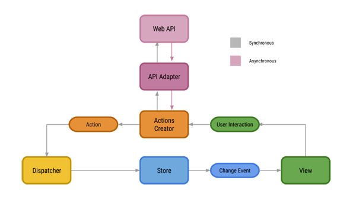
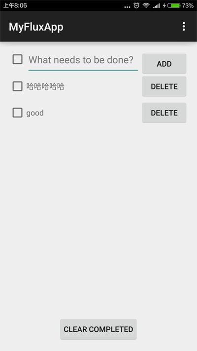

*任何架构最终目的都是让程序更加有序, 功能便于扩展, Bug容易追踪.*

Facebook使用Flux架构来构建客户端的Web应用. Flux架构并不是为移动端设计的, 但是我们仍然可以采用这个思想在Android端使用. Flux是数据驱动型架构, 在以数据为核心的场景中使用非常合适, 不过Facebook好像把**Flux架构**应用于所有产品, **无论是前端还是移动端**. 最新Facebook开发的[ReactNative](https://github.com/facebook/react-native)中, 就是使用Flux架构为核心, 也是开源的, 可以阅读RN的代码了解所有内容.

>Flux架构, 顾名思义表示*流*, 是以数据流为基础. 

<!-- more -->
> 更多: http://www.wangchenlong.org/

---

本文源码的Github[下载地址](https://github.com/SpikeKing/MyFluxApp-TodoList)

> 欢迎Follow我的GitHub: https://github.com/SpikeKing

基本架构模型如图:



模型主要分为四个模块:
1. **View**: 视图, 根据**用户交互(Use Interaction)**的内容创建响应事件, 调用**活动创建器(ActionCreator)**的方法, 发送响应用户操作的事件.
2. **ActionCreator**: 活动创建器, 把活动的类型和数据发送给**调度器(Dispatcher)**, 根据类型和数据创建**活动(Action)**. 也可以进行**网络操作(WebApi)**, 完成后, 再发送数据.
3. **Dispatcher**: 调度器, 把接收到的活动, 通过**总线(EventBus)**, 把活动发送出去, 由**存储器(Store)**根据活动的类型和数据, 修改数据模型.
4. **Store**: 存储器, 维护特定的数据状态, 接收总线分发的活动, 根据活动类型执行不同的业务逻辑. 在完成时, 发出**数据修改(ChangeEvent)**的事件, 视图监听这一事件, 更新显示内容.

Talk is cheap, show you the code.
只有通过代码才能真正的了解架构的意义, 我写了一个基于Flux架构的ToDoList.
页面发送各种**增删改查**的事件, 通过**Flux模型**, 修改本地存储的数据, 再反馈回页面.



---

# 视图

**视图(View)**: 视图是一个Activity, 负责响应**用户交互(Use Interaction)**的事件, 发送到给**活动创建器(ActionCreator)**; 同时接收**修改数据(ChangeEvent)**事件, 更新页面.

```java
public class MainActivity extends AppCompatActivity {

    // ...

    // 添加数据
    @OnClick(R.id.main_add) void addItem() {
        addTodo(); // 添加TodoItem
        resetMainInput(); // 重置输入框
    }

    // 选中数据
    @OnClick(R.id.main_checkbox) void checkItem() {
        checkAll(); // 所有Item项改变选中状态
    }

    @Override
    protected void onCreate(Bundle savedInstanceState) {
        super.onCreate(savedInstanceState);
        setContentView(R.layout.activity_main); // 设置Layout
        ButterKnife.bind(this); // 绑定ButterKnife

        initDependencies(); // 创建Flux的核心管理类

        // 设置RecyclerView
        mMainList.setLayoutManager(new LinearLayoutManager(this));
        mListAdapter = new RecyclerAdapter(sActionsCreator);
        mMainList.setAdapter(mListAdapter);
    }

    // 初始化: Dispatcher调度器, Action事件, Store状态
    private void initDependencies() {
        sDispatcher = Dispatcher.getInstance(new Bus());
        sActionsCreator = ActionsCreator.getInstance(sDispatcher);
        sTodoStore = TodoStore.getInstance(sDispatcher);
    }

    @Override
    protected void onResume() {
        super.onResume();

        // 把订阅接口注册到EventBus
        sDispatcher.register(this);
        sDispatcher.register(sTodoStore);
    }

    @Override
    protected void onPause() {
        super.onPause();

        // 解除订阅接口
        sDispatcher.unregister(this);
        sDispatcher.unregister(sTodoStore);
    }

    // 改变改变所有状态(ActionsCreator)
    private void checkAll() {
        sActionsCreator.toggleCompleteAll();
    }

    // 清理选中的项(ActionsCreator)
    private void clearCompleted() {
        sActionsCreator.destroyCompleted();
    }

    // ...

    // 接收事件的改变
    @Subscribe
    public void onTodoStoreChange(TodoStore.TodoStoreChangeEvent event) {
        updateUI();
    }

    // 更新UI, 核心方法
    private void updateUI() {
        // 设置适配器数据, 每次更新TodoStore的状态
        mListAdapter.setItems(sTodoStore.getTodos());
        ...
    }
}
```

> 代码比较长, 只截取了一部分. 其中View的核心部分:
> (1) **活动创建器(ActionsCreator)**, 负责响应用户交互事件, 如**checkAll()**等.
> (2) **接收状态修改(onTodoStoreChange)**, 负责接收**存储器(Store)**修改完成的数据, 并**更新页面(updateUI)**.

---

# 活动创建器

**活动创建器(ActionsCreator)**: 主要负责根据**响应事件**的**类型**和**数据**, 发送相应的活动到**调度器(Dispatch)**. 也可以发送**网络请求(WebApi)**, 获取异步数据, 完成后再发送.
```java
public class ActionsCreator {
    private static ActionsCreator sInstance;
    private final Dispatcher mDispatcher;

    private ActionsCreator(Dispatcher dispatcher) {
        mDispatcher = dispatcher;
    }

    public static ActionsCreator getInstance(Dispatcher dispatcher) {
        if (sInstance == null) {
            sInstance = new ActionsCreator(dispatcher);
        }
        return sInstance;
    }

    public void create(String text) {
        mDispatcher.dispatch(TodoActions.TODO_CREATE, TodoActions.KEY_TEXT, text);
    }

    public void destroy(long id) {
        mDispatcher.dispatch(TodoActions.TODO_DESTROY, TodoActions.KEY_ID, id);
    }

    // ...
}
```
> 活动在**调度器(Dispatcher)**中创建.
> **活动创造器(ActionsCreator)**, 第一个参数是**类型**, 其余参数是数据, 即**配对的Key-Value**.

---

# 调度器

调度器(Dispatcher), 是事件分发的中心, 使用**事件总线(EventBus)**, 发送活动到**存储器(Store)**. 存储器根据活动的类型和数据, 进行处理.
```java
public class Dispatcher {

    private final Bus mBus;
    private static Dispatcher sInstance;

    private Dispatcher(Bus bus) {
        mBus = bus;
    }

    public static Dispatcher getInstance(Bus bus) {
        if (sInstance == null) {
            sInstance = new Dispatcher(bus);
        }
        return sInstance;
    }

    public void register(final Object cls) {
        mBus.register(cls);
    }

    public void unregister(final Object cls) {
        mBus.unregister(cls);
    }

    private void post(final Object event) {
        mBus.post(event);
    }

    // 每个状态改变都需要发送事件, 由View相应, 做出更改
    public void emitChange(Store.StoreChangeEvent o) {
        post(o);
    }

    /**
     * 调度核心函数
     *
     * @param type 调度类型
     * @param data 数据(Key, Value)
     */
    public void dispatch(String type, Object... data) {
        if (type == null || type.isEmpty()) { // 数据空
            throw new IllegalArgumentException("Type must not be empty");
        }
        if (data.length % 2 != 0) { // 非Key-Value
            throw new IllegalArgumentException("Data must be a valid list of key,value pairs");
        }

        Action.Builder actionBuilder = Action.type(type);

        int i = 0;
        while (i < data.length) {
            String key = (String) data[i++];
            Object value = data[i++];
            actionBuilder.bundle(key, value); // 放置键值
        }

        // 发送到EventBus
        post(actionBuilder.build());
    }

}
```
> 调度器使用**事件总线(EventBus)**分发数据, 有两个核心部分: 
(1) **dispatch()**: 把**类型和数据**组成**活动(Action)**, 发送至**事件总线(EventBus)**, 由**存储器(Store)**负责处理.
(2) **emitChange()**: 把**存储器(Store)**处理完的状态和数据, 发送修改通知至**事件总线(EventBus)**, 提示**视图(View)**进行**更新页面(UpdateUI)**.

---

# 存储器

**存储器(Store)**: 负责存储数据和状态, 接收**事件总线(EventBus)**上的修改通知, 根据**类型**, 修改**数据和状态**. 也可以使用数据库和本地存储.
```java
public class TodoStore extends Store {
    private static TodoStore sInstance; // 单例
    private final List<Todo> mTodos; // 数据
    private Todo lastDeleted; // 状态: 最近一次删除数据

    private TodoStore(Dispatcher dispatcher) {
        super(dispatcher);
        mTodos = new ArrayList<>();
    }

    public static TodoStore getInstance(Dispatcher dispatcher) {
        if (sInstance == null) {
            sInstance = new TodoStore(dispatcher);
        }
        return sInstance;
    }

    @Override
    @Subscribe
    public void onAction(Action action) {
        long id;
        switch (action.getType()) {
            case TodoActions.TODO_CREATE:
                String text = ((String) action.getData().get(TodoActions.KEY_TEXT));
                create(text);
                emitStoreChange(); // 发生改变事件
                break;

            case TodoActions.TODO_DESTROY:
                id = ((long) action.getData().get(TodoActions.KEY_ID));
                destroy(id);
                emitStoreChange();
                break;

            case TodoActions.TODO_UNDO_DESTROY:
                undoDestroy();
                emitStoreChange();
                break;
            // ...
        }
    }

    private void destroyCompleted() {
        Iterator<Todo> iter = mTodos.iterator();
        while (iter.hasNext()) {
            Todo todo = iter.next();
            if (todo.isComplete()) {
                iter.remove();
            }
        }
    }

    // ...

    @Override
    public StoreChangeEvent changeEvent() {
        return new TodoStoreChangeEvent();
    }
}
```
> **存储器(Store)**的核心是**onAction()方法**, 获得**事件总线(EventBus)**的通知, 修改数据, 完成后调用**emitStoreChange()方法**, 通知**视图(View)**进行**数据更新(UpdateUI)**.

---

整套的循环逻辑都已经完成, 清晰可见, 这就是架构的好处吧.
> Flux: View -> Action -> Dispatcher -> Store -> View.

想更多的了解Flux架构, [Facebook](https://facebook.github.io/flux/docs/overview.html)和[参考](http://lgvalle.xyz/2015/08/04/flux-architecture/).

OK, that's all! Enjoy it!

> 原始地址: 
> http://www.wangchenlong.org/2016/03/12/1602/apply-flux-architecture/
> 欢迎Follow我的[GitHub](https://github.com/SpikeKing), 关注我的[简书](http://www.jianshu.com/users/e2b4dd6d3eb4/latest_articles), [微博](http://weibo.com/u/2852941392), [CSDN](http://blog.csdn.net/caroline_wendy), [掘金](http://gold.xitu.io/#/user/56de98c2f3609a005442ec58), [Slides](https://slides.com/spikeking). 
> 我已委托“维权骑士”为我的文章进行维权行动. 未经授权, 禁止转载, 授权或合作请留言.
