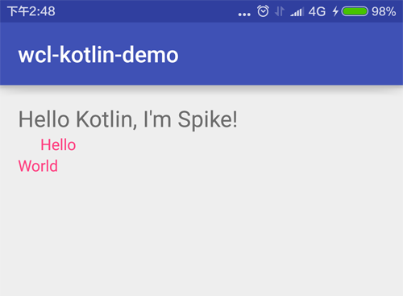

Kotlin由JetBrains公司推出, 是兼容Java的一种编程语言, 也可以用来开发Android. Kotlin的代码简洁, 非常优雅, 对于Android也是非常友好, 拥有大量新语言特性, 适合开发. 

分为两个部分:
基础[参考](http://www.wangchenlong.org/2016/03/15/1602/kotlin-first/): **初探与集成Android项目**
扩展[参考](http://www.wangchenlong.org/2016/03/15/1602/kotlin-extends-point/): **优雅地扩展类的方法和属性**

<!-- more -->
> 更多: http://www.wangchenlong.org/


我来讲三个特性, 做一点有意思的东西.
(1) 类型安全的构建模式
(2) 扩展函数
(3) 扩展属性

本文源码的Github[下载地址](https://github.com/SpikeKing/wcl-kotlin-demo)

---

# 类型安全的构建模式

**类型安全的构建模式**, 即**Type-Safe Builder Pattern**, 类似模板. 
可以用于构建任意类型的Android视图的实例. 

创建View的模板.
```kotlin
    // View的构建
    inline fun <reified TV : View> Context.v(init: TV.() -> Unit): TV {
        val constr = TV::class.java.getConstructor(Context::class.java);
        val view = constr.newInstance(this);
        view.init();
        return view;
    }
```
> ``<reified TV : View>``指定参数类型, 必须继承于View.
> 创建默认构造器, 创建View实例, 初始化, 返回. 

使用View模板创建TextView.
```kotlin
    // 设置属性
    v<TextView> {
        layoutParams = LayoutParams(LayoutParams.WRAP_CONTENT, LayoutParams.WRAP_CONTENT)
        text = "Hello"
        setTextColor(ContextCompat.getColor(applicationContext, R.color.colorAccent))
    }
```
> Kotlin集成很多内部属性, 如applicationContext, 使用非常方便.

创建ViewGroup模板
```kotlin
    // ViewGroup的模板
    inline fun <reified V : View> ViewGroup.v(init: V.() -> Unit): V {
        val constr = V::class.java.getConstructor(Context::class.java);
        val view = constr.newInstance(context);
        addView(view)
        view.init();
        return view;
    }
```
> 与View的模板类似, 替换Context为ViewGroup.

使用ViewGroup模板创建LinearLayout.
```kotlin
// 自定义LinearLayout, val是不可改变immutable, var是可以改变mutable.
val view = v<LinearLayout> {
    layoutParams = LayoutParams(LayoutParams.WRAP_CONTENT, LayoutParams.WRAP_CONTENT)
    orientation = LinearLayout.VERTICAL

    // 设置属性
    v<TextView> {
        layoutParams = LayoutParams(LayoutParams.WRAP_CONTENT, LayoutParams.WRAP_CONTENT)
        text = "Hello"
        setTextColor(ContextCompat.getColor(applicationContext, R.color.colorAccent))
        padLeft = dp_i(20.0f);
    }

    v<TextView> {
        layoutParams = LayoutParams(LayoutParams.WRAP_CONTENT, LayoutParams.WRAP_CONTENT)
        text = "World"
        setTextColor(ContextCompat.getColor(applicationContext, R.color.colorAccent))
    }
}
```

---

# 扩展函数
扩展类的函数, 即**Extension Function**, 可以在已有类中添加新的方法, 比继承更加简洁和优雅.

扩展View的dp转换函数.
```kotlin
// 使用扩展函数
fun View.dp_f(dp: Float): Float {
    // 引用View的context
    return TypedValue.applyDimension(
            TypedValue.COMPLEX_UNIT_DIP, dp, context.resources.displayMetrics)
}

// 转换Int
fun View.dp_i(dp: Float): Int {
    return dp_f(dp).toInt()
}
```
> 类似于方法, 使用"**Parent.**"的方式, 添加新的方法.
> 上节的模板Context.v和ViewGroup.v都是扩展函数.
> context和resources都是Kotlin直接提供的变量.

使用扩展函数
```kotlin
// 设置属性
v<TextView> {
    layoutParams = LayoutParams(LayoutParams.WRAP_CONTENT, LayoutParams.WRAP_CONTENT)
    text = "Hello"
    setTextColor(ContextCompat.getColor(applicationContext, R.color.colorAccent))
    padLeft = dp_i(20.0f);
}
```
> dp_i即扩展函数, 可以在**当前类**中, View的内部直接调用.

---

# 扩展属性
扩展属性, 即**Extension Property**, 即把某些函数添加为数据, 使用"=", 直接设置或使用.

设置View的padLeft属性.
```kotlin
// 使用扩展属性(extension property)
var View.padLeft: Int
    set(value) {
        setPadding(value, paddingTop, paddingRight, paddingBottom)
    }

    get() {
        return paddingLeft
    }
```

> 使用扩展方法, 并指定set和get方法, 即可变成属性.
> 与函数不同的是没有"**()**", 即不需要参数.

---

效果



Kotlin的这些扩展技巧, 当编写简单的程序时, 可能没有什么用处; 当项目非常复杂时, 灵活地扩展类可以减少大量耦合.

OK, that's all! Enjoy it!

---

> 原始地址: 
> http://www.wangchenlong.org/2016/03/15/1602/kotlin-extends-point/
> 欢迎Follow我的[GitHub](https://github.com/SpikeKing), 关注我的[简书](http://www.jianshu.com/users/e2b4dd6d3eb4/latest_articles), [微博](http://weibo.com/u/2852941392), [CSDN](http://blog.csdn.net/caroline_wendy), [掘金](http://gold.xitu.io/#/user/56de98c2f3609a005442ec58), [Slides](https://slides.com/spikeking). 
> 我已委托“维权骑士”为我的文章进行维权行动. 未经授权, 禁止转载, 授权或合作请留言.