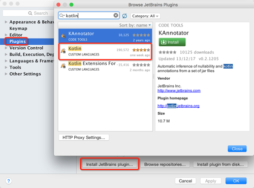

[Kotlin](https://kotlinlang.org/)是基于JVM的编程语言, 由JetBrains公司开发, 目前已经[开源](https://github.com/JetBrains/kotlin). 
IntelliJ IDEA, PyCharm, Android Studio等IDE, 就是出自于JetBrains公司.

Kotlin介绍:
*Statically typed programming language for the JVM, Android and the browser. 100% interoperable with Java™*
> 用于JVM, Android, 网页等的静态类型编程语言, 完全兼容Java.

<!-- more -->
> 更多: http://www.wangchenlong.org/


Kotlin作为Android社区当前比较热的讨论内容, 已经发布了**1.0.0-rc版本**, 并且得到了一些Google开发者的关注, 毕竟Android Studio是基于JetBrains的框架. Java文件可以直接转换为Kotlin文件,  两者具有非常强的互操作性. 

更多关于Kotlin 1.0-rc的介绍, [参考](http://blog.jetbrains.com/kotlin/2016/02/kotlin-1-0-released-pragmatic-language-for-jvm-and-android/).

Kotlin内容分为两个部分:
基础[参考](http://www.wangchenlong.org/2016/03/15/1602/kotlin-first/): **初探与集成Android项目**
扩展[参考](http://www.wangchenlong.org/2016/03/15/1602/kotlin-extends-point/): **优雅地扩展类的方法和属性**

Talk is cheap, show you the code. 让我们来看看如何在已有Android项目中集成Kotlin.

本文示例的Github[下载地址](https://github.com/SpikeKing/wcl-kotlin-demo)

---
# 配置项目

新建一个空的Android项目. 
项目gradle: 
添加Kotlin的版本号, 使用最新的**1.0.0-rc**, 保持版本一致.
```gradle
buildscript {
    ext.kotlin_version = "1.0.0-rc-1036"
}
```

模块gradle: 
添加类的路径, **必须**在模块中添加, 因为**kotlin-android-extensions**插件会使用依赖.
```gradle 
buildscript {
    repositories {
        jcenter()
    }
    dependencies {
        classpath "org.jetbrains.kotlin:kotlin-gradle-plugin:$kotlin_version"
    }
}
```

添加Kotlin支持Android的插件
```gradle
apply plugin: 'kotlin-android'
apply plugin: 'kotlin-android-extensions'
```
> kotlin-android用于编译Android代码, kotlin-android-extensions用于扩展绑定关系.

添加Java的编译路径, 在main中创建kotlin文件夹, 用于存放kotlin代码(建议).
```gradle
    sourceSets {
        main.java.srcDirs += 'src/main/kotlin'
    }
```

添加maven的依赖.
```gradle
dependencies {
    compile "org.jetbrains.kotlin:kotlin-stdlib:$kotlin_version"
}
```

完整的支持Kotlin的模块build.gradle.
```gradle
buildscript {
    repositories {
        jcenter()
    }
    dependencies {
        classpath "org.jetbrains.kotlin:kotlin-gradle-plugin:$kotlin_version"
    }
}

apply plugin: 'com.android.application'
apply plugin: 'kotlin-android'
apply plugin: 'kotlin-android-extensions'

android {
    compileSdkVersion 23
    buildToolsVersion "23.0.2"

    defaultConfig {
        applicationId "me.chunyu.spike.wcl_kotlin_demo"
        minSdkVersion 14
        targetSdkVersion 23
        versionCode 1
        versionName "1.0"
    }
    buildTypes {
        release {
            minifyEnabled false
            proguardFiles getDefaultProguardFile('proguard-android.txt'), 'proguard-rules.pro'
        }
    }
    sourceSets {
        main.java.srcDirs += 'src/main/kotlin'
    }
}

dependencies {
    compile fileTree(dir: 'libs', include: ['*.jar'])
    testCompile 'junit:junit:4.12'
    compile 'com.android.support:appcompat-v7:23.1.1'
    compile "org.jetbrains.kotlin:kotlin-stdlib:$kotlin_version"
}
```

---

# 安装插件
Android Studio的Kotlin插件, 用于支持Kotlin的语言特性.
选择: Preferences -> Plugins -> Install JetBrains plugin -> kotlin.



> 只需要安装Kotlin即可, 因为Kotlin Extensions已经包含在Kotlin中了.

---

# 转换代码

选中需要转换的Java文件, 如**MainActivity.java**,
使用Command+Shift+A, 启动Action, 输入Convert, 找到命令, 即可转换, 如


或
选择Code -> Convert Java File to Kotlin File, 也可以使用快捷键.

把.kt的文件剪切到kotlin文件夹下, 即可使用.

> 推荐Kotlin文件和Java文件分开存放, 不过放在一起也可以使用.

---

# 添加资源

Kotlin的代码非常简洁, 设置属性也比较方便.
``` java
import android.support.v7.app.AppCompatActivity
import android.os.Bundle
import kotlinx.android.synthetic.main.activity_main.*

/**
 * Kotlin的主类, 添加设置属性.
 */
class MainActivity : AppCompatActivity() {
    override fun onCreate(savedInstanceState: Bundle?) {
        super.onCreate(savedInstanceState)
        setContentView(R.layout.activity_main)
        main_tv_message.text = "Hello Kotlin"
        main_tv_message.textSize = 20.0f
    }
}
```

> id是main_tv_message的TextView, 设置text为"Hello Kotlin".
> 代码风格与Python等脚本语言非常类似, 容易编写.

---

显示


[官方](https://kotlinlang.org/docs/tutorials/)提供了关于Kotlin比较丰富的讲解, 大家也可以阅读源码. Just for fun.

OK, that's all! Enjoy it!

> 原始地址: 
> http://www.wangchenlong.org/2016/03/15/1602/kotlin-first/
> 欢迎Follow我的[GitHub](https://github.com/SpikeKing), 关注我的[简书](http://www.jianshu.com/users/e2b4dd6d3eb4/latest_articles), [微博](http://weibo.com/u/2852941392), [CSDN](http://blog.csdn.net/caroline_wendy), [掘金](http://gold.xitu.io/#/user/56de98c2f3609a005442ec58), [Slides](https://slides.com/spikeking). 
> 我已委托“维权骑士”为我的文章进行维权行动. 未经授权, 禁止转载, 授权或合作请留言.