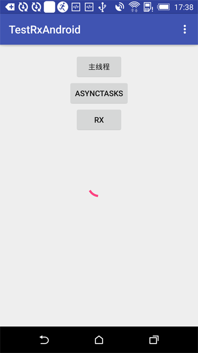

Rx表示响应式编程, 使用观察者模式, 以观察者(Observer)和订阅者(Subscriber)为基础的异步响应方式. 在Android编程时, 经常会使用异步线程处理耗时任务, RxAndroid是比较优雅的选择. 

<!-- more -->
> 更多: http://www.wangchenlong.org/

目前的异步编程方式都会导致一些问题, 如
```
(1) Asynctasks can easily lead to memory leaks.
(2) CursorLoaders with a ContentProvider require a large amount of configuration and boilerplate code to setup.
(3) Services are intended for longer running background tasks and not fast-finishing operations, such as making a network call or loading content from a database.
```

[RxAndroid](https://github.com/ReactiveX/RxAndroid)来源于RxJava, 在RxJava的基础上扩展了一些Android的功能, 已经发布1.0版本, 让我们来看看怎么用吧.

本文源码的GitHub[下载地址](https://github.com/SpikeKing/TestRxAndroidSample)

> 欢迎Follow我的GitHub: https://github.com/SpikeKing



---

# 配置

新建一个HelloWorld程序. 配置``build.gradle``, 添加RxAndroid库和Lamada表达式支持, 还有ButterKnife.
```gradle
plugins {
    id "me.tatarka.retrolambda" version "3.2.2"
}
...

android {
    ...
    compileOptions {
        sourceCompatibility JavaVersion.VERSION_1_8
        targetCompatibility JavaVersion.VERSION_1_8
    }
}

dependencies {
    ...
    compile 'com.jakewharton:butterknife:7.0.1'
    compile 'io.reactivex:rxandroid:1.0.1'
}
```

> Lambda表达式支持不是必须的, 可以让你代码更加简洁, 减少匿名类的出现.

---

# 页面

页面很简单, 设置三个按钮, 触发耗时的线程操作, 分别用主线程, ``Asynctasks``, Rx方式调用, 观察ProcessBar的状态.

```xml
<?xml version="1.0" encoding="utf-8"?>
<RelativeLayout
    xmlns:android="http://schemas.android.com/apk/res/android"
    xmlns:app="http://schemas.android.com/apk/res-auto"
    xmlns:tools="http://schemas.android.com/tools"
    android:layout_width="match_parent"
    android:layout_height="match_parent"
    android:paddingBottom="@dimen/activity_vertical_margin"
    android:paddingLeft="@dimen/activity_horizontal_margin"
    android:paddingRight="@dimen/activity_horizontal_margin"
    android:paddingTop="@dimen/activity_vertical_margin"
    app:layout_behavior="@string/appbar_scrolling_view_behavior"
    tools:context=".MainActivity"
    tools:showIn="@layout/activity_main">

    <Button
        android:id="@+id/main_thread"
        android:layout_width="wrap_content"
        android:layout_height="wrap_content"
        android:layout_centerHorizontal="true"
        android:text="主线程"/>

    <Button
        android:id="@+id/main_async"
        android:layout_width="wrap_content"
        android:layout_height="wrap_content"
        android:layout_below="@id/main_thread"
        android:layout_centerHorizontal="true"
        android:text="Asynctasks"/>

    <Button
        android:id="@+id/main_rx"
        android:layout_width="wrap_content"
        android:layout_height="wrap_content"
        android:layout_below="@id/main_async"
        android:layout_centerHorizontal="true"
        android:text="Rx"/>

    <ProgressBar
        android:layout_width="wrap_content"
        android:layout_height="wrap_content"
        android:indeterminate="true"
        android:layout_centerVertical="true"
        android:layout_centerHorizontal="true"/>

</RelativeLayout>
```

---

# 逻辑

添加一个阻塞任务, 执行5秒, 成功反馈.
```java
    // 长时间运行的任务
    private String longRunningOperation() {
        try {
            Thread.sleep(5000);
        } catch (Exception e) {
            Log.e("DEBUG", e.toString());
        }

        return "Complete!";
    }
```

主线程执行时, 会导致UI卡顿
```java
        // 线程运行
        mThreadButton.setOnClickListener(v -> {
            mThreadButton.setEnabled(false);
            longRunningOperation();
            Snackbar.make(mRootView, longRunningOperation(), Snackbar.LENGTH_LONG).show();
            mThreadButton.setEnabled(true);
        });
```

异步线程执行
```java
    // 异步线程
    private class MyAsyncTasks extends AsyncTask<Void, Void, String> {
        @Override
        protected void onPostExecute(String s) {
            Snackbar.make(mRootView, s, Snackbar.LENGTH_LONG).show();
            mAsyncButton.setEnabled(true);
        }

        @Override
        protected String doInBackground(Void... params) {
            return longRunningOperation();
        }
    }
```
```
        // 异步运行
        mAsyncButton.setOnClickListener(v -> {
            mAsyncButton.setEnabled(false);
            new MyAsyncTasks().execute();
        });
```
响应式方式执行, 使用IO线程处理, 主线程响应, 也可以使用其他线程处理, 如``Schedulers.io()``处理IO的线程, ``Schedulers.computation()``计算的线程, ``Schedulers.newThread()``新创建的线程.
```java
        // 使用IO线程处理, 主线程响应
        Observable<String> observable = Observable.create(new Observable.OnSubscribe<String>() {
            @Override
            public void call(Subscriber<? super String> subscriber) {
                subscriber.onNext(longRunningOperation());
                subscriber.onCompleted();
            }
        }).subscribeOn(Schedulers.io()).observeOn(AndroidSchedulers.mainThread());

        // 响应式运行
        mRxButton.setOnClickListener(v -> {
            mRxButton.setEnabled(false);
            observable.subscribe(new Subscriber<String>() {
                @Override
                public void onCompleted() {
                    mRxButton.setEnabled(true);
                }

                @Override
                public void onError(Throwable e) {

                }

                @Override
                public void onNext(String s) {
                    Snackbar.make(mRootView, s, Snackbar.LENGTH_LONG).show();
                }
            });
        });
```

---

使用响应式编程可以更好的处理内存泄露问题, 代码也更加优雅和可读, 选择执行线程和监听线程也更加方便. 在destroy时, 可以关闭正在执行的异步任务. 还有一些其他优势, 就参考其他吧. 使用响应式这种好用的异步编程方式吧.

OK, that's all. Enjoy it!

---

> 原始地址: 
> http://www.wangchenlong.org/2016/03/19/1602/rxandroid-async/
> 欢迎Follow我的[GitHub](https://github.com/SpikeKing), 关注我的[简书](http://www.jianshu.com/users/e2b4dd6d3eb4/latest_articles), [微博](http://weibo.com/u/2852941392), [CSDN](http://blog.csdn.net/caroline_wendy), [掘金](http://gold.xitu.io/#/user/56de98c2f3609a005442ec58), [Slides](https://slides.com/spikeking). 
> 我已委托“维权骑士”为我的文章进行维权行动. 未经授权, 禁止转载, 授权或合作请留言.


