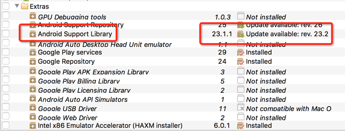
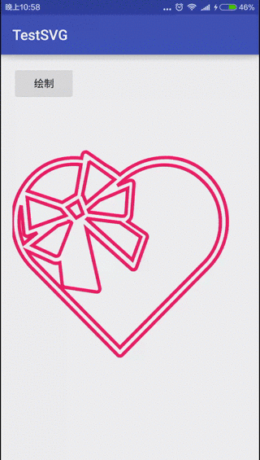

时代在发展, 技术在进步, Android的Vector图像的时代已经到来. 在Google的最新支持库v23.2中, AppCompat类已经使用Vector图像, 使得AAR包减少9%, 大约70KB, 惠及所有高版本的应用. 当然我们也可以使用Vector, 瘦身应用. Vector图像是SVG格式在Android的表现形式. SVG图像适应屏幕, 图片较小, 还有很多优点, [参考](https://zh.wikipedia.org/wiki/%E5%8F%AF%E7%B8%AE%E6%94%BE%E5%90%91%E9%87%8F%E5%9C%96%E5%BD%A2).

本文是第二节, 关于Vector动画.

<!-- more -->
> 更多: http://www.wangchenlong.org/

关于*Vectors时代*, 主要分为两节:
(1) 使用SVG格式图片生成Vector图像, 替换PNG, 缩减应用体积, [参考](http://www.wangchenlong.org/2016/03/15/1602/replace-svg-image/)
(2) 绘制Vector图像的路径动画, 增强用户体验, Android 5.0(21)以上系统使用.


SDK Manager提示支持库更新



使用Vector动画主要有三个部分: Vector图像, 路径动画, Animated-Vector图像.

本文源码的GitHub[下载地址](https://github.com/SpikeKing/TestSVG).

动画



---

## Vector图像

SVG格式的图片, 转换为Vector图像资源, 可以使用AS2.0的转换工具, 也可以是在线转换工具, [参考](http://www.wangchenlong.org/2016/03/15/1602/replace-svg-image/). 图像需要路径(path)样式, 便于绘制, 如
```xml
<vector xmlns:android="http://schemas.android.com/apk/res/android"
        android:width="256dp"
        android:height="256dp"
        android:viewportHeight="70"
        android:viewportWidth="70">
    <path
        android:name="heart1"
        android:pathData="..."
        android:strokeColor="#E91E63"
        android:strokeWidth="1"/>
    <path
        android:name="heart2"
        android:pathData="..."
        android:strokeColor="#E91E63"
        android:strokeWidth="1"/>
</vector>
```

---

## 路径动画

使用属性动画, 控制绘制状态.
```xml
<?xml version="1.0" encoding="utf-8"?>
<objectAnimator
    xmlns:android="http://schemas.android.com/apk/res/android"
    android:duration="6000"
    android:propertyName="trimPathEnd"
    android:valueFrom="0"
    android:valueTo="1"
    android:valueType="floatType"/>
```
> ObjectAnimator的trimPathEnd属性决定绘制path的数量, 其余部分不会绘制, 其取值区间是0到1. duration属性表示持续时间, 6000即6秒.

---

## Animated-Vector图像

把Vector图像的路径(path), 应用于路径动画(objectAnimator), 控制绘制.
```xml
<animated-vector
    xmlns:android="http://schemas.android.com/apk/res/android"
    android:drawable="@drawable/v_heard">
    <target
        android:name="heart1"
        android:animation="@animator/heart_animator"/>
    <target
        android:name="heart2"
        android:animation="@animator/heart_animator"/>
    ...
</animated-vector>
```

---

## 显示动画

需要Android 5.0(21)以上版本, 才能使用Vector动画, 即**AnimatedVectorDrawable**类.
```java
    // 只支持5.0以上.
    private void animateImage() {
        if (Build.VERSION.SDK_INT >= Build.VERSION_CODES.LOLLIPOP) {
            // 获取动画效果
            AnimatedVectorDrawable mAnimatedVectorDrawable = (AnimatedVectorDrawable)
                    ContextCompat.getDrawable(getApplication(), R.drawable.v_heard_animation);
            mIvImageView.setImageDrawable(mAnimatedVectorDrawable);
            if (mAnimatedVectorDrawable != null) {
                mAnimatedVectorDrawable.start();
            }
        }
    }
```

> AnimatedVectorDrawable的start方法就是动画启动功能.

---

使用Vector动画比gif动画节省应用资源, 可以给用户更好的体验. 推荐一个有趣的[SVG库](https://github.com/Pixplicity/sharp).

OK, that's all! Enjoy it!

> 原始地址: 
> http://www.wangchenlong.org/2016/03/15/1602/svg-path-animation/
> 欢迎Follow我的[GitHub](https://github.com/SpikeKing), 关注我的[简书](http://www.jianshu.com/users/e2b4dd6d3eb4/latest_articles), [微博](http://weibo.com/u/2852941392), [CSDN](http://blog.csdn.net/caroline_wendy), [掘金](http://gold.xitu.io/#/user/56de98c2f3609a005442ec58), [Slides](https://slides.com/spikeking). 
> 我已委托“维权骑士”为我的文章进行维权行动. 未经授权, 禁止转载, 授权或合作请留言.