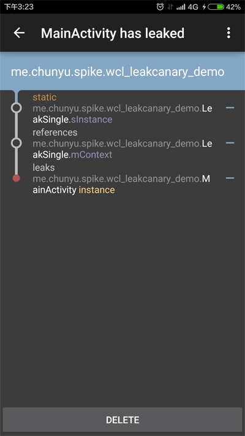

[LeakCanary](https://github.com/square/leakcanary)是检测应用内存泄露的工具, 内存泄露是Android开发中常见的问题, 会导致应用的稳定性下降. 本文介绍LeakCanary的使用方式.

<!-- more -->

> 注意: 集成到低版本应用, 会报出Bug.
> Error:(2) Error retrieving parent for item: No resource found that matches the given name 'android:Theme.Material'.
> 修改编译版本: **compileSdkVersion 21** 即可.

本文示例的Github[下载地址](https://github.com/SpikeKing/wcl-leakcanary-demo).


主要原因: 
生命周期较长的类使用Activity的Context, 导致Activity被引用, 无法被及时回收. 除了需要Activity页面支持的控件类, 如Dialog等, 其他全部使用应用的Context替换Activity的Context, 即Context.getApplicationContext(). 还有就是单例不要持有页面的控件, 单例持有控件, 控件附属页面, 最终页面得不到释放, 单例可以使用回调修改页面, 内部仅仅保留处理数据部分.

LeakCanary可以检查出页面的泄露问题, 并提供具体位置.



> 表明: LeakSingle的**静态单例sInstance**引用LeakSingle的**mContext**, 从而导致MainActivity的**instance**泄露.

内存泄露的原因已经理解了, 那么我来讲解一下如何检测应用吧.

---

# 依赖和引入

build.gradle的依赖.
```gradle
    debugCompile 'com.squareup.leakcanary:leakcanary-android:1.3.1' // or 1.4-beta1
    releaseCompile 'com.squareup.leakcanary:leakcanary-android-no-op:1.3.1' // or 1.4-beta1
    testCompile 'com.squareup.leakcanary:leakcanary-android-no-op:1.3.1' // or 1.4-beta1
```
引入应用
```java
public class DemoApplication extends Application {
    @Override public void onCreate() {
        super.onCreate();
        LeakCanary.install(this);
    }
}
```

> 配置非常简单, 会增加一个附属应用, 去掉Application的引用, 就可以移除LeakCanary.

---

# 泄露单例

泄露单例, 引入页面的TextView, 强制保留的父Activity, 会导致内存泄露, 可以在onDestroy时, 解引用避免. 
```java
/**
 * 泄露单例, 设计混乱, 单例只应该做事务性的工作, 页面操作应该使用回调.
 * 本示例仅做为反面示例, 切勿学习.
 * <p/>
 * Created by wangchenlong on 16/1/25.
 */
public class LeakSingle {
    private Context mContext;
    private TextView mTextView;

    private static LeakSingle sInstance;

    private LeakSingle(Context context) {
        mContext = context;
    }

    public static LeakSingle getInstance(Context context) {
        if (sInstance == null) {
            sInstance = new LeakSingle(context);
        }
        return sInstance;
    }

    // 内存泄露
    public void setRetainedTextView(TextView tv) {
        mTextView = tv;
        mTextView.setText(mContext.getString(R.string.app_name));
    }

    // 删除引用, 防止泄露
    public void removeRetainedTextView() {
        mTextView = null;
    }
}
```

> 单例只应该做事务性的工作, 页面操作应该使用回调, 不是引入控件. 本示例仅做为反面示例, 切勿学习.

---

# 泄露内存

调用单例, 两种引用都会导致内存泄露, 第一种是Context引用泄露, 第二种是子控件引用泄露. 避免方式是在onDestroy中, 清除引用. 

> **最优方式**: 
> 在单例中只执行事务性工作, 不执行具体页面操作, 可以使用接口回调, 异步处理.

```java
public class MainActivity extends AppCompatActivity {

    @Bind(R.id.main_tv_text) TextView mTvText;

    @Override
    protected void onCreate(Bundle savedInstanceState) {
        super.onCreate(savedInstanceState);
        setContentView(R.layout.activity_main);
        ButterKnife.bind(this);

        /**
         * me.chunyu.spike.wcl_leakcanary_demo.MainActivity has leaked:
         * GC ROOT static me.chunyu.spike.wcl_leakcanary_demo.LeakSingle.sInstance
         * references me.chunyu.spike.wcl_leakcanary_demo.LeakSingle.mContext
         * leaks me.chunyu.spike.wcl_leakcanary_demo.MainActivity instance
         */
//        LeakSingle.getInstance(this).setRetainedTextView(mTvText);

        /**
         * me.chunyu.spike.wcl_leakcanary_demo.MainActivity has leaked:
         * GC ROOT static me.chunyu.spike.wcl_leakcanary_demo.LeakSingle.sInstance
         * references me.chunyu.spike.wcl_leakcanary_demo.LeakSingle.mTextView
         * references android.support.v7.widget.AppCompatTextView.mContext
         * leaks me.chunyu.spike.wcl_leakcanary_demo.MainActivity instance
         */
        LeakSingle.getInstance(this.getApplication()).setRetainedTextView(mTvText);
    }

    @Override protected void onDestroy() {
        super.onDestroy();
        // 防止内泄露
        LeakSingle.getInstance(this.getApplication()).removeRetainedTextView();
    }
}
```

根据LeakCanary中的检测结果, 修改内存泄露的地方, 就可以完美的解决问题.

---

# 解析泄露位置

新手程序员经常会问我, 如何理解LeakCanary的错误信息, 我来举个例子讲解一些.
如图:


LeakCanary的内存泄露提示一般会包含三个部分:
**第一部分**(LeakSingle类的sInstance变量)引用**第二部分**(LeakSingle类的mContext变量), 导致**第三部分**(MainActivity类的实例instance)泄露.

应用最常见的泄露位置就是**Activity**的实例, 要手动或使用shell命令, 启动所有的Activity. LeakCanary判断时机是**Activity启动到结束**, 检测这一过程是否会发生内存泄露.

启动Activity的shell命令是
```shell
adb shell am start  -n [包名]/[Activity名]
```

---

内存泄露的问题对于应用的用户体验至关重要, 感谢Square的产品, 让这件事变得如此简单. 

OK, that's all! Enjoy it!

> 原始地址: 
> http://www.wangchenlong.org/2016/03/14/1602/use-leak-canary-check-memory/
> 欢迎Follow我的[GitHub](https://github.com/SpikeKing), 关注我的[简书](http://www.jianshu.com/users/e2b4dd6d3eb4/latest_articles), [微博](http://weibo.com/u/2852941392), [CSDN](http://blog.csdn.net/caroline_wendy), [掘金](http://gold.xitu.io/#/user/56de98c2f3609a005442ec58), [Slides](https://slides.com/spikeking). 
> 我已委托“维权骑士”为我的文章进行维权行动. 未经授权, 禁止转载, 授权或合作请留言.