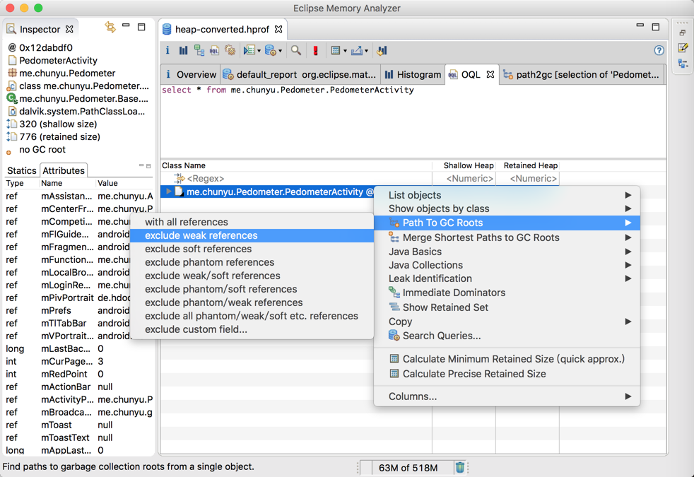

[**MAT(Memory Analyzer Tool)**](http://www.eclipse.org/mat/), 是著名的Android内存分析工具, 虽然[LeakCanary](http://www.wangchenlong.org/2016/03/14/1602/use-leak-canary-check-memory/)更加便捷, 但是MAT可以清楚地获知整体内存使用情况, 还是必须要掌握的. 我来讲解一下如何使用.

<!-- more -->
> 更多: http://www.wangchenlong.org/

---

# 内存文件

使用Android Studio底部的AndroidMonitor, 获取内存片段.
> 点击**Initial GC**回收内存, 使用应用, **Dump Java Heap**, 再次点击停止.


在Android的SDK中的platform-tools文件夹内, **hprof-conv**脚本把AS的内存格式转换为MAT的内存格式. 之后, 使用MAT打开文件.

使用命令
```
./hprof-conv path/file.hprof exitPath/heap-converted.hprof
```

---

# 分析内存

[下载](http://www.eclipse.org/mat/downloads.php)Eclipse的MAT工具. 
> 虽然是Eclipse的工具, 但是可以单独运行, 并不需要安装Eclipse.

打开内存片段, 选择内存报告.


内存整体情况.


选择直方图样式, 添加包名过滤.


---

# 判断泄露

Activity或View大于1个对象, 都有可能发生内存泄露.

显示内存的所有引用情况


> 逐个判断即可, 有些对象的引用较多, 可能是使用了数组, 并不一定是内存泄露.

显示单个类的内存情况


> 使用搜索功能, 输入SQL语句, 并执行. 红色叹号执行搜索.

通过观察, 我们发现微信mWXApi传入了错误的Context, 导致内存泄露.


代码
``` java
        mFriendsPlatform = new WXSharePlatform(mActivity, title, content,
                bitmap, pageUrl, SendMessageToWX.Req.WXSceneTimeline);
```

直接传入Activity导致内存泄露, 修改为getApplicationContext即可.

---

其实还比较复杂, 简单的方法是使用LeakCanary, [参考](http://www.wangchenlong.org/2016/03/14/1602/use-leak-canary-check-memory/). 

OK, that's all! Enjoy it!

> 原始地址: 
> http://www.wangchenlong.org/2016/03/14/1602/use-mat-analyze-memory/
> 欢迎Follow我的[GitHub](https://github.com/SpikeKing), 关注我的[简书](http://www.jianshu.com/users/e2b4dd6d3eb4/latest_articles), [微博](http://weibo.com/u/2852941392), [CSDN](http://blog.csdn.net/caroline_wendy), [掘金](http://gold.xitu.io/#/user/56de98c2f3609a005442ec58), [Slides](https://slides.com/spikeking). 
> 我已委托“维权骑士”为我的文章进行维权行动. 未经授权, 禁止转载, 授权或合作请留言.