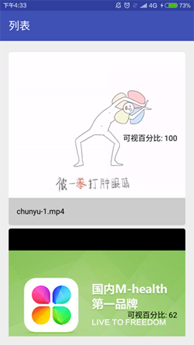

在应用的信息流中, 用户会分享视频, 连续展示, 这就需要处理视频滚动播放. 然而, 在列表视图(RecyclerView)中使用MediaPlayer播放视频时, 会产生一些问题, 即无法同步控制视频的播放和停止. 使用控件库可以解决这一问题. 

<!-- more -->
> 更多: http://www.wangchenlong.org/

**滚动播放功能**: 在页面中, 判断视频的可视比例, 最大视频项开始播放, 其余视频项关闭, 滚动中自动控制切换视频状态. 让我们来看看如何实现这一功能.

本文源码的GitHub[下载地址](https://github.com/SpikeKing/wcl-video-list-demo).

使用的视频管理库.
```gradle
    // 视频播放库
    compile 'com.github.danylovolokh:video-player-manager:0.2.0'
    compile 'com.github.danylovolokh:list-visibility-utils:0.2.0'
```

效果


---

# 基础

依赖注入, 图片加载, 和视频播放.
```gradle
    compile 'com.jakewharton:butterknife:7.0.1' // 依赖注入
    compile 'com.squareup.picasso:picasso:2.5.2' // 图片加载

    // 视频播放库
    compile 'com.github.danylovolokh:video-player-manager:0.2.0'
    compile 'com.github.danylovolokh:list-visibility-utils:0.2.0'
```

首页跳转到Fragment, 可以选择本地视频或者网络视频两种方式.
```java
public class MainActivity extends AppCompatActivity {

    public static final int LOCAL = 0; // 本地
    public static final int ONLINE = 1; // 在线

    @Bind(R.id.main_t_toolbar) Toolbar mTToolbar;

    @Override
    protected void onCreate(Bundle savedInstanceState) {
        super.onCreate(savedInstanceState);
        setContentView(R.layout.activity_main);
        ButterKnife.bind(this);

        mTToolbar.setTitle("列表");
        setSupportActionBar(mTToolbar);

        if (savedInstanceState == null) {
            getSupportFragmentManager()
                    .beginTransaction()
                    .replace(R.id.main_fl_container, VideoListFragment.newInstance(LOCAL))
                    .commit();
        }
    }

    @Override public boolean onCreateOptionsMenu(Menu menu) {
        getMenuInflater().inflate(R.menu.menu_main, menu);
        return true;
    }

    @Override public boolean onOptionsItemSelected(MenuItem item) {
        switch (item.getItemId()) {
            case R.id.enable_local_video:
                if (!item.isChecked()) {
                    getSupportFragmentManager()
                            .beginTransaction()
                            .replace(R.id.main_fl_container, VideoListFragment.newInstance(LOCAL))
                            .commit();
                }
                break;
            case R.id.enable_online_video:
                if (!item.isChecked()) {
                    getSupportFragmentManager()
                            .beginTransaction()
                            .replace(R.id.main_fl_container, VideoListFragment.newInstance(ONLINE))
                            .commit();
                }
                break;
        }

        item.setChecked(!item.isChecked());

        return true;
    }
}
```

> 使用Fragment的工厂模式添加参数. 通过菜单选项可以切换模式.
> **item.setChecked(!item.isChecked());**改变切换状态

---

# 视频列表

设置Video列表的Adapter, 添加滚动状态监听, 实现动态切换视频.
ItemsPositionGetter判断显示百分比, 提供回调控制视频状态.
通过Fragment的设置参数, 判断播放使用本地视频还是网络视频.

```java
    @Override public void onViewCreated(View view, @Nullable Bundle savedInstanceState) {
        super.onViewCreated(view, savedInstanceState);

        Bundle args = getArguments();
        if (args != null) {
            // 设置类型
            if (args.getInt(VIDEO_TYPE_ARG) == MainActivity.LOCAL) {
                initLocalVideoList();
            } else {
                initOnlineVideoList();
            }
        } else {
            initLocalVideoList();
        }

        mRvList.setHasFixedSize(true);

        mLayoutManager = new LinearLayoutManager(getActivity());
        mRvList.setLayoutManager(mLayoutManager);

        VideoListAdapter adapter = new VideoListAdapter(mList);

        mRvList.setAdapter(adapter);

        // 获取Item的位置
        mItemsPositionGetter = new RecyclerViewItemPositionGetter(mLayoutManager, mRvList);
        mRvList.addOnScrollListener(new RecyclerView.OnScrollListener() {
            @Override
            public void onScrollStateChanged(RecyclerView recyclerView, int scrollState) {
                mScrollState = scrollState;
                if (scrollState == RecyclerView.SCROLL_STATE_IDLE && !mList.isEmpty()) {
                    mVisibilityCalculator.onScrollStateIdle(
                            mItemsPositionGetter,
                            mLayoutManager.findFirstVisibleItemPosition(),
                            mLayoutManager.findLastVisibleItemPosition());
                }
            }

            @Override
            public void onScrolled(RecyclerView recyclerView, int dx, int dy) {
                if (!mList.isEmpty()) {
                    mVisibilityCalculator.onScroll(
                            mItemsPositionGetter,
                            mLayoutManager.findFirstVisibleItemPosition(),
                            mLayoutManager.findLastVisibleItemPosition() -
                                    mLayoutManager.findFirstVisibleItemPosition() + 1,
                            mScrollState);
                }
            }
        });
    }
```
> 视频列表主要是监听出现百分比, 动态切换视频.

---

# 适配器

适配器和ViewHolder. 绑定视频元素, 播放监听控制覆盖层的显示与隐藏.
```java
/**
 * 视频列表的适配器
 * <p/>
 * Created by wangchenlong on 16/1/27.
 */
public class VideoListAdapter extends RecyclerView.Adapter<VideoListAdapter.VideoViewHolder> {

    private final List<VideoListItem> mList; // 视频项列表

    // 构造器
    public VideoListAdapter(List<VideoListItem> list) {
        mList = list;
    }

    @Override
    public VideoListAdapter.VideoViewHolder onCreateViewHolder(ViewGroup parent, int viewType) {
        View view = LayoutInflater.from(parent.getContext()).inflate(R.layout.item_video, parent, false);

        // 必须要设置Tag, 否则无法显示
        VideoListAdapter.VideoViewHolder holder = new VideoListAdapter.VideoViewHolder(view);
        view.setTag(holder);

        return new VideoListAdapter.VideoViewHolder(view);
    }

    @Override
    public void onBindViewHolder(final VideoListAdapter.VideoViewHolder holder, int position) {
        VideoListItem videoItem = mList.get(position);
        holder.bindTo(videoItem);
    }

    @Override public int getItemCount() {
        return mList.size();
    }

    public static class VideoViewHolder extends RecyclerView.ViewHolder {
        @Bind(R.id.item_video_vpv_player) VideoPlayerView mVpvPlayer; // 播放控件
        @Bind(R.id.item_video_iv_cover) ImageView mIvCover; // 覆盖层
        @Bind(R.id.item_video_tv_title) TextView mTvTitle; // 标题
        @Bind(R.id.item_video_tv_percents) TextView mTvPercents; // 百分比

        private Context mContext;
        private MediaPlayerWrapper.MainThreadMediaPlayerListener mPlayerListener;

        public VideoViewHolder(View itemView) {
            super(itemView);
            ButterKnife.bind(this, itemView);

            mContext = itemView.getContext().getApplicationContext();
            mPlayerListener = new MediaPlayerWrapper.MainThreadMediaPlayerListener() {
                @Override
                public void onVideoSizeChangedMainThread(int width, int height) {
                }

                @Override
                public void onVideoPreparedMainThread() {
                    // 视频播放隐藏前图
                    mIvCover.setVisibility(View.INVISIBLE);
                }

                @Override
                public void onVideoCompletionMainThread() {
                }

                @Override
                public void onErrorMainThread(int what, int extra) {
                }

                @Override
                public void onBufferingUpdateMainThread(int percent) {
                }

                @Override
                public void onVideoStoppedMainThread() {
                    // 视频暂停显示前图
                    mIvCover.setVisibility(View.VISIBLE);
                }
            };

            mVpvPlayer.addMediaPlayerListener(mPlayerListener);
        }

        public void bindTo(VideoListItem vli) {
            mTvTitle.setText(vli.getTitle());
            mIvCover.setVisibility(View.VISIBLE);
            Picasso.with(mContext).load(vli.getImageResource()).into(mIvCover);
        }

        // 返回播放器
        public VideoPlayerView getVpvPlayer() {
            return mVpvPlayer;
        }

        // 返回百分比
        public TextView getTvPercents() {
            return mTvPercents;
        }
    }
}
```

> 注意, 在onCreateViewHolder中, 在View的Tag中绑定所属的ViewHolder. 视频项类VideoListItem会在Tag中提取ViewHolder, 设置显示效果.

---

# 视频项

通过ItemsPositionGetter类提供的接口, 返回显示比例, 根据显示区域的大小, 控制视频播放的启动还是停止, 实现自动切换视频状态功能.
```java
public abstract class VideoListItem implements VideoItem, ListItem {

    private final Rect mCurrentViewRect; // 当前视图的方框
    private final VideoPlayerManager<MetaData> mVideoPlayerManager; // 视频播放管理器
    private final String mTitle; // 标题
    @DrawableRes private final int mImageResource; // 图片资源

    // 构造器, 输入视频播放管理器
    public VideoListItem(
            VideoPlayerManager<MetaData> videoPlayerManager,
            String title,
            @DrawableRes int imageResource) {
        mVideoPlayerManager = videoPlayerManager;
        mTitle = title;
        mImageResource = imageResource;

        mCurrentViewRect = new Rect();
    }

    // 视频项的标题
    public String getTitle() {
        return mTitle;
    }

    // 视频项的背景
    public int getImageResource() {
        return mImageResource;
    }

    // 显示可视的百分比程度
    @Override public int getVisibilityPercents(View view) {
        int percents = 100;

        view.getLocalVisibleRect(mCurrentViewRect);
        int height = view.getHeight();

        if (viewIsPartiallyHiddenTop()) {
            percents = (height - mCurrentViewRect.top) * 100 / height;
        } else if (viewIsPartiallyHiddenBottom(height)) {
            percents = mCurrentViewRect.bottom * 100 / height;
        }

        // 设置百分比
        setVisibilityPercentsText(view, percents);

        return percents;
    }

    @Override public void setActive(View newActiveView, int newActiveViewPosition) {
        VideoListAdapter.VideoViewHolder viewHolder =
                (VideoListAdapter.VideoViewHolder) newActiveView.getTag();
        playNewVideo(new CurrentItemMetaData(newActiveViewPosition, newActiveView),
                viewHolder.getVpvPlayer(), mVideoPlayerManager);
    }

    @Override public void deactivate(View currentView, int position) {
        stopPlayback(mVideoPlayerManager);
    }

    @Override public void stopPlayback(VideoPlayerManager videoPlayerManager) {
        videoPlayerManager.stopAnyPlayback();
    }

    // 显示百分比
    private void setVisibilityPercentsText(View currentView, int percents) {
        VideoListAdapter.VideoViewHolder vh =
                (VideoListAdapter.VideoViewHolder) currentView.getTag();
        String percentsText = "可视百分比: " + String.valueOf(percents);
        vh.getTvPercents().setText(percentsText);
    }

    // 顶部出现
    private boolean viewIsPartiallyHiddenTop() {
        return mCurrentViewRect.top > 0;
    }

    // 底部出现
    private boolean viewIsPartiallyHiddenBottom(int height) {
        return mCurrentViewRect.bottom > 0 && mCurrentViewRect.bottom < height;
    }
}
```

---

动画效果


虽然使用视频播放的管理器, 但播放功能还是需要注意一些细节. 毕竟视频播放是个比较复杂的过程, 需要考虑的很多事情.

[参考](https://medium.com/@v.danylo/implementing-video-playback-in-a-scrolled-list-listview-recyclerview-d04bc2148429#.enwmpexzz)

OK, that's all! Enjoy it!

---

> 原始地址: 
> http://www.wangchenlong.org/2016/03/20/1603/202-implement-video-timeline/
> 欢迎Follow我的[GitHub](https://github.com/SpikeKing), 关注我的[简书](http://www.jianshu.com/users/e2b4dd6d3eb4/latest_articles), [微博](http://weibo.com/u/2852941392), [CSDN](http://blog.csdn.net/caroline_wendy), [掘金](http://gold.xitu.io/#/user/56de98c2f3609a005442ec58), [Slides](https://slides.com/spikeking). 
> 我已委托“维权骑士”为我的文章进行维权行动. 未经授权, 禁止转载, 授权或合作请留言.


