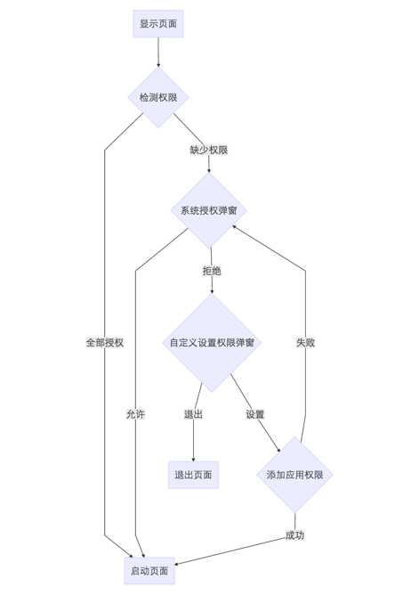
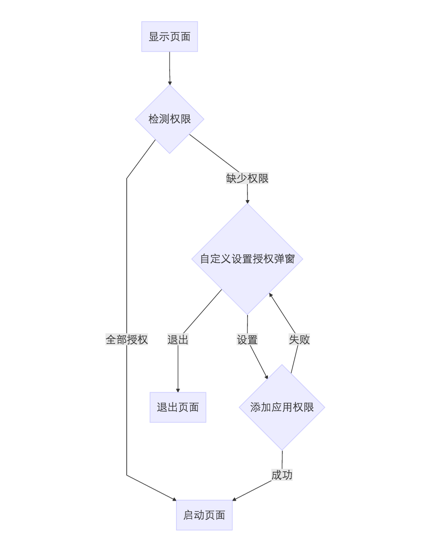
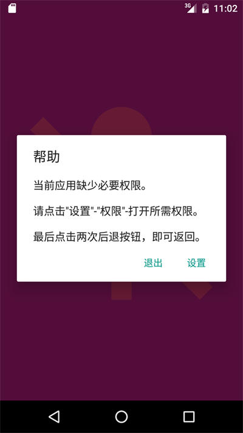
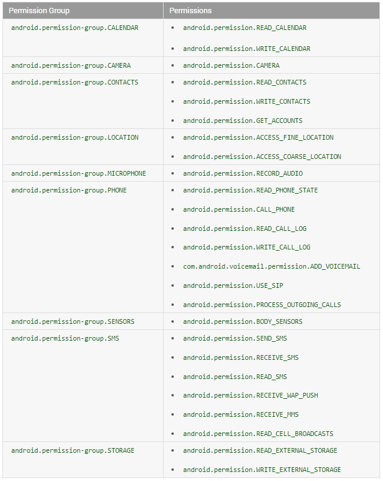

**Android 6.0**版本(Api 23)推出了很多新的特性, 大幅提升了用户体验, 同时也为程序员带来新的负担. **动态权限管理**就是这样, 一方面让用户更加容易的控制自己的隐私, 一方面需要重新适配应用权限. 时代总是不断发展, 程序总是以人为本, 让我们为应用添加动态权限管理吧! 这里提供了一个非常不错的解决方案, 提供源码, 项目可以直接使用.

<!-- more -->
> 更多: http://www.wangchenlong.org/


Android系统包含**默认的授权提示框**, 但是我们仍需要设置自己的页面. 原因是系统提供的授权框, 会有**不再提示**的选项. 如果用户选择, 则无法触发授权提示. 使用自定义的提示页面, 可以给予用户手动修改授权的指导.

本文源码的GitHub[下载地址](https://github.com/SpikeKing/wcl-permission-demo).

> 欢迎Follow我的GitHub: https://github.com/SpikeKing

在Api 23中, 权限需要动态获取, 核心权限必须满足. 标准流程:



如果用户点击, **不再提示**, 则系统授权弹窗将不会弹出. 流程变为:



流程就这些, 让我们看看代码吧.

---

# 权限

在AndroidManifest中, 添加两个权限, **录音**和**修改音量**.
```xml
    <!--危险权限-->
    <uses-permission android:name="android.permission.RECORD_AUDIO"/>

    <!--一般权限-->
    <uses-permission android:name="android.permission.MODIFY_AUDIO_SETTINGS"/>
```

> 危险权限必须要授权, 一般权限不需要.

检测权限类
```java
/**
 * 检查权限的工具类
 * <p/>
 * Created by wangchenlong on 16/1/26.
 */
public class PermissionsChecker {
    private final Context mContext;

    public PermissionsChecker(Context context) {
        mContext = context.getApplicationContext();
    }

    // 判断权限集合
    public boolean lacksPermissions(String... permissions) {
        for (String permission : permissions) {
            if (lacksPermission(permission)) {
                return true;
            }
        }
        return false;
    }

    // 判断是否缺少权限
    private boolean lacksPermission(String permission) {
        return ContextCompat.checkSelfPermission(mContext, permission) ==
                PackageManager.PERMISSION_DENIED;
    }
}
```

---

# 首页
假设首页需要使用权限, 在页面显示前, 即onResume时, 检测权限, 
如果缺少, 则进入权限获取页面; 接收返回值, 拒绝权限时, 直接关闭.
```java
public class MainActivity extends AppCompatActivity {

    private static final int REQUEST_CODE = 0; // 请求码

    // 所需的全部权限
    static final String[] PERMISSIONS = new String[]{
            Manifest.permission.RECORD_AUDIO,
            Manifest.permission.MODIFY_AUDIO_SETTINGS
    };

    @Bind(R.id.main_t_toolbar) Toolbar mTToolbar;

    private PermissionsChecker mPermissionsChecker; // 权限检测器

    @Override
    protected void onCreate(Bundle savedInstanceState) {
        super.onCreate(savedInstanceState);
        setContentView(R.layout.activity_main);
        ButterKnife.bind(this);

        setSupportActionBar(mTToolbar);

        mPermissionsChecker = new PermissionsChecker(this);
    }

    @Override protected void onResume() {
        super.onResume();

        // 缺少权限时, 进入权限配置页面
        if (mPermissionsChecker.lacksPermissions(PERMISSIONS)) {
            startPermissionsActivity();
        }
    }

    private void startPermissionsActivity() {
        PermissionsActivity.startActivityForResult(this, REQUEST_CODE, PERMISSIONS);
    }

    @Override protected void onActivityResult(int requestCode, int resultCode, Intent data) {
        super.onActivityResult(requestCode, resultCode, data);
        // 拒绝时, 关闭页面, 缺少主要权限, 无法运行
        if (requestCode == REQUEST_CODE && resultCode == PermissionsActivity.PERMISSIONS_DENIED) {
            finish();
        }
    }
}
```

> 核心权限必须满足, 如摄像应用, 摄像头权限就是必须的, 如果用户不予授权, 则直接关闭.

---

# 授权页

授权页, 首先使用系统默认的授权页, 当用户拒绝时, 指导用户手动设置, 当用户再次操作失败后, 返回继续提示. 用户手动退出授权页时, 给使用页发送授权失败的通知.
```java
/**
 * 权限获取页面
 * <p/>
 * Created by wangchenlong on 16/1/26.
 */
public class PermissionsActivity extends AppCompatActivity {

    public static final int PERMISSIONS_GRANTED = 0; // 权限授权
    public static final int PERMISSIONS_DENIED = 1; // 权限拒绝

    private static final int PERMISSION_REQUEST_CODE = 0; // 系统权限管理页面的参数
    private static final String EXTRA_PERMISSIONS =
            "me.chunyu.clwang.permission.extra_permission"; // 权限参数
    private static final String PACKAGE_URL_SCHEME = "package:"; // 方案

    private PermissionsChecker mChecker; // 权限检测器
    private boolean isRequireCheck; // 是否需要系统权限检测

    // 启动当前权限页面的公开接口
    public static void startActivityForResult(Activity activity, int requestCode, String... permissions) {
        Intent intent = new Intent(activity, PermissionsActivity.class);
        intent.putExtra(EXTRA_PERMISSIONS, permissions);
        ActivityCompat.startActivityForResult(activity, intent, requestCode, null);
    }

    @Override protected void onCreate(@Nullable Bundle savedInstanceState) {
        super.onCreate(savedInstanceState);
        if (getIntent() == null || !getIntent().hasExtra(EXTRA_PERMISSIONS)) {
            throw new RuntimeException("PermissionsActivity需要使用静态startActivityForResult方法启动!");
        }
        setContentView(R.layout.activity_permissions);

        mChecker = new PermissionsChecker(this);
        isRequireCheck = true;
    }

    @Override protected void onResume() {
        super.onResume();
        if (isRequireCheck) {
            String[] permissions = getPermissions();
            if (mChecker.lacksPermissions(permissions)) {
                requestPermissions(permissions); // 请求权限
            } else {
                allPermissionsGranted(); // 全部权限都已获取
            }
        } else {
            isRequireCheck = true;
        }
    }

    // 返回传递的权限参数
    private String[] getPermissions() {
        return getIntent().getStringArrayExtra(EXTRA_PERMISSIONS);
    }

    // 请求权限兼容低版本
    private void requestPermissions(String... permissions) {
        ActivityCompat.requestPermissions(this, permissions, PERMISSION_REQUEST_CODE);
    }

    // 全部权限均已获取
    private void allPermissionsGranted() {
        setResult(PERMISSIONS_GRANTED);
        finish();
    }

    /**
     * 用户权限处理,
     * 如果全部获取, 则直接过.
     * 如果权限缺失, 则提示Dialog.
     *
     * @param requestCode  请求码
     * @param permissions  权限
     * @param grantResults 结果
     */
    @Override
    public void onRequestPermissionsResult(int requestCode, @NonNull String[] permissions, @NonNull int[] grantResults) {
        if (requestCode == PERMISSION_REQUEST_CODE && hasAllPermissionsGranted(grantResults)) {
            isRequireCheck = true;
            allPermissionsGranted();
        } else {
            isRequireCheck = false;
            showMissingPermissionDialog();
        }
    }

    // 含有全部的权限
    private boolean hasAllPermissionsGranted(@NonNull int[] grantResults) {
        for (int grantResult : grantResults) {
            if (grantResult == PackageManager.PERMISSION_DENIED) {
                return false;
            }
        }
        return true;
    }

    // 显示缺失权限提示
    private void showMissingPermissionDialog() {
        AlertDialog.Builder builder = new AlertDialog.Builder(PermissionsActivity.this);
        builder.setTitle(R.string.help);
        builder.setMessage(R.string.string_help_text);

        // 拒绝, 退出应用
        builder.setNegativeButton(R.string.quit, new DialogInterface.OnClickListener() {
            @Override public void onClick(DialogInterface dialog, int which) {
                setResult(PERMISSIONS_DENIED);
                finish();
            }
        });

        builder.setPositiveButton(R.string.settings, new DialogInterface.OnClickListener() {
            @Override public void onClick(DialogInterface dialog, int which) {
                startAppSettings();
            }
        });

        builder.show();
    }

    // 启动应用的设置
    private void startAppSettings() {
        Intent intent = new Intent(Settings.ACTION_APPLICATION_DETAILS_SETTINGS);
        intent.setData(Uri.parse(PACKAGE_URL_SCHEME + getPackageName()));
        startActivity(intent);
    }
}
```

> 注意isRequireCheck参数的使用, 防止和系统提示框重叠.
> 系统授权提示: ActivityCompat.requestPermissions, ActivityCompat兼容低版本.

效果


---

关键部分就这些了, 动态权限授权虽然给程序员带来了一些麻烦, 但是对用户还是很有必要的, 我们也应该欢迎, 毕竟每个程序员都是半个产品经理.

危险权限列表



[相关文章](http://droidyue.com/blog/2016/01/17/understanding-marshmallow-runtime-permission/)
[相关文章](https://blog.stylingandroid.com/)

OK, that's all! Enjoy it.

---

> 原始地址: 
> http://www.wangchenlong.org/2016/03/20/1603/204-manage-permission/
> 欢迎Follow我的[GitHub](https://github.com/SpikeKing), 关注我的[简书](http://www.jianshu.com/users/e2b4dd6d3eb4/latest_articles), [微博](http://weibo.com/u/2852941392), [CSDN](http://blog.csdn.net/caroline_wendy), [掘金](http://gold.xitu.io/#/user/56de98c2f3609a005442ec58), [Slides](https://slides.com/spikeking). 
> 我已委托“维权骑士”为我的文章进行维权行动. 未经授权, 禁止转载, 授权或合作请留言.

