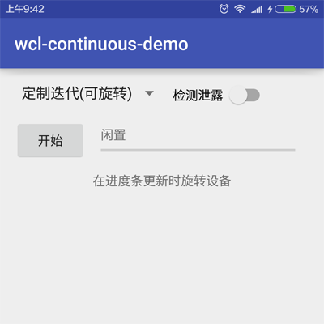

在应用开发中, 我们需要使用**后台任务**更新**前台界面**, 不因页面切换而导致重新开始, 或因某些任务阻塞界面刷新, 比如显示下载或播放进度等. 为了追求更优质的用户体验, 需要大量使用后台任务, 常见的就是异步任务(AsyncTask)和后台服务(Service), 当然还有RxJava. 我写了一个示例, 来讲讲如何使用这些常用的后台方式.

<!-- more -->
> 更多: http://www.wangchenlong.org/


主要
(1) 使用异步任务和后台服务更新页面, 避免内存泄露.
(2) 使用RxJava的时间间隔\延迟发送\定制迭代, 处理后台任务, 保存发送状态.

示例: 旋转屏幕更新进度条, 在摧毁页面和新建页面时, 保存和获取页面状态. 

本文源码的GitHub[下载地址](https://github.com/SpikeKing/wcl-continuous-demo)

> 欢迎Follow我的GitHub: https://github.com/SpikeKing



---

# 基础

Gradle配置: Lambda表达式 + Butterknife + RxJava + LeakCanary.
页面布局: Spinner选择使用模式, ProgressBar显示更新状态, 可选择启动LeakCanary.

主逻辑:
(1) 使用Fragment存储页面信息, 包括异步任务, RxJava的观察者和主题.
```java
        // 设置存储的Fragment
        FragmentManager fm = getFragmentManager();
        mRetainedFragment = (RetainedFragment) fm.findFragmentByTag(RETAINED_FRAGMENT);

        if (mRetainedFragment == null) {
            mRetainedFragment = new RetainedFragment();
            fm.beginTransaction().add(mRetainedFragment, RETAINED_FRAGMENT).commit();
        }
```

(2) 在页面重建时, 在onResume中恢复状态, 继续更新进度条.
```java
    @Override protected void onResume() {
        super.onResume();

        // 是否包含内存泄露
        if (mSTrackLeaks.isChecked()) {
            LeakCanary.install(getApplication());
        }

        mMode = mRetainedFragment.getMode();
        mCustomAsyncTask = mRetainedFragment.getCustomAsyncTask();

        mObservable = mRetainedFragment.getObservable();
        mSubject = mRetainedFragment.getSubject();
        mSubscriber = createSubscriber();

        switch (mMode) {
            case ASYNC_TASK:
                if (mCustomAsyncTask != null) {
                    if (!mCustomAsyncTask.isCompleted()) {
                        mCustomAsyncTask.setActivity(this);
                    } else {
                        mRetainedFragment.setCustomAsyncTask(null);
                    }
                }
                break;
            case TIME_INTERVAL:
                if (mObservable != null) {
                    mObservable.subscribeOn(Schedulers.io())
                            .observeOn(AndroidSchedulers.mainThread())
                            .take(MAX_PROGRESS)
                            .map(x -> x + 1)
                            .subscribe(mSubscriber);
                }
                break;
            case DELAY_EMIT:
                if (mObservable != null) {
                    mObservable.subscribeOn(Schedulers.io())
                            .delay(1, TimeUnit.SECONDS)
                            .observeOn(AndroidSchedulers.mainThread())
                            .subscribe(mSubscriber);
                }
                break;
            case CUSTOM_ITERATOR:
                if (mSubject != null) {
                    mSubject.subscribe(mSubscriber);
                }
            default:
                break;
        }

        setBusy(mRetainedFragment.isBusy());
    }
```

> 生命周期: onCreate -> onRestoreInstanceState -> onResume.
> 在onResume中设置setActivity: 因为在旋转页面时, 会执行onRestoreInstanceState方法, 恢复旋转屏幕之前保存的数据, 即mPbProgressBar的值, 此时再恢复状态. 如果移到在onCreate时设置, 则会导致Progress值为0, 因为Activity并没有开始恢复之前的数据. 

---

# 异步任务

启动异常任务AsyncTask, 在doInBackground中, 调用publishProgress显示进度, 触发onProgressUpdate回调, 从而更新进度条.
```java
public class CustomAsyncTask extends AsyncTask<Void, Integer, Void> {

    private WeakReference<MainActivity> mActivity; // 弱引用Activity, 防止内存泄露

    private boolean mCompleted = false; // 是否完成

    // 设置Activity控制ProgressBar
    public void setActivity(MainActivity activity) {
        mActivity = new WeakReference<>(activity);
    }

    // 判断是否完成
    public boolean isCompleted() {
        return mCompleted;
    }

    @Override
    protected Void doInBackground(Void... params) {
        for (int i = 1; i < MainActivity.MAX_PROGRESS + 1; i++) {
            SystemClock.sleep(MainActivity.EMIT_DELAY_MS); // 暂停时间
            publishProgress(i); // AsyncTask的方法, 调用onProgressUpdate, 表示完成状态
        }
        return null;
    }

    @Override
    protected void onProgressUpdate(Integer... progress) {
        mActivity.get().setProgressValue(progress[0]); // 更新ProgressBar的值
        mActivity.get().setProgressPercentText(progress[0]); // 设置文字
    }

    @Override
    protected void onPreExecute() {
        mActivity.get().setProgressText("开始异步任务..."); // 准备开始
        mCompleted = false;
    }

    @Override
    protected void onPostExecute(Void result) {
        mCompleted = true; // 结束
        mActivity.get().setBusy(false);
        mActivity.get().setProgressValue(0);
    }
}
```

> 注意使用WeakReference弱引用Activity, 因为线程的回收不太稳定, 如果持有Activity, 会导致长时间无法释放, 导致内存泄露.

使用方式
```java
    // 处理异步线程的点击
    private void handleAsyncClick() {
        // 获得异步线程
        mCustomAsyncTask = new CustomAsyncTask();
        mCustomAsyncTask.setActivity(this);

        // 存储异步线程
        mRetainedFragment.setCustomAsyncTask(mCustomAsyncTask);

        // 执行异步线程
        mCustomAsyncTask.execute();
    }
```

> 存储异步任务, 在旋转屏幕时, 页面重建, 可以读取当前进度, 继续更新.

---

# 后台服务
通过LocalBroadcastManager的Intent传送当前状态, 更新页面.
```java
public class CustomService extends IntentService {

    public static final String KEY_EXTRA_BUSY = "busy";
    public static final String KEY_EXTRA_PROGRESS = "progress";

    private LocalBroadcastManager mLbm;

    public CustomService() {
        super(CustomService.class.getSimpleName());
    }

    @Override protected void onHandleIntent(Intent intent) {
        mLbm = LocalBroadcastManager.getInstance(getApplicationContext());

        Intent broadcastIntent = new Intent(MainActivity.UPDATE_PROGRESS_FILTER);
        broadcastIntent.putExtra(KEY_EXTRA_BUSY, true);
        mLbm.sendBroadcast(broadcastIntent);

        for (int i = 1; i < MainActivity.MAX_PROGRESS + 1; ++i) {
            broadcastIntent = new Intent(MainActivity.UPDATE_PROGRESS_FILTER);
            broadcastIntent.putExtra(KEY_EXTRA_PROGRESS, i);
            mLbm.sendBroadcast(broadcastIntent);
            SystemClock.sleep(MainActivity.EMIT_DELAY_MS);
        }

        broadcastIntent = new Intent(MainActivity.UPDATE_PROGRESS_FILTER);
        broadcastIntent.putExtra(KEY_EXTRA_BUSY, false);
        broadcastIntent.putExtra(KEY_EXTRA_PROGRESS, 0);
        mLbm.sendBroadcast(broadcastIntent);
    }
}
```
使用方式, 先判断进度, 后判断状态.
```java
    private void handleIntentServiceClick() {
        mTvProgressText.setText("开始消息服务...");

        Intent intent = new Intent(this, CustomService.class);
        startService(intent);
    }

...

    private BroadcastReceiver mUpdateProgressReceiver = new BroadcastReceiver() {
        @Override public void onReceive(Context context, Intent intent) {
            if (intent.hasExtra(CustomService.KEY_EXTRA_PROGRESS)) {
                int progress = intent.getIntExtra(CustomService.KEY_EXTRA_PROGRESS, 0);
                mPbProgressBar.setProgress(progress);
                setProgressPercentText(progress);
            }

            if (intent.hasExtra(CustomService.KEY_EXTRA_BUSY)) {
                setBusy(intent.getBooleanExtra(CustomService.KEY_EXTRA_BUSY, false));
            }
        }
    };
```

---

# RxJava
RxJava更新进度条的方法有很多种, 可以使用时间间隔, 延迟发送, 和定制迭代器, 但是如果需要处理页面重建的连续更新, 需要存储PublishSubject, 使用定制迭代器即可完成.

时间间隔: 在旋转页面时, 会刷新数据, 重新开始.
延迟发送: 在旋转页面时, 会完成前一个发送后, 重新开始.
定制迭代: 在旋转页面时, 可以正常完成连续更新.

时间间隔
```java
    private void handleTimeIntervalClick() {
        mTvProgressText.setText("开始时间间隔...");

        mSubscriber = createSubscriber();
        mObservable = Observable.interval(1, TimeUnit.SECONDS);

        mObservable.subscribeOn(Schedulers.io())
                .observeOn(AndroidSchedulers.mainThread())
                .take(MAX_PROGRESS)
                .map(x -> x + 1)
                .subscribe(mSubscriber);

        mRetainedFragment.setObservable(mObservable);
    }
```

> Observable.interval观察者, take终止条件, map数据加工.

延迟发送
```java
    private void handleDelayEmitClick() {
        mTvProgressText.setText("开始延迟发射...");

        mSubscriber = createSubscriber();
        mObservable = createObservable();

        mObservable.subscribeOn(Schedulers.io())
                .observeOn(AndroidSchedulers.mainThread())
                .subscribe(mSubscriber);

        mRetainedFragment.setObservable(mObservable);
    }
```
观察者发送数据时, 会延迟一秒, 即SystemClock.sleep.
```java
    // 创建延迟观察者
    private Observable<Long> createObservable() {
        return Observable.create(new Observable.OnSubscribe<Long>() {
            @Override public void call(Subscriber<? super Long> subscriber) {
                for (long i = 1; i < MAX_PROGRESS + 1; i++) {
                    SystemClock.sleep(EMIT_DELAY_MS);
                    subscriber.onNext(i);
                }
                subscriber.onCompleted();
            }
        });
    }
```

定制迭代器, 在RetainedFragment中存储PublishSubject.
```java
    private void handleCustomIteratorClick() {
        mTvProgressText.setText("开始定制迭代器...");

        mObservable = Observable.from(new CustomIterator());
        mSubscriber = createSubscriber();
        mSubject = PublishSubject.create();

        mObservable.subscribeOn(Schedulers.io())
                .observeOn(AndroidSchedulers.mainThread())
                .subscribe(mSubject);

        mSubject.subscribe(mSubscriber);

        mRetainedFragment.setObservable(mObservable);
        mRetainedFragment.setSubject(mSubject);
    }
```

定制迭代器, 重写next方法, 返回数据.
```java
public class CustomIterator implements Iterable<Long> {

    private List<Long> mNumberList = new ArrayList<>();

    public CustomIterator() {
        for (long i = 0; i < MainActivity.MAX_PROGRESS; i++) {
            mNumberList.add(i + 1);
        }
    }

    @Override public Iterator<Long> iterator() {
        return new Iterator<Long>() {
            private int mCurrentIndex = 0;

            @Override public boolean hasNext() {
                return mCurrentIndex < mNumberList.size() && mNumberList.get(mCurrentIndex) != null;
            }

            @Override public Long next() {
                SystemClock.sleep(MainActivity.EMIT_DELAY_MS);
                return mNumberList.get(mCurrentIndex++);
            }

            // 不允许使用
            @Override public void remove() {
                throw new UnsupportedOperationException();
            }
        };
    }
}
```

---

效果动画


比较而言, 使用异步任务容易造成内存泄露, 并且可扩展性比较小, 适合简单的更新; 使用后台服务比较重, 需要另起进程, 适合复杂的数据处理, 不适合更新页面; 使用RxJava, 容易扩展, 可以控制释放时机, 是比较不错的选择.

[参考](https://medium.com/@carl.whalley)

That's all! Enjoy it!

---

> 原始地址: 
> http://www.wangchenlong.org/2016/03/20/1603/205-rx-continue-update/
> 欢迎Follow我的[GitHub](https://github.com/SpikeKing), 关注我的[简书](http://www.jianshu.com/users/e2b4dd6d3eb4/latest_articles), [微博](http://weibo.com/u/2852941392), [CSDN](http://blog.csdn.net/caroline_wendy), [掘金](http://gold.xitu.io/#/user/56de98c2f3609a005442ec58), [Slides](https://slides.com/spikeking). 
> 我已委托“维权骑士”为我的文章进行维权行动. 未经授权, 禁止转载, 授权或合作请留言.
