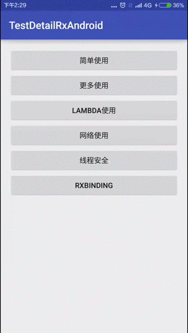

[RxBinding](https://github.com/JakeWharton/RxBinding)是Rx中处理控件异步调用的方式, 也是由Square公司开发, Jake负责编写. 通过绑定组件, 异步获取事件, 并进行处理. 编码风格非常优雅. 让我来讲解一下如何使用, 本文含有代码示例.

<!-- more -->
> 更多: http://www.wangchenlong.org/

本文源码的Github[下载地址](https://github.com/SpikeKing/TestDetailRxAndroid).


---

# 依赖

除了RxJava, 再添加RxBinding的依赖.
```gradle
    // RxBinding
    compile 'com.jakewharton.rxbinding:rxbinding:0.3.0'
    compile 'com.jakewharton.rxbinding:rxbinding-appcompat-v7:0.3.0'
    compile 'com.jakewharton.rxbinding:rxbinding-design:0.3.0'
```

---

# 布局

Toolbar和Fab, 两个较新的控件.
```xml
<?xml version="1.0" encoding="utf-8"?>
<android.support.design.widget.CoordinatorLayout
    xmlns:android="http://schemas.android.com/apk/res/android"
    xmlns:tools="http://schemas.android.com/tools"
    android:layout_width="match_parent"
    android:layout_height="match_parent"
    android:fitsSystemWindows="true"
    android:orientation="vertical"
    tools:context=".BindingActivity">

    <android.support.design.widget.AppBarLayout
        android:layout_width="match_parent"
        android:layout_height="wrap_content"
        android:theme="@style/AppTheme.AppBarOverlay">

        <android.support.v7.widget.Toolbar
            android:id="@+id/rxbinding_t_toolbar"
            android:layout_width="match_parent"
            android:layout_height="?attr/actionBarSize"
            android:background="?attr/colorPrimary"
            android:popupTheme="@style/AppTheme.PopupOverlay"
            tools:targetApi="21"/>

    </android.support.design.widget.AppBarLayout>

    <include layout="@layout/content_rxbinding"/>

    <android.support.design.widget.FloatingActionButton
        android:id="@+id/rxbinding_fab_fab"
        android:layout_width="wrap_content"
        android:layout_height="wrap_content"
        android:layout_gravity="bottom|end"
        android:layout_margin="@dimen/fab_margin"
        android:src="@android:drawable/ic_dialog_email"/>

</android.support.design.widget.CoordinatorLayout>
```
两个EditText控件, 对比传统方法和RxBinding方法.
```xml
<?xml version="1.0" encoding="utf-8"?>
<LinearLayout xmlns:android="http://schemas.android.com/apk/res/android"
              xmlns:app="http://schemas.android.com/apk/res-auto"
              xmlns:tools="http://schemas.android.com/tools"
              android:layout_width="match_parent"
              android:layout_height="match_parent"
              android:orientation="vertical"
              android:padding="@dimen/activity_margin"
              app:layout_behavior="@string/appbar_scrolling_view_behavior"
              tools:context=".BindingActivity"
              tools:showIn="@layout/activity_binding">

    <TextView
        android:layout_width="match_parent"
        android:layout_height="wrap_content"
        android:text="@string/usual_approach"/>

    <EditText
        android:id="@+id/rxbinding_et_usual_approach"
        android:layout_width="match_parent"
        android:layout_height="48dp"
        android:hint="@null"/>

    <TextView
        android:layout_width="match_parent"
        android:layout_height="wrap_content"
        android:text="@string/reactive_approach"/>

    <EditText
        android:id="@+id/rxbinding_et_reactive_approach"
        android:layout_width="match_parent"
        android:layout_height="48dp"
        android:hint="@null"/>

    <TextView
        android:id="@+id/rxbinding_tv_show"
        android:layout_width="match_parent"
        android:layout_height="wrap_content"/>

</LinearLayout>
```

> 使用include子布局, 使页面结构清晰.

---

# 逻辑

使用ButterKnife注入控件, 使用RxBinding方式绑定控件, 异步监听事件.
```java
/**
 * Rx绑定
 * <p>
 * Created by wangchenlong on 16/1/25.
 */
public class BindingActivity extends AppCompatActivity {

    @Bind(R.id.rxbinding_t_toolbar) Toolbar mTToolbar;
    @Bind(R.id.rxbinding_et_usual_approach) EditText mEtUsualApproach;
    @Bind(R.id.rxbinding_et_reactive_approach) EditText mEtReactiveApproach;
    @Bind(R.id.rxbinding_tv_show) TextView mTvShow;
    @Bind(R.id.rxbinding_fab_fab) FloatingActionButton mFabFab;

    @Override protected void onCreate(@Nullable Bundle savedInstanceState) {
        super.onCreate(savedInstanceState);
        setContentView(R.layout.activity_binding);
        ButterKnife.bind(this);

        initToolbar(); // 初始化Toolbar
        initFabButton(); // 初始化Fab按钮
        initEditText(); // 初始化编辑文本
    }

    // 初始化Toolbar
    private void initToolbar() {
        // 添加菜单按钮
        setSupportActionBar(mTToolbar);
        ActionBar actionBar = getSupportActionBar();
        // 添加浏览按钮
        if (actionBar != null) {
            actionBar.setDisplayHomeAsUpEnabled(true);
        }

        RxToolbar.itemClicks(mTToolbar).subscribe(this::onToolbarItemClicked);

        RxToolbar.navigationClicks(mTToolbar).subscribe(this::onToolbarNavigationClicked);
    }

    // 点击Toolbar的项
    private void onToolbarItemClicked(MenuItem menuItem) {
        String m = "点击\"" + menuItem.getTitle() + "\"";
        Toast.makeText(this, m, Toast.LENGTH_SHORT).show();
    }

    // 浏览点击
    private void onToolbarNavigationClicked(Void v) {
        Toast.makeText(this, "浏览点击", Toast.LENGTH_SHORT).show();
    }

    @Override public boolean onCreateOptionsMenu(Menu menu) {
        getMenuInflater().inflate(R.menu.menu_rxbinding, menu);
        return super.onCreateOptionsMenu(menu);
    }

    // 初始化Fab按钮
    private void initFabButton() {
        RxView.clicks(mFabFab).subscribe(this::onFabClicked);
    }

    // 点击Fab按钮
    private void onFabClicked(Void v) {
        Snackbar snackbar = Snackbar.make(findViewById(android.R.id.content), "点击Snackbar", Snackbar.LENGTH_SHORT);
        snackbar.show();
        RxSnackbar.dismisses(snackbar).subscribe(this::onSnackbarDismissed);
    }

    // 销毁Snackbar, event参考{Snackbar}
    private void onSnackbarDismissed(int event) {
        String text = "Snackbar消失代码:" + event;
        Toast.makeText(this, text, Toast.LENGTH_SHORT).show();
    }

    // 初始化编辑文本
    private void initEditText() {
        // 正常方式
        mEtUsualApproach.addTextChangedListener(new TextWatcher() {
            @Override
            public void beforeTextChanged(CharSequence s, int start, int count, int after) {

            }

            @Override public void onTextChanged(CharSequence s, int start, int before, int count) {
                mTvShow.setText(s);
            }

            @Override public void afterTextChanged(Editable s) {

            }

        });

        // Rx方式
        RxTextView.textChanges(mEtReactiveApproach).subscribe(mTvShow::setText);
    }
}
```

> Toolbar使用RxToolbar监听点击事件; Snackbar使用RxSnackbar监听;
> EditText使用RxTextView监听; 其余使用RxView监听.

---



Rx响应式编程是处理异步回调的一种优雅方式, 每一个最求完美的程序员都应该学会.

OK, that's all! Enjoy it!

---

> 原始地址: 
> http://www.wangchenlong.org/2016/03/20/1603/206-rxbinding-react-event/
> 欢迎Follow我的[GitHub](https://github.com/SpikeKing), 关注我的[简书](http://www.jianshu.com/users/e2b4dd6d3eb4/latest_articles), [微博](http://weibo.com/u/2852941392), [CSDN](http://blog.csdn.net/caroline_wendy), [掘金](http://gold.xitu.io/#/user/56de98c2f3609a005442ec58), [Slides](https://slides.com/spikeking). 
> 我已委托“维权骑士”为我的文章进行维权行动. 未经授权, 禁止转载, 授权或合作请留言.