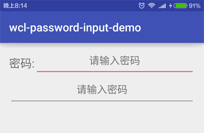

在使用App的时候, 首次都需要输入密码. 有些人为了安全性, 密码较长, 偶尔会输入错误; 有些人忘记了密码, 需要多次尝试, 但又不知道是输入错误, 还是密码错误, 这些都会影响用户体验. 这一点, 移动端设计师们早有准备, 因为手机的私密性较强, 在输入密码时, 可以提示用户显式输入, 增强准确性, 提升体验. 这些当然是有成本的, 需要额外编写功能. 因此, 我来讲一下, 如何编写密码明文显示的功能, 减少大家的学习成本.

<!-- more -->
> 更多: http://www.wangchenlong.org/


本文源码的GitHub[下载地址](https://github.com/SpikeKing/wcl-password-input-demo)

> 欢迎Follow我的GitHub: https://github.com/SpikeKing

要点
(1) 重写EditText, 添加提示密码显示和隐藏的图片.
(2) 判断点击位置, 切换EditText的密码显示状态.
(3) 在屏幕旋转或配置改变时, 保留图片的状态信息.

实现只有一个类和两个图片资源, 大家可以自由定制.

---

# 布局样式

两种密码的显示样式, 一种是常规显示, 一种是TextInputLayout显示.
```xml
    <LinearLayout
        android:id="@+id/main_ll_container_1"
        android:layout_width="match_parent"
        android:layout_height="40dp"
        android:gravity="center">

        <TextView
            android:layout_width="wrap_content"
            android:layout_height="wrap_content"
            android:text="密码:"
            android:textSize="20sp"/>

        <me.chunyu.spike.wcl_password_input_demo.PasswordEditText
            android:id="@+id/main_pet_password"
            android:layout_width="match_parent"
            android:layout_height="wrap_content"
            android:gravity="center"
            android:hint="请输入密码"/>

    </LinearLayout>

    <android.support.design.widget.TextInputLayout
        android:layout_width="match_parent"
        android:layout_height="wrap_content"
        android:layout_below="@+id/main_ll_container_1">

        <me.chunyu.spike.wcl_password_input_demo.PasswordEditText
            android:layout_width="match_parent"
            android:layout_height="wrap_content"
            android:gravity="center"
            android:hint="请输入密码"/>

    </android.support.design.widget.TextInputLayout>
```

效果



---

# 提示图标

初始化资源和布局, 获取密码图片的资源, 监听EditText, 有文字时显示图标, 没有文字时隐藏图标.
```java
    // 初始化布局
    public void initFields(AttributeSet attrs, int defStyleAttr) {
        if (attrs != null) {
            // 获取属性信息
            TypedArray styles = getContext().getTheme().obtainStyledAttributes(attrs, R.styleable.PasswordEditText, defStyleAttr, 0);
            try {
                // 根据参数, 设置Icon
                mShowPwdIcon = styles.getResourceId(R.styleable.PasswordEditText_pet_iconShow, mShowPwdIcon);
                mHidePwdIcon = styles.getResourceId(R.styleable.PasswordEditText_pet_iconHide, mHidePwdIcon);
            } finally {
                styles.recycle();
            }
        }

        // 密码状态
        setInputType(EditorInfo.TYPE_CLASS_TEXT | EditorInfo.TYPE_TEXT_VARIATION_PASSWORD);

        addTextChangedListener(new TextWatcher() {
            @Override
            public void beforeTextChanged(CharSequence s, int start, int count, int after) {

            }

            @Override public void onTextChanged(CharSequence s, int start, int before, int count) {
                if (s.length() > 0) {
                    // 有文字时显示指示器
                    showPasswordVisibilityIndicator(true);
                } else {
                    mIsShowPwdIcon = false;
                    restorePasswordIconVisibility(mIsShowPwdIcon);
                    showPasswordVisibilityIndicator(false); // 隐藏指示器
                }
            }

            @Override public void afterTextChanged(Editable s) {

            }
        });
    }
```

> setInputType设置密码状态, TYPE_TEXT_VARIATION_PASSWORD密文状态.
> 通过pet_iconShow属性, 可以选择自定义密码提示图片.

---

# 监听事件

点击图片, 切换显示或隐藏密码, 获取点击位置, 和图片位置进行比较, 判断事件.
```java
    @Override public boolean onTouchEvent(MotionEvent event) {
        if (mDrawableSide == null) {
            return super.onTouchEvent(event);
        }
        final Rect bounds = mDrawableSide.getBounds();
        final int x = (int) event.getRawX(); // 点击的位置

        int iconX = (int) getTopRightCorner().x;

        // Icon的位置
        int leftIcon = iconX - bounds.width();

        Log.e(TAG, "x: " + x + ", leftIcon: " + leftIcon);

        // 大于Icon的位置, 才能触发点击
        if (x >= leftIcon) {
            togglePasswordIconVisibility(); // 变换状态
            event.setAction(MotionEvent.ACTION_CANCEL);
            return false;
        }
        return super.onTouchEvent(event);
    }
```

切换明文或密文的密码
```java
    // 设置密码指示器的状态
    private void restorePasswordIconVisibility(boolean isShowPwd) {
        if (isShowPwd) {
            // 可视密码输入
            setInputType(EditorInfo.TYPE_CLASS_TEXT | EditorInfo.TYPE_TEXT_VARIATION_VISIBLE_PASSWORD);
        } else {
            // 非可视密码状态
            setInputType(EditorInfo.TYPE_CLASS_TEXT | EditorInfo.TYPE_TEXT_VARIATION_PASSWORD);
        }

        // 移动光标
        setSelection(getText().length());
    }
```
---

# 保存状态

重写SavedState, 在旋转屏幕时, 保存和恢复显示图片信息. 
```java
    // 存储密码状态, 显示Icon的位置
    protected static class PwdSavedState extends BaseSavedState {

        private final boolean mShowingIcon;

        private PwdSavedState(Parcelable superState, boolean showingIcon) {
            super(superState);
            mShowingIcon = showingIcon;
        }

        private PwdSavedState(Parcel in) {
            super(in);
            mShowingIcon = in.readByte() != 0;
        }

        public boolean isShowingIcon() {
            return mShowingIcon;
        }

        @Override
        public void writeToParcel(Parcel destination, int flags) {
            super.writeToParcel(destination, flags);
            destination.writeByte((byte) (mShowingIcon ? 1 : 0));
        }

        public static final Parcelable.Creator<PwdSavedState> CREATOR = new Creator<PwdSavedState>() {
            public PwdSavedState createFromParcel(Parcel in) {
                return new PwdSavedState(in);
            }

            public PwdSavedState[] newArray(int size) {
                return new PwdSavedState[size];
            }
        };
    }
```

---

动画效果


现在可以把类复制到应用中, 更换图片资源, 替换显示密码框, 给用户更好的移动端体验. 永远追求极致, 追求不凡.

OK, that's all! Enjoy it!

---

> 原始地址: 
> http://www.wangchenlong.org/2016/03/21/1603/211-show-password-reveal/
> 欢迎Follow我的[GitHub](https://github.com/SpikeKing), 关注我的[简书](http://www.jianshu.com/users/e2b4dd6d3eb4/latest_articles), [微博](http://weibo.com/u/2852941392), [CSDN](http://blog.csdn.net/caroline_wendy), [掘金](http://gold.xitu.io/#/user/56de98c2f3609a005442ec58), [Slides](https://slides.com/spikeking). 
> 我已委托“维权骑士”为我的文章进行维权行动. 未经授权, 禁止转载, 授权或合作请留言.

