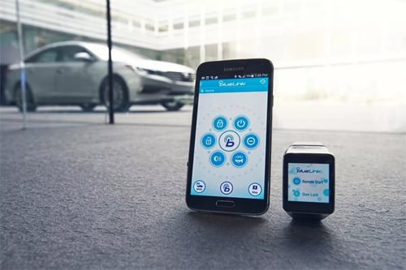
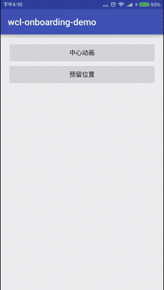
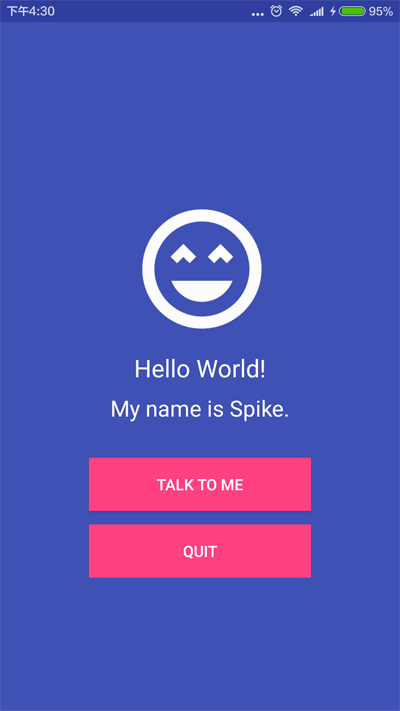

在启动Android应用时, 直接显示页面, 就称之为**冷启动(Cold Start)**. 为了增强用户体验, 可以添加控件动画, 让启动页面更有趣, 用户也更加容易接受. 提升应用的用户体验.

<!-- more -->
> 更多: http://www.wangchenlong.org/



主要讲解两种启动方式, 一种是**中心动画**, 一种是**预留位置**.
中心动画: 使用动画效果逐渐显示控件, 如位移, 渐变, 缩放等.
预留位置: 改变控件的位置和大小直至匹配, 如坍塌, 滑入等.

本文的GitHub[下载地址](https://github.com/SpikeKing/wcl-onboarding-demo)

动画效果



---

# 中心动画

在显示控件的过程中, 可以使用三种动画方式, **位移\渐变\缩放**, 可以单独使用, 也可以组合使用. 核心类是** ViewCompat**.

**位移**: 控制Y轴的距离, 向上移动300像素.
```java
        // 向上移动
        ViewCompat.animate(mIvLogo)
                .translationY(-300)
                .setStartDelay(STARTUP_DELAY)
                .setDuration(ANIM_ITEM_DURATION)
                .setInterpolator(new DecelerateInterpolator(1.2f))
                .start();
```

**渐变**: 默认Alpha是0, 渐变为1, 并移动50像素.
```java
                viewAnimator = ViewCompat.animate(v)
                        .translationY(50).alpha(1)
                        .setStartDelay((ITEM_DELAY * i) + 500)
                        .setDuration(1000);
```

**缩放**: scaleX和scaleY从0变为1.
```java
                viewAnimator = ViewCompat.animate(v)
                        .scaleY(1).scaleX(1)
                        .setStartDelay((ITEM_DELAY * i) + 500)
                        .setDuration(500);
```

> 注意: **setStartDelay**延迟启动动画, **setDuration**动画持续时间.



---

# 预留位置

在控件显示的过程中, 可以改变位置和大小, 动画效果可以是坍塌和滑入. 坍塌效果与CollapsingToolbarLayout相同, 通过本文代码, 理解实现原理.

**坍塌**: 使用** ValueAnimator**改变Toolbar的高度, 在结束时, 启动其他动画.
```java
    // Toolbar坍塌成ActionBar
    private void collapseToolbar(int height) {
        TypedValue tv = new TypedValue();
        getTheme().resolveAttribute(android.R.attr.actionBarSize, tv, true);
        int toolBarHeight = TypedValue.complexToDimensionPixelSize(tv.data, getResources().getDisplayMetrics());
        ValueAnimator valueAnimator = ValueAnimator.ofInt(height, toolBarHeight); // 动画
        valueAnimator.addUpdateListener(animation -> {
            ViewGroup.LayoutParams lp = mTToolbar.getLayoutParams();
            lp.height = (Integer) animation.getAnimatedValue();
            mTToolbar.setLayoutParams(lp);
        });
        valueAnimator.start();
        valueAnimator.addListener(new AnimatorListenerAdapter() {
            @Override public void onAnimationEnd(Animator animation) {
                super.onAnimationEnd(animation);
                mPhRecyclerAdapter.setItems(ModelItem.getFakeItems());
                ViewCompat.animate(mFabBar).setStartDelay(500)
                        .setDuration(500).scaleX(1).scaleY(1).start();
            }
        });
    }
```

**渐入**: 在列表加载时, 使用动画效果, 卡片逐张滑入.
```java
    // 列表适配器
    public static class PhRecyclerAdapter extends RecyclerView.Adapter<PhRecyclerAdapter.PhViewHolder> {

        private final ArrayList<ModelItem> mItems = new ArrayList<>(); // 数据

        public void setItems(List<ModelItem> items) {
            // 启动动画的关键位, 顺次添加动画效果
            int pos = getItemCount();
            mItems.addAll(items);
            notifyItemRangeInserted(pos, mItems.size());
        }

        @Override
        public PhViewHolder onCreateViewHolder(ViewGroup parent, int viewType) {
            View v = LayoutInflater.from(parent.getContext()).inflate(R.layout.item_card, parent, false);
            return new PhViewHolder(v);
        }

        @Override
        public void onBindViewHolder(PhViewHolder holder, int position) {
            holder.bindTo(mItems.get(position));
        }

        @Override public int getItemCount() {
            return mItems.size();
        }

        // 数据存储
        public static class PhViewHolder extends RecyclerView.ViewHolder {
            @Bind(R.id.item_tv_title) TextView mTvTitle;
            @Bind(R.id.item_iv_image) ImageView mIvImage;

            private Context mContext;

            public PhViewHolder(View itemView) {
                super(itemView);
                ButterKnife.bind(this, itemView);
                mContext = itemView.getContext().getApplicationContext();
            }

            public void bindTo(ModelItem item) {
                Picasso.with(mContext).load(item.getImgId()).into(mIvImage);
                mTvTitle.setText(item.getName());
            }
        }
    }
```

> 注意: **notifyItemRangeInserted(pos, mItems.size());** 确保单张动画效果.
> 设置列表(RecyclerView)的Item动画: **mRvRecycler.setItemAnimator(...);**


---

启动动画可以增强应用的吸引力, 但也并不是所有页面都需要启动动画, 还需要根据情况具体分析, 交给UE\UX吧, 程序员只要提供这些可选技能即可.

OK, that's all! Enjoy it!

---

> 原始地址: 
> http://www.wangchenlong.org/2016/03/22/1603/221-start-page-anim/
> 欢迎Follow我的[GitHub](https://github.com/SpikeKing), 关注我的[简书](http://www.jianshu.com/users/e2b4dd6d3eb4/latest_articles), [微博](http://weibo.com/u/2852941392), [CSDN](http://blog.csdn.net/caroline_wendy), [掘金](http://gold.xitu.io/#/user/56de98c2f3609a005442ec58), [Slides](https://slides.com/spikeking). 
> 我已委托“维权骑士”为我的文章进行维权行动. 未经授权, 禁止转载, 授权或合作请留言.

