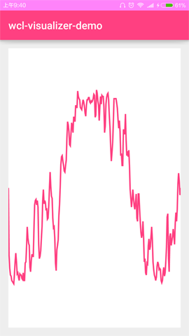
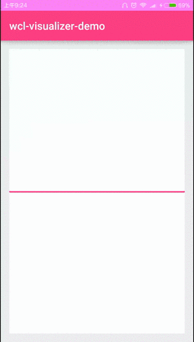

在一些音乐类应用中, 经常会展示随着节奏上下起伏的波纹信息, 这些波纹形象地传达了声音信息, 可以提升用户体验, 那么是如何实现的呢? 可以使用Visualizer类获取当前播放的声音信息, 并绘制在画布上, 使用波纹展示即可. 我来讲解一下使用方法.

<!-- more -->
> 更多: http://www.wangchenlong.org/


主要
(1) Visualizer类提取波纹信息的方式.
(2) 应用动态权限管理的方法.
(3) 分离自定义视图的展示和逻辑.

本文源码的GitHub[下载地址](https://github.com/SpikeKing/wcl-visualizer-demo)

---

# 基础准备

Android 6.0引入动态权限管理, 在这个项目中, 会使用系统的音频信息, 因此把权限管理引入这个项目, [参考](http://www.jianshu.com/p/dbe4d37731e6). Gradle配置引入了Lambda表达式, [参考](http://www.jianshu.com/p/4b659c7754aa).

页面布局, 使用自定义的波纹视图控件.
```xml
    <!--波纹视图-->
    <me.chunyu.spike.wcl_visualizer_demo.visualizers.WaveformView
        android:id="@+id/main_wv_waveform"
        android:layout_width="match_parent"
        android:layout_height="match_parent"/>
```

效果


---

# 首页逻辑

添加动态权限管理, 在启动页面时, 获取应用所需的音频权限. 
**RendererFactory**工厂类创建波纹的绘制类SimpleWaveformRender.
**startVisualiser**方法获取当前播放音乐的音频信息.
注意页面关闭, 在onPause时, 释放Visualiser类.

```java
public class MainActivity extends AppCompatActivity {

    private static final int CAPTURE_SIZE = 256; // 获取这些数据, 用于显示
    private static final int REQUEST_CODE = 0;

    // 权限
    private static final String[] PERMISSIONS = new String[]{
            Manifest.permission.RECORD_AUDIO,
            Manifest.permission.MODIFY_AUDIO_SETTINGS
    };

    @Bind(R.id.main_wv_waveform) WaveformView mWvWaveform; // 波纹视图

    private Visualizer mVisualizer; // 音频可视化类

    @Override
    protected void onCreate(Bundle savedInstanceState) {
        super.onCreate(savedInstanceState);
        setContentView(R.layout.activity_main);
        ButterKnife.bind(this);

        RendererFactory rendererFactory = new RendererFactory();
        mWvWaveform.setRenderer(rendererFactory.createSimpleWaveformRender(ContextCompat.getColor(this, R.color.colorPrimary), Color.WHITE));
    }

    @Override protected void onResume() {
        super.onResume();

        PermissionsChecker checker = new PermissionsChecker(this);

        if (checker.lakesPermissions(PERMISSIONS)) {
            PermissionsActivity.startActivityForResult(this, REQUEST_CODE, PERMISSIONS);
        } else {
            startVisualiser();
        }
    }

    @Override protected void onActivityResult(int requestCode, int resultCode, Intent data) {
        super.onActivityResult(requestCode, resultCode, data);
        if (requestCode == REQUEST_CODE && resultCode == PermissionsActivity.PERMISSIONS_DENIED) {
            finish();
        }
    }

    // 设置音频线
    private void startVisualiser() {
        mVisualizer = new Visualizer(0); // 初始化
        mVisualizer.setDataCaptureListener(new Visualizer.OnDataCaptureListener() {
            @Override
            public void onWaveFormDataCapture(Visualizer visualizer, byte[] waveform, int samplingRate) {
                if (mWvWaveform != null) {
                    mWvWaveform.setWaveform(waveform);
                }
            }

            @Override
            public void onFftDataCapture(Visualizer visualizer, byte[] fft, int samplingRate) {

            }
        }, Visualizer.getMaxCaptureRate(), true, false);
        mVisualizer.setCaptureSize(CAPTURE_SIZE);
        mVisualizer.setEnabled(true);
    }

    // 释放
    @Override protected void onPause() {
        if (mVisualizer != null) {
            mVisualizer.setEnabled(false);
            mVisualizer.release();
        }
        super.onPause();
    }
}
```

> **Visualizer类**
> new Visualizer(0), 初始化; setCaptureSize, 获取波纹数量; setEnabled, 启动监听;
> setDataCaptureListener, 第一个参数是回调, 使用WaveFormData或FftData; 第二个是更新率; 第三个是判断使用WaveFormData; 第四个是判断使用FftData, 第三\四个均与回调的返回值有关.

---

# 波纹视图

页面框架, 分离显示和逻辑, 使用接口渲染, 输入画布Canvas和波纹Waveform.
```java
/**
 * 音频波纹视图
 * <p>
 * Created by wangchenlong on 16/2/11.
 */
public class WaveformView extends View {

    private WaveformRenderer mRenderer; // 绘制类
    private byte[] mWaveform; // 波纹形状

    public WaveformView(Context context) {
        super(context);
    }

    public WaveformView(Context context, AttributeSet attrs) {
        super(context, attrs);
    }

    public WaveformView(Context context, AttributeSet attrs, int defStyleAttr) {
        super(context, attrs, defStyleAttr);
    }

    @TargetApi(21)
    public WaveformView(Context context, AttributeSet attrs, int defStyleAttr, int defStyleRes) {
        super(context, attrs, defStyleAttr, defStyleRes);
    }

    public void setRenderer(WaveformRenderer renderer) {
        mRenderer = renderer;
    }

    public void setWaveform(byte[] waveform) {
        mWaveform = Arrays.copyOf(waveform, waveform.length); // 数组复制
        invalidate(); // 设置波纹之后, 需要重绘
    }

    @Override protected void onDraw(Canvas canvas) {
        super.onDraw(canvas);
        if (mRenderer != null) {
            mRenderer.render(canvas, mWaveform);
        }
    }
}
```
> 数组复制Arrays.copyOf(), 在设置波纹后重绘页面invalidate().

---

# 波纹逻辑
核心部分renderWaveform, 渲染波纹.
把页面分为网格样式, 根据波纹值, 绘制曲线; 没有波纹, 绘制居中水平直线.
```java
/**
 * 波纹渲染逻辑
 * <p>
 * Created by wangchenlong on 16/2/12.
 */
public class SimpleWaveformRenderer implements WaveformRenderer {

    private static final int Y_FACTOR = 0xFF; // 2的8次方 = 256
    private static final float HALF_FACTOR = 0.5f;

    @ColorInt private final int mBackgroundColor;
    private final Paint mForegroundPaint;
    private final Path mWaveformPath;

    private SimpleWaveformRenderer(@ColorInt int backgroundColor, Paint foregroundPaint, Path waveformPath) {
        mBackgroundColor = backgroundColor;
        mForegroundPaint = foregroundPaint;
        mWaveformPath = waveformPath;
    }

    public static SimpleWaveformRenderer newInstance(@ColorInt int backgroundColor, @ColorInt int foregroundColour) {
        Paint paint = new Paint();
        paint.setColor(foregroundColour);
        paint.setAntiAlias(true); // 抗锯齿
        paint.setStrokeWidth(8.0f); // 设置宽度
        paint.setStyle(Paint.Style.STROKE); // 填充

        Path waveformPath = new Path();

        return new SimpleWaveformRenderer(backgroundColor, paint, waveformPath);
    }

    @Override public void render(Canvas canvas, byte[] waveform) {
        canvas.drawColor(mBackgroundColor);
        float width = canvas.getWidth();
        float height = canvas.getHeight();

        mWaveformPath.reset();

        // 没有数据
        if (waveform != null) {
            // 绘制波形
            renderWaveform(waveform, width, height);
        } else {
            // 绘制直线
            renderBlank(width, height);
        }

        canvas.drawPath(mWaveformPath, mForegroundPaint);
    }

    private void renderWaveform(byte[] waveform, float width, float height) {
        float xIncrement = width / (float) (waveform.length); // 水平块数
        float yIncrement = height / Y_FACTOR; // 竖直块数
        int halfHeight = (int) (height * HALF_FACTOR); // 居中位置
        mWaveformPath.moveTo(0, halfHeight);
        for (int i = 1; i < waveform.length; ++i) {
            float yPosition = waveform[i] > 0 ?
                    height - (yIncrement * waveform[i]) : -(yIncrement * waveform[i]);
            mWaveformPath.lineTo(xIncrement * i, yPosition);
        }
        mWaveformPath.lineTo(width, halfHeight); // 最后的点, 水平居中
    }

    // 居中画一条直线
    private void renderBlank(float width, float height) {
        int y = (int) (height * HALF_FACTOR);
        mWaveformPath.moveTo(0, y);
        mWaveformPath.lineTo(width, y);
    }
}
```

> 绘制移动moveTo, 绘制直线lineTo.

---

效果


通过绘制波纹, 可以类似地绘制一些连续数据, 更加直观地展示, 提升用户体验.

[参考](https://blog.stylingandroid.com)

That's all! Enjoy it!

---

> 原始地址: 
> http://www.wangchenlong.org/2016/03/22/1603/223-voice-ripple-anim/
> 欢迎Follow我的[GitHub](https://github.com/SpikeKing), 关注我的[简书](http://www.jianshu.com/users/e2b4dd6d3eb4/latest_articles), [微博](http://weibo.com/u/2852941392), [CSDN](http://blog.csdn.net/caroline_wendy), [掘金](http://gold.xitu.io/#/user/56de98c2f3609a005442ec58), [Slides](https://slides.com/spikeking). 
> 我已委托“维权骑士”为我的文章进行维权行动. 未经授权, 禁止转载, 授权或合作请留言.

