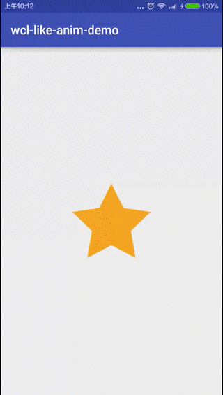

在Android中, 属性动画是非常有意思的功能, 控制参数变换动画效果. 与使用gif图片相比, 动画控件要节约空间和增加响应速度. 本文介绍使用属性动画实现星光四射的动画效果, 可以作为点赞按钮.

<!-- more -->
> 更多: http://www.wangchenlong.org/

要点:
(1) 使用PercentLayout设置自定义控件的大小.
(2) 属性动画的两个重要函数, 中值和映射.
(3) 擦除画笔(PorterDuff.Mode.CLEAR)的使用方法.
(4) 使用颜色估值器(ArgbEvaluator)控制颜色变换.
(5) 自定义控件的延迟重绘(postInvalidate)方法.
(6) 属性动画(``Property<View, Float>``)的设置和使用.
(7) 使用映射函数, 控制变换节奏.
(8) 插值器(Interpolator)的使用方法.
(9) 动画集合(AnimatorSet)的使用方法.
(10) 点击事件(onTouchEvent)的设置.


掌握这些之后, 我们就可以使用属性动画完成一些自定义控件, 让我们来看看是如何实现的.

本文源码的GitHub[下载地址](https://github.com/SpikeKing/wcl-like-anim-demo)

> 欢迎Follow我的GitHub: https://github.com/SpikeKing



---

# 主页

主页加载自定义的星型控件, 所有逻辑都在控件中实现.

逻辑
```java
public class MainActivity extends AppCompatActivity {
    @Override
    protected void onCreate(Bundle savedInstanceState) {
        super.onCreate(savedInstanceState);
        setContentView(R.layout.activity_main);
    }
}
```
布局
```xml
<FrameLayout
    xmlns:android="http://schemas.android.com/apk/res/android"
    xmlns:tools="http://schemas.android.com/tools"
    android:layout_width="match_parent"
    android:layout_height="match_parent"
    tools:context="clwang.chunyu.me.wcl_like_anim_demo.MainActivity">

    <clwang.chunyu.me.wcl_like_anim_demo.LikeButtonView
        android:layout_width="200dp"
        android:layout_height="200dp"
        android:layout_gravity="center"/>

</FrameLayout>
```

---

# 星型控件
控件主要分为三个部分:
(1) 圆环的爆炸效果.
(2) 点状的散射效果.
(3) 星星的明暗变化.

布局, 使用PercentLayout, 圆环和星星占控件宽度的40%, 高度与宽度相同.
```xml
<?xml version="1.0" encoding="utf-8"?>
<FrameLayout xmlns:android="http://schemas.android.com/apk/res/android"
             xmlns:app="http://schemas.android.com/apk/res-auto"
             android:layout_width="match_parent"
             android:layout_height="match_parent">

    <clwang.chunyu.me.wcl_like_anim_demo.DotsView
        android:id="@+id/like_button_dv_dots"
        android:layout_width="match_parent"
        android:layout_height="match_parent"
        android:layout_gravity="center"/>

    <android.support.percent.PercentRelativeLayout
        android:layout_width="match_parent"
        android:layout_height="match_parent"
        android:gravity="center">

        <clwang.chunyu.me.wcl_like_anim_demo.CircleView
            android:id="@+id/like_button_cv_circle"
            android:layout_width="0dp"
            android:layout_height="0dp"
            app:layout_aspectRatio="100%"
            app:layout_widthPercent="40%"/>

    </android.support.percent.PercentRelativeLayout>

    <android.support.percent.PercentRelativeLayout
        android:layout_width="match_parent"
        android:layout_height="match_parent"
        android:gravity="center">

        <ImageView
            android:id="@+id/like_button_iv_star"
            android:layout_width="0dp"
            android:layout_height="0dp"
            android:layout_gravity="center"
            android:contentDescription="@null"
            android:src="@drawable/ic_star_rate_off"
            app:layout_aspectRatio="100%"
            app:layout_widthPercent="40%"/>

    </android.support.percent.PercentRelativeLayout>

</FrameLayout>
```

属性动画常用工具类, 映射函数和中值函数.
```java
/**
 * 工具类
 * <p>
 * Created by wangchenlong on 16/1/5.
 */
public class Utils {
    // 映射到下一个域
    public static double mapValueFromRangeToRange(double value, double fromLow, double fromHigh, double toLow, double toHigh) {
        return toLow + ((value - fromLow) / (fromHigh - fromLow) * (toHigh - toLow));
    }

    // 中间值, value<low, 返回low, value>high, 返回high.
    public static double clamp(double value, double low, double high) {
        return Math.min(Math.max(value, low), high);
    }
}
```

---

# 圆环

圆环要实现爆炸效果. 外圆是实心圆圈, 颜色渐变; 内圆是擦除效果.

逻辑
```java
/**
 * 圆形视图, 外圆是实心圆圈, 颜色渐变; 内圆是擦除效果.
 * <p>
 * Created by wangchenlong on 16/1/5.
 */
public class CircleView extends View {

    private static final int START_COLOR = 0xFFFF5722;
    private static final int END_COLOR = 0xFFFFC107;

    private ArgbEvaluator mArgbEvaluator; // Argb估计器

    private Paint mCirclePaint; // 圆形视图
    private Paint mMaskPaint; // 掩盖视图

    private Canvas mTempCanvas; // 中间画布
    private Bitmap mTempBitmap; // 中间图画

    private int mMaxCircleSize; // 最大圆环大小

    private float mOuterCircleRadiusProgress; // 外圈圆的控制器
    private float mInnerCircleRadiusProgress; // 内圈圆的控制器

    public CircleView(Context context) {
        super(context);
        init();
    }

    public CircleView(Context context, AttributeSet attrs) {
        super(context, attrs);
        init();
    }

    public CircleView(Context context, AttributeSet attrs, int defStyleAttr) {
        super(context, attrs, defStyleAttr);
        init();
    }

    @TargetApi(Build.VERSION_CODES.LOLLIPOP)
    public CircleView(Context context, AttributeSet attrs, int defStyleAttr, int defStyleRes) {
        super(context, attrs, defStyleAttr, defStyleRes);
    }

    // 初始化
    private void init() {
        mCirclePaint = new Paint();
        mCirclePaint.setStyle(Paint.Style.FILL);

        mMaskPaint = new Paint(); // 消失的效果
        mMaskPaint.setXfermode(new PorterDuffXfermode(PorterDuff.Mode.CLEAR));

        mArgbEvaluator = new ArgbEvaluator();
    }

    @Override
    protected void onSizeChanged(int w, int h, int oldw, int oldh) {
        super.onSizeChanged(w, h, oldw, oldh);
        mMaxCircleSize = w / 2; // 当前画布的一半.
        mTempBitmap = Bitmap.createBitmap(getWidth(), getWidth(), Bitmap.Config.ARGB_8888);
        mTempCanvas = new Canvas(mTempBitmap); // 初始化画布
    }

    @Override protected void onDraw(Canvas canvas) {
        super.onDraw(canvas);
        mTempCanvas.drawColor(0xffffff, PorterDuff.Mode.CLEAR); // 清除颜色, 设置为白色
        // 在控件的中心画圆, 宽度是当前视图宽度的一半(会随着控件变化), 半径会越来越大.
        mTempCanvas.drawCircle(getWidth() / 2, getHeight() / 2, mOuterCircleRadiusProgress * mMaxCircleSize, mCirclePaint);
        mTempCanvas.drawCircle(getWidth() / 2, getHeight() / 2, mInnerCircleRadiusProgress * mMaxCircleSize, mMaskPaint);
        canvas.drawBitmap(mTempBitmap, 0, 0, null); // 画布绘制两个圆.
    }

    public float getOuterCircleRadiusProgress() {
        return mOuterCircleRadiusProgress;
    }

    public void setOuterCircleRadiusProgress(float outerCircleRadiusProgress) {
        mOuterCircleRadiusProgress = outerCircleRadiusProgress;
        updateCircleColor();
        postInvalidate(); // 延迟重绘
    }

    // 更新圆圈的颜色变化
    private void updateCircleColor() {
        // 0.5到1颜色渐变
        float colorProgress = (float) Utils.clamp(mOuterCircleRadiusProgress, 0.5, 1);
        // 转换映射控件
        colorProgress = (float) Utils.mapValueFromRangeToRange(colorProgress, 0.5f, 1f, 0f, 1f);
        mCirclePaint.setColor((Integer) mArgbEvaluator.evaluate(colorProgress, START_COLOR, END_COLOR));
    }

    public float getInnerCircleRadiusProgress() {
        return mInnerCircleRadiusProgress;
    }

    public void setInnerCircleRadiusProgress(float innerCircleRadiusProgress) {
        mInnerCircleRadiusProgress = innerCircleRadiusProgress;
        postInvalidate(); // 延迟重绘
    }

    // 内部圆圈处理
    public static final Property<CircleView, Float> INNER_CIRCLE_RADIUS_PROGRESS =
            new Property<CircleView, Float>(Float.class, "innerCircleRadiusProgress") {
                @Override
                public Float get(CircleView object) {
                    return object.getInnerCircleRadiusProgress();
                }

                @Override
                public void set(CircleView object, Float value) {
                    object.setInnerCircleRadiusProgress(value);
                }
            };

    // 外部圆圈处理
    public static final Property<CircleView, Float> OUTER_CIRCLE_RADIUS_PROGRESS =
            new Property<CircleView, Float>(Float.class, "outerCircleRadiusProgress") {
                @Override
                public Float get(CircleView object) {
                    return object.getOuterCircleRadiusProgress();
                }

                @Override
                public void set(CircleView object, Float value) {
                    object.setOuterCircleRadiusProgress(value);
                }
            };
}
```

初始化, 外圆使用实心画笔(Paint), 内圆使用擦除画笔. ArgbEvaluator控制颜色变换.
```java
    // 初始化
    private void init() {
        mCirclePaint = new Paint(); // 实心圆圈
        mCirclePaint.setStyle(Paint.Style.FILL);

        mMaskPaint = new Paint(); // 消失效果
        mMaskPaint.setXfermode(new PorterDuffXfermode(PorterDuff.Mode.CLEAR));

        mArgbEvaluator = new ArgbEvaluator();
    }
```

圆圈, 内圆和外圆绘制在画布的中心, 半径是画布当前宽度的一半.
```java
    @Override
    protected void onSizeChanged(int w, int h, int oldw, int oldh) {
        super.onSizeChanged(w, h, oldw, oldh);
        mMaxCircleSize = w / 2; // 当前画布的一半.
        mTempBitmap = Bitmap.createBitmap(getWidth(), getWidth(), Bitmap.Config.ARGB_8888);
        mTempCanvas = new Canvas(mTempBitmap); // 初始化画布
    }

    @Override protected void onDraw(Canvas canvas) {
        super.onDraw(canvas);
        mTempCanvas.drawColor(0xffffff, PorterDuff.Mode.CLEAR); // 清除颜色, 设置为白色
        // 在控件的中心画圆, 宽度是当前视图宽度的一半(会随着控件变化).
        mTempCanvas.drawCircle(getWidth() / 2, getHeight() / 2, mOuterCircleRadiusProgress * mMaxCircleSize, mCirclePaint);
        mTempCanvas.drawCircle(getWidth() / 2, getHeight() / 2, mInnerCircleRadiusProgress * mMaxCircleSize, mMaskPaint);
        canvas.drawBitmap(mTempBitmap, 0, 0, null); // 画布绘制两个圆.
    }
```

通过控制Progress控制内外圆圈的半径.
```java
    public float getOuterCircleRadiusProgress() {
        return mOuterCircleRadiusProgress;
    }

    public void setOuterCircleRadiusProgress(float outerCircleRadiusProgress) {
        mOuterCircleRadiusProgress = outerCircleRadiusProgress;
        updateCircleColor();
        postInvalidate(); // 延迟重绘
    }

    // 更新圆圈
    private void updateCircleColor() {
        // 0.5到1颜色渐变
        float colorProgress = (float) Utils.clamp(mOuterCircleRadiusProgress, 0.5, 1);
        // 转换映射控件        
        colorProgress = (float) Utils.mapValueFromRangeToRange(colorProgress, 0.5f, 1f, 0f, 1f);
        mCirclePaint.setColor((Integer) mArgbEvaluator.evaluate(colorProgress, START_COLOR, END_COLOR));
    }

    public float getInnerCircleRadiusProgress() {
        return mInnerCircleRadiusProgress;
    }

    public void setInnerCircleRadiusProgress(float innerCircleRadiusProgress) {
        mInnerCircleRadiusProgress = innerCircleRadiusProgress;
        postInvalidate(); // 延迟重绘
    }
```
> postInvalidate(), 延迟重绘, 不会阻碍UI线程.

设置动画属性, 通过设置progress的值, 改变圆圈的大小和颜色.
```java
    // 内部圆圈处理
    public static final Property<CircleView, Float> INNER_CIRCLE_RADIUS_PROGRESS =
            new Property<CircleView, Float>(Float.class, "innerCircleRadiusProgress") {
                @Override
                public Float get(CircleView object) {
                    return object.getInnerCircleRadiusProgress();
                }

                @Override
                public void set(CircleView object, Float value) {
                    object.setInnerCircleRadiusProgress(value);
                }
            };

    // 外部圆圈处理
    public static final Property<CircleView, Float> OUTER_CIRCLE_RADIUS_PROGRESS =
            new Property<CircleView, Float>(Float.class, "outerCircleRadiusProgress") {
                @Override
                public Float get(CircleView object) {
                    return object.getOuterCircleRadiusProgress();
                }

                @Override
                public void set(CircleView object, Float value) {
                    object.setOuterCircleRadiusProgress(value);
                }
            };
```

---

# 散射点

散射点, 由大点小点组成, 两类点排列和颜色均错开, 速度先慢后快向外发射.
```java
/**
 * 发散的点, 由大点小点组成, 两类点排列和颜色均错开, 速度先慢后快向外发射.
 * <p>
 * Created by wangchenlong on 16/1/6.
 */
public class DotsView extends View {
    private static final int DOTS_COUNT = 7; // 7个点阵
    private static final int OUTER_DOTS_POSITION_ANGLE = 51; // 每个原点51度

    private static final int COLOR_1 = 0xFFFFC107;
    private static final int COLOR_2 = 0xFFFF9800;
    private static final int COLOR_3 = 0xFFFF5722;
    private static final int COLOR_4 = 0xFFF44336;

    private final Paint[] mCirclePaints = new Paint[4]; // 4种类型的圆圈

    // 图像的中心位置
    private int mCenterX;
    private int mCenterY;

    private float mMaxOuterDotsRadius; // 最大外圈的半径
    private float mMaxInnerDotsRadius; // 最大内圈的半径
    private float mMaxDotSize; // 圆圈的最大尺寸

    private float mCurrentProgress = 0; // 当前进度, 核心参数

    private float mCurrentRadius1 = 0; // 外圈点的半径
    private float mCurrentDotSize1 = 0; // 外圈点的大小

    private float mCurrentDotSize2 = 0; // 内圈点的半径
    private float mCurrentRadius2 = 0; // 内圈点的大小

    private ArgbEvaluator argbEvaluator = new ArgbEvaluator();

    public DotsView(Context context) {
        super(context);
        init();
    }

    public DotsView(Context context, AttributeSet attrs) {
        super(context, attrs);
        init();
    }

    public DotsView(Context context, AttributeSet attrs, int defStyleAttr) {
        super(context, attrs, defStyleAttr);
        init();
    }

    @TargetApi(Build.VERSION_CODES.LOLLIPOP)
    public DotsView(Context context, AttributeSet attrs, int defStyleAttr, int defStyleRes) {
        super(context, attrs, defStyleAttr, defStyleRes);
        init();
    }

    private void init() {
        // 填充圆圈
        for (int i = 0; i < mCirclePaints.length; i++) {
            mCirclePaints[i] = new Paint();
            mCirclePaints[i].setStyle(Paint.Style.FILL);
        }
    }

    @Override
    protected void onSizeChanged(int w, int h, int oldw, int oldh) {
        super.onSizeChanged(w, h, oldw, oldh);
        mCenterX = w / 2;
        mCenterY = h / 2;
        mMaxDotSize = 20; // 点的大小
        mMaxOuterDotsRadius = w / 2 - mMaxDotSize * 2; // 最大外圈
        mMaxInnerDotsRadius = 0.8f * mMaxOuterDotsRadius; // 最大内圈
    }

    @Override
    protected void onDraw(Canvas canvas) {
        drawOuterDotsFrame(canvas);
        drawInnerDotsFrame(canvas);
    }

    // 外圈点, 画若干点, 使用不同颜色, 中心位置CurrentRadius和点大小CurrentDotSize是变量.
    private void drawOuterDotsFrame(Canvas canvas) {
        for (int i = 0; i < DOTS_COUNT; i++) {
            int cX = (int) (mCenterX + mCurrentRadius1 * Math.cos(i * OUTER_DOTS_POSITION_ANGLE * Math.PI / 180));
            int cY = (int) (mCenterY + mCurrentRadius1 * Math.sin(i * OUTER_DOTS_POSITION_ANGLE * Math.PI / 180));
            canvas.drawCircle(cX, cY, mCurrentDotSize1, mCirclePaints[i % mCirclePaints.length]);
        }
    }

    // 内圈点, 与外圈点错开10, 颜色也与外圈点开, 中心位置CurrentRadius和点大小CurrentDotSize是变量.
    private void drawInnerDotsFrame(Canvas canvas) {
        for (int i = 0; i < DOTS_COUNT; i++) {
            int cX = (int) (mCenterX + mCurrentRadius2 * Math.cos((i * OUTER_DOTS_POSITION_ANGLE - 10) * Math.PI / 180));
            int cY = (int) (mCenterY + mCurrentRadius2 * Math.sin((i * OUTER_DOTS_POSITION_ANGLE - 10) * Math.PI / 180));

            // i+1确保颜色不同
            canvas.drawCircle(cX, cY, mCurrentDotSize2, mCirclePaints[(i + 1) % mCirclePaints.length]);
        }
    }

    // 设置当前进度, 会更新大小和轨迹
    public void setCurrentProgress(float currentProgress) {
        mCurrentProgress = currentProgress;

        // 更新位置
        updateInnerDotsPosition();
        updateOuterDotsPosition();

        updateDotsPaints(); // 更新颜色
        updateDotsAlpha(); // 更新透明度

        postInvalidate(); // 每次设置都会延迟重绘
    }

    public float getCurrentProgress() {
        return mCurrentProgress;
    }

    // 更新内部点
    private void updateInnerDotsPosition() {
        // 0.3以上不动
        if (mCurrentProgress < 0.3f) {
            this.mCurrentRadius2 = (float) Utils.mapValueFromRangeToRange(mCurrentProgress, 0, 0.3f, 0.f, mMaxInnerDotsRadius);
        } else {
            this.mCurrentRadius2 = mMaxInnerDotsRadius;
        }

        // 点的缩小速度
        if (mCurrentProgress < 0.2) {
            this.mCurrentDotSize2 = mMaxDotSize;
        } else if (mCurrentProgress < 0.5) {
            this.mCurrentDotSize2 = (float) Utils.mapValueFromRangeToRange(mCurrentProgress, 0.2f, 0.5f, mMaxDotSize, 0.3 * mMaxDotSize);
        } else {
            this.mCurrentDotSize2 = (float) Utils.mapValueFromRangeToRange(mCurrentProgress, 0.5f, 1f, mMaxDotSize * 0.3f, 0);
        }

    }

    // 变换外层点的位置
    private void updateOuterDotsPosition() {
        // 半径先走的快, 后走的慢
        if (mCurrentProgress < 0.3f) {
            mCurrentRadius1 = (float) Utils.mapValueFromRangeToRange(mCurrentProgress, 0.0f, 0.3f, 0, mMaxOuterDotsRadius * 0.8f);
        } else {
            mCurrentRadius1 = (float) Utils.mapValueFromRangeToRange(mCurrentProgress, 0.3f, 1f, 0.8f * mMaxOuterDotsRadius, mMaxOuterDotsRadius);
        }

        // 点的大小, 小于0.7是最大点, 大于0.7逐渐为0.
        if (mCurrentProgress < 0.7f) {
            mCurrentDotSize1 = mMaxDotSize;
        } else {
            mCurrentDotSize1 = (float) Utils.mapValueFromRangeToRange(mCurrentProgress, 0.7f, 1f, mMaxDotSize, 0);
        }
    }

    // 变化颜色
    private void updateDotsPaints() {
        if (mCurrentProgress < 0.5f) {
            float progress = (float) Utils.mapValueFromRangeToRange(mCurrentProgress, 0f, 0.5f, 0, 1f);
            mCirclePaints[0].setColor((Integer) argbEvaluator.evaluate(progress, COLOR_1, COLOR_2));
            mCirclePaints[1].setColor((Integer) argbEvaluator.evaluate(progress, COLOR_2, COLOR_3));
            mCirclePaints[2].setColor((Integer) argbEvaluator.evaluate(progress, COLOR_3, COLOR_4));
            mCirclePaints[3].setColor((Integer) argbEvaluator.evaluate(progress, COLOR_4, COLOR_1));
        } else {
            float progress = (float) Utils.mapValueFromRangeToRange(mCurrentProgress, 0.5f, 1f, 0, 1f);
            mCirclePaints[0].setColor((Integer) argbEvaluator.evaluate(progress, COLOR_2, COLOR_3));
            mCirclePaints[1].setColor((Integer) argbEvaluator.evaluate(progress, COLOR_3, COLOR_4));
            mCirclePaints[2].setColor((Integer) argbEvaluator.evaluate(progress, COLOR_4, COLOR_1));
            mCirclePaints[3].setColor((Integer) argbEvaluator.evaluate(progress, COLOR_1, COLOR_2));
        }
    }

    // 变化透明度
    private void updateDotsAlpha() {
        float progress = (float) Utils.clamp(mCurrentProgress, 0.6f, 1f); // 最小0.6, 最大1
        int alpha = (int) Utils.mapValueFromRangeToRange(progress, 0.6f, 1f, 255, 0); // 直至消失
        mCirclePaints[0].setAlpha(alpha);
        mCirclePaints[1].setAlpha(alpha);
        mCirclePaints[2].setAlpha(alpha);
        mCirclePaints[3].setAlpha(alpha);
    }

    public static final Property<DotsView, Float> DOTS_PROGRESS = new Property<DotsView, Float>(Float.class, "dotsProgress") {
        @Override
        public Float get(DotsView object) {
            return object.getCurrentProgress();
        }

        @Override
        public void set(DotsView object, Float value) {
            object.setCurrentProgress(value);
        }
    };
}
```

初始化圆圈, 设置点的大小和半径, 大小点错开排列.
```java
    private void init() {
        // 填充圆圈
        for (int i = 0; i < mCirclePaints.length; i++) {
            mCirclePaints[i] = new Paint();
            mCirclePaints[i].setStyle(Paint.Style.FILL);
        }
    }

    @Override
    protected void onSizeChanged(int w, int h, int oldw, int oldh) {
        super.onSizeChanged(w, h, oldw, oldh);
        mCenterX = w / 2;
        mCenterY = h / 2;
        mMaxDotSize = 20; // 点的大小
        mMaxOuterDotsRadius = w / 2 - mMaxDotSize * 2; // 最大外圈
        mMaxInnerDotsRadius = 0.8f * mMaxOuterDotsRadius; // 最大内圈
    }

    @Override
    protected void onDraw(Canvas canvas) {
        drawOuterDotsFrame(canvas);
        drawInnerDotsFrame(canvas);
    }

    // 外圈点, 画若干点, 使用不同颜色, 中心位置CurrentRadius和点大小CurrentDotSize是变量.
    private void drawOuterDotsFrame(Canvas canvas) {
        for (int i = 0; i < DOTS_COUNT; i++) {
            int cX = (int) (mCenterX + mCurrentRadius1 * Math.cos(i * OUTER_DOTS_POSITION_ANGLE * Math.PI / 180));
            int cY = (int) (mCenterY + mCurrentRadius1 * Math.sin(i * OUTER_DOTS_POSITION_ANGLE * Math.PI / 180));
            canvas.drawCircle(cX, cY, mCurrentDotSize1, mCirclePaints[i % mCirclePaints.length]);
        }
    }

    // 内圈点, 与外圈点错开10, 颜色也与外圈点开, 中心位置CurrentRadius和点大小CurrentDotSize是变量.
    private void drawInnerDotsFrame(Canvas canvas) {
        for (int i = 0; i < DOTS_COUNT; i++) {
            int cX = (int) (mCenterX + mCurrentRadius2 * Math.cos((i * OUTER_DOTS_POSITION_ANGLE - 10) * Math.PI / 180));
            int cY = (int) (mCenterY + mCurrentRadius2 * Math.sin((i * OUTER_DOTS_POSITION_ANGLE - 10) * Math.PI / 180));

            // i+1确保颜色不同
            canvas.drawCircle(cX, cY, mCurrentDotSize2, mCirclePaints[(i + 1) % mCirclePaints.length]);
        }
    }
```

设置点的大小和半径, 颜色变化, 透明度, 使用映射函数控制速度变化.
```java
    // 设置当前进度, 会更新大小和轨迹
    public void setCurrentProgress(float currentProgress) {
        mCurrentProgress = currentProgress;

        // 更新位置
        updateInnerDotsPosition();
        updateOuterDotsPosition();

        updateDotsPaints(); // 更新颜色
        updateDotsAlpha(); // 更新透明度

        postInvalidate(); // 每次设置都会延迟重绘
    }

    public float getCurrentProgress() {
        return mCurrentProgress;
    }

    // 更新内部点
    private void updateInnerDotsPosition() {
        // 0.3以上不动
        if (mCurrentProgress < 0.3f) {
            this.mCurrentRadius2 = (float) Utils.mapValueFromRangeToRange(mCurrentProgress, 0, 0.3f, 0.f, mMaxInnerDotsRadius);
        } else {
            this.mCurrentRadius2 = mMaxInnerDotsRadius;
        }

        // 点的缩小速度
        if (mCurrentProgress < 0.2) {
            this.mCurrentDotSize2 = mMaxDotSize;
        } else if (mCurrentProgress < 0.5) {
            this.mCurrentDotSize2 = (float) Utils.mapValueFromRangeToRange(mCurrentProgress, 0.2f, 0.5f, mMaxDotSize, 0.3 * mMaxDotSize);
        } else {
            this.mCurrentDotSize2 = (float) Utils.mapValueFromRangeToRange(mCurrentProgress, 0.5f, 1f, mMaxDotSize * 0.3f, 0);
        }

    }

    // 变换外层点的位置
    private void updateOuterDotsPosition() {
        // 半径先走的快, 后走的慢
        if (mCurrentProgress < 0.3f) {
            mCurrentRadius1 = (float) Utils.mapValueFromRangeToRange(mCurrentProgress, 0.0f, 0.3f, 0, mMaxOuterDotsRadius * 0.8f);
        } else {
            mCurrentRadius1 = (float) Utils.mapValueFromRangeToRange(mCurrentProgress, 0.3f, 1f, 0.8f * mMaxOuterDotsRadius, mMaxOuterDotsRadius);
        }

        // 点的大小, 小于0.7是最大点, 大于0.7逐渐为0.
        if (mCurrentProgress < 0.7f) {
            mCurrentDotSize1 = mMaxDotSize;
        } else {
            mCurrentDotSize1 = (float) Utils.mapValueFromRangeToRange(mCurrentProgress, 0.7f, 1f, mMaxDotSize, 0);
        }
    }

    // 变化颜色
    private void updateDotsPaints() {
        if (mCurrentProgress < 0.5f) {
            float progress = (float) Utils.mapValueFromRangeToRange(mCurrentProgress, 0f, 0.5f, 0, 1f);
            mCirclePaints[0].setColor((Integer) argbEvaluator.evaluate(progress, COLOR_1, COLOR_2));
            mCirclePaints[1].setColor((Integer) argbEvaluator.evaluate(progress, COLOR_2, COLOR_3));
            mCirclePaints[2].setColor((Integer) argbEvaluator.evaluate(progress, COLOR_3, COLOR_4));
            mCirclePaints[3].setColor((Integer) argbEvaluator.evaluate(progress, COLOR_4, COLOR_1));
        } else {
            float progress = (float) Utils.mapValueFromRangeToRange(mCurrentProgress, 0.5f, 1f, 0, 1f);
            mCirclePaints[0].setColor((Integer) argbEvaluator.evaluate(progress, COLOR_2, COLOR_3));
            mCirclePaints[1].setColor((Integer) argbEvaluator.evaluate(progress, COLOR_3, COLOR_4));
            mCirclePaints[2].setColor((Integer) argbEvaluator.evaluate(progress, COLOR_4, COLOR_1));
            mCirclePaints[3].setColor((Integer) argbEvaluator.evaluate(progress, COLOR_1, COLOR_2));
        }
    }

    // 变化透明度
    private void updateDotsAlpha() {
        float progress = (float) Utils.clamp(mCurrentProgress, 0.6f, 1f); // 最小0.6, 最大1
        int alpha = (int) Utils.mapValueFromRangeToRange(progress, 0.6f, 1f, 255, 0); // 直至消失
        mCirclePaints[0].setAlpha(alpha);
        mCirclePaints[1].setAlpha(alpha);
        mCirclePaints[2].setAlpha(alpha);
        mCirclePaints[3].setAlpha(alpha);
    }
```

添加属性
```java
    public static final Property<DotsView, Float> DOTS_PROGRESS = new Property<DotsView, Float>(Float.class, "dotsProgress") {
        @Override
        public Float get(DotsView object) {
            return object.getCurrentProgress();
        }

        @Override
        public void set(DotsView object, Float value) {
            object.setCurrentProgress(value);
        }
    };
```

---

# 控件逻辑

喜欢按钮, 通过属性值变化(0-1), 设置子控件状态, 使用插值器控制速度变化.
```java
/**
 * 喜欢按钮, 通过属性值变化(0-1)设置子控件状态, 使用不同的插值器控制速度.
 * <p>
 * Created by wangchenlong on 16/1/5.
 */
public class LikeButtonView extends FrameLayout {

    @Bind(R.id.like_button_cv_circle) CircleView mCvCircle; // 圆形
    @Bind(R.id.like_button_iv_star) ImageView mIvStar; // 星星
    @Bind(R.id.like_button_dv_dots) DotsView mDvDots; // 圆圈

    private DecelerateInterpolator mDecelerate; // 减速插值
    private OvershootInterpolator mOvershoot; // 超出插值
    private AccelerateDecelerateInterpolator mAccelerateDecelerate; // 加速度减速插值
    private AnimatorSet mAnimatorSet; // 动画集合

    private boolean mIsChecked; // 点击状态

    public LikeButtonView(Context context) {
        super(context);
        init();
    }

    public LikeButtonView(Context context, AttributeSet attrs) {
        super(context, attrs);
        init();
    }

    public LikeButtonView(Context context, AttributeSet attrs, int defStyleAttr) {
        super(context, attrs, defStyleAttr);
        init();
    }

    @TargetApi(Build.VERSION_CODES.LOLLIPOP)
    public LikeButtonView(Context context, AttributeSet attrs, int defStyleAttr, int defStyleRes) {
        super(context, attrs, defStyleAttr, defStyleRes);
        init();
    }

    // 初始化视图
    private void init() {
        isInEditMode();

        LayoutInflater.from(getContext()).inflate(R.layout.view_like_button, this, true);
        ButterKnife.bind(this);

        mDecelerate = new DecelerateInterpolator(); // 减速插值器
        mOvershoot = new OvershootInterpolator(4); // 超出插值器
        mAccelerateDecelerate = new AccelerateDecelerateInterpolator(); // 加速再减速插值器

        setOnClickListener(this::clickView);
    }

    // 点击视图
    private void clickView(View view) {
        mIsChecked = !mIsChecked;
        mIvStar.setImageResource(mIsChecked ? R.drawable.ic_star_rate_on : R.drawable.ic_star_rate_off);

        if (mAnimatorSet != null) {
            mAnimatorSet.cancel();
        }

        if (mIsChecked) {
            mIvStar.animate().cancel();
            mIvStar.setScaleX(0);
            mIvStar.setScaleY(0);
            mCvCircle.setInnerCircleRadiusProgress(0);
            mCvCircle.setOuterCircleRadiusProgress(0);
            mDvDots.setCurrentProgress(0);

            mAnimatorSet = new AnimatorSet();

            ObjectAnimator outerCircleAnimator = ObjectAnimator.ofFloat(mCvCircle, CircleView.OUTER_CIRCLE_RADIUS_PROGRESS, 0.1f, 1f);
            outerCircleAnimator.setDuration(250);
            outerCircleAnimator.setInterpolator(mDecelerate);

            ObjectAnimator innerCircleAnimator = ObjectAnimator.ofFloat(mCvCircle, CircleView.INNER_CIRCLE_RADIUS_PROGRESS, 0.1f, 1f);
            innerCircleAnimator.setDuration(200);
            innerCircleAnimator.setStartDelay(200);
            innerCircleAnimator.setInterpolator(mDecelerate);

            ObjectAnimator starScaleYAnimator = ObjectAnimator.ofFloat(mIvStar, ImageView.SCALE_Y, 0.2f, 1f);
            starScaleYAnimator.setDuration(350);
            starScaleYAnimator.setStartDelay(250);
            starScaleYAnimator.setInterpolator(mOvershoot);

            ObjectAnimator starScaleXAnimator = ObjectAnimator.ofFloat(mIvStar, ImageView.SCALE_X, 0.2f, 1f);
            starScaleXAnimator.setDuration(350);
            starScaleXAnimator.setStartDelay(250);
            starScaleXAnimator.setInterpolator(mOvershoot);

            ObjectAnimator dotsAnimator = ObjectAnimator.ofFloat(mDvDots, DotsView.DOTS_PROGRESS, 0, 1f);
            dotsAnimator.setDuration(900);
            dotsAnimator.setStartDelay(50);
            dotsAnimator.setInterpolator(mAccelerateDecelerate);

            mAnimatorSet.playTogether(
                    outerCircleAnimator,
                    innerCircleAnimator,
                    starScaleYAnimator,
                    starScaleXAnimator,
                    dotsAnimator
            );


            mAnimatorSet.addListener(new AnimatorListenerAdapter() {
                @Override
                public void onAnimationCancel(Animator animation) {
                    mIvStar.setScaleX(1);
                    mIvStar.setScaleY(1);
                    mCvCircle.setInnerCircleRadiusProgress(0);
                    mCvCircle.setOuterCircleRadiusProgress(0);
                    mDvDots.setCurrentProgress(0);
                }
            });

            mAnimatorSet.start();
        }
    }

    @Override
    public boolean onTouchEvent(MotionEvent event) {
        switch (event.getAction()) {
            case MotionEvent.ACTION_DOWN:
                mIvStar.animate().scaleX(0.7f).scaleY(0.7f).setDuration(150).setInterpolator(mDecelerate);
                setPressed(true);
                break;

            case MotionEvent.ACTION_MOVE:
                float x = event.getX();
                float y = event.getY();
                boolean isInside = (x > 0 && x < getWidth() && y > 0 && y < getHeight());
                if (isPressed() != isInside) {
                    setPressed(isInside);
                }
                break;

            case MotionEvent.ACTION_UP:
                mIvStar.animate().scaleX(1).scaleY(1).setInterpolator(mDecelerate);
                if (isPressed()) {
                    performClick();
                    setPressed(false);
                }
                break;
        }
        return true;
    }
}
```

初始化, 减速插值器用于圆环控件, 超出插值器用于星星图片, 加速再减速插值器用于散射点.
```java
    // 初始化视图
    private void init() {
        isInEditMode();

        LayoutInflater.from(getContext()).inflate(R.layout.view_like_button, this, true);
        ButterKnife.bind(this);

        mDecelerate = new DecelerateInterpolator(); // 减速插值器
        mOvershoot = new OvershootInterpolator(4); // 超出插值器, 图片放大和缩小
        mAccelerateDecelerate = new AccelerateDecelerateInterpolator(); // 加速再减速插值器

        setOnClickListener(this::clickView);
    }
```

依次设计三个控件的动画, 放入动画集合, 设置初始状态, 启动.
```java
    // 点击视图
    private void clickView(View view) {
        mIsChecked = !mIsChecked;
        mIvStar.setImageResource(mIsChecked ? R.drawable.ic_star_rate_on : R.drawable.ic_star_rate_off);

        // 情况状态
        if (mAnimatorSet != null) {
            mAnimatorSet.cancel();
        }

        if (mIsChecked) {
            mIvStar.animate().cancel();
            mIvStar.setScaleX(0);
            mIvStar.setScaleY(0);
            mCvCircle.setInnerCircleRadiusProgress(0);
            mCvCircle.setOuterCircleRadiusProgress(0);
            mDvDots.setCurrentProgress(0);

            mAnimatorSet = new AnimatorSet();

            ObjectAnimator outerCircleAnimator = ObjectAnimator.ofFloat(mCvCircle, CircleView.OUTER_CIRCLE_RADIUS_PROGRESS, 0.1f, 1f);
            outerCircleAnimator.setDuration(250);
            outerCircleAnimator.setInterpolator(mDecelerate);

            // 延迟擦除
            ObjectAnimator innerCircleAnimator = ObjectAnimator.ofFloat(mCvCircle, CircleView.INNER_CIRCLE_RADIUS_PROGRESS, 0.1f, 1f);
            innerCircleAnimator.setDuration(200);
            innerCircleAnimator.setStartDelay(200);
            innerCircleAnimator.setInterpolator(mDecelerate);

            // 竖直水平放大和缩小
            ObjectAnimator starScaleYAnimator = ObjectAnimator.ofFloat(mIvStar, ImageView.SCALE_Y, 0.2f, 1f);
            starScaleYAnimator.setDuration(350);
            starScaleYAnimator.setStartDelay(250);
            starScaleYAnimator.setInterpolator(mOvershoot);

            ObjectAnimator starScaleXAnimator = ObjectAnimator.ofFloat(mIvStar, ImageView.SCALE_X, 0.2f, 1f);
            starScaleXAnimator.setDuration(350);
            starScaleXAnimator.setStartDelay(250);
            starScaleXAnimator.setInterpolator(mOvershoot);

            // 先快后慢.
            ObjectAnimator dotsAnimator = ObjectAnimator.ofFloat(mDvDots, DotsView.DOTS_PROGRESS, 0, 1f);
            dotsAnimator.setDuration(900);
            dotsAnimator.setStartDelay(50);
            dotsAnimator.setInterpolator(mAccelerateDecelerate);

            // 放入动画集合
            mAnimatorSet.playTogether(
                    outerCircleAnimator,
                    innerCircleAnimator,
                    starScaleYAnimator,
                    starScaleXAnimator,
                    dotsAnimator
            );

            // 动画集合监听
            mAnimatorSet.addListener(new AnimatorListenerAdapter() {
                @Override
                public void onAnimationCancel(Animator animation) {
                    // 初始值
                    mIvStar.setScaleX(1);
                    mIvStar.setScaleY(1);
                    mCvCircle.setInnerCircleRadiusProgress(0);
                    mCvCircle.setOuterCircleRadiusProgress(0);
                    mDvDots.setCurrentProgress(0);
                }
            });

            mAnimatorSet.start();
        }
    }
```

点击事件
```java
    @Override
    public boolean onTouchEvent(MotionEvent event) {
        switch (event.getAction()) {
            case MotionEvent.ACTION_DOWN:
                mIvStar.animate().scaleX(0.7f).scaleY(0.7f).setDuration(150).setInterpolator(mDecelerate);
                setPressed(true);
                break;

            // 在控件内移动, 判断为点击.
            case MotionEvent.ACTION_MOVE:
                float x = event.getX();
                float y = event.getY();
                boolean isInside = (x > 0 && x < getWidth() && y > 0 && y < getHeight());
                if (isPressed() != isInside) {
                    setPressed(isInside);
                }
                break;

            case MotionEvent.ACTION_UP:
                mIvStar.animate().scaleX(1).scaleY(1).setInterpolator(mDecelerate);
                if (isPressed()) {
                    performClick();
                    setPressed(false);
                }
                break;
        }
        return true;
    }
```

---

[参考](http://frogermcs.github.io/twitters-like-animation-in-android-alternative/)

属性动画虽然有些复杂, 但是掌握其中原理, 特别有意思, 类似于数学公式, 及其锻炼智商. 

OK, that's all! Enjoy it!

---

> 原始地址: 
> http://www.wangchenlong.org/2016/03/22/1603/224-star-explode-anim/
> 欢迎Follow我的[GitHub](https://github.com/SpikeKing), 关注我的[简书](http://www.jianshu.com/users/e2b4dd6d3eb4/latest_articles), [微博](http://weibo.com/u/2852941392), [CSDN](http://blog.csdn.net/caroline_wendy), [掘金](http://gold.xitu.io/#/user/56de98c2f3609a005442ec58), [Slides](https://slides.com/spikeking). 
> 我已委托“维权骑士”为我的文章进行维权行动. 未经授权, 禁止转载, 授权或合作请留言.

