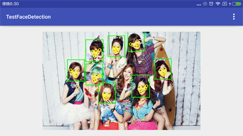
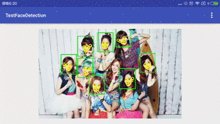

检测人脸有很多用处, 可以提供更好的交互, 和一些有针对性的意见. 检测脸部关键信息, 也可以处理一些微表情的内容.

<!-- more -->
> 更多: http://www.wangchenlong.org/

Google推出了官方的人脸检测功能, 很不幸依赖Google Service, 需要版本8.1以上. 国内手机基本不会默认配置. [下载地址](http://www.apkmirror.com/apk/google-inc/google-play-services/google-play-services-8-1-15-2250156-836-android-apk-download/), 此版本适配手机系统4.4+.

本文的GitHub[下载地址](https://github.com/SpikeKing/TestFaceDetection)

关注:
(1) 如何提取人脸(Face)位置.
(2) 如何提取脸部关键点(Landmark)位置.
(3) 如何在画布(Canvas)创建居中图片控件.

[官方API](https://developers.google.com/android/reference/com/google/android/gms/vision/face/package-summary)

我讲解一下用法, 写了一个简单的显示控件, 注释详细.



---

# 配置项目

新建HelloWorld项目, 配置``build.gradle``.
```gradle
    compile 'com.google.android.gms:play-services-vision:8.1.0' // 包含人脸识别类
    compile 'com.jakewharton:butterknife:7.0.1'
```

> 一般都会从最基础的HelloWorld开始, 方便学习和理解. ButterKnife必用.

---

# 检测人脸控件

控件居中显示一张图片, 在图片上, 绘制人脸位置和关键点(Landmarks).
[关键点](https://developers.google.com/android/reference/com/google/android/gms/vision/face/Landmark)包括: 眼睛, 鼻子, 嘴等属性. 存在遮挡, 根据不同人脸提取量不同.
通过``FaceDetector ``检测``Bitmap``, 获取图片的所有脸部(face)信息.
根据位置(Position)画出脸的形状, 根据关键点(Landmarks)画出脸部特征.
同时可以获取各种特征的概率(Probability), 和脸部偏移.

```java
/**
 * 检测人脸的控件
 * <p/>
 * Created by wangchenlong on 15/12/15.
 */
public class FacesDisplayView extends View {

    private static final String TAG = "DEBUG-WCL: " + FacesDisplayView.class.getSimpleName();

    private Bitmap mBitmap; // 图片
    private SparseArray<Face> mFaces; // 人脸数组

    // 确保图片居中
    private int mHorizonOffset; // 水平偏移
    private int mVerticalOffset; // 竖直偏移

    public FacesDisplayView(Context context) {
        this(context, null);
    }

    public FacesDisplayView(Context context, AttributeSet attrs) {
        this(context, attrs, 0);
    }

    public FacesDisplayView(Context context, AttributeSet attrs, int defStyleAttr) {
        super(context, attrs, defStyleAttr);
    }

    // 设置显示图片
    @SuppressWarnings("unused")
    public void setBitmap(Bitmap bitmap) {
        mBitmap = bitmap;
        FaceDetector detector = new FaceDetector.Builder(getContext())
                .setTrackingEnabled(true)
                .setLandmarkType(FaceDetector.ALL_LANDMARKS)
                .setMode(FaceDetector.ACCURATE_MODE)
                .build();

        if (!detector.isOperational()) {
            Log.e(TAG, "加载失败");
            return;
        } else {
            Frame frame = new Frame.Builder().setBitmap(bitmap).build();
            mFaces = detector.detect(frame);
            detector.release();
        }

        logFaceData(); // 打印人脸数据
        invalidate();  // 填充
    }

    @Override
    protected void onDraw(Canvas canvas) {
        super.onDraw(canvas);

        if ((mBitmap != null) && (mFaces != null)) {
            double scale = drawBitmap(canvas);
            drawFaceBox(canvas, scale);
            drawFaceLandmarks(canvas, scale);
        }
    }

    // 绘制图片, 返回缩放概率
    private double drawBitmap(Canvas canvas) {
        double viewWidth = canvas.getWidth(); // 显示宽度
        double viewHeight = canvas.getHeight(); // 显示高度
        double imageWidth = mBitmap.getWidth(); // 图片宽度
        double imageHeight = mBitmap.getHeight(); // 图片高度

        double wScale = viewWidth / imageWidth;
        double hScale = viewHeight / imageHeight;

        double scale;
        Rect destBounds;

        // 水平竖直缩放
        if (wScale > hScale) {
            mHorizonOffset = (int) ((viewWidth - imageWidth * hScale) / 2.0f);
            destBounds = new Rect(mHorizonOffset, 0,
                    (int) (imageWidth * hScale) + mHorizonOffset, (int) (imageHeight * hScale));
            scale = hScale;
        } else {
            mVerticalOffset = (int) ((viewHeight - imageHeight * wScale) / 2.0f);
            destBounds = new Rect(0, mVerticalOffset,
                    (int) (imageWidth * wScale), (int) (imageHeight * wScale) + mVerticalOffset);
            scale = wScale;
        }

        canvas.drawBitmap(mBitmap, null, destBounds, null); // 添加图片

        return scale;
    }

    // 绘制脸部方形
    private void drawFaceBox(Canvas canvas, double scale) {

        // 画笔
        Paint paint = new Paint();
        paint.setColor(Color.GREEN);
        paint.setStyle(Paint.Style.STROKE);
        paint.setStrokeWidth(5);

        float left;
        float top;
        float right;
        float bottom;

        // 绘制每张脸
        for (int i = 0; i < mFaces.size(); i++) {
            Face face = mFaces.valueAt(i);

            left = (float) (face.getPosition().x * scale);
            top = (float) (face.getPosition().y * scale);
            right = (float) scale * (face.getPosition().x + face.getWidth());
            bottom = (float) scale * (face.getPosition().y + face.getHeight());

            canvas.drawRect(left + mHorizonOffset, top + mVerticalOffset,
                    right + mHorizonOffset, bottom + mVerticalOffset, paint);
        }
    }

    // 绘制脸部关键部位
    private void drawFaceLandmarks(Canvas canvas, double scale) {
        Paint paint = new Paint();
        paint.setColor(Color.YELLOW);
        paint.setStyle(Paint.Style.STROKE);
        paint.setStrokeWidth(5);

        for (int i = 0; i < mFaces.size(); i++) {
            Face face = mFaces.valueAt(i);

            for (Landmark landmark : face.getLandmarks()) {
                int cx = (int) (landmark.getPosition().x * scale);
                int cy = (int) (landmark.getPosition().y * scale);
                canvas.drawCircle(cx + mHorizonOffset, cy + mVerticalOffset, 10, paint);
            }

        }
    }

    // 输出脸部数据
    private void logFaceData() {

        float smilingProbability;
        float leftEyeOpenProbability;
        float rightEyeOpenProbability;
        float eulerY;
        float eulerZ;

        for (int i = 0; i < mFaces.size(); i++) {
            Face face = mFaces.valueAt(i);

            // 可能性
            smilingProbability = face.getIsSmilingProbability();
            leftEyeOpenProbability = face.getIsLeftEyeOpenProbability();
            rightEyeOpenProbability = face.getIsRightEyeOpenProbability();

            eulerY = face.getEulerY(); // 竖直轴偏移
            eulerZ = face.getEulerZ(); // 前后偏移

            Log.e(TAG, "脸数: " + i);
            Log.e(TAG, "微笑概率: " + smilingProbability);
            Log.e(TAG, "左眼睁开概率: " + leftEyeOpenProbability);
            Log.e(TAG, "右眼睁开概率: " + rightEyeOpenProbability);
            Log.e(TAG, "竖直轴偏移: " + eulerY);
            Log.e(TAG, "前后偏移: " + eulerZ);
            Log.e(TAG, "--------------------");
        }
    }
}
```

> 图像和特征是显示在画布上, 根据画布大小, 等比例缩放, 并居中显示.

---

# 主页面

主界面通过一个简单的ViewPager连续显示图片.
```java
    @Bind(R.id.main_vp_container) ViewPager mVpContainer; // 连续

    @Override
    protected void onCreate(Bundle savedInstanceState) {
        super.onCreate(savedInstanceState);
        setContentView(R.layout.activity_main);
        ButterKnife.bind(this);
        Toolbar toolbar = (Toolbar) findViewById(R.id.toolbar);
        setSupportActionBar(toolbar);

        mVpContainer.setAdapter(new FacesViewPagerAdapter(getSupportFragmentManager()));
    }
```

适配传递参数, 根据参数, 返回不同的图片页面.
```java
/**
 * 脸部适配器
 * <p/>
 * Created by wangchenlong on 15/12/15.
 */
public class FacesViewPagerAdapter extends FragmentPagerAdapter {

    private static final int NUM = 9;

    public FacesViewPagerAdapter(FragmentManager fm) {
        super(fm);
    }

    @Override public Fragment getItem(int position) {
        return ShowFaceFragment.newInstance(position);
    }

    @Override public int getCount() {
        return NUM;
    }
}
```

每页是个Fragment, 根据参数, 使用不同资源.
```java
/**
 * 显示人脸的界面
 * <p/>
 * Created by wangchenlong on 15/12/15.
 */
public class ShowFaceFragment extends Fragment {
    private static final String ARG_SELECTION_NUM = "arg_selection_num";

    @Bind(R.id.main_fdv_face_detector) FacesDisplayView mFdvFaceDetector;
    @RawRes ArrayList<Integer> mPhotos; // 图片集合

    public ShowFaceFragment() {
        mPhotos = new ArrayList<>();
        mPhotos.add(R.raw.total_large_poster);
        mPhotos.add(R.raw.jessicajung_large_poster);
        mPhotos.add(R.raw.seohyun_large_poster);
        mPhotos.add(R.raw.sooyoung_large_poster);
        mPhotos.add(R.raw.sunny_large_poster);
        mPhotos.add(R.raw.taeyeon_large_poster);
        mPhotos.add(R.raw.tiffany_large_poster);
        mPhotos.add(R.raw.yoona_large_poster);
        mPhotos.add(R.raw.yuri_large_poster);
    }

    public static ShowFaceFragment newInstance(int selectionNum) {
        ShowFaceFragment simpleFragment = new ShowFaceFragment();
        Bundle args = new Bundle();
        args.putInt(ARG_SELECTION_NUM, selectionNum);
        simpleFragment.setArguments(args);
        return simpleFragment;
    }

    @Nullable @Override
    public View onCreateView(LayoutInflater inflater, @Nullable ViewGroup container, @Nullable Bundle savedInstanceState) {
        View view = inflater.inflate(R.layout.fragment_show_face, container, false);
        ButterKnife.bind(this, view);
        return view;
    }

    @Override public void onViewCreated(View view, @Nullable Bundle savedInstanceState) {
        super.onViewCreated(view, savedInstanceState);
        @RawRes int image = mPhotos.get(getArguments().getInt(ARG_SELECTION_NUM));
        InputStream stream = getResources().openRawResource(image);
        Bitmap bitmap = BitmapFactory.decodeStream(stream);
        mFdvFaceDetector.setBitmap(bitmap);
    }

    @Override public void onDestroyView() {
        super.onDestroyView();
        ButterKnife.unbind(this);
    }
}
```

> 注意使用注释(Annotation), 判断资源类型, 如``@RawRes``.



---

有时间再完善一下这个小控件吧.

OK, that's all! Enjoy It!

---

> 原始地址: 
> http://www.wangchenlong.org/2016/03/22/1603/225-face-detect/
> 欢迎Follow我的[GitHub](https://github.com/SpikeKing), 关注我的[简书](http://www.jianshu.com/users/e2b4dd6d3eb4/latest_articles), [微博](http://weibo.com/u/2852941392), [CSDN](http://blog.csdn.net/caroline_wendy), [掘金](http://gold.xitu.io/#/user/56de98c2f3609a005442ec58), [Slides](https://slides.com/spikeking). 
> 我已委托“维权骑士”为我的文章进行维权行动. 未经授权, 禁止转载, 授权或合作请留言.

