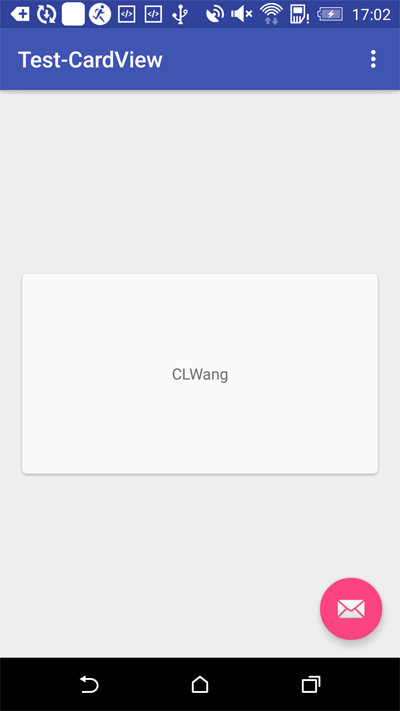

CardView是Material Design的一种卡片视图, 以卡片形式显示内容, 边缘包含阴影效果, 吸引用户点击. CardView提供了v7的支持库, 兼容低版本. 本文主要介绍CardView的使用方法.

<!-- more -->
> 更多: http://www.wangchenlong.org/


Maven库
```gradle
compile 'com.android.support:cardview-v7:+'
```

> 需要额外添加Design的支持库, 如**compile 'com.android.support:design:23.1.0'**

资源文件
```xml
    <android.support.v7.widget.CardView
        android:id="@+id/card_view"
        android:layout_width="320dp"
        android:layout_height="180dp"
        android:layout_centerInParent="true"
        android:foreground="?attr/selectableItemBackground"
        android:stateListAnimator="@anim/item_raise"
        app:cardCornerRadius="4dp"
        app:cardElevation="4dp">

        <TextView
            android:id="@+id/info_text"
            android:layout_width="match_parent"
            android:layout_height="match_parent"
            android:gravity="center"
            android:text="CLWang"/>
    </android.support.v7.widget.CardView>
```

``app:cardCornerRadius``表示卡片的弧度.
``app:cardElevation``表示阴影的深度.

点击事件
```java
        CardView cardView = (CardView) findViewById(R.id.card_view);
        cardView.setOnClickListener(new View.OnClickListener() {
            @Override
            public void onClick(View v) {
                Toast.makeText(MainActivity.this, "This is a card view!", Toast.LENGTH_LONG).show();
            }
        });
```

波纹型的选中效果.
```xml
android:foreground="?attr/selectableItemBackground"
```

阴影加深的选中效果
```xml
android:stateListAnimator="@anim/item_raise"

阴影动画item_raise
```
```xml
<?xml version="1.0" encoding="utf-8"?>
<selector xmlns:android="http://schemas.android.com/apk/res/android">
    <item
        android:state_enabled="true"
        android:state_pressed="true">
        <objectAnimator
            android:duration="@android:integer/config_shortAnimTime"
            android:propertyName="translationZ"
            android:valueTo="8dp"
            android:valueType="floatType"/>
    </item>
    <item>
        <objectAnimator
            android:duration="@android:integer/config_shortAnimTime"
            android:propertyName="translationZ"
            android:valueTo="0dp"
            android:valueType="floatType"/>
    </item>
</selector>
```

> 选中时, Z轴逐渐升起; 未选中时, Z轴恢复0. 动画属性支持api21+.



**注意**
不同版本显示效果不同时, 定制``/res/value``和 ``/res/value-v21``的资源. 

设计要点, CardView主要突出不同种类的卡片在一起显示, 尽量不要使用单一的模式, 如固定高度的卡片, 类似ListView的显示.

That's all! Enjoy it!

---

**生活**

> 有技术又要有生活, 美让生活更精彩!

[](http://s.click.taobao.com/t?e=m%3D2%26s%3Dej4BaB%2FnUoMcQipKwQzePOeEDrYVVa64LKpWJ%2Bin0XJRAdhuF14FMbO2CON%2BuR7dMMgx22UI05aD18qGwYGwMucFZRTbL%2Fvo%2BIoZChn2nagyz8D6Kmb7m%2B%2Fof3H88sxpcT2EudbsuL7MmUDdIf17dXEqY%2Bakgpmw)

女生, 让自己更职业受欢迎! [好物](http://s.click.taobao.com/t?e=m%3D2%26s%3Dej4BaB%2FnUoMcQipKwQzePOeEDrYVVa64LKpWJ%2Bin0XJRAdhuF14FMbO2CON%2BuR7dMMgx22UI05aD18qGwYGwMucFZRTbL%2Fvo%2BIoZChn2nagyz8D6Kmb7m%2B%2Fof3H88sxpcT2EudbsuL7MmUDdIf17dXEqY%2Bakgpmw)

---

> 原始地址: 
> http://www.wangchenlong.org/2016/03/22/1603/229-card-view-first/
> 欢迎Follow我的[GitHub](https://github.com/SpikeKing), 关注我的[简书](http://www.jianshu.com/users/e2b4dd6d3eb4/latest_articles), [微博](http://weibo.com/u/2852941392), [CSDN](http://blog.csdn.net/caroline_wendy), [掘金](http://gold.xitu.io/#/user/56de98c2f3609a005442ec58). 
> 我已委托“维权骑士”为我的文章进行维权行动. 未经授权, 禁止转载, 授权或合作请留言.

