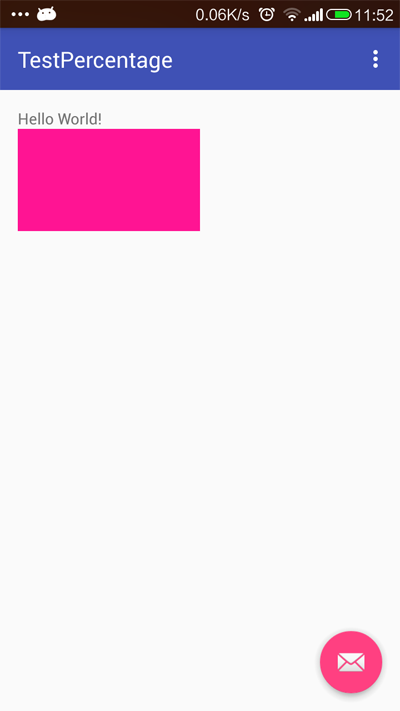

PercentLayout布局是百分比控件, 使用百分比属性创建控件. 除了常用的百分比, 也可以使用固定比例进行布局(aspect ratio), 需要编译版本23.

<!-- more -->
> 更多: http://www.wangchenlong.org/

Percent相关Layout包括: [PercentFrameLayout](http://developer.android.com/reference/android/support/percent/PercentFrameLayout.html) \ [PercentRelativeLayout](http://developer.android.com/reference/android/support/percent/PercentRelativeLayout.html).


添加Gradle依赖
```gradle
compile 'com.android.support:percent:23.1.0'
```

PercentRelativeLayout布局, 提供宽度和比例, 自动适配高度.
``` xml
    <android.support.percent.PercentRelativeLayout
        android:layout_width="match_parent"
        android:layout_height="wrap_content"
        android:layout_below="@+id/main_text">

        <ImageView
            android:layout_width="0dp"
            android:layout_height="0dp"
            android:background="#FF1493"
            app:layout_aspectRatio="@fraction/header_aspectRatio"
            app:layout_widthPercent="50%"/>

    </android.support.percent.PercentRelativeLayout>
```

比例的资源文件, ``fractions.xml``.
```xml
<resources>
    <item name="header_aspectRatio" type="fraction">178%</item>
</resources>
```

> ``178%``的含义是16:9.



[参考](https://plus.google.com/+AndroidDevelopers/posts/ZQS29a5yroK)

可以通过设置比例, 更好地优化控件的布局.

OK, that's all! Enjoy it!

---

> 原始地址: 
> http://www.wangchenlong.org/2016/03/22/1603/231-percent-layout-first/
> 欢迎Follow我的[GitHub](https://github.com/SpikeKing), 关注我的[简书](http://www.jianshu.com/users/e2b4dd6d3eb4/latest_articles), [微博](http://weibo.com/u/2852941392), [CSDN](http://blog.csdn.net/caroline_wendy), [掘金](http://gold.xitu.io/#/user/56de98c2f3609a005442ec58). 
> 我已委托“维权骑士”为我的文章进行维权行动. 未经授权, 禁止转载, 授权或合作请留言.

