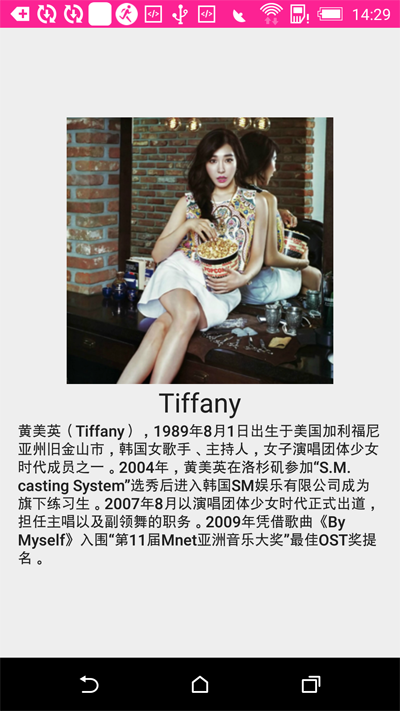

Android的动画效果, Material Design提出的. 当Fragment切换时, 一些元素(Element)会保持不变, 形成连续动画. 目前只支持Api21+.

<!-- more -->
> 更多: http://www.wangchenlong.org/

在这些元素切换时, 页面需要设置addSharedElement()方法. 让我们来看一下如何实现吧. 

本文源码的GitHub[下载地址](https://github.com/SpikeKing/TestFragmetnSharedElement)


---

# 配置

还是从一个HelloWorld工程开始.
``build.gradle``添加两个常用库, recyclerview和butterknife.
```gradle
    compile 'com.jakewharton:butterknife:7.0.1'
    compile 'com.android.support:recyclerview-v7:23.1.0'
```

修改主题颜色
```xml
    <color name="colorPrimary">#FF1493</color>
    <color name="colorPrimaryDark">#FF1493</color>
```

去掉``状态条(status bar)``的透明颜色, 在style中, 删除statusBarColor.
```xml
<item name="android:statusBarColor">@android:color/transparent</item>
```

---

# 主页

在Activity中添加Fragment, 内容在Fragment中添加
```java
    @Override
    protected void onCreate(Bundle savedInstanceState) {
        super.onCreate(savedInstanceState);
        setContentView(R.layout.activity_main);

        // 替换Fragment
        if (savedInstanceState == null) {
            getSupportFragmentManager().beginTransaction()
                    .add(R.id.main_cl_container, new GridFragment())
                    .commit();
        }
    }
```

Fragment中使用RecyclerView创建一个网格(Grid)页面, 为Item添加点击监听, 这个下一步再完成. Item显示一个图片和一行文字.
```java
public class GridFragment extends Fragment {

    private ArrayList<Pair<Integer, Integer>> mData;

    @Bind(R.id.grid_rv_recycler)
    RecyclerView mRvRecycler;

    @Nullable
    @Override
    public View onCreateView(LayoutInflater inflater, ViewGroup container,
                             Bundle savedInstanceState) {
        View view = inflater.inflate(R.layout.fragment_grid, container, false);
        ButterKnife.bind(this, view);
        return view;
    }

    @Override
    public void onViewCreated(View view, Bundle savedInstanceState) {
        super.onViewCreated(view, savedInstanceState);

        initData();

        mRvRecycler.setAdapter(new MyGridAdapter(mData, mListener));
        mRvRecycler.setLayoutManager(new GridLayoutManager(getContext(), 2)); // 一行两个
    }

    private MyViewOnClickListener mListener = new MyViewOnClickListener() {
        @Override
        public void onClickedView(MyGridViewHolder holder, int position) {

        }
    };

    // 初始化数据
    private void initData() {
        mData = new ArrayList<>();

        mData.add(Pair.create(R.string.taeyeon, R.drawable.taeyeon));
        mData.add(Pair.create(R.string.jessica, R.drawable.jessica));
        mData.add(Pair.create(R.string.sunny, R.drawable.sunny));
        mData.add(Pair.create(R.string.tiffany, R.drawable.tiffany));
        mData.add(Pair.create(R.string.yuri, R.drawable.yuri));
        mData.add(Pair.create(R.string.yoona, R.drawable.yoona));
    }

    @Override
    public void onDestroyView() {
        super.onDestroyView();
        ButterKnife.unbind(this);
    }
}
```

RecyclerView的Adapter
```java
/**
 * Fragment的网格适配器
 * <p/>
 * Created by wangchenlong on 15/11/5.
 */
public class MyGridAdapter extends RecyclerView.Adapter<MyGridViewHolder> {

    private ArrayList<Pair<Integer, Integer>> mData; // 名字和图片
    private MyViewOnClickListener mListener; // 点击事件

    public MyGridAdapter(ArrayList<Pair<Integer, Integer>> data,
                         MyViewOnClickListener listener) {
        mData = data;
        mListener = listener;
    }

    @Override
    public MyGridViewHolder onCreateViewHolder(ViewGroup parent, int viewType) {
        View view = LayoutInflater.from(parent.getContext()).inflate(R.layout.grid_item, parent, false);
        return new MyGridViewHolder(view);
    }

    @Override
    public void onBindViewHolder(final MyGridViewHolder holder, final int position) {
        holder.getTextView().setText(mData.get(position).first);
        holder.getImageView().setImageResource(mData.get(position).second);

        // 把每个图片视图设置不同的Transition名称, 防止在一个视图内有多个相同的名称, 在变换的时候造成混乱
        // Fragment支持多个View进行变换, 使用适配器时, 需要加以区分
        ViewCompat.setTransitionName(holder.getImageView(), String.valueOf(position) + "_image");

        holder.getImageView().setOnClickListener(new View.OnClickListener() {
            @Override
            public void onClick(View v) {
                mListener.onClickedView(holder, position);
            }
        });
    }

    @Override
    public int getItemCount() {
        return mData.size();
    }
}
```

> 注意``ViewCompat.setTransitionName();``, 把不同的视图设置不同的变换名称, 防止造成混乱, 同时支持多个视图同时变换.

ViewHolder
```java
/**
 * 提供了Grid的ImageView
 * <p/>
 * Created by wangchenlong on 15/11/5.
 */
public class MyGridViewHolder extends RecyclerView.ViewHolder {

    private ImageView mImageView;
    private TextView mTextView;

    public MyGridViewHolder(View itemView) {
        super(itemView);
        mImageView = (ImageView) itemView.findViewById(R.id.grid_image);
        mTextView = (TextView) itemView.findViewById(R.id.grid_text);
    }

    public ImageView getImageView() {
        return mImageView;
    }

    public TextView getTextView() {
        return mTextView;
    }
}
```

点击接口, 提供ViewHolder和点击的位置position.
```java
public interface MyViewOnClickListener {
    void onClickedView(MyGridViewHolder holder, int position);
}
```

效果


---

# 详情

主页面跳转之后的详情页面, 根据选择的ID, 创建不同内容的Fragment, 点击图片返回上一个Fragment, 和主页面联动执行动画, 动画逻辑在主页面的FragmentManager中添加的.
```java
/**
 * 详情页面
 * <p/>
 * Created by wangchenlong on 15/11/5.
 */
public class DetailFragment extends Fragment {

    private static final String ARG_NUMBER = "arg_number";
    private ArrayList<DetailData> mDetailDatas;

    @Bind(R.id.detail_image)
    ImageView mImage;

    @Bind(R.id.detail_head)
    TextView mHead;

    @Bind(R.id.detail_body)
    TextView mBody;

    /**
     * 根据选择的number, 选择展示的数据
     *
     * @param number 数字
     * @return 详情页面
     */
    public static DetailFragment newInstance(@IntRange(from = 0, to = 5) int number) {
        Bundle bundle = new Bundle();
        bundle.putInt(ARG_NUMBER, number);

        DetailFragment detailFragment = new DetailFragment();
        detailFragment.setArguments(bundle);

        return detailFragment;
    }

    @Nullable
    @Override
    public View onCreateView(LayoutInflater inflater, ViewGroup container, Bundle savedInstanceState) {
        View view = inflater.inflate(R.layout.fragment_detail, container, false);
        ButterKnife.bind(this, view);
        return view;
    }

    @Override
    public void onViewCreated(View view, Bundle savedInstanceState) {
        super.onViewCreated(view, savedInstanceState);

        initData();

        int number = getArguments().getInt(ARG_NUMBER);
        mImage.setImageResource(mDetailDatas.get(number).getImage());
        mHead.setText(mDetailDatas.get(number).getHead());
        mBody.setText(mDetailDatas.get(number).getBody());

        mImage.setOnClickListener(new View.OnClickListener() {
            @Override
            public void onClick(View v) {
                getActivity().getSupportFragmentManager().popBackStack();
            }
        });
    }


    // 初始化数据
    private void initData() {
        mDetailDatas = new ArrayList<>();
        mDetailDatas.add(new DetailData(R.drawable.taeyeon, R.string.taeyeon, R.string.taeyeon_detail));
        mDetailDatas.add(new DetailData(R.drawable.jessica, R.string.jessica, R.string.jessica_detail));
        mDetailDatas.add(new DetailData(R.drawable.sunny, R.string.sunny, R.string.sunny_detail));
        mDetailDatas.add(new DetailData(R.drawable.tiffany, R.string.tiffany, R.string.tiffany_detail));
        mDetailDatas.add(new DetailData(R.drawable.yuri, R.string.yuri, R.string.yuri_detail));
        mDetailDatas.add(new DetailData(R.drawable.yoona, R.string.yoona, R.string.yoona_detail));
    }

    @Override
    public void onDestroyView() {
        super.onDestroyView();
        ButterKnife.unbind(this);
    }

    // 定义类
    private class DetailData {
        private int mImage;
        private int mHead;
        private int mBody;

        public DetailData(int image, int head, int body) {
            mImage = image;
            mHead = head;
            mBody = body;
        }

        public int getImage() {
            return mImage;
        }

        public int getHead() {
            return mHead;
        }

        public int getBody() {
            return mBody;
        }
    }
}
```

关键的资源文件, 有一条重要的属性, ``android:transitionName=""``表明需要转换对象的名称, 在点击事件中使用.
```xml
<?xml version="1.0" encoding="utf-8"?>
<LinearLayout xmlns:android="http://schemas.android.com/apk/res/android"
              xmlns:tools="http://schemas.android.com/tools"
              android:layout_width="match_parent"
              android:layout_height="match_parent"
              android:gravity="center"
              android:orientation="vertical"
              android:padding="16dp">

    <ImageView
        android:id="@+id/detail_image"
        android:layout_width="240dp"
        android:layout_height="240dp"
        android:scaleType="centerCrop"
        android:src="@drawable/tiffany"
        android:transitionName="@string/image_transition"
        tools:ignore="UnusedAttribute"/>

    <TextView
        android:id="@+id/detail_head"
        android:layout_width="wrap_content"
        android:layout_height="wrap_content"
        android:text="@string/tiffany"
        android:textAppearance="@style/TextAppearance.AppCompat.Headline"/>

    <TextView
        android:id="@+id/detail_body"
        android:layout_width="wrap_content"
        android:layout_height="wrap_content"
        android:text="@string/tiffany_detail"
        android:textAppearance="@style/TextAppearance.AppCompat.Body2"/>

</LinearLayout>
```

效果


重写``GridFragment``的点击事件
```java
    /**
     * 点击事件, 转换元素的动画,
     * 关键addSharedElement(holder.getImageView(), getResources().getString(R.string.image_transition))
     * 绑定ViewHolder的图片和DetailFragment的跳转.
     */
    private MyViewOnClickListener mListener = new MyViewOnClickListener() {
        @Override
        public void onClickedView(MyGridViewHolder holder, int position) {
            DetailFragment detailFragment = DetailFragment.newInstance(position);

            if (Build.VERSION.SDK_INT >= Build.VERSION_CODES.LOLLIPOP) {
                detailFragment.setSharedElementEnterTransition(new DetailTransition());
                setExitTransition(new Fade());
                detailFragment.setEnterTransition(new Fade());
                detailFragment.setSharedElementReturnTransition(new DetailTransition());
            }

            getActivity().getSupportFragmentManager().beginTransaction()
                    .addSharedElement(holder.getImageView(), getResources().getString(R.string.image_transition))
                    .replace(R.id.main_cl_container, detailFragment)
                    .addToBackStack(null)
                    .commit();
        }
    };
```
> 关键addSharedElement(), 确定转换的元素View.
> Fade是淡出动画; DetailTransition是自定义动画.

填写动画属性
```java
/**
 * 转换动画
 * Created by wangchenlong on 15/11/5.
 */
@TargetApi(Build.VERSION_CODES.LOLLIPOP)
public class DetailTransition extends TransitionSet {
    public DetailTransition() {
        init();
    }

    // 允许资源文件使用
    public DetailTransition(Context context, AttributeSet attrs) {
        super(context, attrs);
        init();
    }

    private void init() {
        setOrdering(ORDERING_TOGETHER);
        addTransition(new ChangeBounds()).
                addTransition(new ChangeTransform()).
                addTransition(new ChangeImageTransform());
    }
}
```

> 动画效果, 添加属性即可.
> ChangeBounds: 视图的位置和大小;
> ChangeTransform: 视图的比例(scale);
> ChangeImageTransform: 图像的比例;

---

已经都完成了, 当切换Fragment时, 关联视图就会使用动画进行播放! 
OK, that's all! Enjoy it.

---

**生活**

> 有技术又要有生活, 美让生活更精彩!

[](http://s.click.taobao.com/t?e=m%3D2%26s%3DBIDSCWTHX%2BgcQipKwQzePOeEDrYVVa64K7Vc7tFgwiHjf2vlNIV67kcNifCCjBeAYFMBzHxYoCN1lK%2FY7wPaoHeQQxhDmA6IAe67oaxDEWp4DvOxtwmul4Ep9ov0yrw60ixpVrz2yT%2BQnTiMaxSHD8YMXU3NNCg%2F&pvid=10_117.73.144.43_17234_1458428662179)

女生, 让自己更职业受欢迎! [好物](http://s.click.taobao.com/t?e=m%3D2%26s%3DBIDSCWTHX%2BgcQipKwQzePOeEDrYVVa64K7Vc7tFgwiHjf2vlNIV67kcNifCCjBeAYFMBzHxYoCN1lK%2FY7wPaoHeQQxhDmA6IAe67oaxDEWp4DvOxtwmul4Ep9ov0yrw60ixpVrz2yT%2BQnTiMaxSHD8YMXU3NNCg%2F&pvid=10_117.73.144.43_17234_1458428662179)

---

> 原始地址: 
> http://www.wangchenlong.org/2016/03/22/1603/232-fragment-shared-element/
> 欢迎Follow我的[GitHub](https://github.com/SpikeKing), 关注我的[简书](http://www.jianshu.com/users/e2b4dd6d3eb4/latest_articles), [微博](http://weibo.com/u/2852941392), [CSDN](http://blog.csdn.net/caroline_wendy), [掘金](http://gold.xitu.io/#/user/56de98c2f3609a005442ec58). 
> 我已委托“维权骑士”为我的文章进行维权行动. 未经授权, 禁止转载, 授权或合作请留言.

