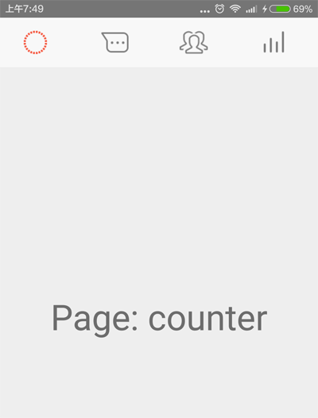
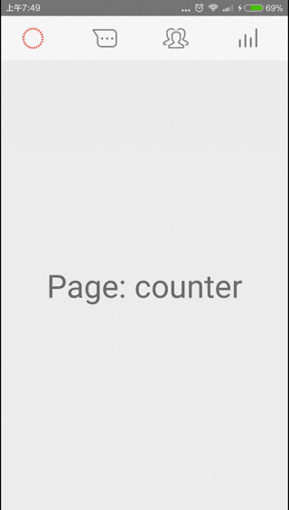

FragmentTabHost作为Android4.0版本的控件, 已经被项目广泛使用, 5.0版本又推出 **TabLayout + ViewPager** 显示多页. 作为4.0的重要首页架构方式, FragmentTabHost被广泛地应用. 本文介绍FragmentTabHost的使用及优化方式.

<!-- more -->
> 更多: http://www.wangchenlong.org/

本文源码的GitHub[下载地址](https://github.com/SpikeKing/TestFragmentTabHost)


主要包括:
(1) 自定义Tab的图片资源和去掉分割线.
(2) 缓存Fragment的布局, 减少填充.

> 在切换页面时, 控件会调用Fragment的onCreateView, 重新创建页面. 
> 通过预先缓存页面, 可以增强加载性能. 

---

# 布局

FragmentTabHost是原生控件, 并不需要添加其他的maven库. 
包括标签组Tabs和页面TabContainer, 标签组固定大小, 页面填充.
```xml
<?xml version="1.0" encoding="utf-8"?>
<android.support.v4.app.FragmentTabHost
    android:id="@android:id/tabhost"
    xmlns:android="http://schemas.android.com/apk/res/android"
    android:layout_width="match_parent"
    android:layout_height="match_parent">

    <LinearLayout
        android:layout_width="match_parent"
        android:layout_height="match_parent"
        android:orientation="vertical">

        <TabWidget
            android:id="@android:id/tabs"
            android:layout_width="match_parent"
            android:layout_height="?attr/actionBarSize"
            android:layout_gravity="bottom"/>

        <FrameLayout
            android:id="@android:id/tabcontent"
            android:layout_width="match_parent"
            android:layout_height="0dp"
            android:layout_weight="1"/>

    </LinearLayout>

</android.support.v4.app.FragmentTabHost>
```

> 注意控件的id必须是Android提供的标准id, 即"@android:id".

Fragment布局, 包含一行文字提示.
```xml
<?xml version="1.0" encoding="utf-8"?>
<LinearLayout xmlns:android="http://schemas.android.com/apk/res/android"
              xmlns:tools="http://schemas.android.com/tools"
              android:layout_width="match_parent"
              android:layout_height="match_parent"
              android:orientation="vertical">

    <TextView
        android:id="@+id/tab_tv_text"
        android:layout_width="match_parent"
        android:layout_height="match_parent"
        android:gravity="center"
        android:textSize="40sp"
        tools:text="Test"/>

</LinearLayout>
```

Tab布局, 包含一个图片控件.
```xml
<?xml version="1.0" encoding="utf-8"?>
<LinearLayout
    xmlns:android="http://schemas.android.com/apk/res/android"
    xmlns:tools="http://schemas.android.com/tools"
    android:layout_width="wrap_content"
    android:layout_height="wrap_content"
    android:orientation="vertical">

    <ImageView
        android:id="@+id/tab_iv_image"
        android:padding="12dp"
        android:layout_width="wrap_content"
        android:layout_height="wrap_content"
        android:contentDescription="@null"
        tools:src="@drawable/tab_assistant"/>

</LinearLayout>
```



---

# 主页

setup设置页面组合, 却掉分割线etDividerDrawable(null), 设置Tab.
使用自定义的图片资源, newTabSpec设置Fragment的Tag标签.
```java
/**
 * 主页, 切换Tab标签显示不同页面.
 *
 * @author C.L.Wang
 */
public class MainActivity extends AppCompatActivity {

    @Bind(android.R.id.tabhost) FragmentTabHost mTabHost;

    // 图片
    @DrawableRes
    private int mImages[] = {
            R.drawable.tab_counter,
            R.drawable.tab_assistant,
            R.drawable.tab_contest,
            R.drawable.tab_center
    };

    // 标题
    private String mFragmentTags[] = {
            "counter",
            "assistant",
            "contest",
            "center"
    };

    @Override
    protected void onCreate(Bundle savedInstanceState) {
        super.onCreate(savedInstanceState);
        setContentView(R.layout.activity_main);

        ButterKnife.bind(this);

        mTabHost.setup(this, getSupportFragmentManager(), android.R.id.tabcontent);
        mTabHost.getTabWidget().setDividerDrawable(null); // 去掉分割线

        for (int i = 0; i < mImages.length; i++) {
            // Tab按钮添加文字和图片
            TabHost.TabSpec tabSpec = mTabHost.newTabSpec(mFragmentTags[i]).setIndicator(getImageView(i));
            // 添加Fragment
            mTabHost.addTab(tabSpec, FragmentTab.class, null);
            // 设置Tab按钮的背景
            mTabHost.getTabWidget().getChildAt(i).setBackgroundResource(R.color.pedo_actionbar_bkg);
        }
    }

    // 获得图片资源
    private View getImageView(int index) {
        @SuppressLint("InflateParams")
        View view = getLayoutInflater().inflate(R.layout.view_tab_indicator, null);
        ImageView imageView = (ImageView) view.findViewById(R.id.tab_iv_image);
        imageView.setImageResource(mImages[index]);
        return view;
    }
}
```

---

# 切换页

显示不同Tag标签. 缓存页面, 注意关联前, 删除父控件关联. 页面显示Tag信息. 
```java
/**
 * Tab的Fragment
 * <p/>
 * Created by wangchenlong on 15/12/28.
 */
public class FragmentTab extends Fragment {

    @Bind(R.id.tab_tv_text) TextView mTvText;

    private View mViewContent; // 缓存视图内容

    @Nullable @Override
    public View onCreateView(LayoutInflater inflater, @Nullable ViewGroup container, @Nullable Bundle savedInstanceState) {
        if (mViewContent == null) {
            mViewContent = inflater.inflate(R.layout.fragment_tab, container, false);
        }

        // 缓存View判断是否含有parent, 如果有需要从parent删除, 否则发生已有parent的错误.
        ViewGroup parent = (ViewGroup) mViewContent.getParent();
        if (parent != null) {
            parent.removeView(mViewContent);
        }

        ButterKnife.bind(this, mViewContent);
        return mViewContent;
    }

    @Override public void onViewCreated(View view, @Nullable Bundle savedInstanceState) {
        super.onViewCreated(view, savedInstanceState);
        // 显示Fragment的Tag信息
        mTvText.setText(String.valueOf("Page: " + getTag()));
    }

    @Override public void onDestroyView() {
        super.onDestroyView();
        ButterKnife.unbind(this);
    }
}
```



---

熟练使用FragmentTabHost控件很重要, 因为大量应用都在使用.

OK, That's all!  Enjoy It!

---

**生活**

> 有技术又要有生活, 美让生活更精彩!

[](http://s.click.taobao.com/t?e=m%3D2%26s%3D8i0Flhyf1gMcQipKwQzePOeEDrYVVa64K7Vc7tFgwiHjf2vlNIV67tcy0Em%2BHXdDPx3RkWSJTux1lK%2FY7wPaoHeQQxhDmA6IAe67oaxDEWp4DvOxtwmul7QjEVeo0%2FYmgE9V3e8PmOyIiYuNitTbzwyW7mQwqx7e&pvid=12_117.73.144.43_401_1458429238541)

女生, 让自己更职业受欢迎! [好物](http://s.click.taobao.com/t?e=m%3D2%26s%3D8i0Flhyf1gMcQipKwQzePOeEDrYVVa64K7Vc7tFgwiHjf2vlNIV67tcy0Em%2BHXdDPx3RkWSJTux1lK%2FY7wPaoHeQQxhDmA6IAe67oaxDEWp4DvOxtwmul7QjEVeo0%2FYmgE9V3e8PmOyIiYuNitTbzwyW7mQwqx7e&pvid=12_117.73.144.43_401_1458429238541)

---

> 原始地址: 
> http://www.wangchenlong.org/2016/03/23/1603/233-fragment-tabhost-first/
> 欢迎Follow我的[GitHub](https://github.com/SpikeKing), 关注我的[简书](http://www.jianshu.com/users/e2b4dd6d3eb4/latest_articles), [微博](http://weibo.com/u/2852941392), [CSDN](http://blog.csdn.net/caroline_wendy), [掘金](http://gold.xitu.io/#/user/56de98c2f3609a005442ec58). 
> 我已委托“维权骑士”为我的文章进行维权行动. 未经授权, 禁止转载, 授权或合作请留言.

