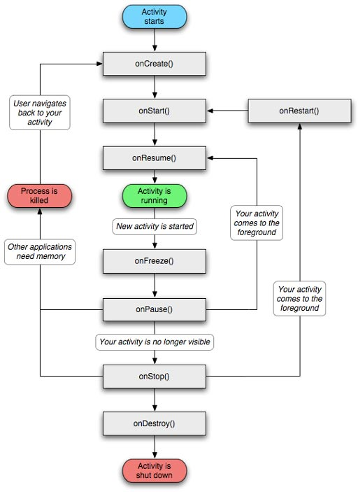
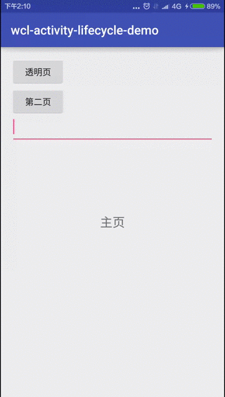

在Android应用中, Activity是最重要的组件, 其[生命周期(Lifecycle)](http://developer.android.com/training/basics/activity-lifecycle/index.html)被大家所熟知. 但是, 大家需要注意一些细节, 才能在使用中得心应手. 

<!-- more -->
> 更多: http://www.wangchenlong.org/

Android的生命周期改变主要有两种情况, 一是用户参与Activity生命周期的改变, 二是系统回收或配置修改导致的改变.

本文示例的GitHub[下载地址](https://github.com/SpikeKing/wcl-activity-lifecycle-demo)


Android的生命周期:


---

# 用户参与

用户最常见的两种操作, 按Home键或Back键.
(1) 点击Home键, 暂停当前Activity, 调用onPause -> onStop; 再次返回, 恢复当前页面, 调用onRestart -> onStart -> onResume.
(2) 点击Back键, 关闭当前Activity, 调用onPause -> onStop -> onDestroy; 再次启动则为重建, 从onCreate开始调用.

onStart()是Activity可见, 无法交互; onResume()是Activity可见, 可以交互. onPause是Activity无法交互, 必须执行前一个Activity的onPause完成, 后一个Activity才能启动, **在onPause中, 不能执行复杂的操作**, 否则会影响下一个Activity启动速度. onStop是Activity关闭显示. 

> 注意: 启动透明页面只调用onPause, 不会调用onStop, 即只是不可以交互, 但仍在前台显示. 启动非透明页, 会调用onPause -> onStop.

执行操作, 启动透明页, 关闭透明页, 启动非透明页, 关闭非透明页.
```cmd
E/DEBUG-WCL: MainActivity: onPause
E/DEBUG-WCL: MainActivity: onSaveInstanceState
E/DEBUG-WCL: TranslateActivity: onPause
E/DEBUG-WCL: MainActivity: onResume
E/DEBUG-WCL: TranslateActivity: onStop
E/DEBUG-WCL: TranslateActivity: onDestroy
E/DEBUG-WCL: MainActivity: onPause
E/DEBUG-WCL: SecondActivity: onCreate
E/DEBUG-WCL: MainActivity: onSaveInstanceState
E/DEBUG-WCL: MainActivity: onStop
E/DEBUG-WCL: SecondActivity: onPause
E/DEBUG-WCL: MainActivity: onRestart
E/DEBUG-WCL: MainActivity: onStart
E/DEBUG-WCL: MainActivity: onResume
E/DEBUG-WCL: SecondActivity: onStop
E/DEBUG-WCL: SecondActivity: onDestroy
```

> 注意透明页启动, 主页只会调用onPause, 而不调用onStop.
> onSaveInstanceState方法, 在关闭时, 都会执行, 但非系统调用启动, 不会执行恢复数据的操作, 即onRestoreInstanceState方法.

---

# 系统重建

在系统配置发生改变时, Activity就会重建, 由于是系统控制的关闭和启动, 会调用onSaveInstanceState保存数据, onRestoreInstanceState恢复数据.

```cmd
E/DEBUG-WCL: MainActivity: onPause
E/DEBUG-WCL: MainActivity: onSaveInstanceState
E/DEBUG-WCL: MainActivity: onStop
E/DEBUG-WCL: MainActivity: onDestroy
E/DEBUG-WCL: MainActivity: onCreate
E/DEBUG-WCL: MainActivity: onStart
E/DEBUG-WCL: MainActivity: onRestoreInstanceState
E/DEBUG-WCL: MainActivity: onResume

```

> onRestoreInstanceState在可以交互之前(onResume)执行, onSaveInstanceState在停止交互(onPause)之后执行.

系统会保存关闭之前的视图结构和暂存数据. 视图具体保存的数据项, 可以通过阅读文档, 也可以直接阅读代码.  搜索视图类的onSaveInstanceState方法, 类SavedState就是保存的数据.

TextView的onSaveInstanceState
```java
    @Override
    public Parcelable onSaveInstanceState() {
        Parcelable superState = super.onSaveInstanceState();

        // Save state if we are forced to
        boolean save = mFreezesText;
        int start = 0;
        int end = 0;

        if (mText != null) {
            start = getSelectionStart();
            end = getSelectionEnd();
            if (start >= 0 || end >= 0) {
                // Or save state if there is a selection
                save = true;
            }
        }

        if (save) {
            SavedState ss = new SavedState(superState);
            // XXX Should also save the current scroll position!
            ss.selStart = start;
            ss.selEnd = end;

            if (mText instanceof Spanned) {
                Spannable sp = new SpannableStringBuilder(mText);

                if (mEditor != null) {
                    removeMisspelledSpans(sp);
                    sp.removeSpan(mEditor.mSuggestionRangeSpan);
                }

                ss.text = sp;
            } else {
                ss.text = mText.toString();
            }

            if (isFocused() && start >= 0 && end >= 0) {
                ss.frozenWithFocus = true;
            }

            ss.error = getError();

            if (mEditor != null) {
                ss.editorState = mEditor.saveInstanceState();
            }
            return ss;
        }

        return superState;
    }
```

> TextView主要保存了内容Text和焦点Focus, 还有一些位置和错误信息.

如果是恢复自定义数据, 恢复时机, 可以选择onCreate或onRestoreInstanceState, 区别是onCreate需要判断savedInstanceState是否为空, 而onRestoreInstanceState的参数savedInstanceState是一定非空, 否则不会调用. **推荐使用onRestoreInstanceState**.

onCreate判空
```java
        if (savedInstanceState != null) {
            String txt = savedInstanceState.getString(EXTRA_TEXT);
            Log.e(TAG, "[onCreate]savedInstanceState: " + txt);
        }
```

在AndroidManifest的Activity属性中添加
```
android:configChanges="orientation|screenSize"
```
防止在旋转屏幕时, 重绘页面, 但**屏幕仍可以旋转**. 
不会调用生命周期, 而是调用onConfigurationChanged处理旋转屏幕事件.

> 使用**android:screenOrientation="portrait"**会使屏幕保持竖直, 无法旋转.

动画



> 一个是正常, 一个是透明.

---

[参考](http://developer.android.com/reference/android/app/Activity.html)

OK, that's all! Enjoy it!

---

**生活**

> 有技术又要有生活, 美让生活更精彩!

[](http://s.click.taobao.com/t?e=m%3D2%26s%3DTYLUofq4cjccQipKwQzePOeEDrYVVa64K7Vc7tFgwiHjf2vlNIV67jsEMve3TkQ%2BkJM98MoZX0h1lK%2FY7wPaoHeQQxhDmA6IAe67oaxDEWp4DvOxtwmul9%2FGdv92tjhODzB9iHgNH%2FDUH0CQmlmN08YMXU3NNCg%2F&pvid=12_117.73.144.43_332_1458433143248)

女生, 让自己更职业受欢迎! [好物](http://s.click.taobao.com/t?e=m%3D2%26s%3DTYLUofq4cjccQipKwQzePOeEDrYVVa64K7Vc7tFgwiHjf2vlNIV67jsEMve3TkQ%2BkJM98MoZX0h1lK%2FY7wPaoHeQQxhDmA6IAe67oaxDEWp4DvOxtwmul9%2FGdv92tjhODzB9iHgNH%2FDUH0CQmlmN08YMXU3NNCg%2F&pvid=12_117.73.144.43_332_1458433143248)

---

> 原始地址: 
> http://www.wangchenlong.org/2016/03/23/1603/235-activity-lifecycle/
> 欢迎Follow我的[GitHub](https://github.com/SpikeKing), 关注我的[简书](http://www.jianshu.com/users/e2b4dd6d3eb4/latest_articles), [微博](http://weibo.com/u/2852941392), [CSDN](http://blog.csdn.net/caroline_wendy), [掘金](http://gold.xitu.io/#/user/56de98c2f3609a005442ec58). 
> 我已委托“维权骑士”为我的文章进行维权行动. 未经授权, 禁止转载, 授权或合作请留言.

