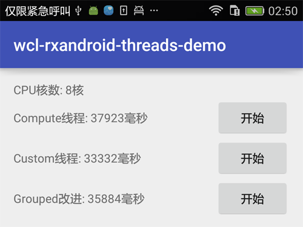

随着手机的发展, 其性能已经与电脑越来越接近, 也会有一些复杂耗时的并行任务需要处理, 对于异步与并行, [RxAndroid](http://www.wangchenlong.org/2016/03/20/1603/207-rxjava-first/)是我们的最佳选择. 那么让我来使用实例介绍一下吧.

<!-- more -->
> 更多: http://www.wangchenlong.org/


在计算调度器``Schedulers.computation()``中, 可以并行处理任务, 核数是Rx根据手机CPU定制的, 在我的华为P8手机(8核)中, 使用的是8个线程. 但是根据Java线程的最佳配置而言, 8核最佳是9个线程, 即**线程数等于核数+1**.

本文源码的GitHub[下载地址](https://github.com/SpikeKing/wcl-rxandroid-threads-demo)

---

# 配置

RxAndroid+ButterKnife, 我是ButterKnife的粉丝.

``` gradle
    compile 'com.jakewharton:butterknife:7.0.1'
    compile 'io.reactivex:rxjava:1.1.0'
    compile 'io.reactivex:rxandroid:1.1.0'
```

---

# 计算线程

``MAX``是并行执行的任务数. 使用``flatMap``逐个分发到计算线程``computation``中, 执行耗时任务``intenseCalculation``.

``` java
    // 计算线程并行, 8核
    public void computePara(View view) {
        mTvComputeValue.setText("计算中");
        Observable.range(MIN, MAX)
                .flatMap(i -> Observable.just(i)
                                .subscribeOn(Schedulers.computation()) // 使用Rx的计算线程
                                .map(this::intenseCalculation)
                )
                .observeOn(AndroidSchedulers.mainThread())
                .subscribe(this::computeTag);
    }
```

使用``intenseCalculation``模拟耗时任务.

``` java
    // 模拟耗时计算
    private int intenseCalculation(int i) {
        try {
            tag("Calculating " + i + " on " + Thread.currentThread().getName());
            Thread.sleep(randInt(100, 500));
            return i;
        } catch (InterruptedException e) {
            throw new RuntimeException(e);
        }
    }
```

---

# 最大线程

最大线程数 = CPU核数 + 1

由于CPU的核数是8, 因此我们选择9个线程. 创建执行器``executor``, 使用执行器创建Rx的调度器``Scheduler``, 处理异步任务.

``` java
    // 定制线程并行, 9核
    public void customPara(View view) {
        int threadCt = Runtime.getRuntime().availableProcessors() + 1;
        mTvCustomValue.setText(String.valueOf("计算中(" + threadCt + "线程)"));

        ExecutorService executor = Executors.newFixedThreadPool(threadCt);
        Scheduler scheduler = Schedulers.from(executor);

        Observable.range(MIN, MAX)
                .flatMap(i -> Observable.just(i)
                                .subscribeOn(scheduler)
                                .map(this::intenseCalculation)
                ).observeOn(AndroidSchedulers.mainThread())
                .subscribe(this::customTag);
    }
```

高版本计算CPU核数的方式.

``` java
Runtime.getRuntime().availableProcessors()
```


低版本, [参考](http://stackoverflow.com/questions/30119604/how-to-get-the-number-of-cores-of-an-android-device).

``` java
    private int getNumCoresOldPhones() {
        //Private Class to display only CPU devices in the directory listing
        class CpuFilter implements FileFilter {
            @Override
            public boolean accept(File pathname) {
                //Check if filename is "cpu", followed by a single digit number
                if (Pattern.matches("cpu[0-9]+", pathname.getName())) {
                    return true;
                }
                return false;
            }
        }

        try {
            //Get directory containing CPU info
            File dir = new File("/sys/devices/system/cpu/");
            //Filter to only list the devices we care about
            File[] files = dir.listFiles(new CpuFilter());
            //Return the number of cores (virtual CPU devices)
            return files.length;
        } catch (Exception e) {
            //Default to return 1 core
            return 1;
        }
    }
```

---

# 循环赛模式

``循环赛模式(Round-Robin)``是把数据分组, 按线程数分组, 每组9个, 一起发送处理. 这样做, 可以减少Observable的创建, 节省系统资源, 但是会增加处理时间, 是空间和时间的综合考虑.

``` java
int threadCt = Runtime.getRuntime().availableProcessors() + 1;
mTvGroupedValue.setText(String.valueOf("计算中(" + threadCt + "线程)"));

ExecutorService executor = Executors.newFixedThreadPool(threadCt);
Scheduler scheduler = Schedulers.from(executor);

final AtomicInteger batch = new AtomicInteger(0);

Observable.range(MIN, MAX)
        .groupBy(i -> batch.getAndIncrement() % threadCt)
        .flatMap(g -> g.observeOn(scheduler).map(this::intenseCalculation))
        .observeOn(AndroidSchedulers.mainThread())
        .subscribe(this::groupedTag);
```

---

这是``Compute`` \ ``Max`` \ ``Group``三种效果的时间对比, 可以发现Max的时间最优, 因为比Compute多一个线程, 但是Group会更加节省资源一些. 根据所执行的并行任务使用Rx吧.

**效果**



OK, that's all! Enjoy it!

---

> 原始地址: 
> http://www.wangchenlong.org/2016/03/28/1603/281-rx-max-threads/
> 欢迎Follow我的[GitHub](https://github.com/SpikeKing), 关注我的[简书](http://www.jianshu.com/users/e2b4dd6d3eb4/latest_articles), [微博](http://weibo.com/u/2852941392), [CSDN](http://blog.csdn.net/caroline_wendy), [掘金](http://gold.xitu.io/#/user/56de98c2f3609a005442ec58). 
> 我已委托“维权骑士”为我的文章进行维权行动. 未经授权, 禁止转载, 授权或合作请留言.

