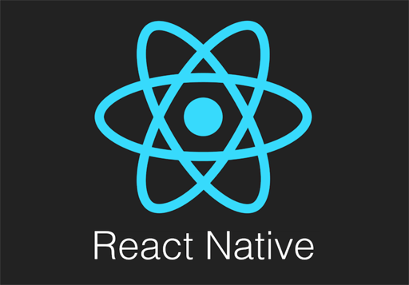
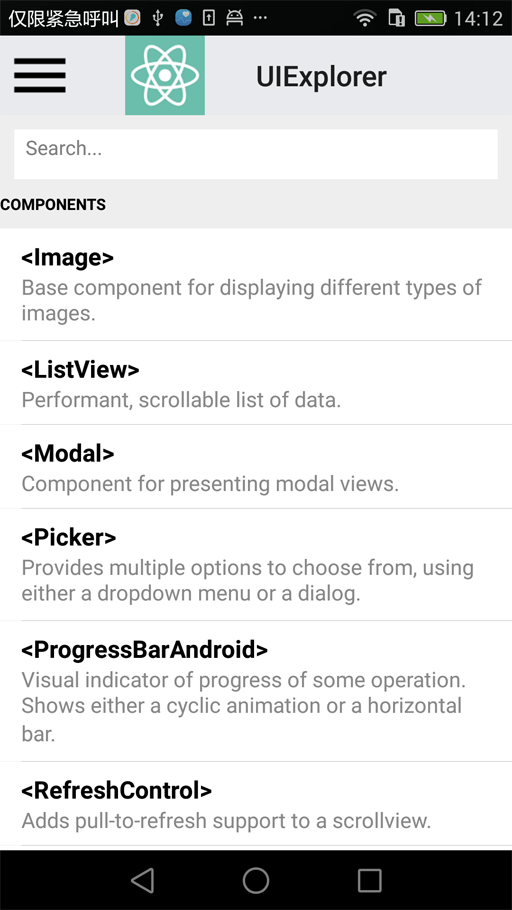
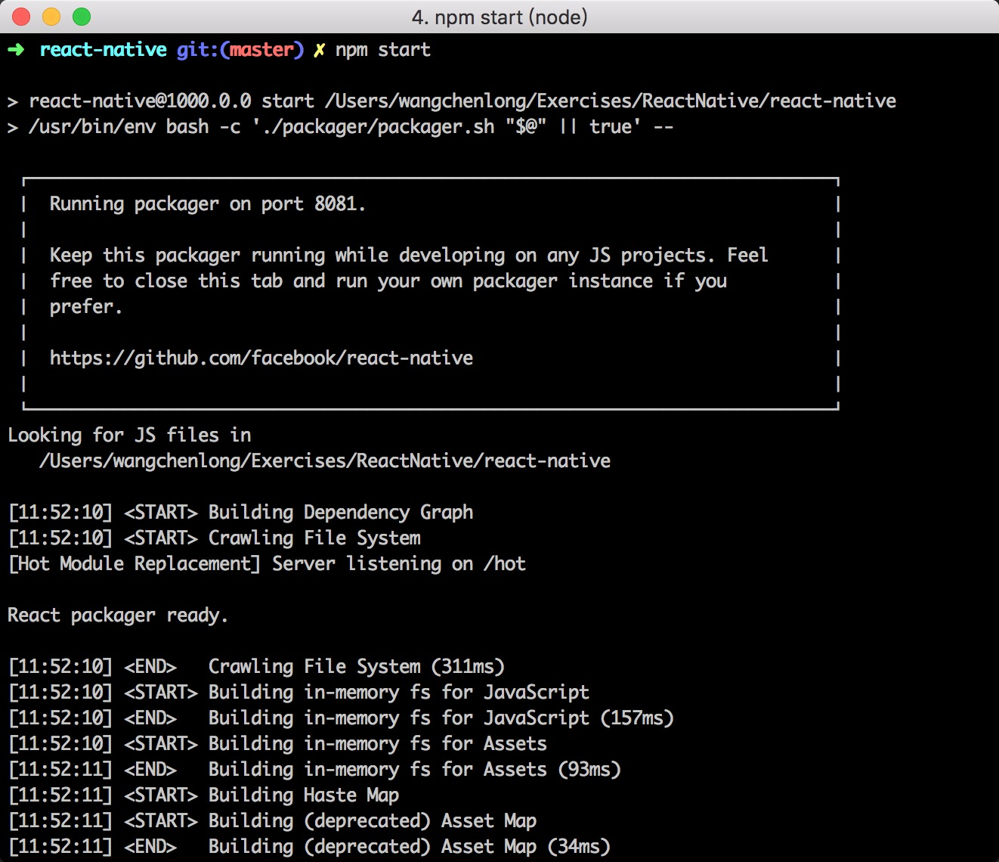
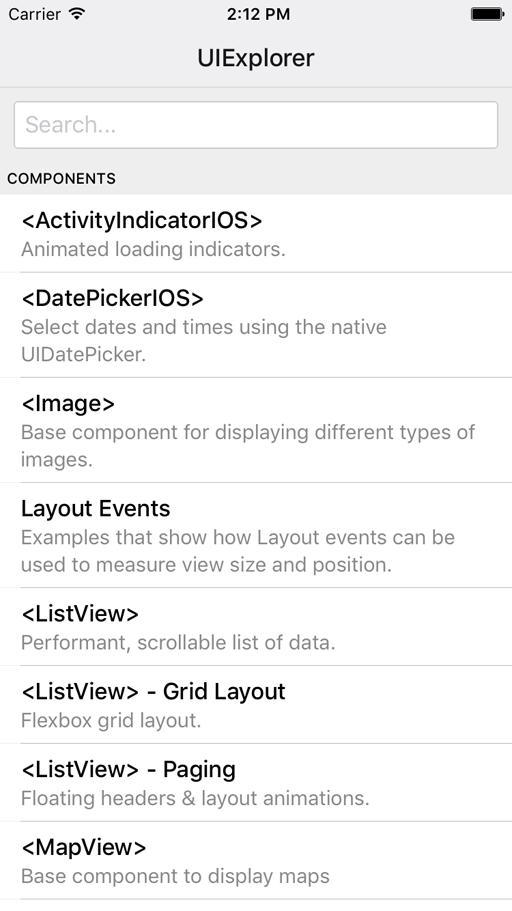

使用 React Native 框架可以使用相同的代码编写不同平台的应用. 在学习过程中, 既会兼顾老朋友 ``Android`` , 有要熟悉新朋友 ``iOS`` . 本文主要介绍运行 RN 的默认工程 UIExplorer .

<!-- more -->
> 更多: http://www.wangchenlong.org/
> 欢迎Follow我的GitHub: https://github.com/SpikeKing

工作环境是 ``Mac`` + ``VPN`` + ``Android Studio`` + ``Xcode`` + ``PyCharm`` + ``华为P8(Android 5.0)`` + ``iPhone 6S 模拟器``.

时间: 2016年4月6日, ``React Native`` 最新版, 让我们开始吧.



> 前置的环境配置, 参考 ReactNative 官网的 [Requirements](https://facebook.github.io/react-native/docs/getting-started.html#requirements) . 需要安装一些工具. 本文介绍在启动项目时, 容易导致的一些问题.

---

# Android配置 

GitHub 的 ``React Native`` 项目, [参考](https://github.com/facebook/react-native). RN 项目较新, 问题可能会比较多, 我会详细介绍, 可能遇到的问题, 让大家更多地了解这个有趣的项目.

下载 React Native 项目

``` bash
git clone https://github.com/facebook/react-native.git
```

进入 ``React Native`` 文件夹, 编译 Android 项目.

```
./gradlew :Examples:UIExplorer:android:app:installDebug
```

> 可能需要下载 ``gradle`` , 大小约100M+, 比较慢, 耐心等待.

构建完成之后, RN 的 App 已经成功安装到手机中.



## 常见错误

**下载失败**: 需要删除文件, 重新下载即可, 如:

``` bash
Could not expand ZIP '/Users/wangchenlong/Exercises/ReactNative/react-native/ReactAndroid/build/downloads/boost_1_57_0.zip'
```

删除即可

``` bash
rm /Users/wangchenlong/Exercises/ReactNative/react-native/ReactAndroid/build/downloads/boost_1_57_0.zip
```

> ``Boost`` 是 Cpp 重要的库, 比较大100M左右, 下载较慢.


**安装错误**: Gradle 的编译版本过高, 不兼容部分5.0+手机, 需要降低版本为 1.3.

``` bash
Installing APK 'app-debug.apk' on 'HUAWEI GRA-TL00 - 5.0.1' for app:debug
Error while uploading app-debug.apk : Unknown failure ([CDS]close[0])
```

使用 ``Android Studio`` 打开 ``React Native`` 的项目, 修改最外层工程的 ``build.gradle`` 配置, 降低 ``gradle``的 ``build`` 为1.2.3版本.

``` gradle
buildscript {
    repositories {
        jcenter()
        mavenLocal()
    }
    dependencies {
        classpath 'com.android.tools.build:gradle:1.2.3' // 修改1.2.3
        classpath 'de.undercouch:gradle-download-task:2.0.0'

        // NOTE: Do not place your application dependencies here; they belong
        // in the individual module build.gradle files
    }
}
```

需要重新设置 Gradle 的 Wrapper , 修改为2.2版本.

``` gradle
Gradle version 2.2 is required. Current version is 2.11
```

**NDK路径**: 在工程的 ``local.properties`` 中, 添加 NDK 的路径.

``` gradle
ndk.dir=/Users/wangchenlong/Installations/android-ndk-r10e
```

---

# 服务配置

安装 NPM 的插件, 可能会需要权限进行存储, 时间较长, 耐心等待.

``` bash
sudo npm install
```

> NPM 安装 React Native 的支持库. RN 是 JavaScript 编写的, 需要 Node 环境支持.

修改 ADB 的 TCP 端口号, 映射为8081, 针对于5.0以上手机有效.

``` bash
adb reverse tcp:8081 tcp:8081
```

> 5.0以下的手机, 检测当前的网络IP地址, 手动添加入App.

启动服务

``` bash
npm start
```



**晃动** Android 手机, 即进入菜单页面, 选择 ``Reload JS`` 项, 重新加载页面即可显示.

**OK, Android 项目加载成功!**

## 修改下载源

使用淘宝的 ``NPM`` 下载源, 可以加快下载速度.

``` bash
npm config set registry=http://registry.npm.taobao.org/
```

配置地址在根目录的 ``.npmrc`` 中, 即

``` bash
registry=http://registry.npm.taobao.org/

```

---

# iOS配置

相比于 Android 配置的复杂性, iOS 配置比较简单. 需要升级 ``Xcode`` 的最新版本.

在 Xcode 中, 启动 ``UIExplorer`` 项目中的``UIExplorer.xcodeproj``即可.

**不要关闭服务**, 运行项目, 会自动加载数据.



---

Android 和 iOS 的配置都已经完成, 都可以运行自带 Demo - ``UIExplorer`` .

让我们继续学习新的知识吧, 运行 ``Hello World`` 是成功的一半.

OK, that's all! Enjoy it!

---

> 原始地址: 
> http://www.wangchenlong.org/2016/04/07/1604/071-rn-uiexplorer/
> 欢迎Follow我的[GitHub](https://github.com/SpikeKing), 关注我的[简书](http://www.jianshu.com/users/e2b4dd6d3eb4/latest_articles), [微博](http://weibo.com/u/2852941392), [CSDN](http://blog.csdn.net/caroline_wendy), [掘金](http://gold.xitu.io/#/user/56de98c2f3609a005442ec58). 
> 我已委托“维权骑士”为我的文章进行维权行动. 未经授权, 禁止转载, 授权或合作请留言.

