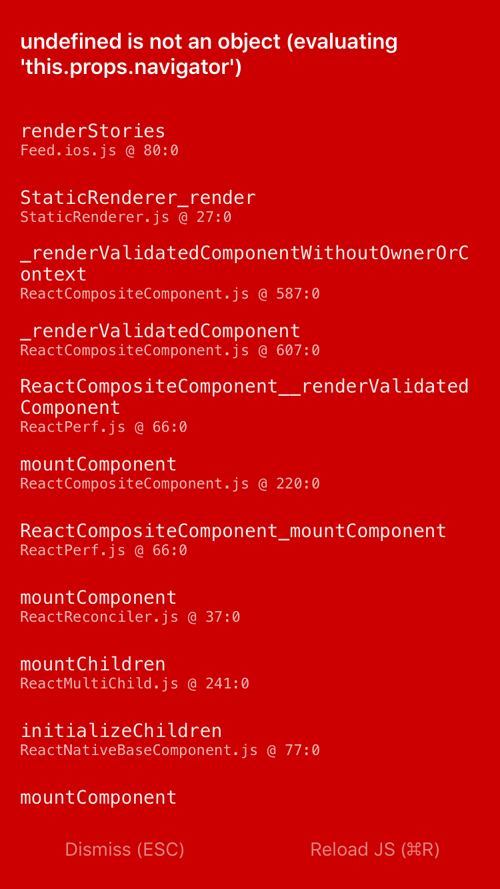

**ES6**, 即ECMAScript6, JavaScript的新标准, 书写更加规范, 代码更加优雅. React Native推荐使用ES6的类写法代替传统的模块, 即使用``extends React.Component``代替``React.createClass``. 本文介绍在ReactNative中ES6的写法, 与传统方法进行对比, 并解决**未定义(undefined)**错误. 

<!-- more -->
> 更多: http://www.wangchenlong.org/
> 欢迎Follow我的GitHub: https://github.com/SpikeKing


> 在ES6中, 一定要注意**this**的使用, 否则``undefined is not an object``.

---

# 模块定义

在ES6中, RN模块使用``class``形式, 代替``var``形式, 使代码更加规范.旧的写法, 方法或变量使用**逗号(",")**间隔.

``` js
var Feed = React.createClass({});
```

ES6的写法, 方法或变量结束使用**分号(";")**.

``` js
class Feed extends Component {}
```

## 引入导出

**引入**使用``import Story from './Story.js';``

替换``var Story = require('./Story');``

**导出**使用``export default Feed;``

替换``module.exports = Feed;``

# 初始化状态

在ES6中, 使用``class``类的形式, 因此初始化在**构造器(constructor)**中进进行. 旧的写法, 使用``getInitialState``, 使用``return``返回状态.

``` js
var Feed = React.createClass({
  getInitialState() {
    return {
      dataSource: new ListView.DataSource({
        rowHasChanged: (row1, row2) => row1 !== row2
      }),
      loaded: false,
      isAnimating: true,
      isRefreshing: false
    };
  }
});
```

ES6的写法, 使用``constructor ``构造器, 直接设置``state``状态.

``` js
class Feed extends Component {
  constructor(props) {
    super(props);
    this.state = {
      dataSource: new ListView.DataSource({
        rowHasChanged: (row1, row2) => row1 !== row2
      }),
      loaded: false,
      isAnimating: true,
      isRefreshing: false
    }
  }
}
```

# this绑定

在ES6中, 注意**this**的作用域, 由于使用类的写法, 所以**this**仅仅指代当前的类, 对于内部类需要重新指定**this**, 指定位置可以任选. 旧的方式直接写, 使用传递的``props``属性.

``` js
var Feed = React.createClass({
  // 直接使用this.props属性
  renderStories(story) {
    return (
      <Story story={story} navigator={this.props.navigator}></Story>
    );
  }

  render() {
    return (
      <ListView
        testID={"Feed Screen"}
        dataSource={this.state.dataSource}
        renderRow={this.renderStories}
        .../>
    )
  }
});
```

ES6的写法. 在内部类中, 需要重新绑定this. 三种实现方式: 构造时, 调用时, 使用时.

``` js
class Feed extends Component {
  // 构造器直接绑定方法.
  constructor(props) {
    super(props);
    this.renderStories = this.renderStories.bind(this);
  }
}
```

``` js
class Feed extends Component {
  // 调用时, 绑定this.
  render() {
    return (
      <ListView
        testID={"Feed Screen"}
        dataSource={this.state.dataSource}
        renderRow={(story) => this.renderStories(story)}
        .../>
    )
  }
}
```

``` js
class Feed extends Component {
  // 使用时, 绑定this
  render() {
    return (
      <ListView
        testID={"Feed Screen"}
        dataSource={this.state.dataSource}
        renderRow={this.renderStories.bind(this)}
        .../>
    )
  }
}
```

注意绑定this失败, 会发生未定义错误, 即``undefined is not an object``.

**错误信息**



---

**React Native**推荐使用ES6的语法规范开发, 因此在开发中, 我们尽量使用ES6. 使用类的形式, 对于编辑器更加友好, 也更容易实现自动索引, 方便编程.

感谢我的朋友**前端大神@左大师**的指导!

另外[参考](https://toddmotto.com/react-create-class-versus-component/)

OK, that's all! Enjoy it!

---

> 原始地址: 
> http://www.wangchenlong.org/2016/04/26/1604/261-rn-es6-class/
> 欢迎Follow我的[GitHub](https://github.com/SpikeKing), 关注我的[简书](http://www.jianshu.com/users/e2b4dd6d3eb4/latest_articles), [CSDN](http://blog.csdn.net/caroline_wendy), [掘金](http://gold.xitu.io/#/user/56de98c2f3609a005442ec58). 
> 我已委托“维权骑士”为我的文章进行维权行动. 未经授权, 禁止转载, 授权或合作请留言.

