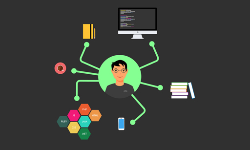

无论做什么工作, 都希望能做到最好, 就像参与一款游戏, 每个人都希望能赢到最后. 工作自然也会有其"秘籍", 让我们更快的实现目标. 有些工作五年的程序员仍然很平庸, 也有刚学一年就技术出众的天才. 

<!-- more -->
> 更多: http://www.wangchenlong.org/
> 欢迎Follow我的GitHub: https://github.com/SpikeKing

时间并不能决定一切, 重要的是怎么做. 我列举几点基本要求, 重要性依次排列.

---

# 身体

身体看似最不重要, 其实不然, 活的长久是对技术最好的回报. 每天爱惜自己的身体, 才能让工作更有效率.

* **早睡早起**, 感受自然的力量. 日落而息, 日出而作. 早晨起来, 喝一杯水, 制定计划, 完成重要工作, 让一天不至于忙东忙西, 碌碌无为. 也是"克己"的第一步.

* **运动**, 每天至少跑步半个小时, 健身半个小时. 对于程序员而言, 则还需要[站式编程](https://www.zhihu.com/question/21679072), 让自己更有活力, 记住工作是为了更好的生活.

* **番茄工作法**, 集中注意力做事情, 稍微休息五分钟, 这样会使我们心情更好, 效率更高, 更有掌握时间的感觉.

如果只能选择一条去实现, 我希望你优先改变自己的身体.

# 工作

真正的技术来源于工作, 也服务于工作. 把工作做好, 最容易实现技术的进步, 并且让自己更快乐.

* **安全**, 安全是指工作不要出重要的问题. 无论完成多少任务, 错误导致的损失都是无法弥补的. 关键节点的检查尤为重要. 除了编程的[注意事项](http://www.wangchenlong.org/2016/04/16/1604/161-check-code/), **在上线前一天一定一定要仔细的检查问题, 否则出了问题导致这一段时间都会心情不好**.

* **效率**, 开发代码的效率问题, 这一点需要有经验的人才能理解得更多. 第一, 打字要快, 用心去打字, 每个字母都要准确; 第二, 写代码要快, 多背代码片段, 合适的时候选择合适的方法; 第三, 熟悉IDE, 理解IDE的所有功能和快捷键, 训练无鼠标操作; 第四, 熟悉**Live Template**, 拥有自己的模板是开发的高级增速.

# 技术

是的, 技术其实最不重要, 但是我也有几点需要提示.

* **基础**, 熟悉你所使用技术的基础, 理解所有**控件或常用功能**的书写, 这一部分如果是最初接触, 我的建议是**背下来**, 这样在编程的时候, 才能游刃有余.

* **框架**, 无论做什么工作, 都是已经成熟或者多人参与, 框架非常重要. 如果开发``Android``, 应该理解``Android``系统如何架构, 如何绘制页面, 如何通信等等, 这些基本的框架知识.

* **开源库**, 开源很重要, 重复发明常见的轮子是没有用的行为. 虽然开源库升级会导致版本的兼容性问题, 但是使用一款优秀的开源库, 可以大量的减少代码错误. 我们一定要**分析**所使用每一个开源库的**源码**, 非常重要!

* **新技术**, 每周阅读一些行业内的[博客](http://www.wangchenlong.org/), 理解目前的技术发展方向, 与时代同步, 让技术历久弥新.

只有这四点, 顺序递进, 坚持做都会使我们的技术会有质地提升.

---

不要在意学校, 我见过最优秀的普本学校毕业生, 也见过最平庸的清华毕业生; 不要在意年龄, 我见过最健康的四十岁程序员, 也见过最虚弱的二十岁程序员. 生命像流水一样不停的流淌, 爱惜自己的身体, 做好自己的工作, 学习喜爱的东西, 一切都不晚, 一切都可以完成. 与君共勉.

---

> 最初发布地址: 
> http://www.wangchenlong.org/2016/05/06/1605/062-become-better-programmer/
> 欢迎Follow我的[GitHub](https://github.com/SpikeKing), 关注我的[简书](http://www.jianshu.com/users/e2b4dd6d3eb4/latest_articles), [CSDN](http://blog.csdn.net/caroline_wendy), [掘金](http://gold.xitu.io/#/user/56de98c2f3609a005442ec58). 
> 我已委托“维权骑士”为我的文章进行维权行动. 未经授权, 禁止转载, 授权或合作请留言.

