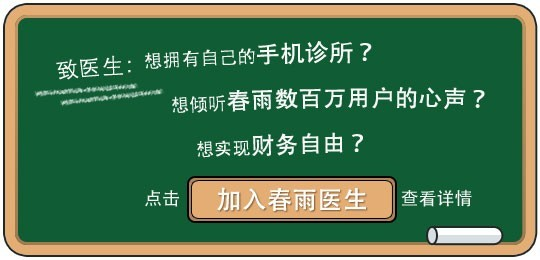

我的创意, 关于春雨诊所的宣传语和三个需要解决的问题.

<!-- more -->
> 更多: http://www.wangchenlong.org/

---

# 宣传语

**春雨与您, 始于医疗, 共伴健康.**

**You & SpringRain, begin with treatment, keep on health.**

注解: 

春雨诊所之所以不同于其他医疗服务机构, 是因为我们更注重用户的体验, 更关心用户的持续健康状况. 
"春雨与您", 强调纽带关系, 拉近春雨品牌与用户之间的距离; 

"始于医疗", 对于用户而言, 我们之间的沟通是开始于治疗服务, 来到诊所的用户, 第一个诉求就是治好症状, 这也是我们的核心内容, 通过良好的服务留住用户, 有"始"才有发展.

"共伴健康", 而我们的服务不仅仅是医疗, 最终目的是健康, 这也区别于其他医疗机构的最大不同, 希望用户健康少得病, 这是张大灌输给春雨人的理念.

"春雨与您, 始于医疗, 共伴健康." 突出主题, 突出核心价值, 突出两步健康方案, 语言简洁.

PS:

关于后续服务, the key is EHR & PD. 用户来到春雨诊所, 在医疗结束后, 我们的后续服务就是保持健康, 这也是EHR和私人医生的核心. 通过数字化档案(EHR), 帮用户持续跟踪健康, 避免疾病; 通过私人医生(PD), 帮助用户治疗慢性疾病, 调节身体状态. 

---

# Plan

关于春雨诊所的核心问题, 我来提一些自己的看法.

*(1) 您期待的春雨诊所是什么样子？*

春雨诊所的产品不仅仅是医疗服务, 医疗服务只是一种途径. 通过这种途径, 春雨诊所需要把一种独特的健康生活理念传递给春雨的客户. 医疗的消费很大程度上是带有强迫性的消费, 健康的消费是感性的文化层次上的消费, 通过春雨诊所营造的气氛, 让用户治愈好疾病的同时, 能更关注于健康生活, 通过文化的输出感染用户, 并形成良好的互动体验.

春雨诊所提供的不仅仅是医疗, 那是诊所要做的事情, 而春雨要做的事情就提升人们对健康的关注. 这是春雨的健康价值主张. 春雨诊所创造出的“医疗与健康之道”使每个光临的客户都有独特的体验. 通过医疗服务的这种载体，春雨诊所把春雨健康文化传递给客户, 让用户不仅是春雨诊所的客户, 也是实践春雨健康理念的用户.

我期待的春雨诊所, 可以治愈我的疾病, 也可以提供健康服务, **The key is EHR & PD**. 比如在诊治结束后, 通过数字化档案(EHR), 帮用户持续跟踪健康, 避免疾病, 即使在其他春雨诊所, 也可以快速提供病历; 继续提供私人医生(PD)的后续服务, 图文咨询\语音服务, 帮助用户治疗慢性疾病, 调节身体状态; 提供健康生活指导, 通过春雨新闻与微信公众号, 让用户继续获得健康知识.

*(2) 有什么样的渠道和方式让更多的人知道春雨诊所？*

渠道和方式无非主动宣传和口碑营销两种. 主动宣传除了常见的广告营销以外, 我比较关注于**医生品牌营销**. 春雨诊所的医生都是行业名医, 在宣传坐诊时, 需要提前准备好材料, 让用户知道医生的水平与价值. 作为一个普通用户而言, 主要信息途径都是依赖于宣传, 毕竟医疗是低频行为. 坐诊前, 我们的营销团队制作一些海报, 把医生作为名人宣传, 在用户中转载传播. 在自媒体时代, 医生既可以收获名声, 春雨诊所也可以收获人气. 利用好医生资源, 是我们最大的核心竞争力, 也是春雨诊所宣传的根本.

*(3) 如何引导更多的患者到春雨诊所就诊？*

我的建议是**垂直社区**. 创建或合作一些医疗垂直社区\公众号\微博\贴吧等等, 如糖尿病, 高血压, 冠心病等垂直领域. 当此类型的名医坐诊时, 把宣传海报在社区中提前传播出去, 匹配精准用户. 在口碑营销形成规模以前, 社区营销是主要着力点, 既可以精确匹配用户, 又可以增大核心用户规模. 我们的诊所并不是全科医生, 精确匹配目标用户很有必要, 毕竟看病都是大事, 都希望找到优秀的医生资源, 只要宣传合适, 目标准确, 必然会有大量用户参与. 把手中的名医资源通过自媒体\线上媒体真正利用起来, 吸引用户前来就诊.

---

That's all! Enjoy it.

---

> 最初发布地址: 
> http://www.wangchenlong.org/2016/05/06/1605/063-clinic-idea/
> 欢迎Follow我的[GitHub](https://github.com/SpikeKing), 关注我的[简书](http://www.jianshu.com/users/e2b4dd6d3eb4/latest_articles), [CSDN](http://blog.csdn.net/caroline_wendy), [掘金](http://gold.xitu.io/#/user/56de98c2f3609a005442ec58). 
> 我已委托“维权骑士”为我的文章进行维权行动. 未经授权, 禁止转载, 授权或合作请留言.

