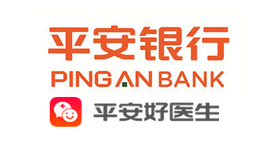

**平安好医生**作为平安旗下的移动医疗应用, 受到平安集团的很大重视, 非常不错. 让我们来分析一下这款应用所使用的技术吧, 多学习多进步. 大家在文中获取需要学习的内容吧.

<!-- more -->
> 更多: http://www.wangchenlong.org/
> 欢迎Follow我的GitHub: https://github.com/SpikeKing

版本: ``personaldoc_PCGW_V_3.1.2_30102.apk``

---

## 架构

**Apk**: 18.5M, 包名是``com.pingan.papd``.

**Android SDK**: 构建版本19, 最低版本14.

**MultiDex**: 使用两个Dex.

**[Jpush](https://www.jpush.cn/)**: **极光推送**. 平安大量使用极光推送(Jpush)的产品. 服务: ``AlarmReceiver``, ``DownloadService``, ``PushReceiver``, ``DaemonService``. 同时, 自开发的``RegistrationIdReceiver``接收器也接收大量Jpush的广播.

**百度LBS** & **高德定位**.

**[动态加载DL](https://github.com/singwhatiwanna/dynamic-load-apk)**: 动态加载方案DL, 百度的任玉刚开发, 非常厉害.

**小米推送(mipush)**: 使用的类``XMPushService``, ``PushMessageHandler``, ``MessageHandleService``, ``PingReceiver``.

**友盟统计(umeng)**.

**SQLite的So**: libsecsqlite3.so, xUtils(ORM)使用.

---

## 代码

### com

**xiaomi**: 小米推送;

**[ryg](https://github.com/singwhatiwanna/dynamic-load-apk)**: **动态加载DL**, 百度任玉刚的库, 非常棒的库.

**[squareup](https://github.com/square/otto)**: **Otto**是一种EventBus.

**pajk, pingan**: 平安健康, 平安, 自有代码.

**[talkingdata](https://www.talkingdata.com/)**: **TalkingData**数据统计服务, 类似于听云, 平安定制.

**samsung**: 三星的**SHealth**库.

**[se.emilsjolander.StickyListHeaders](https://github.com/emilsjolander/StickyListHeaders)**: **StickyListHeaders**是固定顶部滚动列表的开源库, 3k+的Star, 非常有名.

**[paf.cordova](https://cordova.apache.org/)**: **Cordova**混合编程, 类似于RN.

**autonavi.aps**: 高德的自动导航.

**[lidroid.xutils](https://github.com/wyouflf/xUtils)**: **xUtils**是SQLite的ORM, 简化编写, 与Sugar类似.

**[alibaba.fastjson](https://github.com/alibaba/fastjson/wiki)**: **FastJson**是阿里巴巴的Json解析库, FastJson.

**google.gson**: Google的Gson库.

**tencent**: 腾讯的SNS库集合.

**[eu.janmuller](https://github.com/biokys/cropimage)**: **CropImage**是图片剪裁的开源库, 400+Stars.

**pafu**: 平安的公共库, 工具和渠道管理, 使用方便.

**amap.api**: 高德定位.

**sina**: 新浪微博.

**[tendcloud](https://www.talkingdata.com/)**: TalkingData数据统计库, 类似听云.

**[paic.zhifu](https://www.1qianbao.com/)**: **壹钱包**, 平安的支付平台.

### 其他

**[de.greenrobot](https://github.com/greenrobot/EventBus)**: GreenRobot的**EventBus**;

**[ru.noties.scrollable](https://github.com/noties/Scrollable)**: **Scrollable**是滚动控件库.

**org.apache.cordova**: **Cordova**混合编程.

**[org.akita](http://xjanker.github.io/akita/)**: **Akita**是Android的快速开发库, 一家公司的产品, 非常有意思.

**[org.jivesoftware](https://www.jivesoftware.com/products/jive-n/)**: **Jivesoftware**是协同工作的库, 也是一家公司的产品.

**[cn.jpush](https://www.jpush.cn/)**: **极光推送**, 平安健康非常喜欢, 还做了定制!

**[pl.droidsonroids.gif](https://github.com/koral--/android-gif-drawable)**: 使用**Gif**图片的库.

---

## 总结

平安好医生的体积相对较大, 升级Android的SDK比较慢, 所以只使用Api19版本. 使用几个主流的开源库, 加快迭代速度. 混合编程(Cordova)和动态加载(DL)均有使用. 其他的开源库都比较大众, 就不多介绍了, 想了解可以直接阅读相关GitHub或官网.

本文仅做为技术学习使用.

OK, that's all! Enjoy it!

---

> 最初发布地址: 
> http://www.wangchenlong.org/2016/05/06/1605/064-pingan-app-analyze/
> 欢迎Follow我的[GitHub](https://github.com/SpikeKing), 关注我的[简书](http://www.jianshu.com/users/e2b4dd6d3eb4/latest_articles), [CSDN](http://blog.csdn.net/caroline_wendy), [掘金](http://gold.xitu.io/#/user/56de98c2f3609a005442ec58). 
> 我已委托“维权骑士”为我的文章进行维权行动. 未经授权, 禁止转载, 授权或合作请留言.

