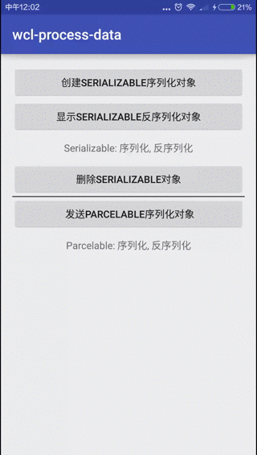

在进程或页面通信时需要使用Intent传递数据; 在对象持久化时需要存储数据. 对于复杂的对象, 进行序列化才可传递或存储, 可以使用``Java的Serializable``方式或``Android的Parcelable``方式. 本文介绍**Serializable**和**Parcelable**的使用方式, 含有Demo.

<!-- more -->
> 更多: http://www.wangchenlong.org/
> 欢迎Follow我的GitHub: https://github.com/SpikeKing

本文源码的GitHub[下载地址](https://github.com/SpikeKing/wcl-process-data)


---

# Serializable

序列化**User**类, 实现``Serializable``接口即可. 注意**serialVersionUID**用于辅助序列化与反序列化, 只有相同时, 才会正常进行. 如不指定, 则系统会自动生成Hash值, 修改类代码, 可能会导致无法反序列化, 所以强制指定.

``` java
public class UserSerializable implements Serializable {
    // 标准序列ID, 用于判断版本
    private static final long serialVersionUID = 1L;

    public int userId;
    public String userName;
    public boolean isMale;

    public UserSerializable(int userId, String userName, boolean isMale) {
        this.userId = userId;
        this.userName = userName;
        this.isMale = isMale;
    }
}
```

序列化对象, 使用``ObjectOutputStream``存储已经序列化的对象数据, 通过``writeObject``写入对象.

``` java
public void serialIn(View view) {
    Context context = view.getContext();
    File cache = new File(context.getCacheDir(), "cache.txt");
    try {
        ObjectOutputStream out = new ObjectOutputStream(new FileOutputStream(cache));
        UserSerializable user = new UserSerializable(0, "Spike", false);
        out.writeObject(user);
        out.close();
        Toast.makeText(context, "序列化成功", Toast.LENGTH_SHORT).show();
    } catch (IOException e) {
        e.printStackTrace();
    }
}
```

> 缓存文件位置: ``new File(context.getCacheDir(), "cache.txt")``.

反序列对象, 使用``ObjectInputStream``反序列化对象, 通过``readObject``读取对象的持久化信息.

``` java
public void serialOut(View view) {
    Context context = view.getContext();
    File cache = new File(context.getCacheDir(), "cache.txt");
    UserSerializable newUser = null;
    try {
        ObjectInputStream in = new ObjectInputStream(new FileInputStream(cache));
        newUser = (UserSerializable) in.readObject();
        in.close();
    } catch (Exception e) {
        e.printStackTrace();
        Toast.makeText(context, "请先序列化", Toast.LENGTH_SHORT).show();

    }
    if (newUser != null) {
        String content = "序号: " + newUser.userId
                + ", 姓名: " + newUser.userName
                + ", 性别: " + (newUser.isMale ? "男" : "女");
        mSerialTvContent.setText(content);
    } else {
        mSerialTvContent.setText("无数据");
    }
}
```

---

# Parcelable

Android推荐的序列化对象方式. 实现``Parcelable``接口, ``writeToParcel``写入对象的变量, ``UserParcelable``提供解析对象方式. ``CREATOR``是创建序列化对象的匿名类, 必须实现, 包含创建单个对象与数组的方式. ``describeContents``只有在含有文件描述符是返回1, 默认都是返回0, 不需要修改.

``` java
public class UserParcelable implements Parcelable {
    public int userId;
    public String userName;
    public boolean isMale;
    public BookParcelable book;

    public UserParcelable(int userId, String userName, boolean isMale, String bookName) {
        this.userId = userId;
        this.userName = userName;
        this.isMale = isMale;
        this.book = new BookParcelable(bookName);
    }

    @Override public int describeContents() {
        return 0;
    }

    @Override public void writeToParcel(Parcel dest, int flags) {
        dest.writeInt(userId);
        dest.writeString(userName);
        dest.writeInt(isMale ? 1 : 0);
        dest.writeParcelable(book, 0);
    }

    public static final Parcelable.Creator<UserParcelable> CREATOR = new Parcelable.Creator<UserParcelable>() {
        @Override public UserParcelable createFromParcel(Parcel source) {
            return new UserParcelable(source);
        }

        @Override public UserParcelable[] newArray(int size) {
            return new UserParcelable[size];
        }
    };

    private UserParcelable(Parcel source) {
        userId = source.readInt();
        userName = source.readString();
        isMale = source.readInt() == 1;
        book = source.readParcelable(Thread.currentThread().getContextClassLoader());
    }
}
```

使用Intent传递对象数据, 编号0, 姓名Spike, 性别女, 喜欢书籍三国演义.

``` java
public void parcelSend(View view) {
    Intent intent = new Intent(PASS_PARCEL_FILTER);
    intent.putExtra(PARCEL_EXTRA, new UserParcelable(0, "Spike", false, "三国演义"));
    mLBM.sendBroadcast(intent);
}
```

解析广播Intent的数据, 使用``getParcelableExtra``方法即可.

``` java
private BroadcastReceiver mParcelReceiver = new BroadcastReceiver() {
    @Override public void onReceive(Context context, Intent intent) {
        UserParcelable newUser = intent.getParcelableExtra(PARCEL_EXTRA);
        if (newUser != null) {
            String content = "序号: " + newUser.userId
                    + ", 姓名: " + newUser.userName
                    + ", 性别: " + (newUser.isMale ? "男" : "女")
                    + ", 书: " + newUser.book.bookName;
            Toast.makeText(context, content, Toast.LENGTH_SHORT).show();
            mParcelTvContent.setText(content);
        }
    }
};
```

---

效果



Serializable序列化需要大量的IO操作, Parcelable序列化虽然使用复杂, 但是效率很高, 是Android开发的首选. Parcelable主要应用于内存序列化, 如Intent广播等.

OK, that's all! Enjoy it!

---

> 最初发布地址: 
> http://www.wangchenlong.org/2016/05/07/1605/072-serial-object/
> 欢迎Follow我的[GitHub](https://github.com/SpikeKing), 关注我的[简书](http://www.jianshu.com/users/e2b4dd6d3eb4/latest_articles), [CSDN](http://blog.csdn.net/caroline_wendy), [掘金](http://gold.xitu.io/#/user/56de98c2f3609a005442ec58). 
> 我已委托“维权骑士”为我的文章进行维权行动. 未经授权, 禁止转载, 授权或合作请留言.

