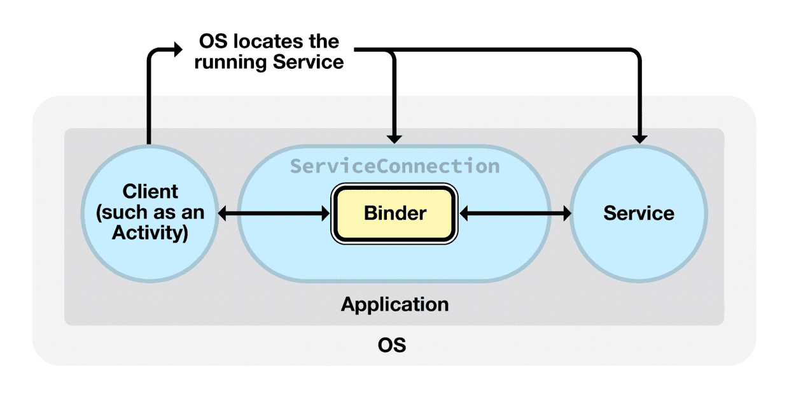
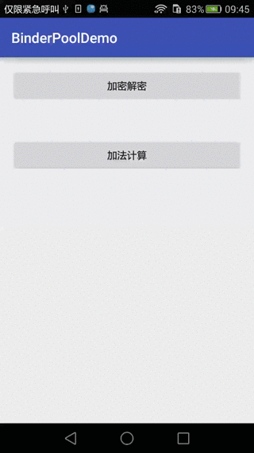

Binder作为AIDL通信的核心, 在使用中经常需要重复利用, 动态管理AIDL接口. Binder连接池的主要作用是把Binder请求统一发送至Service执行, 即动态管理Binder操作, 避免重复创建Service. 本文使用两种简单的AIDL服务, 使用Binder连接池动态切换, 含有演示Demo.

<!-- more -->
> 更多: http://www.wangchenlong.org/
> 欢迎Follow我的GitHub: https://github.com/SpikeKing



本文源码的GitHub[下载地址](https://github.com/SpikeKing/BinderPoolDemo)

---

# AIDL

模拟Binder连接池, 使用两个简单的AIDL接口与实现, 一个是加解密, 一个是加法.

加解密, AIDL提供两个方法, 即加密字符串和解密字符串.

``` java
package org.wangchenlong.binderpooldemo;

interface ISecurityCenter {
    String encrypt(String content);
    String decrypt(String password);
}
```

加密和解密的实现, 使用简单的异或运算处理.

``` java
public class SecurityCenterImpl extends ISecurityCenter.Stub {
    private static final char SECRET_CODE = 'w';

    @Override public String encrypt(String content) throws RemoteException {
        char[] chars = content.toCharArray();
        for (int i = 0; i < chars.length; i++) {
            chars[i] ^= SECRET_CODE;
        }
        return new String(chars);
    }

    @Override public String decrypt(String password) throws RemoteException {
        return encrypt(password);
    }
}
```

> AIDL的实现方法都需要设置``RemoteException``的异常抛出, 防止连接异常.

求和的AIDL接口

``` java
package org.wangchenlong.binderpooldemo;

interface ICompute {
    int add(int a, int b);
}
```

求和的实现, 非常简单.

``` java
public class ComputeImpl extends ICompute.Stub {
    @Override public int add(int a, int b) throws RemoteException {
        return a + b;
    }
}
```

**Binder连接池**通过ID查找Bidner, 查询并返回匹配的Binder.

``` java
package org.wangchenlong.binderpooldemo;

interface IBinderPool {
    IBinder queryBinder(int binderCode);
}
```

---

# Binder 连接池

Service服务通过``Binder``连接池动态选择``Binder``请求.

``` java
private Binder mBinderPool = new BinderPool.BinderPoolImpl(); // 动态选择Binder

@Nullable @Override public IBinder onBind(Intent intent) {
    Log.e(TAG, "onBind");
    return mBinderPool;
}
```

Binder连接池的具体实现, 创建``BinderPool``单例, 连接服务.

``` java
private BinderPool(Context context) {
    mContext = context.getApplicationContext();
    connectBinderPoolService(); // 连接服务
}

public static BinderPool getInstance(Context context) {
    if (sInstance == null) {
        synchronized (BinderPool.class) {
            if (sInstance == null) {
                sInstance = new BinderPool(context);
            }
        }
    }
    return sInstance;
}
```

绑定服务, 通过``CountDownLatch``类, 把异步操作转换为同步操作, 防止绑定冲突.

```
private synchronized void connectBinderPoolService() {
    mCountDownLatch = new CountDownLatch(1); // 只保持一个绑定服务
    Intent service = new Intent(mContext, BinderPoolService.class);
    mContext.bindService(service, mBinderPoolConnection, Context.BIND_AUTO_CREATE);
    try {
        mCountDownLatch.await();
    } catch (InterruptedException e) {
        e.printStackTrace();
    }
}
```

通过``DeathRecipient``处理Binder连接池死亡重联机制.

``` java
// 失效重联机制, 当Binder死亡时, 重新连接
private IBinder.DeathRecipient mDeathRecipient = new IBinder.DeathRecipient() {
    @Override public void binderDied() {
        Log.e(TAG, "Binder失效");
        mBinderPool.asBinder().unlinkToDeath(mDeathRecipient, 0);
        mBinderPool = null;
        connectBinderPoolService();
    }
};

// Binder的服务连接
private ServiceConnection mBinderPoolConnection = new ServiceConnection() {
    @Override public void onServiceConnected(ComponentName name, IBinder service) {
        mBinderPool = IBinderPool.Stub.asInterface(service);
        try {
            mBinderPool.asBinder().linkToDeath(mDeathRecipient, 0);
        } catch (RemoteException e) {
            e.printStackTrace();
        }
        mCountDownLatch.countDown();
    }

    @Override public void onServiceDisconnected(ComponentName name) {

    }
};
```

通过ID连接不同的``Binder``请求.

``` java
public IBinder queryBinder(int binderCode) {
    IBinder binder = null;
    try {
        if (mBinderPool != null) {
            binder = mBinderPool.queryBinder(binderCode);
        }
    } catch (RemoteException e) {
        e.printStackTrace();
    }

    return binder;
}
```

Binder连接池AIDL的具体实现, 通过ID选择Binder.

``` java
public static class BinderPoolImpl extends IBinderPool.Stub {
    public BinderPoolImpl() {
        super();
    }

    @Override public IBinder queryBinder(int binderCode) throws RemoteException {
        IBinder binder = null;
        switch (binderCode) {
            case BINDER_COMPUTE:
                binder = new ComputeImpl();
                break;
            case BINDER_SECURITY_CENTER:
                binder = new SecurityCenterImpl();
                break;
            default:
                break;
        }
        return binder;
    }
}
```

> AIDL并不会直接生成, 使用AS的``Build -> Make Project``即可.

---

# 客户端

通过AIDL接口, 把耗时任务移到Service进行. 操作Binder需要在其他线程中执行, 使用Handler回调至主线程, 并更新页面.

``` java
public void encryptMsg(View view) {
    new Thread(new Runnable() {
        @Override public void run() {
            doEncrypt();
        }
    }).start();
}

private void doEncrypt() {
    BinderPool binderPool = BinderPool.getInstance(getApplicationContext());
    IBinder securityBinder = binderPool.queryBinder(BinderPool.BINDER_SECURITY_CENTER);
    mISecurityCenter = SecurityCenterImpl.asInterface(securityBinder);
    String msg = "Hello, I am Spike!";
    try {
        String encryptMsg = mISecurityCenter.encrypt(msg);
        Log.e(TAG, "加密信息: " + encryptMsg);
        String decryptMsg = mISecurityCenter.decrypt(encryptMsg);
        Log.e(TAG, "解密信息: " + decryptMsg);
        Message hm = new Message();
        hm.what = 0;
        hm.obj = encryptMsg + "\n" + decryptMsg;
        mHandler.sendMessage(hm);

    } catch (RemoteException e) {
        e.printStackTrace();
    }
}
```

> 其他线程使用``Handler``向主线程传递数据, 在界面中显示效果.

加法操作类似.

``` java
public void addNumbers(View view) {
    new Thread(new Runnable() {
        @Override public void run() {
            doAddition();
        }
    }).start();
}

private void doAddition() {
    BinderPool binderPool = BinderPool.getInstance(getApplicationContext());
    IBinder computeBinder = binderPool.queryBinder(BinderPool.BINDER_COMPUTE);
    mICompute = ComputeImpl.asInterface(computeBinder);
    try {
        int result = mICompute.add(12, 12);
        Log.e(TAG, "12 + 12 = " + result);

        Message hm = new Message();
        hm.what = 1;
        hm.obj = result + "";
        mHandler.sendMessage(hm);
    } catch (RemoteException e) {
        e.printStackTrace();
    }
}
```

> 注意AIDL需要捕获``RemoteException``的异常.

---

效果



AIDL是较为高效的跨进程通信方式, 也是很多方式的低层实现; Binder连接池可以在同一服务中处理多个Binder请求, 节省资源, 因此需要熟练掌握.

OK, that's all! Enjoy it!

---

> 最初发布地址: 
> http://www.wangchenlong.org/2016/08/07/1608/074-aild-binder-pool/
> 欢迎Follow我的[GitHub](https://github.com/SpikeKing), 关注我的[简书](http://www.jianshu.com/users/e2b4dd6d3eb4/latest_articles), [CSDN](http://blog.csdn.net/caroline_wendy), [掘金](http://gold.xitu.io/#/user/56de98c2f3609a005442ec58). 
> 我已委托“维权骑士”为我的文章进行维权行动. 未经授权, 禁止转载, 授权或合作请留言.

