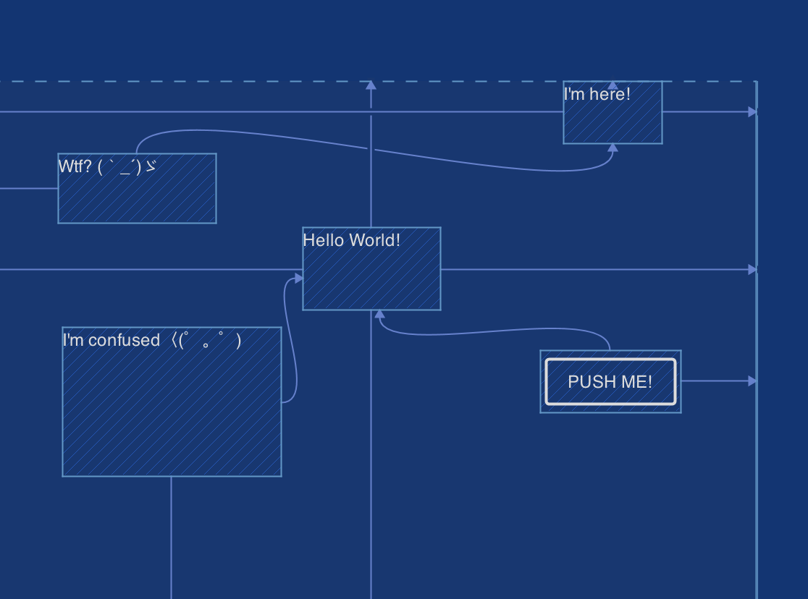
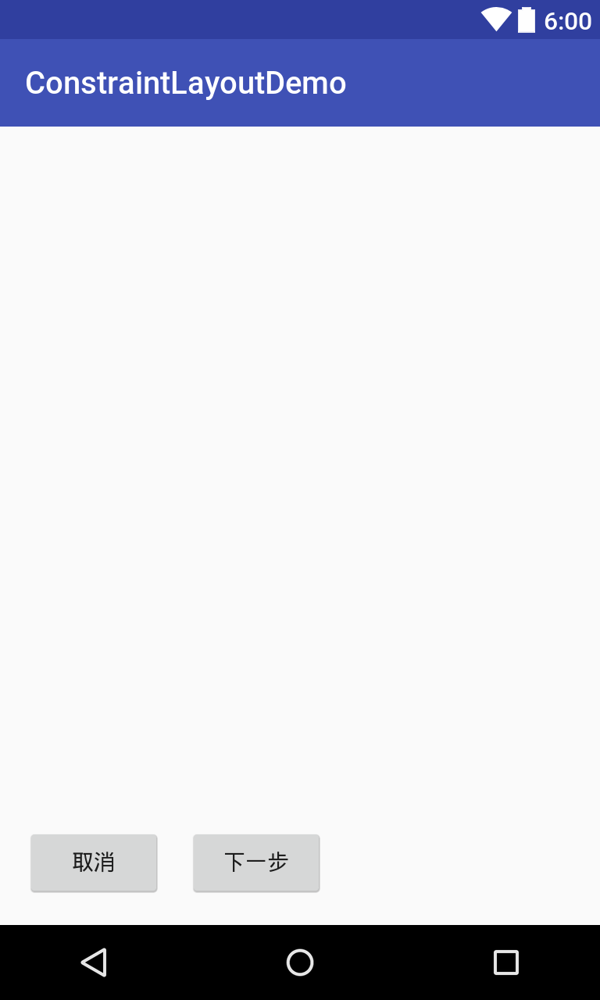
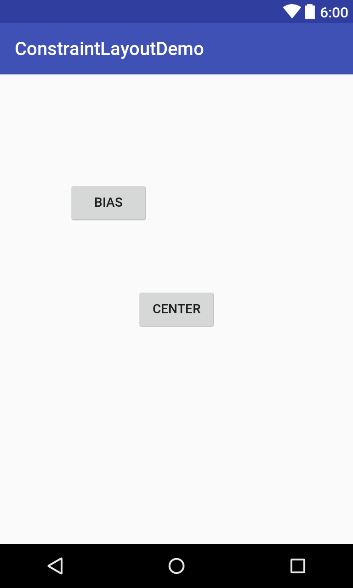
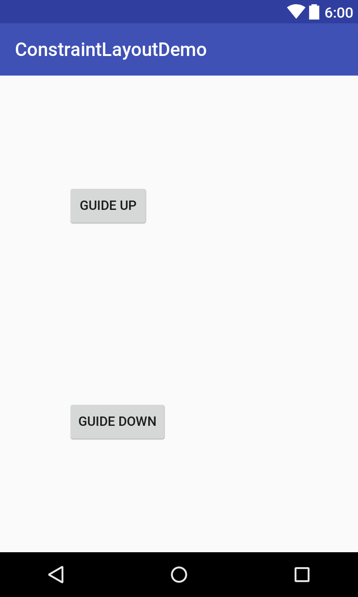
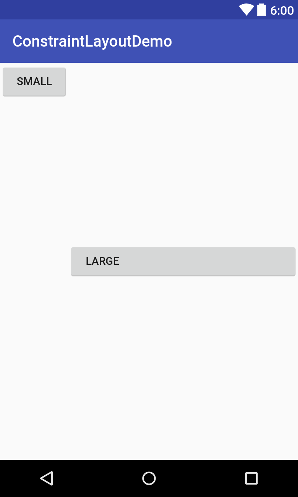
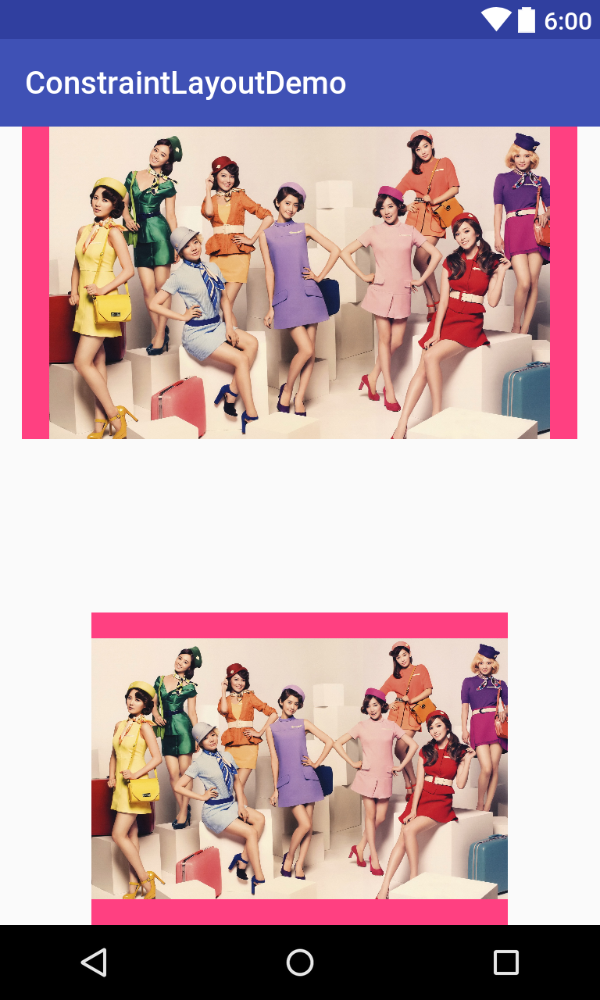

**ConstraintLayout(约束布局)**, 是2016年``Google I/O``最新推出的Android布局, 目前还在完善阶段. 从推出的力度而言, 应该会成为主流布局样式. 在最新版本的``Android Studio``中, ConstraintLayout已经成为默认布局. 

<!-- more -->
> 更多: http://www.wangchenlong.org/
> 欢迎Follow我的GitHub: https://github.com/SpikeKing



> 使用ConstraintLayout布局的最新版本``1.0.0-alpha4``, 需要下载最新Canary版本的``Android Studio``, [下载地址](https://sites.google.com/a/android.com/tools/download/studio/builds/2-2-preview-6).

ConstraintLayout作为非绑定(Unbundled)的支持库, 命名空间是``app:``, 来自于本地包的命名空间. 本文介绍``ConstraintLayout``布局的常见使用方式.

本文源码的GitHub[下载地址](https://github.com/SpikeKing/ConstraintLayoutDemo)

# 概念

ConstraintLayout约束布局的含义: 根据布局中的其他元素或视图, 确定View在屏幕中的位置. 包含三个重要信息, 根据其他视图设置位置, 根据父容器设置位置, 根据基准线设置位置.

```
layout_constraint[本源]_[目标]="[目标ID]"

```

例如: 

``` java
app:layout_constraintBottom_toBottomOf="@+id/constraintLayout"
```

约束``当前View的底部``至``目标View的底部``, 目标View是constraintLayout. 表明, 把当前View放置到constraintLayout(父容器)的底部, 并且底部一致.

为了演示多个示例, 使用复用的Activity页面. 根据参数设置标题和布局Id.

``` java
public class LayoutDisplayActivity extends AppCompatActivity {
    private static final String TAG = LayoutDisplayActivity.class.getSimpleName();
    static final String EXTRA_LAYOUT_ID = TAG + ".layoutId"; // 布局ID

    @Override protected void onCreate(@Nullable Bundle savedInstanceState) {
        super.onCreate(savedInstanceState);
        setTitle(getIntent().getStringExtra(Intent.EXTRA_TITLE));
        final int layoutId = getIntent().getIntExtra(EXTRA_LAYOUT_ID, 0);
        setContentView(layoutId); // 设置页面布局, 复用布局
    }
}
```

主页面使用ListView展示多个项, 每项都是不同的布局. 点击项发送不同的Intent, 填充所要显示的页面.

``` java
public class MainActivity extends AppCompatActivity {
    @Override
    protected void onCreate(Bundle savedInstanceState) {
        super.onCreate(savedInstanceState);
        setContentView(R.layout.activity_main);

        ListView list = (ListView) findViewById(R.id.activity_main);
        ArrayAdapter<String> adapter = new ArrayAdapter<>(this,
                android.R.layout.simple_list_item_1, LIST_ITEMS);
        list.setAdapter(adapter);
        list.setOnItemClickListener(new AdapterView.OnItemClickListener() {
            @Override
            public void onItemClick(AdapterView<?> adapterView, View view, int i, long l) {
                // 复用显示布局
                Intent intent = new Intent(MainActivity.this, LayoutDisplayActivity.class);
                intent.putExtra(Intent.EXTRA_TITLE, LIST_ITEMS[i]); // 标题
                intent.putExtra(LayoutDisplayActivity.EXTRA_LAYOUT_ID, LAYOUT_IDS[i]); // 布局Id
                startActivity(intent);
            }
        });
    }
}
```

# 基础

ConstraintLayout布局最基本的使用方式, 就是直接指定位置. ``取消``按钮的底部对齐``constraintLayout(父容器)``的底部, 左侧对齐父容器的左侧. ``下一步``按钮的底部对齐父容器的底部, 而左侧对齐``取消``按钮的右侧. 并且每个按钮边缘有Margin空隙.

``` xml
<?xml version="1.0" encoding="utf-8"?>
<android.support.constraint.ConstraintLayout
    android:id="@+id/constraintLayout"
    xmlns:android="http://schemas.android.com/apk/res/android"
    xmlns:app="http://schemas.android.com/apk/res-auto"
    android:layout_width="match_parent"
    android:layout_height="match_parent">

    <Button
        android:id="@+id/cancel_button"
        android:layout_width="wrap_content"
        android:layout_height="wrap_content"
        android:layout_marginBottom="16dp"
        android:layout_marginStart="16dp"
        android:text="取消"
        app:layout_constraintBottom_toBottomOf="@id/constraintLayout"
        app:layout_constraintStart_toStartOf="@id/constraintLayout"/>

    <Button
        android:id="@+id/next_button"
        android:layout_width="wrap_content"
        android:layout_height="wrap_content"
        android:layout_marginBottom="16dp"
        android:layout_marginStart="16dp"
        android:text="下一步"
        app:layout_constraintBottom_toBottomOf="@id/constraintLayout"
        app:layout_constraintStart_toEndOf="@id/cancel_button"/>

</android.support.constraint.ConstraintLayout>
```

> ConstraintLayout的属性设置, 最重要的就是理解属性的表示含义.





# 比例

ConstraintLayout布局除了对齐属性, 还有重要的比例属性. ``中心(Center)``按钮需要把全部边界与``constraintLayout(父容器)``边界对齐, 则为居中. 同时还可以设置水平与竖直的比例, 如0.25. ``Bias``按钮设置水平与竖直的比例是0.25, 表示左侧与右侧比例是1:4, 上部与下部的比例是1:4.

``constraintHorizontal_bias``设置水平比例, ``constraintVertical_bias``设置竖直比例. 

``` xml
<?xml version="1.0" encoding="utf-8"?>
<android.support.constraint.ConstraintLayout
    xmlns:tools="http://schemas.android.com/tools"
    android:id="@+id/constraintLayout"
    xmlns:android="http://schemas.android.com/apk/res/android"
    xmlns:app="http://schemas.android.com/apk/res-auto"
    android:layout_width="match_parent"
    android:layout_height="match_parent">

    <Button
        android:layout_width="wrap_content"
        android:layout_height="wrap_content"
        android:text="Center"
        app:layout_constraintEnd_toEndOf="@id/constraintLayout"
        app:layout_constraintStart_toStartOf="@id/constraintLayout"
        app:layout_constraintTop_toTopOf="@+id/constraintLayout"
        app:layout_constraintBottom_toBottomOf="@+id/constraintLayout"/>

    <Button
        android:layout_width="wrap_content"
        android:layout_height="wrap_content"
        android:text="Bias"
        app:layout_constraintEnd_toEndOf="@id/constraintLayout"
        app:layout_constraintStart_toStartOf="@id/constraintLayout"
        app:layout_constraintTop_toTopOf="@+id/constraintLayout"
        app:layout_constraintBottom_toBottomOf="@+id/constraintLayout"
        app:layout_constraintHorizontal_bias="0.25"
        app:layout_constraintVertical_bias="0.25"/>

</android.support.constraint.ConstraintLayout>
```

``tools:layout_editor_absoluteX``属性对于视图起到辅助作用, 理解边界的真实距离, 点击可视化布局会自动生成.



# 引导线

ConstraintLayout布局除了与布局对齐以外, 还可以与``引导线(Guideline)``对齐. 设置``竖直引导线(Guideline)``距离左侧``72dp``. 按钮(Button)的左侧都与引导线对齐, 上下使用比例的方式排列, 一个0.25比例, 一个0.75比例.

``` xml
<?xml version="1.0" encoding="utf-8"?>
<android.support.constraint.ConstraintLayout
    xmlns:tools="http://schemas.android.com/tools"
    android:id="@+id/constraintLayout"
    xmlns:android="http://schemas.android.com/apk/res/android"
    xmlns:app="http://schemas.android.com/apk/res-auto"
    android:layout_width="match_parent"
    android:layout_height="match_parent">

    <android.support.constraint.Guideline
        android:id="@+id/guideLine"
        android:layout_width="wrap_content"
        android:layout_height="wrap_content"
        android:orientation="vertical"
        app:layout_constraintGuide_begin="72dp"/>

    <Button
        android:layout_width="wrap_content"
        android:layout_height="wrap_content"
        android:text="Guide Up"
        app:layout_constraintStart_toStartOf="@id/guideLine"
        app:layout_constraintTop_toTopOf="@+id/constraintLayout"
        app:layout_constraintBottom_toBottomOf="@+id/constraintLayout"
        app:layout_constraintVertical_bias="0.25"/>

    <Button
        android:layout_width="wrap_content"
        android:layout_height="wrap_content"
        android:text="Guide Down"
        app:layout_constraintStart_toStartOf="@id/guideLine"
        app:layout_constraintTop_toTopOf="@+id/constraintLayout"
        app:layout_constraintBottom_toBottomOf="@+id/constraintLayout"
        app:layout_constraintVertical_bias="0.75"/>

</android.support.constraint.ConstraintLayout>
```



# 视图尺寸

ConstraintLayout布局中的控件也可以设置填充尺寸. 控件把宽度设置为``0dp``会自动根据位置进行填充. 如``Large``按钮, 左侧对齐与``Small``按钮的左侧, 右侧对齐与``constraintLayout父控件``的右侧, 宽度设置为``0dp``, 实际会填充全部位置.

``` xml
<?xml version="1.0" encoding="utf-8"?>
<android.support.constraint.ConstraintLayout
    android:id="@+id/constraintLayout"
    xmlns:android="http://schemas.android.com/apk/res/android"
    xmlns:app="http://schemas.android.com/apk/res-auto"
    android:layout_width="match_parent"
    android:layout_height="match_parent">

    <Button
        android:id="@+id/small"
        android:layout_width="wrap_content"
        android:layout_height="wrap_content"
        android:text="Small"
        app:layout_constraintStart_toStartOf="@id/constraintLayout"
        app:layout_constraintTop_toTopOf="@id/constraintLayout"/>

    <Button
        android:layout_width="0dp"
        android:layout_height="wrap_content"
        android:text="Large"
        app:layout_constraintBottom_toBottomOf="@id/constraintLayout"
        app:layout_constraintEnd_toEndOf="@id/constraintLayout"
        app:layout_constraintStart_toEndOf="@id/small"
        app:layout_constraintTop_toTopOf="@id/constraintLayout"/>

</android.support.constraint.ConstraintLayout>
```



# 视图纵横比

ConstraintLayout布局还可以使用``constraintDimensionRatio``设置视图的纵横比, 则需要把``宽(layout_width)``或者``高(layout_height)``设置为0dp, 根据另一个属性和比例, 计算当前属性, 如两个图片控件的显示大小.

``` xml
<?xml version="1.0" encoding="utf-8"?>
<android.support.constraint.ConstraintLayout
    android:id="@+id/constraintLayout"
    xmlns:android="http://schemas.android.com/apk/res/android"
    xmlns:app="http://schemas.android.com/apk/res-auto"
    android:layout_width="match_parent"
    android:layout_height="match_parent">

    <ImageView
        android:layout_width="0dp"
        android:layout_height="200dp"
        android:background="@color/colorAccent"
        android:src="@drawable/total_large"
        app:layout_constraintBottom_toBottomOf="@+id/constraintLayout"
        app:layout_constraintLeft_toLeftOf="@+id/constraintLayout"
        app:layout_constraintRight_toRightOf="@+id/constraintLayout"
        app:layout_constraintTop_toTopOf="@+id/constraintLayout"
        app:layout_constraintVertical_bias="0.0"/>

    <ImageView
        android:layout_width="0dp"
        android:layout_height="200dp"
        android:background="@color/colorAccent"
        android:contentDescription="@null"
        android:src="@drawable/total_large"
        app:layout_constraintBottom_toBottomOf="@+id/constraintLayout"
        app:layout_constraintDimensionRatio="4:3"
        app:layout_constraintLeft_toLeftOf="@+id/constraintLayout"
        app:layout_constraintRight_toRightOf="@+id/constraintLayout"/>

</android.support.constraint.ConstraintLayout>
```



---

``ConstraintLayout``约束布局的基本使用方式就是这些, 可以观察到ConstraintLayout布局兼顾LinearLayout与RelativeLayout的优点, 非常适合构建复杂布局, 会成为Android的主流布局方式.

OK, that's all! Enjoy it!

---

> 最初发布地址: 
> http://www.wangchenlong.org/2016/08/07/1608/077-constraint-layout-concept/
> 欢迎Follow我的[GitHub](https://github.com/SpikeKing), 关注我的[简书](http://www.jianshu.com/users/e2b4dd6d3eb4/latest_articles), [CSDN](http://blog.csdn.net/caroline_wendy), [掘金](http://gold.xitu.io/#/user/56de98c2f3609a005442ec58). 
> 我已委托“维权骑士”为我的文章进行维权行动. 未经授权, 禁止转载, 授权或合作请留言.

