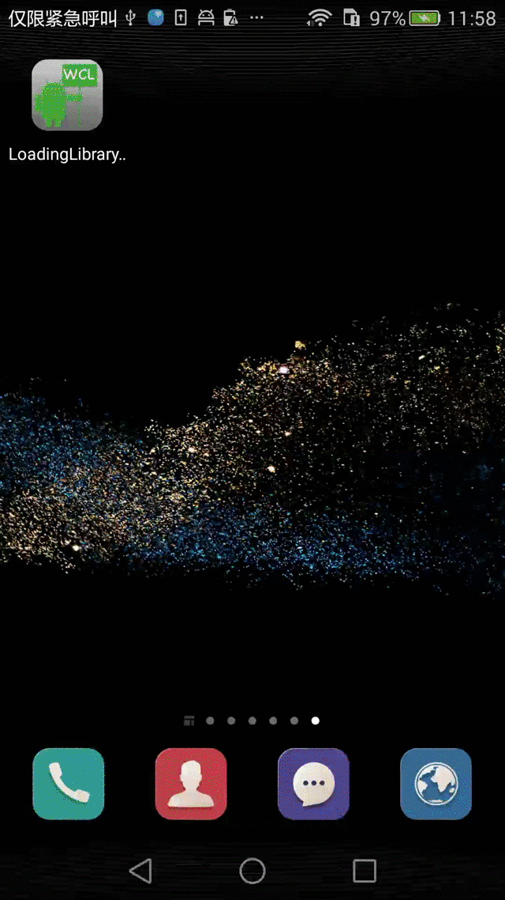

在Android项目的应用启动前, 一般都需要加载若干功能库或者发送网络请求, 这些操作需要在首页加载前完成, 因此多数应用选择添加首屏广告或者Logo. 既能提供充足的加载时间, 又能赚取商业利润和产品曝光. 最优的方案是根据耗时任务需要的时间, 设置首屏的显示时间. 本文使用Dagger与RxJava控制首页的显示时间.

<!-- more -->
> 更多: http://www.wangchenlong.org/
> 欢迎Follow我的GitHub: https://github.com/SpikeKing


本文源码的GitHub[下载地址](https://github.com/SpikeKing/LoadingLibraryDemo)

# 启动背景

在加载数据过程中, 启动页面也需要处理系统留白, 并且全屏显示. 

> [参考](http://www.jianshu.com/p/1962eac023d9)启动页面留白部分.

设置SplashActivity的主题样式, 全屏和添加自定义背景.

``` xml
<style name="BaseSplashTheme" parent="Theme.AppCompat.NoActionBar">
    <item name="android:windowBackground">@drawable/bkg_splash</item>
</style>

<style name="SplashTheme" parent="BaseSplashTheme"/>
```

自定义背景, 使用``layer-list``, 底部纯色, 上部图片.

``` xml
<?xml version="1.0" encoding="utf-8"?>
<layer-list xmlns:android="http://schemas.android.com/apk/res/android">

    <item android:drawable="@android:color/holo_purple"/>

    <item>
        <bitmap
            android:gravity="center"
            android:src="@drawable/img_tiffany"/>
    </item>

</layer-list>
```

同时, 设置``SplashActivity``的布局(layout)的背景是透明, 显示主题背景.

``` xml
<RelativeLayout
    xmlns:android="http://schemas.android.com/apk/res/android"
    android:background="@android:color/transparent">
```

# 启动页面

启动页面的布局比较简单, 由``ProgressBar``和``TextView``组成.

``` xml
<RelativeLayout
    xmlns:android="http://schemas.android.com/apk/res/android"
    android:layout_width="match_parent"
    android:layout_height="match_parent"
    android:background="@android:color/transparent"
    android:paddingBottom="@dimen/activity_vertical_margin"
    android:paddingLeft="@dimen/activity_horizontal_margin"
    android:paddingRight="@dimen/activity_horizontal_margin"
    android:paddingTop="@dimen/activity_vertical_margin">

    <ProgressBar
        style="?android:attr/progressBarStyleSmall"
        android:layout_width="wrap_content"
        android:layout_height="wrap_content"
        android:layout_above="@+id/splash_tv_text"
        android:layout_centerHorizontal="true"/>

    <TextView
        android:id="@+id/splash_tv_text"
        android:layout_width="wrap_content"
        android:layout_height="wrap_content"
        android:layout_alignParentBottom="true"
        android:layout_centerHorizontal="true"
        android:layout_marginBottom="50dp"
        android:text="@string/initializing_splash_library"/>

</RelativeLayout>
```

SplashActivity使用Dagger注入加载库. 模拟Splash的耗时较长的加载库, 并提供若干信息返回.

``` java
public class SplashLibrary {
    private static final String TAG = SplashActivity.class.getSimpleName();

    public SplashLibrary() {
        // 模拟高耗时任务, 需要5秒
        for (int i = 0; i < 5; i++) {
            Log.d(TAG, String.format("i = %1$s", i));
            SystemClock.sleep(1000);
        }
    }

    public String usefulString() {
        return "Useful string. " + getClass().getName();
    }

    // 初始化完成
    public String initializedString() {
        return "Initialized " + getClass().getSimpleName();
    }
}
```

# 启动注入

SplashModule模块, 可以使用四种方式加载模拟的SplashLibrary.

**Defer加载**. 只有在订阅``Observable``的时候, 才会调用``splashLazy.get()``, 防止阻塞线程, [参考](http://blog.danlew.net/2014/10/08/grokking-rxjava-part-4/#oldslowcode).

``` java
@NonNull @Provides @SplashScope @Named(OBSERVABLE_SPLASH_LIBRARY)
public Observable<SplashLibrary> splashLibraryObservable(
        final Lazy<SplashLibrary> splashLazy) {
    return Observable.defer(() -> Observable.just(splashLazy.get()));
}
```

> 加载缓慢任务需要使用Rxjava的Defer操作.

**FromCallback加载**, 是Defer的简化形式, [参考](https://artemzin.com/blog/rxjava-defer-execution-of-function-via-fromcallable/)

``` java
@NonNull @Provides @SplashScope @Named(OBSERVABLE_SPLASH_LIBRARY_FROM_CALLABLE)
public Observable<SplashLibrary> splashLibraryObservableFromCallable(
        final Lazy<SplashLibrary> splashLazy) {
    return Observable.fromCallable(splashLazy::get);
}

```

**FromAsync加载**, 使用Emitter模式, 处理获得的数据.

``` java
@NonNull @Provides @SplashScope @Named(OBSERVABLE_SPLASH_LIBRARY_ASYNC)
public Observable<SplashLibrary> splashLibraryObservableAsync(
        final Lazy<SplashLibrary> splashLazy) {
    return Observable.fromAsync(emitter -> emitter.onNext(splashLazy.get())
            , AsyncEmitter.BackpressureMode.NONE);
}
```

**Single模式**, 只发送单个数值, 也可以使用Single替代, 简洁.

``` java
@Provides @NonNull @SplashScope
public Single<SplashLibrary> splashLibrarySingle(
        final Lazy<SplashLibrary> splashLazy) {
    return Single.defer(() -> Single.just(splashLazy.get()));
}
```

> 这四种模式, 可以相互替代, 使用其中一个即可. 对于Provider的区分, 使用``Named``标记具体注入. ``SplashScope``标签表示模块在组件内复用, 不会重复创建. [参考](https://guides.codepath.com/android/Dependency-Injection-with-Dagger-2)

启动页的组件, 依赖应用组件, 添加启动模块.

``` java
@Component(dependencies = DemoComponent.class, modules = SplashModule.class)
@SplashScope
public interface SplashComponent {
    void inject(SplashActivity splashActivity);
}
```

# 启动逻辑

使用RxJava加载启动库, 使用计算线程, 在成功后跳转主页面, 在失败后弹出信息提示. 注意在加载库的控制, 保证只加载一次. 在页面关闭时, 取消注册订阅, 即``unsubscribe()``.

``` java
@Override protected void onStart() {
    super.onStart();

    // 初始化成功
    if (initialized.get()) {
        openMainAndFinish(this, splashLibraryLazy.get());
    } else {
        // 加载数据
        mSplashSubscription = splashLibraryObservable
                .subscribeOn(Schedulers.computation())
                .observeOn(AndroidSchedulers.mainThread())
                .subscribe(this::onSuccess, this::onFailure);
    }
}

// 加载成功
private void onSuccess(SplashLibrary library) {
    initialized.set(true);
    openMainAndFinish(SplashActivity.this, library);
}

// 加载失败
private void onFailure(Throwable e) {
    Toast.makeText(SplashActivity.this, R.string.error_fatal, Toast.LENGTH_SHORT).show();
    finish();
}

@Override protected void onStop() {
    super.onStop();

    // 取消 注册订阅者
    if (mSplashSubscription != null && !mSplashSubscription.isUnsubscribed()) {
        mSplashSubscription.unsubscribe();
    }
}
```

在加载成功后, 跳转至主页, 并关闭当前页面.

``` java
private static void openMainAndFinish(@NonNull Activity activity, @NonNull SplashLibrary splashLibrary) {
    // 提示加载库完成
    Toast.makeText(activity, splashLibrary.initializedString(), Toast.LENGTH_SHORT).show();

    // 跳转主页面
    Intent intent = new Intent(activity, MainActivity.class);
    intent.putExtra(MainActivity.EXTRA_USEFUL_STRING, splashLibrary.usefulString());
    activity.startActivity(intent);

    // 跳转页面完成关闭当前页面
    activity.finish();
}
```

---

效果



使用``Dagger+RxJava``的形式是处理网络请求的优秀做法. 应用的启动页处理耗时的数据加载, 对于提升用户体验而言, 非常重要.

OK, that's all! Enjoy it!

---

> 最初发布地址: 
> http://www.wangchenlong.org/2016/08/07/1608/078-loading-slow-lib/
> 欢迎Follow我的[GitHub](https://github.com/SpikeKing), 关注我的[简书](http://www.jianshu.com/users/e2b4dd6d3eb4/latest_articles), [CSDN](http://blog.csdn.net/caroline_wendy), [掘金](http://gold.xitu.io/#/user/56de98c2f3609a005442ec58). 
> 我已委托“维权骑士”为我的文章进行维权行动. 未经授权, 禁止转载, 授权或合作请留言.

