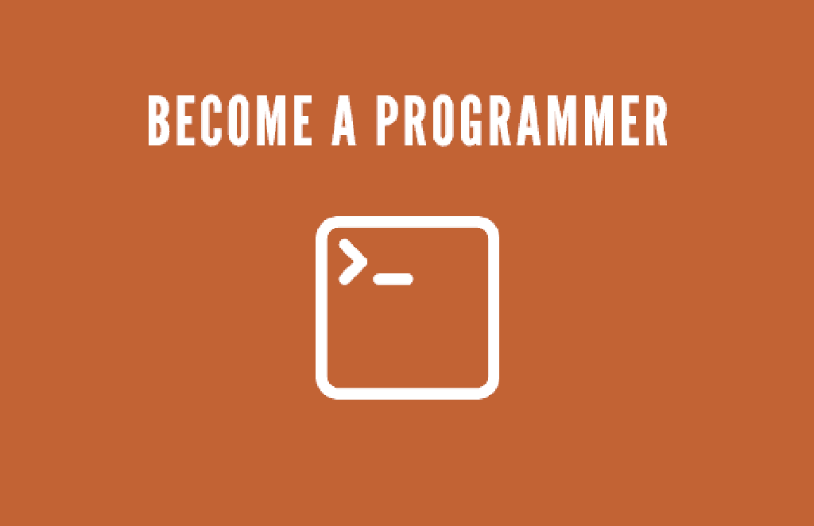
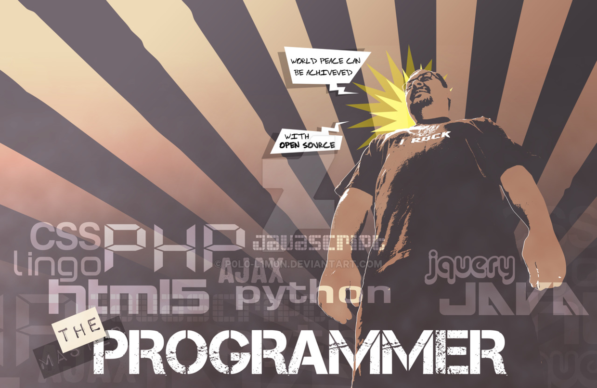

> 问题来源于一个读者朋友的提问, 这几乎是一个老生常谈的问题了, 但是忍不住还想多说一些. 就当作老程序员对于想加入这一行业新人的叮嘱, [参考](http://www.jianshu.com/p/089172900e33).

<!-- more -->
> 更多: http://www.wangchenlong.org/
> 欢迎Follow我的GitHub: https://github.com/SpikeKing

**问题**: 谢楼主分享, 我今年暑假正在自学Java, 差不多有二十来天了, 以前学过VB(应付考试), 把自学书上的代码几乎打了一遍, 不过现在想要回顾所学的除了主要的大标题, 就没记住什么... 是不是我的学习方法错了? 有没有什么好的招数能自学好Java?

最近我也一直在想关于如何学习编程的一些东西, 所以耽搁了几天, 真的很怕误人子弟. 年轻的时候, 就应该多学多问, 这样才能有飞快的进步. 对于生活而言, 我也是个探索者, 只是比你们出发的时间早一些, 见过的事情多一些. 对于编程而言, 以我的经历告诉大家, 真的非常有趣, 很轻松, 并且在新闻中, 关于编程关于程序员的一些东西都不是真的.

对于程序员群体而言, 非常宽泛. 就如一个木匠而言, 有学徒, 有为了做家居而赚钱的人, 也有雕刻大师. 有人为了糊口, 有人为了技艺. 并不是都是很累很苦很傻, 只能说有些人是这样, 有些人要更优秀更美好. 就如街头摆摊是创业, 阿里巴巴也是创业, 并不相同. 说这些是想让你端正思想, 不要带有偏见.

让我们来说说细节, 我大约从事三年的C++编程, 三年的Android编程, 做过国家级的数据挖掘项目, 做着改变时代的优秀APP. 对于Android而言, Java是基础, 但也仅仅是一门语言而已. Java的学习, 我只推荐*Java编程思想*这一本书, 反复看并理解它, 书中除了Java语法还有面向对象. 除了做书上习题, 敲代码以外, 要多理解多做笔记. 就像你把*论语*都誊抄一遍, 也不能完全理解圣人的思想, 生活中还是困惑. "学而不思则罔, 思而不学则殆".

编程还有其他的方面, 作为一个真正的程序员, 除了"语言", 还要理解"数据结构", "设计模式", "面向对象", 高级一些的是"项目架构"和"性能优化", 最高级的是提升"用户体验". 不需要着急, 一步一步的积累就好, 毕竟我们不是什么都学会再去做, 而是在做中去积累, 去理解. 关于如何找到这些知识, 如何学习这些知识, 我可以推荐一些书, 如严蔚敏的*数据结构*, *HeadFirst设计模式*, *Java编程思想*等, 但其他的还需要自己去探索. 国内, 可以看"知乎"中关于程序员问题的一些精选, 虽然有些观点我太赞同, 但是对于初级程序员而言足够了. 国外, 可以上Google, 一个神奇的天地, 寻找自己的程序部落, 加入他们, 融入他们. 当然, 需要英语, 对于不懂英语的人, 我只想说你要学会它. 还可以关注一些技术博客, 如移动端可以看[我的博客](http://www.jianshu.com/users/e2b4dd6d3eb4/latest_articles), 其他的可以在简书, 掘金, CSDN等查找.

无论哪一个行业, 最重要的都是自学能力, 没有人告诉你该怎么做, 你需要自己去探索. 入门可以靠读书, 进阶则只能靠自己的求知欲. 那么我们回到你的问题, 我可以回答一次, 但是以后还需要靠你自己去寻找.

敲完代码记好笔记, 把经典的代码背下来, 用纸笔写下来, 至于为什么, 看看大师唐纳德的回答就好. 自学Java的招数, 读懂*Java编程思想(Thanking in Java)*, 仅此而已. 但是这些只是开始, 不是嘛? 编程还有更多神奇的东西等待你去探索.

我们这个时代是一个伟大的时代, 是一个程序员的黄金时代, 计算机可以做更多更好的事, 看看AlphaGo. 一切都等待着我们去探索. 你们还年轻, 未来一定属于你们.

**"士不可以不弘毅, 任重而道远. 仁以为己任, 不亦重乎? 死而后已, 不亦远乎?"**

---

> 最初发布地址: 
> http://www.wangchenlong.org/2016/08/07/1608/079-learn-programming/
> 欢迎Follow我的[GitHub](https://github.com/SpikeKing), 关注我的[简书](http://www.jianshu.com/users/e2b4dd6d3eb4/latest_articles), [CSDN](http://blog.csdn.net/caroline_wendy), [掘金](http://gold.xitu.io/#/user/56de98c2f3609a005442ec58). 
> 我已委托“维权骑士”为我的文章进行维权行动. 未经授权, 禁止转载, 授权或合作请留言.

