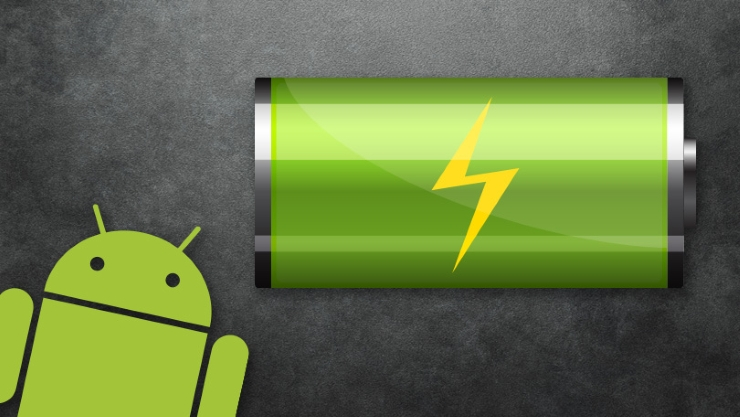
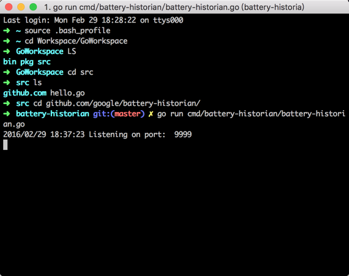
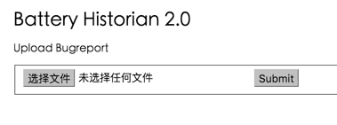
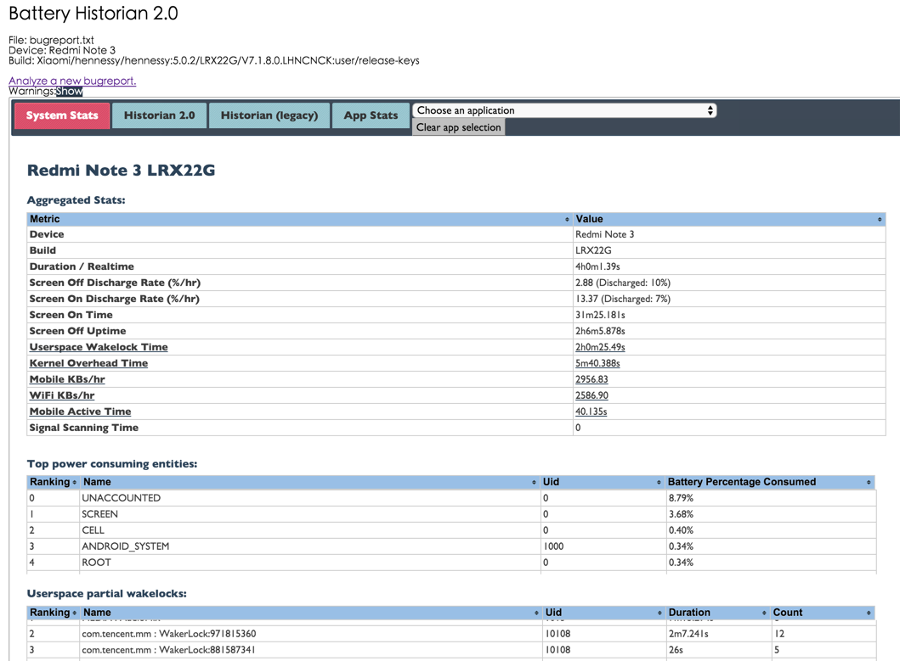
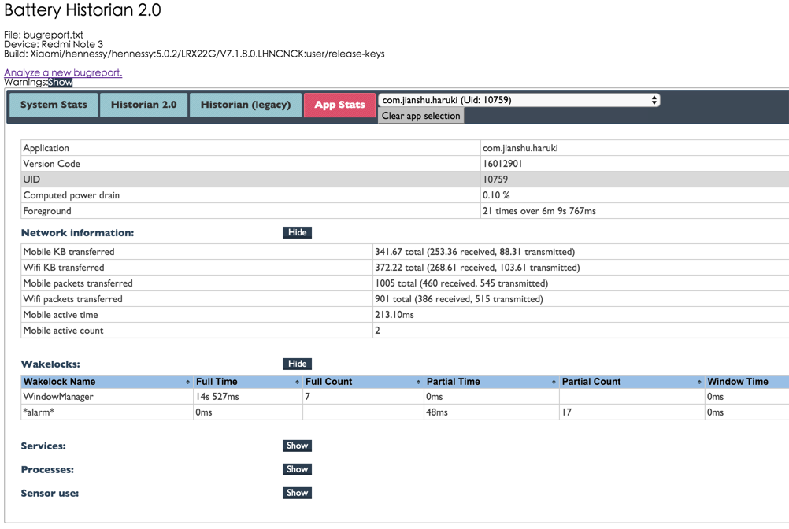

在Android项目中, 较难监控应用的电量消耗, 但是用户却非常关心手机的待机时间. 过度耗电的应用, 会遭到用户无情的卸载, 不要存在侥幸心理, 给竞品带来机会. 因此, 我们需要研究应用的耗电量, 并进行优化. 本文讲解一下[Battery Historian](https://github.com/google/battery-historian), 是一款由Google提供的Android系统电量分析工具. 在网页中展示手机的电量消耗过程, 输入电量分析文件, 显示消耗情况. 最后提供一些电量优化的方法, 可供参考.

<!-- more -->
> 更多: http://www.wangchenlong.org/




# 安装[Go](http://golang.org/)

**Battery Historian**是Go语言开发, 需要安装Go编译环境.
 
下载Mac版的[安装包](http://golang.org/doc/install/), 执行完成, 检查Go版本
```
➜  ~ go version
go version go1.6 darwin/amd64
```

在``.bash_profile``中, 设置Go语言变量
```
#Go Settings
export GOPATH=/Users/.../Workspace/GoWorkspace
export GOBIN=/Users/.../Workspace/GoWorkspace/bin
```
> GOPATH源码地址. GOBIN生成地址, 推荐$GOPATH/bin.
 执行``source .bash_profile``, 应用profile配置.

新建src文件夹, 添加HelloWorld文件``hello.go``.
```
package main

import "fmt"

func main() {
    fmt.Printf("hello, world\n")
}
```
安装hello.go
```
go install hello.go
```
执行
```
$GOBIN/hello
```
如果显示``hello, world``, 即表示安装完成.

---

# [Battery Historian](https://github.com/google/battery-historian)

在安装Battery Historian时, 需要提前安装wget.
```
sudo brew install wget
```

按照**Battery Historian**的[GitHub](https://github.com/google/battery-historian)文档执行操作即可.
```shell
go get -u github.com/golang/protobuf/proto
go get -u github.com/golang/protobuf/protoc-gen-go
go get -u github.com/google/battery-historian/...
cd $GOPATH/src/github.com/google/battery-historian
bash setup.sh
# 运行Go脚本, 默认端口9999 
go run cmd/battery-historian/battery-historian.go [--port <default:9999>]
```



启动命令
```
cd $GOPATH/src/github.com/google/battery-historian
go run cmd/battery-historian/battery-historian.go [--port <default:9999>]
```
在浏览器中, 输入**http://localhost:9999/**, 即可启动电量检测页面.



> 在启动页面时, 可能需要连接VPN, 访问Google信息. 

---

# 分析

获取手机的电量文件, 导出到根目录, 以备**Battery Historian**使用.
```shell
adb bugreport > bugreport.txt
```

使用**Battery Historian**的网页加载**bugreport.txt**文件.

> 如遇到一些问题, 重新提交**bugreport.txt**文件.

**系统状态**



**应用状态(简书)**



---

# 电量优化

根据**Battery Historian**的电量提示信息, 消耗电量包含
**唤醒锁\SyncManager同步管理器\音视频\流量**.

优化方式:
(1) 检查全部**唤醒锁**, 是否存在冗余或者无用的位置.
(2) 集中相关的**数据请求**, 统一发送; 精简数据, 减少无用数据的传输.
(3) 分析和统计等**非重要**操作, 可以在电量充足或连接WIFI时进行, 参考[JobScheduler](https://developer.android.com/reference/android/app/job/JobScheduler.html).
(4) 精简冗余的**服务(Service)**, 避免长时间执行耗电操作.
(5) 注意**定位**信息的获取, 使用后及时关闭.

---

电量优化并不是很难, 但需要对业务非常熟悉, 了解一些耗电操作的使用情况, 及时优化. 只有给用户精致的体验, 用户才能更加喜欢我们的应用, 这就是服务型社会的本质.

That's all! Enjoy it!

> 原始地址: 
> http://www.wangchenlong.org/2016/03/14/analyze-app-battery/
> 欢迎Follow我的[GitHub](https://github.com/SpikeKing), 关注我的[简书](http://www.jianshu.com/users/e2b4dd6d3eb4/latest_articles), [微博](http://weibo.com/u/2852941392), [CSDN](http://blog.csdn.net/caroline_wendy), [掘金](http://gold.xitu.io/#/user/56de98c2f3609a005442ec58), [Slides](https://slides.com/spikeking). 
> 我已委托“维权骑士”为我的文章进行维权行动. 未经授权, 禁止转载, 授权或合作请留言.