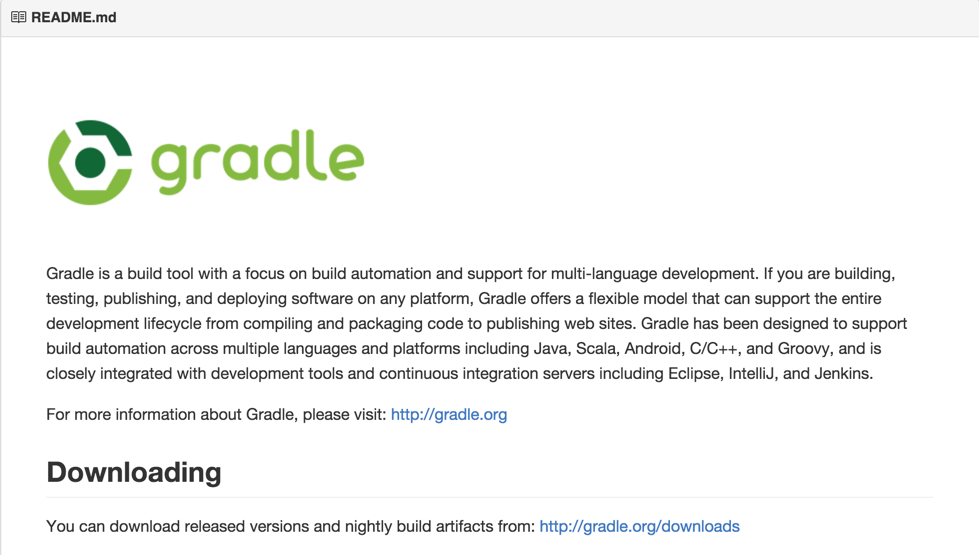

Gradle是构建Android项目的有力工具, 然而当项目比较大时, 就会非常缓慢, 需要进行优化. 本文主要介绍关于优化Gradle运行速度的一些方法.

<!-- more -->
> 更多: http://www.wangchenlong.org/



---

# 升级gradle

进入项目文件夹, 使用最新的gradle. 修改
```
$project/gradle/wrapper/gradle-wrapper.properties
```
替换为最新.
```
distributionUrl=https\://services.gradle.org/distributions/gradle-2.9-all.zip
```

---

# 升级gradle插件(plugin)

使用最新的gradle依赖.

```gradle
buildscrpt {
  dependencies {
    classpath 'com.android.tools.build:gradle:1.5.0'
  }
}
```

---

# 设置开发最低SDK版本

在开发时, 使用最低sdk版本的提升至21. 
```gradle
android {
  productFlavors {
    dev {
        minSdkVersion 21
    }
    prod {
        minSdkVersion 14
    }
  }
}
```
> 项目生成apk包分为两步, 第一步转换dex, 第二步合成dex, 但是版本21+使用Android运行时([Android Runtime](https://en.wikipedia.org/wiki/Android_Runtime))生成apk, 不需要合并dex, 所以速度加快, 也可以解决[65K方法](http://developer.android.com/intl/ko/tools/building/multidex.html).

---

# 添加gradle属性

修改``gradle.properties``
```gradle
org.gradle.daemon=true
org.gradle.parallel=true
org.gradle.jvmargs=-Xmx768m
```

---

# 使用递增的dex

增加dex的容量. [参考](http://stackoverflow.com/questions/25006075/extremely-long-build-with-gradle-android-studio).
```gradle
dexOptions {
    incremental true
}
```

---

如果项目构建过慢, 就根据实际情况, 选择优化Gradle的组合方式吧.

OK, That's all! Enjoy It!

> 原始地址: 
> http://www.wangchenlong.org/2016/03/14/improve-gradle-speed/
> 欢迎Follow我的[GitHub](https://github.com/SpikeKing), 关注我的[简书](http://www.jianshu.com/users/e2b4dd6d3eb4/latest_articles), [微博](http://weibo.com/u/2852941392), [CSDN](http://blog.csdn.net/caroline_wendy), [掘金](http://gold.xitu.io/#/user/56de98c2f3609a005442ec58), [Slides](https://slides.com/spikeking). 
> 我已委托“维权骑士”为我的文章进行维权行动. 未经授权, 禁止转载, 授权或合作请留言.


