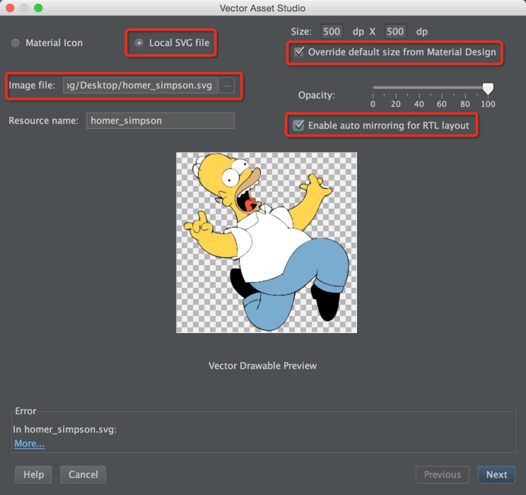
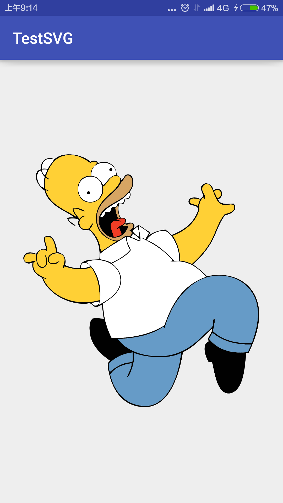
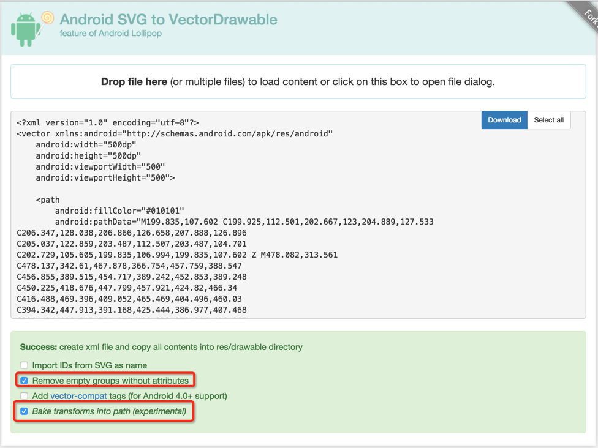

时代在发展, 技术在进步, Android的Vector图像的时代已经到来. 在Google的最新支持库v23.2中, AppCompat类已经使用Vector图像, 使得AAR包减少9%, 大约70KB, 惠及所有高版本的应用. 当然我们也可以使用Vector, 瘦身应用. Vector图像是SVG格式在Android的表现形式. SVG图像适应屏幕, 图片较小, 优点很多, [参考](https://zh.wikipedia.org/wiki/%E5%8F%AF%E7%B8%AE%E6%94%BE%E5%90%91%E9%87%8F%E5%9C%96%E5%BD%A2).

本文是第一节, 关于Vector图像.

<!-- more -->
> 更多: http://www.wangchenlong.org/

关于*Vectors时代*, 主要分为两节:
(1) 使用SVG格式图片生成Vector图像, 替换PNG, 缩减应用体积.
(2) 绘制Vector图像的路径动画, 增强用户体验, Android 5.0(21)以上系统使用, [参考](http://www.wangchenlong.org/2016/03/15/svg-path-animation/).

> SVG: Scalable Vector Graphics, 可缩放矢量图形.
> IRI: Internationalized Resource Identifiers, 国际化资源标识符.

本文源码的GitHub[下载地址](https://github.com/SpikeKing/TestSVG).

---

下载SVG格式的图片.

新建项目, 空白项目显示图片.

Android Studio 2.0
路径: File -> New -> Vector Asset -> Local SVG file



> 勾选**重置图片大小**和**左右布局适配**.

在``drawable``文件夹中, 就会发现``.xml``格式的图片.

代码中导入图片.
```xml
    <ImageView
        android:layout_width="match_parent"
        android:layout_height="match_parent"
        android:contentDescription="@null"
        android:src="@drawable/homer_simpson"/>
```

显示


如果是``非AS2.0``版本, 我们可以使用在线网站转换.
网址: http://inloop.github.io/svg2android/

上传SVG图片, 生成代码.


> 勾选**删除空组**和**添加变换**.

可以下载在线图片, 也可以在``drawable``文件夹中, 创建``.xml``文件, 粘贴代码.
使用方式与自动生成的类似, 直接添加即可.

---

通过观察发现, 均是500x500的图片:
自动生成的SVG图片是20KB, 在线生成的SVG图片是29KB.
而PNG(放大的系统图片)要732KB, 由此得知SVG图片还是非常节省内存的.
对于一些较大的App, 使用SVG图片有很大的吸引力.

OK, that's all! Enjoy it.

> 原始地址: 
> http://www.wangchenlong.org/2016/03/15/replace-svg-image/
> 欢迎Follow我的[GitHub](https://github.com/SpikeKing), 关注我的[简书](http://www.jianshu.com/users/e2b4dd6d3eb4/latest_articles), [微博](http://weibo.com/u/2852941392), [CSDN](http://blog.csdn.net/caroline_wendy), [掘金](http://gold.xitu.io/#/user/56de98c2f3609a005442ec58), [Slides](https://slides.com/spikeking). 
> 我已委托“维权骑士”为我的文章进行维权行动. 未经授权, 禁止转载, 授权或合作请留言.