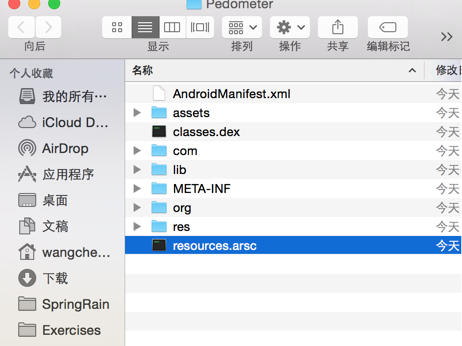
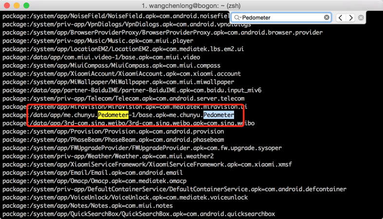
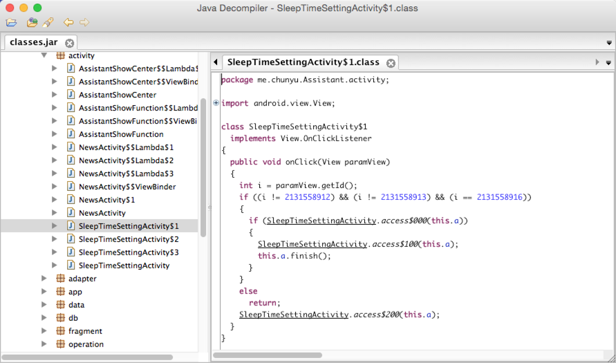
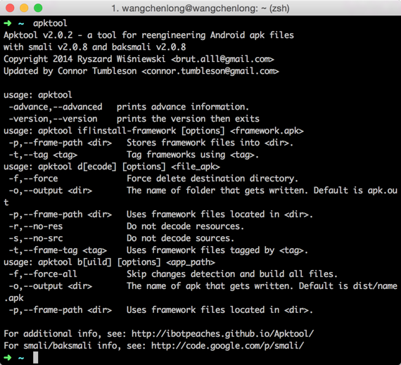
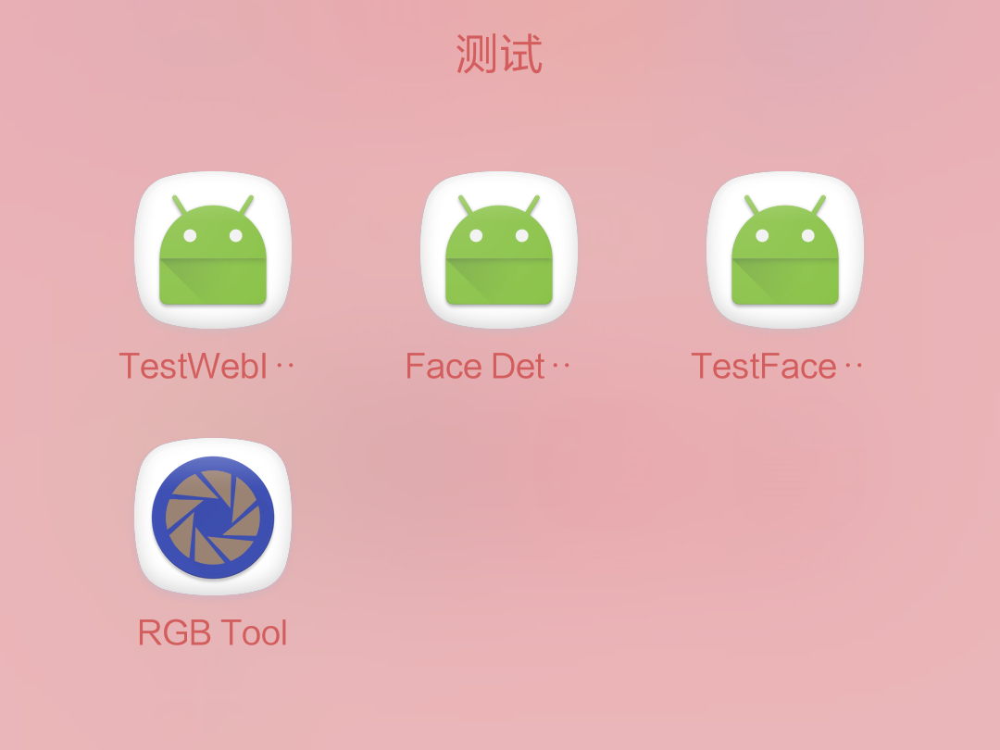
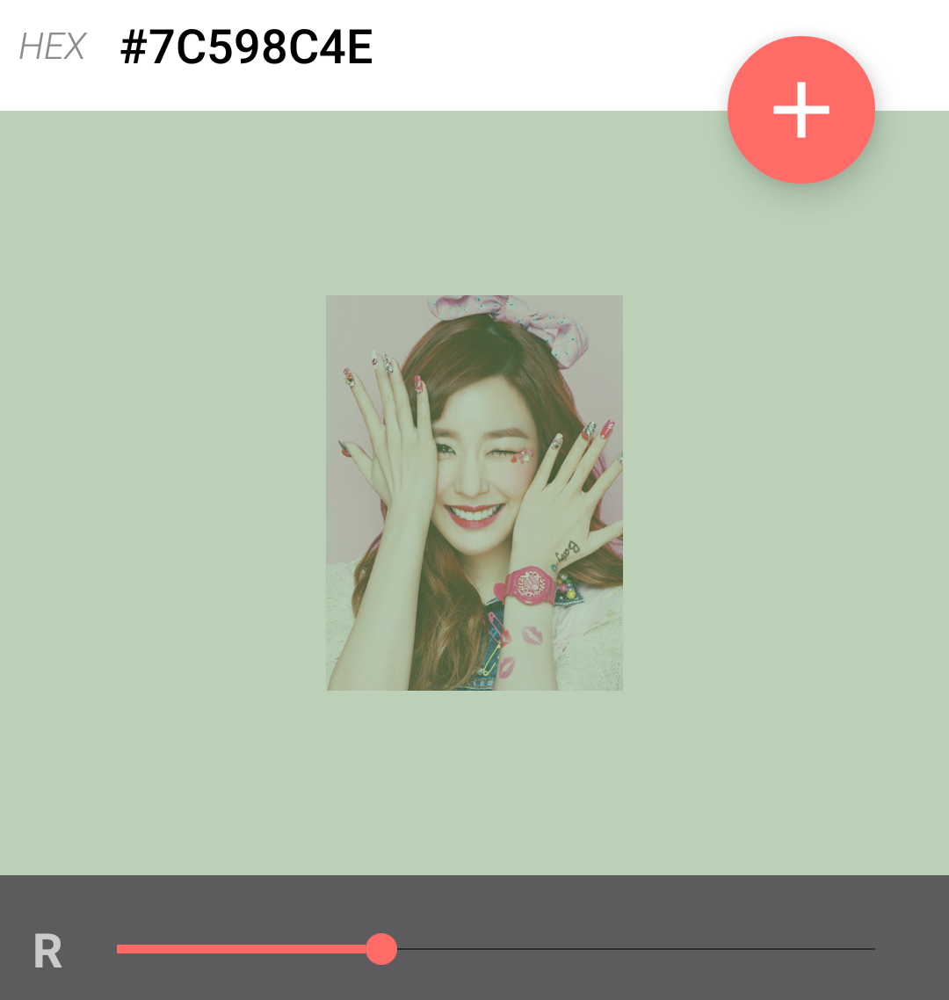
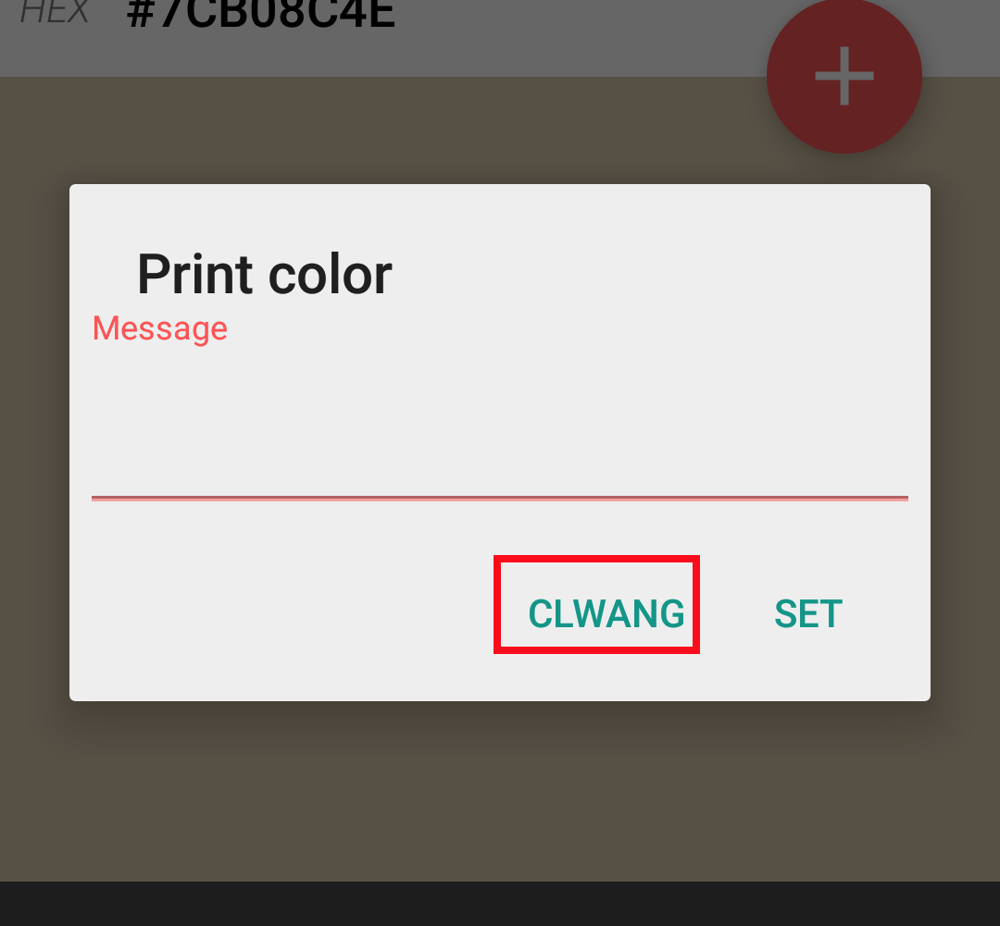

反编译就是逆向工程(Reverse Engineering), 通过解析Apk的内容, 可以验证特性和替换资源. 在批量生成应用时, 使用服务器脚本批量修改Apk, 可以节约人力和时间. 本文介绍逆向工程的常用工具和使用方法. 最新的工具是[ClassyShark](http://www.wangchenlong.org/2016/03/17/analyze-app-framework/).

<!-- more -->
> 更多: http://www.wangchenlong.org/

---

# apk
apk表示``Application PacKage``, 是zip文件, 修改后缀名``.apk``为``.zip``, 解压获得apk信息.



应用信息:
AndroidManifest.xml: 二进制清单文件.
classes.dex: Dex格式编译文件.
resources.arsc: 二进制预编译资源文件.
res: 不需编译的资源文件, 一般都是系统的资源文件.
assets: AssetManager检索应用特性.
META-INF: Jar包元数据, 也包含应用签名.

安装应用
```shell
adb install -r ~/Desktop/Pedometer.apk
```
> ``-r``表示强制安装, 会覆盖当前版本.

查看手机中的所有应用信息
```shell
adb shell pm list packages -f
```

导出手机中的apk
```shell
adb pull -p /data/app/me.chunyu.Pedometer-1/base.apk ~/Desktop/base.apk
```


> aar类型和apk相似, 在aar中, AndroidManifest是可显示的XML文件, 资源都在res文件夹中, 作为项目的库使用.

---

# aapt

aapt表示``Android Assets Packaging Tool``, 即Android属性打包工具, 导入命令行.

在Android SDK的``build-tools``文件夹中, 如
```
ANDROID_SDK_HOME/build-tools/23.0.2
```

> Android项目的Gradle中, 通过``buildToolsVersion``设置版本, [参考](http://developer.android.com/sdk/installing/studio-build.html), 主要负责apk的编译.

获取apk信息
```
aapt list base.apk // 内容
aapt dump badging base.apk // 属性
aapt dump permissions base.apk // 权限
aapt dump resources base.apk // 资源
```

获取二进制xml信息
```
aapt dump xmltree base.apk AndroidManifest.xml
```

---

# dex2jar

[dex2jar](https://github.com/pxb1988/dex2jar)是dex转换jar的工具, 导入命令行, 还需要使用Java包解析工具[JD-GUI](http://jd.benow.ca/). 可以分析Apk的崩溃信息.

> 配置``d2j-dex2jar.sh``命令行:
> 改变``d2j-dex2jar.sh``和``d2j_invoke.sh``的权限, 即``chmod 777 xx.sh``.
> 软链接: ``ln -s /.../Installations/dex2jar-2.0/d2j-dex2jar.sh d2j-dex2jar.sh``.

转换apk为jar包
```
d2j-dex2jar.sh -f -o classes.jar base.apk
```

> 转换过程中, 如果发生内存不够, 修改``d2j_invoke.sh``的虚拟机配置.
> ``java -Xms512m -Xmx1024m -classpath "${_classpath}" "$@"``

使用JD-GUI打开jar包, 资源都被替换为数字.


转换jar包为dex
```
d2j-jar2dex.sh -f -o classes.dex classes.jar
```

压缩dex为apk
```
zip -r my.apk classes.dex
```
> 注意现在的apk是无法安装入手机的, 因为没有签名.
> 即使签名也会报错. 通过apktool替代打包.

---

# apktool

解析apk的第三方工具, 安装方式[参考](http://ibotpeaches.github.io/Apktool/install/).

```
Mac OS X:
1. Download Mac wrapper script (Right click, Save Link As apktool)
2. Download apktool-2 (find newest here)
3. Rename downloaded jar to apktool.jar
4. Move both files (apktool.jar & apktool) to /usr/local/bin (root needed)
5. Make sure both files are executable (chmod +x)
6. Try running apktool via cli
```

配置成功


示例rgb_tool.apk[下载](https://apkpure.com/rgb-tool/com.fastebro.androidrgbtool), [源码](https://github.com/fasteque/rgb-tool).

解析apk
```
apktool d rgb_tool.apk
```

在``rgb_tool``文件夹, 内容: 
apktool.yml: apk属性.
AndroidManifest.xml: 清单文件, 非二进制.
original: 原始数据, 应用的二进制清单和签名.
res: 资源文件.
smali: dex解析的代码.

> smali是dex虚拟机的解析格式, [参考](https://github.com/JesusFreke/smali). 在``dex2jar``中, 也包含smali格式的转换.

构建apk. 在``rgb_tool/rgb_tool/dist``中生成apk文件.
```
apktool b rgb_tool
```

安装时, 会显示未签名.
```
Failure [INSTALL_PARSE_FAILED_NO_CERTIFICATES]
```

添加apk签名
```
jarsigner -verbose -sigalg SHA1withRSA -digestalg SHA1 -keystore ~/.android/debug.keystore -signedjar rgb_tool.apk rgb_tool.apk androiddebugkey
zipalign -v -f 4 rgb_tool.apk rgb_tool_align.apk
```

> 使用系统默认签名, 或者添加自己的签名, ``zipalign``用于对齐应用, 建议使用. [参考](http://developer.android.com/tools/publishing/app-signing.html).

颜色
接着, 我们来解析包, 修改一些颜色, 再生成包.
找到系统颜色, 修改``rgb_tool/res/values/colors.xml``, 主题粉色.
```xml
<color name="primary">#ffff1493</color>
```
图标
替换应用图标, [AndroidAssetStudio](http://jgilfelt.github.io/AndroidAssetStudio/)创建图标. 替换``mipmap``中``ic_launcher.png``.



图片
替换资源, 把背景图片换了. 替换``drawable-xxxhdpi-v4``中的``robot.png``.



资源
替换字符串, 在``strings.xml``创建新的字符串, 
```xml
<string name="action_common_skip_wcl">CLWang</string>
```
在``res/values/public.xml``中替换``action_common_skip``为``action_common_skip_wcl``.
```xml
<public type="string" name="action_common_skip_wcl" id="0x7f070017" />
```



> ``public.xml``是资源映射, ``smali``文件使用, 类似``R.java``.

``apktool``是非常强大的逆向工程工具, 一定要熟练掌握.

---

# androguard

[源码](https://github.com/androguard/androguard), [下载](https://github.com/androguard/androguard/releases/).

这个是一个命令行处理库, 开发时间很早了, 就不做深入讲解了.

---

逆向工程的基本工具, aapt\dex2jar\apktool\androguard都已经介绍了, 根据需求选择好用的工具吧. 
OK, that's all. Enjoy it!

---

**生活**

> 有技术又要有生活, 美让生活更精彩!

[](http://s.click.taobao.com/t?e=m%3D2%26s%3DBIDSCWTHX%2BgcQipKwQzePOeEDrYVVa64K7Vc7tFgwiHjf2vlNIV67kcNifCCjBeAYFMBzHxYoCN1lK%2FY7wPaoHeQQxhDmA6IAe67oaxDEWp4DvOxtwmul4Ep9ov0yrw60ixpVrz2yT%2BQnTiMaxSHD8YMXU3NNCg%2F&pvid=10_117.73.144.43_17234_1458428662179)

女生, 让自己更职业受欢迎! 男生, 送给心中女神或未来女友! [好物](http://s.click.taobao.com/t?e=m%3D2%26s%3DBIDSCWTHX%2BgcQipKwQzePOeEDrYVVa64K7Vc7tFgwiHjf2vlNIV67kcNifCCjBeAYFMBzHxYoCN1lK%2FY7wPaoHeQQxhDmA6IAe67oaxDEWp4DvOxtwmul4Ep9ov0yrw60ixpVrz2yT%2BQnTiMaxSHD8YMXU3NNCg%2F&pvid=10_117.73.144.43_17234_1458428662179)

---

> 原始地址: 
> http://www.wangchenlong.org/2016/03/19/reverse-analyze-apk/
> 欢迎Follow我的[GitHub](https://github.com/SpikeKing), 关注我的[简书](http://www.jianshu.com/users/e2b4dd6d3eb4/latest_articles), [微博](http://weibo.com/u/2852941392), [CSDN](http://blog.csdn.net/caroline_wendy), [掘金](http://gold.xitu.io/#/user/56de98c2f3609a005442ec58), [Slides](https://slides.com/spikeking). 
> 我已委托“维权骑士”为我的文章进行维权行动. 未经授权, 禁止转载, 授权或合作请留言.

