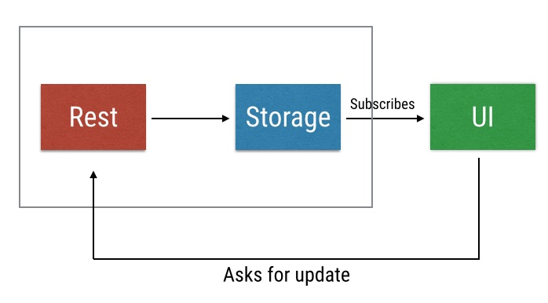
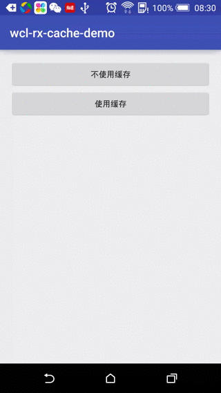

RxJava是响应式编程, 在异步处理网络数据时, 使用广泛. 使用一些Rx的特性, 缓存网络数据, 并同步显示, 可以增强用户的网络加载体验.

<!-- more -->
> 更多: http://www.wangchenlong.org/

缓存模式: 读取数据库, 显示, 请求数据, 存储到数据库, 再更新页面.



使用Dagger2+Retrofit+Rx的标准组合, 我来讲解一下如何使用.

本文源码的GitHub[下载地址](https://github.com/SpikeKing/wcl-rx-cache-demo)



---

# 框架

常规项目, 包含跳转缓存和非缓存页面, 为了模拟慢速环境, 延迟3秒加载数据.
```java
public class MainActivity extends AppCompatActivity {

    @Override
    protected void onCreate(Bundle savedInstanceState) {
        super.onCreate(savedInstanceState);
        setContentView(R.layout.activity_main);
    }

    // 跳转无缓存
    public void gotoNoCache(View view) {
        startActivity(new Intent(this, NocacheActivity.class));
    }

    // 跳转有缓存
    public void gotoCache(View view) {
        startActivity(new Intent(this, CacheActivity.class));
    }
}
```
---

# 无缓存

依赖注入三个关键部分, Application/Component/Module.
```java
public class RcApplication extends Application {
    private ApiComponent mApiComponent;

    @Override public void onCreate() {
        super.onCreate();
        mApiComponent = DaggerApiComponent.builder()
                .apiModule(new ApiModule(this)).build();
    }

    public ApiComponent getApiComponent() {
        return mApiComponent;
    }
}
```
```java
@Singleton
@Component(modules = ApiModule.class)
public interface ApiComponent {
    void inject(NocacheActivity activity);

    void inject(CacheActivity activity);
}
```
```java
@Module
public class ApiModule {
    private Application mApplication;

    public ApiModule(Application application) {
        mApplication = application;
    }

    @Provides
    @Singleton
    public Application provideApplication() {
        return mApplication;
    }

    @Provides
    @Singleton GitHubClient provideGitHubClient() {
        return new GitHubClient();
    }

    @Provides ObservableRepoDb provideObservableRepoDb() {
        return new ObservableRepoDb(mApplication);
    }
}
```
> 模块提供应用信息, GitHub的网络请求, 数据库.
> @Singleton表示单例模式, 全部注入拥有一个实例.

页面, 使用RecyclerView显示列表信息, 在加载时显示ProgressBar.
```java
/**
 * 无缓存Activity
 * <p>
 * Created by wangchenlong on 16/1/18.
 */
public class NocacheActivity extends Activity {

    @Bind(R.id.nocache_rv_list) RecyclerView mRvList;
    @Bind(R.id.nocache_pb_progress) ProgressBar mPbProgress;

    @Inject Application mApplication;
    @Inject GitHubClient mGitHubClient;

    private ListAdapter mListAdapter;

    @Override protected void onCreate(Bundle savedInstanceState) {
        super.onCreate(savedInstanceState);
        setContentView(R.layout.activity_nocache);
        ButterKnife.bind(this);

        ((RcApplication) getApplication()).getApiComponent().inject(this);

        LinearLayoutManager layoutManager = new LinearLayoutManager(mApplication);
        mRvList.setLayoutManager(layoutManager);

        mListAdapter = new ListAdapter();
        mRvList.setAdapter(mListAdapter);
    }

    @Override protected void onResume() {
        super.onResume();

        // 延迟3秒, 模拟效果
        mGitHubClient.getRepos("SpikeKing")
                .delay(3, TimeUnit.SECONDS)
                .subscribeOn(Schedulers.io())
                .observeOn(AndroidSchedulers.mainThread())
                .subscribe(this::onSuccess, this::onError);

        mPbProgress.setVisibility(View.VISIBLE);
    }

    private void onSuccess(ArrayList<Repo> repos) {
        mListAdapter.setRepos(repos);
        mPbProgress.setVisibility(View.INVISIBLE);
    }

    private void onError(Throwable throwable) {
        mPbProgress.setVisibility(View.INVISIBLE);
    }
}
```

通过观察可以发现, 长时间显示白屏会降低用户体验. 我来看看缓存模式.

---

# 缓存

缓存模式: 读取数据库, 显示, 请求数据, 存储到数据库, 再更新页面.
推荐使用脚本生成数据库处理类, 使用方式[参考](http://www.jianshu.com/p/012d793e4b5f), **自动生成DbHelper的脚本**.

主页逻辑.
```java
public class CacheActivity extends Activity {

    @Bind(R.id.cache_rv_list) RecyclerView mRvList; // 列表
    @Bind(R.id.cache_srl_swipe) SwipeRefreshLayout mSrlSwipe; // 刷新

    @Inject Application mApplication;
    @Inject ObservableRepoDb mRepoDb;
    @Inject GitHubClient mGitHubClient;

    private ListAdapter mListAdapter; // RecyclerView适配器

    @Override protected void onCreate(Bundle savedInstanceState) {
        super.onCreate(savedInstanceState);
        setContentView(R.layout.activity_cache);
        ButterKnife.bind(this);

        // 注入类
        ((RcApplication) getApplication()).getApiComponent().inject(this);

        LinearLayoutManager layoutManager = new LinearLayoutManager(mApplication);
        mRvList.setLayoutManager(layoutManager);

        mListAdapter = new ListAdapter();
        mRvList.setAdapter(mListAdapter);

        mSrlSwipe.setOnRefreshListener(this::fetchUpdates);
    }

    @Override protected void onResume() {
        super.onResume();
        mRepoDb.getObservable()
                .subscribeOn(Schedulers.io())
                .observeOn(AndroidSchedulers.mainThread())
                .subscribe(this::setData);

        fetchUpdates();
        Toast.makeText(mApplication, "正在更新", Toast.LENGTH_SHORT).show();
    }

    // 设置数据, 更新完成会调用
    private void setData(ArrayList<Repo> repos) {
        mListAdapter.setRepos(repos);
        Toast.makeText(mApplication, "更新完成", Toast.LENGTH_SHORT).show();
    }

    private void fetchUpdates() {
        // 延迟3秒, 模拟效果
        mGitHubClient.getRepos("SpikeKing")
                .delay(3, TimeUnit.SECONDS)
                .subscribeOn(Schedulers.io())
                .observeOn(AndroidSchedulers.mainThread())
                .subscribe(mRepoDb::insertRepoList, this::fetchError, this::fetchComplete);
    }

    private void fetchError(Throwable throwable) {
        mSrlSwipe.setRefreshing(false);
    }

    private void fetchComplete() {
        mSrlSwipe.setRefreshing(false);
    }
}
```

数据库的观察者
```java
/**
 * Redo的观察者
 * <p>
 * Created by wangchenlong on 16/1/18.
 */
public class ObservableRepoDb {
    private PublishSubject<ArrayList<Repo>> mPublishSubject; // 发表主题
    private RepoDbHelper mDbHelper; // 数据库

    public ObservableRepoDb(Context context) {
        mDbHelper = new RepoDbHelper(context);
        mPublishSubject = PublishSubject.create();
    }

    // 返回观察者
    public Observable<ArrayList<Repo>> getObservable() {
        Observable<ArrayList<Repo>> firstObservable = Observable.fromCallable(this::getRepoList);
        return firstObservable.concatWith(mPublishSubject); // 连接发表主题
    }

    // 从数据库获得数据
    private ArrayList<Repo> getRepoList() {
        mDbHelper.openForRead();
        ArrayList<Repo> repos = new ArrayList<>();
        Cursor c = mDbHelper.getAllRepo();
        if (!c.moveToFirst()) {
            return repos; // 返回空
        }

        do {
            // 添加数据
            repos.add(new Repo(
                    c.getString(RepoDbHelper.REPO_ID_COLUMN_POSITION),
                    c.getString(RepoDbHelper.REPO_NAME_COLUMN_POSITION),
                    c.getString(RepoDbHelper.REPO_DESCRIPTION_COLUMN_POSITION),
                    new Repo.Owner(c.getString(RepoDbHelper.REPO_OWNER_COLUMN_POSITION), "", "", "")));
        } while (c.moveToNext());
        c.close();
        mDbHelper.close();
        return repos;
    }

    // 插入Repo列表
    public void insertRepoList(ArrayList<Repo> repos) {
        mDbHelper.open();
        mDbHelper.removeAllRepo();
        for (Repo repo : repos) {
            mDbHelper.addRepo(
                    repo.getId(),
                    repo.getName(),
                    repo.getDescription(),
                    repo.getOwner().getLogin()
            );
        }
        mDbHelper.close();
        mPublishSubject.onNext(repos); // 会调用更新数据
    }
}
```

> 这一部分是关键, 实现网络请求同步插入数据库和更新页面.
> 关联PublishSubject, 在插入数据完成后, 调用绑定观察者, 更新页面.
> 即**.concatWith(mPublishSubject)**和**mPublishSubject.onNext(repos)**.

---

Rx在处理网络请求方面, 确实非常优雅, 值得喜欢完美的人使用.

OK, that's all! Enjoy it.

---

**生活**

> 有技术又要有生活, 美让生活更精彩!

[](http://s.click.taobao.com/t?e=m%3D2%26s%3D302SIwXttHEcQipKwQzePOeEDrYVVa64LKpWJ%2Bin0XLjf2vlNIV67qDUtvAPEpZkrumJQoe%2FxcN1lK%2FY7wPaoHeQQxhDmA6IAe67oaxDEWp4DvOxtwmul0NFd1o3Xd%2FD%2BEw8xZZ6W%2Ffp%2FAHLBs4DsnEqY%2Bakgpmw&pvid=10_117.73.144.43_444_1458391396057)

女生, 让自己更职业更受欢迎! 男生, 送给心中女神或未来女友! [好物](http://s.click.taobao.com/t?e=m%3D2%26s%3D302SIwXttHEcQipKwQzePOeEDrYVVa64LKpWJ%2Bin0XLjf2vlNIV67qDUtvAPEpZkrumJQoe%2FxcN1lK%2FY7wPaoHeQQxhDmA6IAe67oaxDEWp4DvOxtwmul0NFd1o3Xd%2FD%2BEw8xZZ6W%2Ffp%2FAHLBs4DsnEqY%2Bakgpmw&pvid=10_117.73.144.43_444_1458391396057).

---

> 原始地址: 
> http://www.wangchenlong.org/2016/03/19/rx-network-cache/
> 欢迎Follow我的[GitHub](https://github.com/SpikeKing), 关注我的[简书](http://www.jianshu.com/users/e2b4dd6d3eb4/latest_articles), [微博](http://weibo.com/u/2852941392), [CSDN](http://blog.csdn.net/caroline_wendy), [掘金](http://gold.xitu.io/#/user/56de98c2f3609a005442ec58), [Slides](https://slides.com/spikeking). 
> 我已委托“维权骑士”为我的文章进行维权行动. 未经授权, 禁止转载, 授权或合作请留言.
