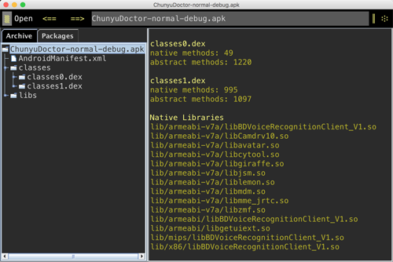
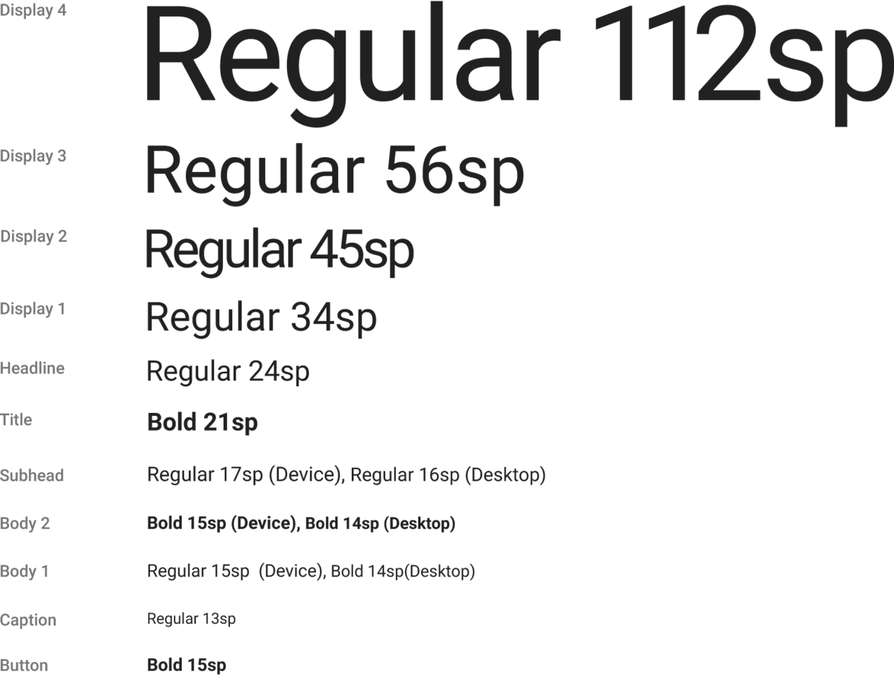

本文介绍一些, 在Android开发中会经常使用的小知识点, 每篇10个. 第二篇.

<!-- more -->
> 更多: http://www.wangchenlong.org/


系列
[第一篇](http://www.wangchenlong.org/2016/02/23/tips/1603/231-android-tips-1/), [第二篇](http://www.wangchenlong.org/2016/02/23/tips/1603/232-android-tips-2/), [第三篇](http://www.wangchenlong.org/2016/02/23/tips/1603/233-android-tips-3/), [第四篇](http://www.wangchenlong.org/2016/02/24/tips/1603/241-android-tips-4/), [第五篇](http://www.wangchenlong.org/2016/02/24/tips/1603/242-android-tips-5/).

---

# [Dagger2](google.github.io/dagger/)开发顺序

Module -> Component -> Application
首先**模块(Module)**创建需要提供的类实例, 其次把模块添加到**组件(Component)**中并提供需要注入的类, 最后把组件添加到**应用(Application)**中并提供接口.

```java
// 模块
@Module
public class TestAppModule {
    private final Context mContext;

    public TestAppModule(Context context) {
        mContext = context.getApplicationContext();
    }

    // 提供类实例
    @AppScope
    @Provides
    public Context provideAppContext() {
        return mContext;
    }

    @Provides
    public WeatherApiClient provideWeatherApiClient() {
        return new MockWeatherApiClient();
    }
}

// 组件
@AppScope
@Component(modules = TestAppModule.class) // 注册模块
public interface TestAppComponent extends AppComponent {
    void inject(MainActivityTest test);
}

// 应用
public class TestWeatherApplication extends WeatherApplication {
    private TestAppComponent mTestAppComponent;

    @Override public void onCreate() {
        super.onCreate();
        mTestAppComponent = DaggerTestAppComponent.builder()
                .testAppModule(new TestAppModule(this))
                .build();
    }

    // 提供组件
    @Override
    public TestAppComponent getAppComponent() {
        return mTestAppComponent;
    }
}
```

---

# [JRebel](https://zeroturnaround.com/software/jrebel-for-android/)

Android调试工具, 不用编译, 就可以刷新一些项目修改. 不过功能已经被Android Studio 2.0 代替, 等待2.0正式发版.

---

# 数据绑定(DataBinding)

[DataBinding](http://developer.android.com/intl/ko/tools/data-binding/guide.html)实现数据与页面的分离, 更符合面向对象的编程模式.
布局设置
```xml
    <data>
        <variable
            name="weatherData"
            type="clwang.chunyu.me.wcl_espresso_dagger_demo.data.WeatherData"/>
    </data>

            <TextView
                android:id="@+id/temperature"
                android:layout_width="wrap_content"
                android:layout_height="wrap_content"
                android:layout_centerInParent="true"
                android:layout_marginBottom="@dimen/margin_large"
                android:layout_marginTop="@dimen/margin_xlarge"
                android:text="@{weatherData.temperatureCelsius}"
                android:textAppearance="@style/TextAppearance.AppCompat.Display3"
                tools:text="10°"/>
```

逻辑设置
```java
private ActivityMainBinding mBinding; // 页面绑定类
mBinding = DataBindingUtil.setContentView(this, R.layout.activity_main); // 绑定页面
mBinding.weatherLayout.setVisibility(View.VISIBLE); // 使用Id
mBinding.setWeatherData(weatherData); // 绑定数据
```

---

# [ClassyShark](https://github.com/google/android-classyshark)

查看Apk信息的软件, 功能非常强大, 省去反编译的步骤, 主要功能:
(1) 在MultiDex中dex的详细信息.
(2) 使用NativeLibrary的详细信息.
(3) 类的详细信息.
(4) 数量统计.



---

# CocoaPod安装

升级Mac系统, 可能会导致Pod命令消失, 需要重新安装Pod.
```
sudo gem install -n /usr/local/bin cocoapods
```

---

# LaunchMode

LaunchMode包含四种模式,
(1) standard, 标准模式, 启动重新创建示例, 默认.
(2) singleTop, 栈顶复用模式, 位于栈顶, 启动不会被创建, 调用onNewIntent.
(3) singleTask, 栈内复用模式, 存在不会被创建, 调用onNewIntent.
(4) singleInstance, 单实例模式, 单独位于一个任务栈内, 复用.

---

# TextView的标准字体

样式
```xml
style="@style/TextAppearance.AppCompat.Display4"
style="@style/TextAppearance.AppCompat.Display3"
style="@style/TextAppearance.AppCompat.Display2"
style="@style/TextAppearance.AppCompat.Display1"
style="@style/TextAppearance.AppCompat.Headline"
style="@style/TextAppearance.AppCompat.Title"
style="@style/TextAppearance.AppCompat.Subhead"
style="@style/TextAppearance.AppCompat.Body2"
style="@style/TextAppearance.AppCompat.Body1"
style="@style/TextAppearance.AppCompat.Caption"
style="@style/TextAppearance.AppCompat.Button"
```

显示



---

# 自动生成DbHelper的脚本

[下载地址](https://github.com/SpikeKing/Android-sql-lite-helper)

安装Jinja2.
```
pip install Jinja2
```

设置数据
```
CLASS Repo
String Id
String Name
String Description
String Owner
ENDCLASS
```

下载代码库. 生成代码.
```
python sql_lite_helper.py -f ~/Desktop/Repo -n SampleGenerate -p me.chunyu -a clwang
```

---

# Gson的序列化参数

有些情况下, Json名称与变量不同, 需要指定.
```java
@SerializedName("avatar_url") private String avatarUrl;
```

---

# Proguard保留库

最简单的方式是全部保留. 去除警告**dontwarn**, 保留类**keep class**.

```proguard
# 在线更新
-dontwarn clwang.chunyu.me.**
-keep class clwang.chunyu.me.**{*;}
```

---

OK, That's all! Enjoy it!

---

> 原始地址: 
> http://www.wangchenlong.org/2016/02/23/tips/1603/232-android-tips-2/
> 欢迎Follow我的[GitHub](https://github.com/SpikeKing), 关注我的[简书](http://www.jianshu.com/users/e2b4dd6d3eb4/latest_articles), [微博](http://weibo.com/u/2852941392), [CSDN](http://blog.csdn.net/caroline_wendy), [掘金](http://gold.xitu.io/#/user/56de98c2f3609a005442ec58). 
> 我已委托“维权骑士”为我的文章进行维权行动. 未经授权, 禁止转载, 授权或合作请留言.

