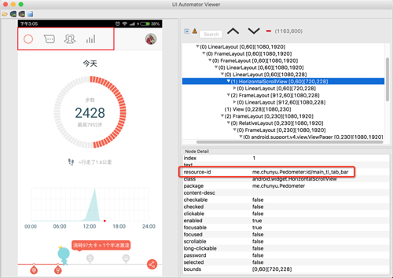
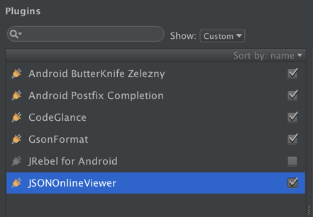
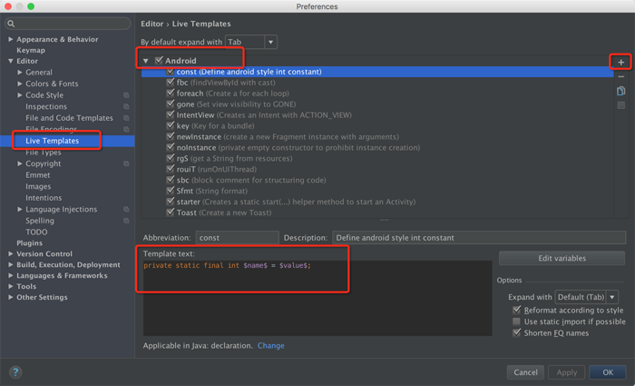
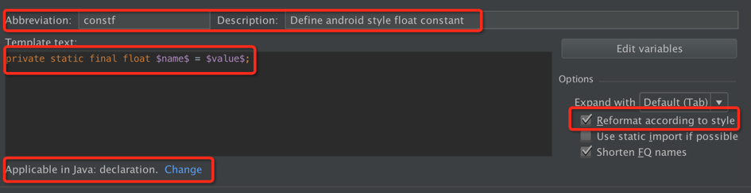

本文介绍一些, 在Android开发中会经常使用的小知识点, 每篇10个. 第三篇.

<!-- more -->
> 更多: http://www.wangchenlong.org/


系列
[第一篇](http://www.wangchenlong.org/2016/02/23/tips/1603/231-android-tips-1/), [第二篇](http://www.wangchenlong.org/2016/02/23/tips/1603/232-android-tips-2/), [第三篇](http://www.wangchenlong.org/2016/02/23/tips/1603/233-android-tips-3/), [第四篇](http://www.wangchenlong.org/2016/02/24/tips/1603/241-android-tips-4/), [第五篇](http://www.wangchenlong.org/2016/02/24/tips/1603/242-android-tips-5/).

---

# [UIAutomatorViewer](http://developer.android.com/tools/testing-support-library/index.html#uia-viewer)

自动化测试是Android测试的趋势, 稳定\复用, 最常用的工具就是Espresso.
使用UIAutomatorViewer获取资源的Id, 
位置/android-sdk/tools/uiautomatorviewer, 点击即可使用.



---

# GitHub标签

[网址](http://shields.io/), 比如:
 


---

# 有趣的SVG库

[地址](https://github.com/Pixplicity/sharp), 加载SVG格式的图片, 修改颜色属性.


---

# Json插件

JSONOnlineViewer, 网络请求插件, 获取Json数据, 位置**View->JSONViewer**.
GsonFormat, 根据Json自动生成类的插件, 在**Command+N**里面.

附一张插件的截图, 其他随意.



---

# 设置Interceptor

Retrofit升级到beta3版本, 使用了最新Okhttp3, Interceptor的设置方式发生改变.

旧版
```java
OkHttpClient client = new OkHttpClient().Builder();

HttpLoggingInterceptor loggingInterceptor = new HttpLoggingInterceptor();
loggingInterceptor.setLevel(HttpLoggingInterceptor.Level.BASIC);
MarvelSigningInterceptor signingInterceptor = new MarvelSigningInterceptor(
    BuildConfig.MARVEL_PUBLIC_KEY, BuildConfig.MARVEL_PRIVATE_KEY);

client.interceptors().add(signingInterceptor);
client.interceptors().add(loggingInterceptor);
```

替换, 新版
```java
        HttpLoggingInterceptor loggingInterceptor = new HttpLoggingInterceptor();
        loggingInterceptor.setLevel(HttpLoggingInterceptor.Level.BASIC);

        MarvelSigningInterceptor signingInterceptor = new MarvelSigningInterceptor(
                BuildConfig.MARVEL_PUBLIC_KEY, BuildConfig.MARVEL_PRIVATE_KEY);

        OkHttpClient client = new OkHttpClient.Builder()
                .addInterceptor(signingInterceptor)
                .addInterceptor(loggingInterceptor)
                .build();
```

> 否则可能会发生: **HTTP 409 Conflict**, 未输入正确的验证方式, 私钥错误.

---

# Okhttp输出log信息

[参考](https://github.com/square/okhttp/tree/master/okhttp-logging-interceptor), 可以输出log信息, 使用, 当前版本是3.0.1.
```gradle
compile "com.squareup.okhttp3:logging-interceptor:${libs.okhttp}"
```

输出参考:
```log
D/OkHttp: <-- 200 OK http://gateway.marvel.com/v1/public/characters?offset=0&... (1552ms, unknown-length body)
```

---

# 全屏ImageView

status bar设置成为透明颜色.
```xml
    <style name="AppTheme.NoStatusBar">
        <item name="android:windowTranslucentStatus">true</item>
    </style>
```

页面的根布局是``CollapsingToolbarLayout``.
```xml
<android.support.design.widget.CollapsingToolbarLayout
    xmlns:android="http://schemas.android.com/apk/res/android"
    android:layout_width="match_parent"
    android:layout_height="match_parent"
    android:fitsSystemWindows="true">

    <ImageView
        android:layout_width="match_parent"
        android:layout_height="match_parent"
        android:contentDescription="@null"
        android:fitsSystemWindows="true"
        android:scaleType="centerCrop"
        android:src="@drawable/christmas"/>

</android.support.design.widget.CollapsingToolbarLayout>
```
效果


> 其他布局无法覆盖效果, [参考](http://www.jcodecraeer.com/a/anzhuokaifa/androidkaifa/2015/1122/3712.html).

---

# AS模板

位置: File->Other Settings->Default Settings->Editor->Live Templates
熟练之后, 根据**简写+Tab**就可以使用了, 当然也可以自己添加.



自定义模板:
缩写(Abbreviation), 描述(Description), 内容(Template text), 应用场景, 格式化.


---

# 动画效果的网站

[网址](http://www.openprocessing.org/browse/), 网站里面有很多好玩的动画效果, 而且都是编程实现, 方便移植, 如[雪花](http://www.openprocessing.org/sketch/84771)效果.

---

# ListView的ViewHolder

Android官方推荐使用RecyclerView代替ListView, 但是很多守旧的人不想这么做, 那么, 也需要使用ViewHolder提升加载速度.

基本用法
```java
static class ViewHolder() {
	TextView testName;
	TextView testDesc;
}

// ...

@Override
public View getView(int position, View convertView, ViewGroup parent) {
	View rowView = convertView;

	// 初始化ViewHolder
	if (convertView == null) {
		LayoutInflater inflater = (LayoutInflater) parent.getContext()
			.getSystemService(Context.LAYOUT_INFLATER_SERVICE);
		rowView = inflater.inflate(R.layout.view_test_row, parent, false);
		ViewHolder viewHolder = new ViewHolder();
		viewHolder.testName = (TextView) rowView.findViewById(R.id.test_tv_name);
		viewHolder.testDesc = (TextView) rowView.findViewById(R.id.test_tv_desc);
		rowView.setTag(viewHolder);
	}

	// 使用ViewHolder
	ViewHolder holder = (ViewHolder) rowView.getTag();
	holder.testName.setText("Test: " + position);
	holder.testDesc.setText("This is number " + position + ". ");

	return rowView;
}
```

---

OK, that's all! Enjoy it.

---

> 原始地址: 
> http://www.wangchenlong.org/2016/02/23/tips/1603/233-android-tips-3/
> 欢迎Follow我的[GitHub](https://github.com/SpikeKing), 关注我的[简书](http://www.jianshu.com/users/e2b4dd6d3eb4/latest_articles), [微博](http://weibo.com/u/2852941392), [CSDN](http://blog.csdn.net/caroline_wendy), [掘金](http://gold.xitu.io/#/user/56de98c2f3609a005442ec58). 
> 我已委托“维权骑士”为我的文章进行维权行动. 未经授权, 禁止转载, 授权或合作请留言.

