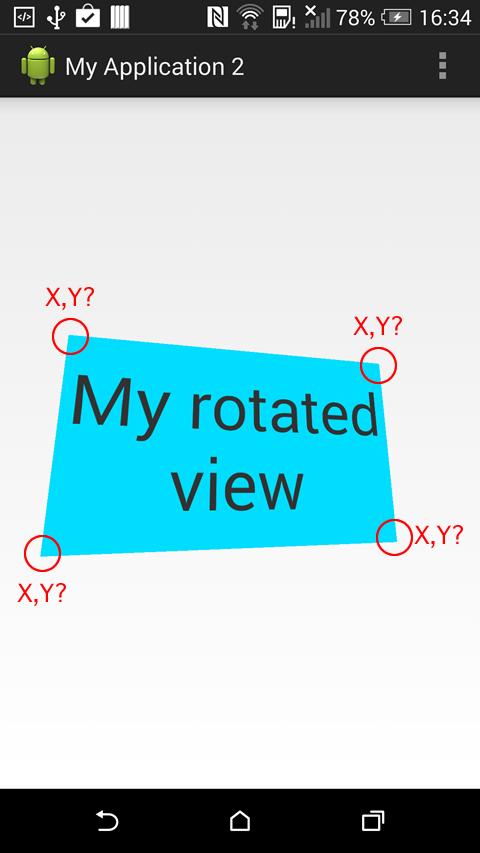

介绍关于Android的一些有趣的小知识点. 本文是第六篇, 欢迎阅读.

<!-- more -->
> 更多: http://www.wangchenlong.org/
> 欢迎Follow我的GitHub: https://github.com/SpikeKing


系列
[第一篇](http://www.wangchenlong.org/2016/02/23/tips/1603/231-android-tips-1/), [第二篇](http://www.wangchenlong.org/2016/02/23/tips/1603/232-android-tips-2/), [第三篇](http://www.wangchenlong.org/2016/02/23/tips/1603/233-android-tips-3/), [第四篇](http://www.wangchenlong.org/2016/02/24/tips/1603/241-android-tips-4/), [第五篇](http://www.wangchenlong.org/2016/02/24/tips/1603/242-android-tips-5/), [第六篇](http://www.wangchenlong.org/2016/02/25/tips/1605/071-android-tips-6/).

---

# 控件位置

获取控件四个角的位置.



代码

``` java
public static PointF getTopLeftCorner(View view) {
    float src[] = new float[8];
    float[] dst = new float[]{0, 0, view.getWidth(), 0, 0, view.getHeight(), view.getWidth(), view.getHeight()};
    view.getMatrix().mapPoints(src, dst);
    PointF cornerPoint = new PointF(view.getX() + src[0], view.getY() + src[1]);
    return cornerPoint;
}

public static PointF getTopRightCorner(View view) {
    float src[] = new float[8];
    float[] dst = new float[]{0, 0, view.getWidth(), 0, 0, view.getHeight(), view.getWidth(), view.getHeight()};
    view.getMatrix().mapPoints(src, dst);
    PointF cornerPoint = new PointF(view.getX() + src[2], view.getY() + src[3]);
    return cornerPoint;
}

public static PointF getBottomLeftCorner(View view) {
    float src[] = new float[8];
    float[] dst = new float[]{0, 0, view.getWidth(), 0, 0, view.getHeight(), view.getWidth(), view.getHeight()};
    view.getMatrix().mapPoints(src, dst);
    PointF cornerPoint = new PointF(view.getX() + src[4], view.getY() + src[5]);
    return cornerPoint;
}

public static PointF getBottomRightCorner(View view) {
    float src[] = new float[8];
    float[] dst = new float[]{0, 0, view.getWidth(), 0, 0, view.getHeight(), view.getWidth(), view.getHeight()};
    view.getMatrix().mapPoints(src, dst);
    PointF cornerPoint = new PointF(view.getX() + src[6], view.getY() + src[7]);
    return cornerPoint;
}
```

---

# 异常Error:(216) Apostrophe not preceded by ...

原因是字符串中包含单引号(**'**), 导致, 添加转义符号即可.

``` xml
<string name="hello_kotlin">Hello Kotlin, I\'m Spike! </string>
```

[参考](http://stackoverflow.com/questions/15705647/apostrophe-not-preceded-by)

---

# Editable和String的转换

Editable是EditText使用的字符串格式. 与String可以相互转换.

``` java
Editable editable = new SpannableStringBuilder("Pass a string here");
String str = editable.toString();
```

[参考](http://stackoverflow.com/questions/13352531/android-how-can-i-convert-a-string-to-a-editable)

---

# 设置WRAP_CONTENT和VERTICAL

在Kotlin中, 使用属性扩展时, 需要记住类.
WRAP_CONTENT属于LayoutParams, VERTICAL属于LinearLayout.

``` java
import android.widget.LinearLayout.LayoutParams
import android.widget.LinearLayout

layoutParams = LayoutParams(LayoutParams.WRAP_CONTENT, LayoutParams.WRAP_CONTENT)
orientation = LinearLayout.VERTICAL
```

---

# 删除Commit

删除本地的Commit, 使用

``` bash
git reset --hard HEAD~1
```

> HEAD~1表示前1个, 可以自由设置数字.

[参考](http://stackoverflow.com/questions/1338728/delete-commits-from-a-branch-in-git)

---

# 标准的gitignore

这是标准的gitignore, 默认项目会生成, 旧的项目可能没有, 需要补充.

``` bash
*.iml
.gradle
/local.properties
/.idea/workspace.xml
/.idea/libraries
.DS_Store
/build
/captures
```

---

# String转换16进制

DeviceID可能是字母, 会导致解析失败, 解析前需要转换String为16进制数.

``` java
// String转换40位16进制, 防止DeviceID是字母, @Thx 秋爽&康康
public String toHex(String arg) {
    if (!TextUtils.isEmpty(arg)) {
    	return String.format("%040x", new BigInteger(1, arg.getBytes(/*YOUR_CHARSET?*/)));
    }
}
```

---

That's all! Enjoy it!

---

> 最初发布地址: 
> http://www.wangchenlong.org/2016/02/25/tips/1605/071-android-tips-6/
> 欢迎Follow我的[GitHub](https://github.com/SpikeKing), 关注我的[简书](http://www.jianshu.com/users/e2b4dd6d3eb4/latest_articles), [CSDN](http://blog.csdn.net/caroline_wendy), [掘金](http://gold.xitu.io/#/user/56de98c2f3609a005442ec58). 
> 我已委托“维权骑士”为我的文章进行维权行动. 未经授权, 禁止转载, 授权或合作请留言.

