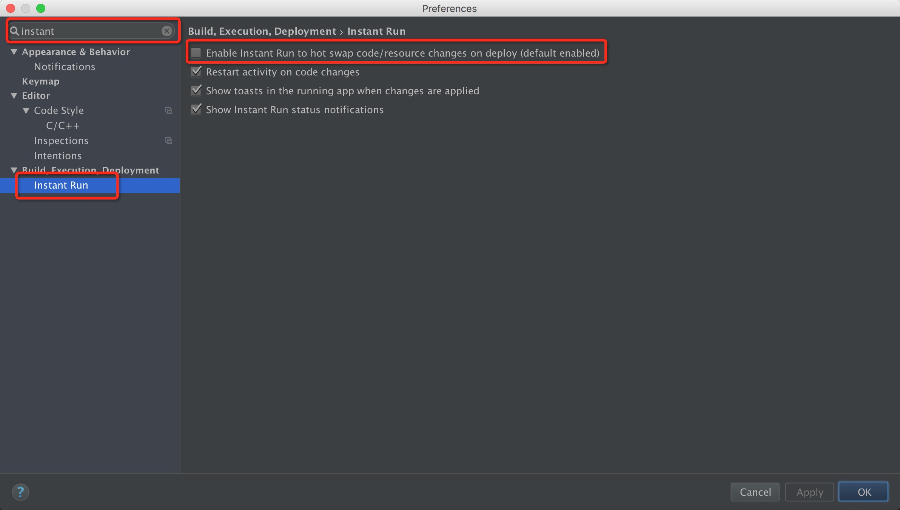
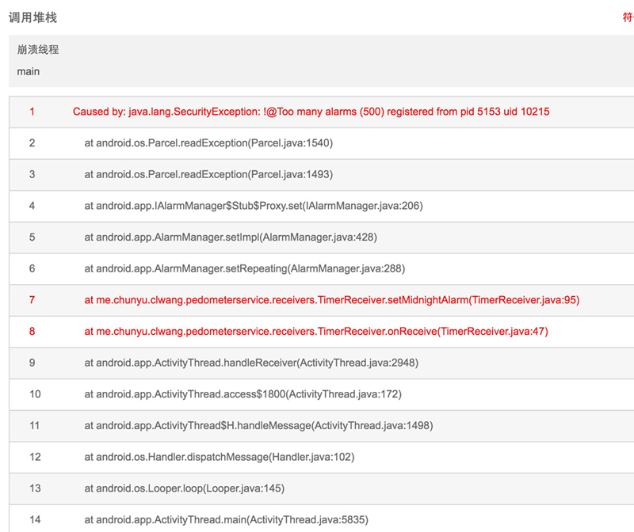
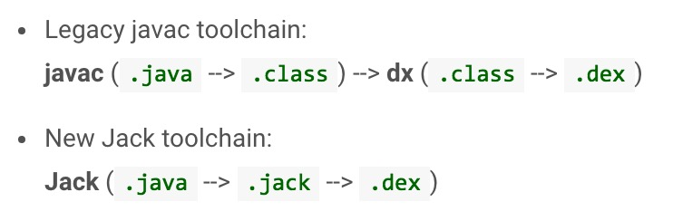

介绍关于Android的一些有趣的小知识点. 本文是第七篇, 欢迎阅读.

<!-- more -->
> 更多: http://www.wangchenlong.org/
> 欢迎Follow我的GitHub: https://github.com/SpikeKing


系列
[第一篇](http://www.wangchenlong.org/2016/02/23/tips/1603/231-android-tips-1/), [第二篇](http://www.wangchenlong.org/2016/02/23/tips/1603/232-android-tips-2/), [第三篇](http://www.wangchenlong.org/2016/02/23/tips/1603/233-android-tips-3/), [第四篇](http://www.wangchenlong.org/2016/02/24/tips/1603/241-android-tips-4/), [第五篇](http://www.wangchenlong.org/2016/02/24/tips/1603/242-android-tips-5/), [第六篇](http://www.wangchenlong.org/2016/02/25/tips/1605/071-android-tips-6/), [第七篇](http://www.wangchenlong.org/2016/02/25/tips/1605/072-android-tips-7/).

---

# 不兼容 Gradle 版本

**条件**: 升级AS 2.0, 执行``gradle clean; gradle build``报错.

``` bash
Error:(1, 0) Plugin with id 'com.android.application' not found
```

**原因**: 使用``gradle``命令的版本过低, 如使用``2.8版本``编译``2.10版本``的项目. 查看``gradle``版本, ``gradle -v``.


升级Gradle命令的版本即可, 建立软连接命令.

``` bash
ln -s /Users/wangchenlong/Installations/gradle-all/gradle-2.10/bin/gradle gradle
```

同时使用v2.8版本, 需要额外gradle命令, 如``gradle-v2.8``, 旧版本项目需要2.8版本以下.

``` bash
ln -s /Users/wangchenlong/Installations/gradle-all/gradle-2.10/bin/gradle gradle-v2.8
```

> Gradle 2.10与2.8跨度较大, 互不兼容, 需要保持在Shell中保持两份Gradle.

---

# AS 2.0 的 Sugar ORM 数据库

在使用``Android Studio 2.x``版本时, 会启用``Instant Run``会影响``Sugar ORM数据库``的使用. **取消**勾选即可.



否则报错, [参考](http://stackoverflow.com/questions/33031570/android-sugar-orm-no-such-table-exception)

``` bash
Sugar ORM No Such Table Exception
```

---

# AlarmManager 取消注册

**AlarmManager**有时会被系统关闭, 需要重复注册, 保证鲁棒性, 但保证只有一个生效, 需要取消之前的设置.

PendingIntent的标记选择``FLAG_UPDATE_CURRENT``, 而不是``FLAG_CANCEL_CURRENT ``.

``` java
PendingIntent.getBroadcast(appContext, 0, intent, PendingIntent.FLAG_UPDATE_CURRENT);
```

设置之前取消即可, 为了安全, 可以捕获``setRepeating``的异常.

``` java
        // 设置之前先取消前一个PendingIntent
        am.cancel(pi);

        // 设置每一天的计时器. 添加异常捕获, 防止崩溃
        try {
            am.setRepeating(AlarmManager.RTC_WAKEUP, calendar.getTimeInMillis(), AlarmManager.INTERVAL_DAY, pi);
        } catch (Exception e) {
            e.printStackTrace();
        }
```

否则报错: ``Too many alarms registered from pid.``



[参考](http://stackoverflow.com/questions/14485368/delete-alarm-from-alarmmanager-using-cancel-android)

---

# Jack Option

``Android Studio 2.1.0`` 版本支持[Jack](https://source.android.com/source/jack.html)的功能, 即**Java Android Compiler Kit**. Jack是Android新的工具链, 优点是完全开源(与Oracle之争), 加快编译速度(节省一步), 提供代码优化与混淆功能.



使用方式

``` gradle
android {
    defaultConfig {
        jackOptions {
            enabled true
        }
    }
    compileOptions {
        sourceCompatibility JavaVersion.VERSION_1_8
        targetCompatibility JavaVersion.VERSION_1_8
    }
}
```

非常遗憾, 依赖注入库Dagger或Butterknife的核心库``android-apt``暂时不支持Jack, [参考](https://bitbucket.org/hvisser/android-apt/issues/33/support-for-jack-and-jill#comment-None).

```
com.neenbedankt.gradle.plugins:android-apt:1.8
```

需要编译版本``Build Tools 24.0.0+``, 即``Android N``以上.

---

# 启动页面留白

应用在启动时, 系统会加载数据, 需要启动完成``Application``的onCreate方法, ``Activity``的onCreate与onResume方法, 会产生短暂的留白, 不可避免.

> 也可能是黑色, 与应用的主题有关, light是白色, dark是黑色.

一些主流应用都会解决这一问题, 如微信\QQ\网易云音乐等, 但某些应用可能并未注意. 去掉留白需要修改启动页面的主题样式, 设置``windowBackground ``属性, 默认是白色, 可以修改为其他颜色或展示Logo图片.

``` xml
<style name="WelcomeTheme" parent="Theme.AppCompat.Light.NoActionBar">
    <item name="windowNoTitle">true</item>
    <item name="windowActionBar">false</item>
    <item name="android:windowFullscreen">true</item>
    <item name="android:windowBackground">@drawable/launch_logo</item>
</style>
```

并且把首页布局的背景设置为透明, 在加载完成后, 再显示广告或其他信息.

``` xml
android:background="@android:color/transparent"
```

这样可以提升用户体验, 开发之道在于细节. Thx@柏毅老师.

---

OK, that's all! Enjoy it!

---

> 最初发布地址: 
> http://www.wangchenlong.org/2016/02/25/tips/1605/072-android-tips-7/
> 欢迎Follow我的[GitHub](https://github.com/SpikeKing), 关注我的[简书](http://www.jianshu.com/users/e2b4dd6d3eb4/latest_articles), [CSDN](http://blog.csdn.net/caroline_wendy), [掘金](http://gold.xitu.io/#/user/56de98c2f3609a005442ec58). 
> 我已委托“维权骑士”为我的文章进行维权行动. 未经授权, 禁止转载, 授权或合作请留言.

