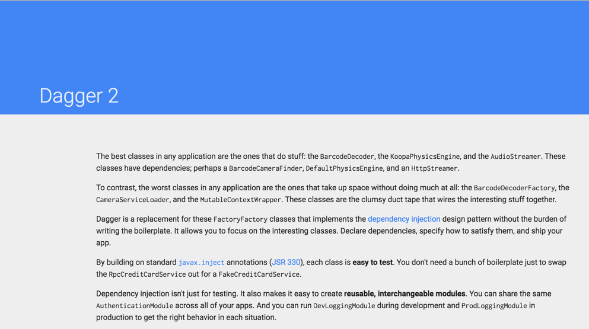
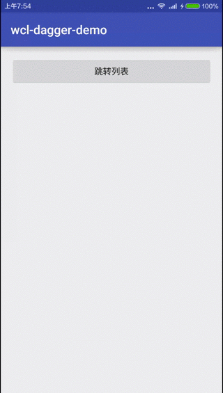

[Dagger](http://google.github.io/dagger/)已经加入Google I/O, 是[Square](https://github.com/square/dagger/)开发的依赖注入库, 发布2.0版本. Dagger表示**有向非循环图(Directed Acyclic Graph, DAGger)**. 好处和优点有很多, [参考](https://github.com/codepath/android_guides/wiki/Dependency-Injection-with-Dagger-2/), 所有优秀的开源库, 本质上都是让程序更加清晰, 编写更加容易. 让我们来看看怎么使用?

<!-- more -->
> 更多: http://www.wangchenlong.org/

主要内容:
(1) 项目的配置环境.
(2) Inject\Module\Component的使用方法.
(3) 结合Retrofit和RxAndroid.

本文源码的GitHub[下载地址](https://github.com/SpikeKing/wcl-dagger-demo)



---

# 配置

从一个最简单的HelloWorld开始, 设置``build.gradle``, 并添加依赖库.

```gradle
buildscript {
    repositories {
        jcenter()
    }
    dependencies {
        classpath 'com.neenbedankt.gradle.plugins:android-apt:1.8'
    }
}

// Lambda表达式
plugins {
    id "me.tatarka.retrolambda" version "3.2.4"
}

apply plugin: 'com.android.application'
apply plugin: 'com.neenbedankt.android-apt' // 注释处理

android {
    compileSdkVersion 23
    buildToolsVersion "23.0.2"

    defaultConfig {
        applicationId "clwang.chunyu.me.wcl_dagger_demo"
        minSdkVersion 17
        targetSdkVersion 23
        versionCode 1
        versionName "1.0"
    }

    buildTypes {
        release {
            minifyEnabled false
            proguardFiles getDefaultProguardFile('proguard-android.txt'), 'proguard-rules.pro'
        }
    }

    // 注释冲突
    packagingOptions {
        exclude 'META-INF/services/javax.annotation.processing.Processor'
    }

    // 使用Java1.8
    compileOptions {
        sourceCompatibility JavaVersion.VERSION_1_8
        targetCompatibility JavaVersion.VERSION_1_8
    }
}

dependencies {
    compile fileTree(dir: 'libs', include: ['*.jar'])
    testCompile 'junit:junit:4.12'
    compile 'com.android.support:appcompat-v7:23.1.1'
    compile 'com.android.support:recyclerview-v7:23.1.1' // RecyclerView

    compile 'com.jakewharton:butterknife:7.0.1' // 标注

    compile 'com.google.dagger:dagger:2.0.2' // dagger2
    compile 'com.google.dagger:dagger-compiler:2.0.2' // dagger2

    compile 'io.reactivex:rxandroid:1.1.0' // RxAndroid
    compile 'io.reactivex:rxjava:1.1.0' // 推荐同时加载RxJava

    compile 'com.squareup.retrofit:retrofit:2.0.0-beta2' // Retrofit网络处理
    compile 'com.squareup.retrofit:adapter-rxjava:2.0.0-beta2' // Retrofit的rx解析库
    compile 'com.squareup.retrofit:converter-gson:2.0.0-beta2' // Retrofit的gson库

    provided 'javax.annotation:jsr250-api:1.0' // Java标注
}
```

Gradle的配置与功能.
``android-apt``, 提供**dagger2使用编译生成类**的功能.
```gradle
buildscript {
    repositories {
        jcenter()
    }
    dependencies {
        classpath 'com.neenbedankt.gradle.plugins:android-apt:1.8'
    }
}

apply plugin: 'com.neenbedankt.android-apt' // 注释处理
```

``retrolambda``, 提供**Lambda表达式支持**的功能.
```gradle
// Lambda表达式
plugins {
    id "me.tatarka.retrolambda" version "3.2.4"
}

android{
    ...
    // 使用Java1.8
    compileOptions {
        sourceCompatibility JavaVersion.VERSION_1_8
        targetCompatibility JavaVersion.VERSION_1_8
    }
}
```

``recyclerview``, 提供**RecyclerView控件**的功能.
```gradle
   compile 'com.android.support:recyclerview-v7:23.1.1' // RecyclerView
```

``butterknife``, 提供**xml至java的id映射**的功能.
```gradle
   compile 'com.jakewharton:butterknife:7.0.1' // 标注
```

``dagger2``, 提供**dagger2支持**的功能.
```gradle
    compile 'com.google.dagger:dagger:2.0.2' // dagger2
    compile 'com.google.dagger:dagger-compiler:2.0.2' // dagger2
```

``rx``, 提供**rxandroid和rxjava支持**的功能.
```gradle
    compile 'io.reactivex:rxandroid:1.1.0' // RxAndroid
    compile 'io.reactivex:rxjava:1.1.0' // 推荐同时加载RxJava
```

``retrofit``, 提供**网络请求的支持**的功能.
```gradle
    compile 'com.squareup.retrofit:retrofit:2.0.0-beta2' // Retrofit网络处理
    compile 'com.squareup.retrofit:adapter-rxjava:2.0.0-beta2' // Retrofit的rx解析库
    compile 'com.squareup.retrofit:converter-gson:2.0.0-beta2' // Retrofit的gson库
```

``annotation``, 提供**java注释解析**的功能.
```gradle
    provided 'javax.annotation:jsr250-api:1.0' // Java标注
```

---

# 主活动
使用主页跳转页面展示dagger2.

``dagger2``主要包含``inject``, ``module``, ``component``三个部分, 即:
``Inject``, 依赖注入``dependency injection``, 把定义的类注入声明.
``Module``, 模块, 提供若干类, 在依赖注入中使用.
``Component``, 组件, 注册若干模块至项目中.

提供图接口, 在项目中, **使用注入**的类.
```java
/**
 * Dagger2的图接口
 * <p/>
 * Created by wangchenlong on 16/1/2.
 */
public interface DemoGraph {
    void inject(MainActivity mainActivity); // 注入MainActivity

    void inject(ReposListActivity reposListActivity); // 注入列表Activity
}
```

组件, 注册Module, 添加主Module.
```java
/**
 * 组件
 * Created by wangchenlong on 16/1/2.
 */
@Singleton
@Component(modules = {MainModule.class, ApiModule.class})
public interface DemoComponent extends DemoGraph {
    final class Initializer {
        private Initializer() {
        } // No instances.

        // 初始化组件
        public static DemoComponent init(DemoApplication app) {
            return DaggerDemoComponent.builder()
                    .mainModule(new MainModule(app))
                    .build();
        }
    }
}
```
> 如果没有Module可以暂时不添加, 但是要提供类, 项目注册需要使用中间类.
> ``DaggerDemoComponent``是自动生成的类, Dagger+类名.

项目的应用, 把``Application``添加至组件, 并提供**注册类的图接口**.
```java
/**
 * 应用信息
 * <p/>
 * Created by wangchenlong on 16/1/2.
 */
public class DemoApplication extends Application {
    private static DemoGraph sDemoGraph;
    private static DemoApplication sInstance;

    @Override public void onCreate() {
        super.onCreate();
        sInstance = this;
        buildComponentAndInject();
    }

    public static DemoGraph component() {
        return sDemoGraph;
    }

    public static void buildComponentAndInject() {
        sDemoGraph = DemoComponent.Initializer.init(sInstance);
    }
}
```

主活动, 注册入图, 并添加跳转下一页功能.
```java
/**
 * 主活动, 注册类.
 */
public class MainActivity extends AppCompatActivity {

    @Override
    protected void onCreate(Bundle savedInstanceState) {
        super.onCreate(savedInstanceState);
        setContentView(R.layout.activity_main);

        ButterKnife.bind(this);

        DemoApplication.component().inject(this); // 应用注入
    }

    // 跳转列表视图
    public void gotoReposList(View view) {
        startActivity(new Intent(this, ReposListActivity.class));
    }
}
```

主模块, 提供Application和Resources.
```java
/**
 * 主要模块, 提供Application和resources.
 * <p/>
 * Created by wangchenlong on 16/1/2.
 */
@Module
public class MainModule {
    private final DemoApplication mApp;

    public MainModule(DemoApplication application) {
        mApp = application;
    }

    @Provides
    @Singleton
    protected Application provideApplication() {
        return mApp;
    }

    @Provides
    @Singleton
    protected Resources provideResources() {
        return mApp.getResources();
    }
}
```

> 方法名添加``@Provides``和``@Singleton``, 使用时, 添加``@Inject``即可. 表示在``Module``中创建, 在其他类中, 可以任意注入使用.
> 方法的参数, 因为没有调用方法的过程, 所以需要模块(Module)提供.

---

# 其他活动
主要是列表展示**GitHub用户的库信息**, 使用Retrofit和RxAndroid的方法.

使用``RecyclerView``展示库信息, 注入类到图中, 并注入``Github服务``, ``Rx``分发信息.
```java
/**
 * 代码库列表
 * <p>
 * Created by wangchenlong on 16/1/2.
 */
public class ReposListActivity extends Activity {
    @Bind(R.id.repos_rv_list) RecyclerView mRvList;

    @Inject
    GitHubService mGitHubService;

    @Override protected void onCreate(Bundle savedInstanceState) {
        super.onCreate(savedInstanceState);
        setContentView(R.layout.activity_repos_list);
        ButterKnife.bind(this);

        DemoApplication.component().inject(this);

        LinearLayoutManager manager = new LinearLayoutManager(this);
        manager.setOrientation(LinearLayoutManager.VERTICAL);
        mRvList.setLayoutManager(manager);

        ListAdapter adapter = new ListAdapter();
        mRvList.setAdapter(adapter);
        loadData(adapter);
    }

    // 加载数据
    private void loadData(ListAdapter adapter) {
        mGitHubService.getRepoData("SpikeKing")
                .subscribeOn(Schedulers.newThread())
                .observeOn(AndroidSchedulers.mainThread())
                .subscribe(adapter::setRepos);
    }
}
```

适配器.
```java
/**
 * RecyclerView的Adapter
 * <p>
 * Created by wangchenlong on 16/1/2.
 */
public class ListAdapter extends RecyclerView.Adapter<ListAdapter.RepoViewHolder> {

    private ArrayList<Repo> mRepos; // 库信息

    public ListAdapter() {
        mRepos = new ArrayList<>();
    }

    public void setRepos(ArrayList<Repo> repos) {
        mRepos = repos;
        notifyItemInserted(mRepos.size() - 1);
    }

    @Override
    public RepoViewHolder onCreateViewHolder(ViewGroup parent, int viewType) {
        View view = LayoutInflater.from(parent.getContext())
                .inflate(R.layout.item_repo, parent, false);
        return new RepoViewHolder(view);
    }

    @Override public void onBindViewHolder(RepoViewHolder holder, int position) {
        holder.bindTo(mRepos.get(position));
    }

    @Override public int getItemCount() {
        return mRepos.size();
    }

    public static class RepoViewHolder extends RecyclerView.ViewHolder {

        @Bind(R.id.item_iv_repo_name) TextView mIvRepoName;
        @Bind(R.id.item_iv_repo_detail) TextView mIvRepoDetail;

        public RepoViewHolder(View itemView) {
            super(itemView);
            ButterKnife.bind(this, itemView);
        }

        public void bindTo(Repo repo) {
            mIvRepoName.setText(repo.name);
            mIvRepoDetail.setText(String.valueOf(repo.description + "(" + repo.language + ")"));
        }
    }

    public static class Repo {
        public String name; // 库的名字
        public String description; // 描述
        public String language; // 语言
    }
}
```

GitHub请求接口, 返回Rx的观察者.
```java
/**
 * GitHub服务
 * <p>
 * Created by wangchenlong on 16/1/2.
 */
public interface GitHubService {
    String ENDPOINT = "https://api.github.com";

    // 获取库, 获取的是数组
    @GET("/users/{user}/repos")
    Observable<ArrayList<ListAdapter.Repo>> getRepoData(@Path("user") String user);
}
```

Api模块, 使用请求接口创建GitHub服务.
```java
/**
 * 接口模块
 * <p>
 * Created by wangchenlong on 16/1/2.
 */
@Module
public class ApiModule {

    @Provides
    @Singleton
    protected GitHubService provideGitHubService() {
        Retrofit retrofit = new Retrofit.Builder()
                .baseUrl(GitHubService.ENDPOINT)
                .addCallAdapterFactory(RxJavaCallAdapterFactory.create()) // 添加Rx适配器
                .addConverterFactory(GsonConverterFactory.create()) // 添加Gson转换器
                .build();
        return retrofit.create(GitHubService.class);
    }
}
```
> 不要忘记, 注册模块(Module)到组件(Component). 组件组成到应用, 模块注册到组件.

---

Dagger2的重要优势就是省略了很多重复的创建, 直接依赖注入非常简单.

效果


OK, that's all! Enjoy It!

---

> 原始地址: 
> http://www.wangchenlong.org/2016/03/16/use-dagger-first/
> 欢迎Follow我的[GitHub](https://github.com/SpikeKing), 关注我的[简书](http://www.jianshu.com/users/e2b4dd6d3eb4/latest_articles), [微博](http://weibo.com/u/2852941392), [CSDN](http://blog.csdn.net/caroline_wendy), [掘金](http://gold.xitu.io/#/user/56de98c2f3609a005442ec58), [Slides](https://slides.com/spikeking). 
> 我已委托“维权骑士”为我的文章进行维权行动. 未经授权, 禁止转载, 授权或合作请留言.