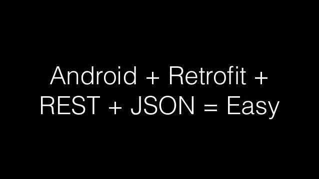

[Retrofit](http://square.github.io/retrofit/)是Square开发的网络服务库, 简化Get/Post网络服务的使用, 配合Rx和Dagger有更好的效果. Retrofit已经更新到第2.0版, 本文介绍一些常见的使用方式.

<!-- more -->
> 更多: http://www.wangchenlong.org/

> 注意: Retrofit2的beta3版本, 使用Okhttp3, Interceptor使用方式发生改变.



主要
(1) Retrofit2(**beta3**)的请求方式.
(2) Okhttp3的Interceptor.
(3) Okhttp3的Deserializer.
(4) Retrofit2使用**Gson转换器(Converter)**和**RxJava适配器(Adapter)**.

---

# 基本请求

使用接口, 区分**Get**和**Post**方法.
```java
/**
 * 网络请求
 * <p>
 * Created by wangchenlong on 16/1/21.
 */
public interface MarvelService {
    String END_POINT = "http://gateway.marvel.com/";
    String PARAM_API_KEY = "apikey";
    String PARAM_HASH = "hash";
    String PARAM_TIMESTAMP = "ts";

    @GET("/v1/public/characters")
    Observable<List<AvengersCharacter>> getCharacters(@Query("offset") int offset);
}
```
使用Retrofit类创建接口服务, 指定Gson为转换器, RxJava为适配器.
```java
public class RestDataSource implements Repository {

    private final MarvelService mMarvelService;

    @Inject
    public RestDataSource() {
        // Log信息
        HttpLoggingInterceptor loggingInterceptor = new HttpLoggingInterceptor();
        loggingInterceptor.setLevel(HttpLoggingInterceptor.Level.BASIC);

        // 公私密匙
        MarvelSigningInterceptor signingInterceptor = new MarvelSigningInterceptor(
                BuildConfig.MARVEL_PUBLIC_KEY, BuildConfig.MARVEL_PRIVATE_KEY);

        // OkHttp3.0的使用方式
        OkHttpClient client = new OkHttpClient.Builder()
                .addInterceptor(signingInterceptor)
                .addInterceptor(loggingInterceptor)
                .build();

        // 选择人物信息
        Gson customGsonInstance = new GsonBuilder()
                .registerTypeAdapter(new TypeToken<List<AvengersCharacter>>() {
                        }.getType(),
                        new MarvelResultsDeserializer<AvengersCharacter>())
                .create();

        // 适配器
        Retrofit marvelApiAdapter = new Retrofit.Builder()
                .baseUrl(MarvelService.END_POINT)
                .addConverterFactory(GsonConverterFactory.create(customGsonInstance))
                .addCallAdapterFactory(RxJavaCallAdapterFactory.create())
                .client(client)
                .build();

        // 服务
        mMarvelService = marvelApiAdapter.create(MarvelService.class);
    }

    // 返回人物信息
    @Override
    public Observable<List<AvengersCharacter>> getCharacters(int currentOffset) {
        return mMarvelService.getCharacters(currentOffset);
    }
}
```

---

# Interceptor

Interceptor是拦截器, 在发送之前, 添加一些参数, 或者获取一些信息.
如MarvelSigningInterceptor是添加参数, loggingInterceptor是打印参数.
```java
/**
 * 添加Key和密码
 * <p>
 * Created by wangchenlong on 16/1/21.
 */
public class MarvelSigningInterceptor implements Interceptor {
    private final String mApiKey;
    private final String mApiSecret;

    public MarvelSigningInterceptor(String apiKey, String apiSecret) {
        mApiKey = apiKey;
        mApiSecret = apiSecret;
    }

    @Override public Response intercept(Interceptor.Chain chain) throws IOException {
        String marvelHash = MarvelApiUtils.generateMarvelHash(mApiKey, mApiSecret);
        Request oldRequest = chain.request();

        // 添加新的参数
        HttpUrl.Builder authorizedUrlBuilder = oldRequest.url()
                .newBuilder()
                .scheme(oldRequest.url().scheme())
                .host(oldRequest.url().host())
                .addQueryParameter(MarvelService.PARAM_API_KEY, mApiKey)
                .addQueryParameter(MarvelService.PARAM_TIMESTAMP, MarvelApiUtils.getUnixTimeStamp())
                .addQueryParameter(MarvelService.PARAM_HASH, marvelHash);

        // 新的请求
        Request newRequest = oldRequest.newBuilder()
                .method(oldRequest.method(), oldRequest.body())
                .url(authorizedUrlBuilder.build())
                .build();

        return chain.proceed(newRequest);
    }
}
```

> **addQueryParameter**添加网络参数.

Okhttp3使用了装饰者模式, 使用Builder添加Interceptor.
```java
        // OkHttp3.0的使用方式
        OkHttpClient client = new OkHttpClient.Builder()
                .addInterceptor(signingInterceptor)
                .addInterceptor(loggingInterceptor)
                .build();
```

---

# Deserializer

Deserializer是反序列化, Gson使用, 去除不使用的参数.
```java
public class MarvelResultsDeserializer<T> implements JsonDeserializer<List<T>> {
    @Override
    public List<T> deserialize(JsonElement je, Type typeOfT,
                               JsonDeserializationContext context) throws JsonParseException {
        // 转换Json的数据, 获取内部有用的信息
        JsonElement results = je.getAsJsonObject().get("data")
                .getAsJsonObject().get("results");
        return new Gson().fromJson(results, typeOfT);
    }
}
```
Gson使用Deserializer, 过滤不用的参数.
```java
        // 选择人物信息
        Gson customGsonInstance = new GsonBuilder()
                .registerTypeAdapter(new TypeToken<List<AvengersCharacter>>() {
                        }.getType(),
                        new MarvelResultsDeserializer<AvengersCharacter>())
                .create();
```

---

# 获取数据

Rx选择执行线程和返回线程.
```java
    private void loadData() {
        mCharactersSubscription = mRepository.getCharacters(0)
                .subscribeOn(Schedulers.io())
                .observeOn(AndroidSchedulers.mainThread())
                .subscribe(avengersCharacters -> {
                    mMainView.setListData(avengersCharacters);
                });
    }
```

---

Rxjava+[Dagger](http://www.wangchenlong.org/2016/03/16/use-dagger-first/)+[Retrofit](http://www.wangchenlong.org/2016/03/16/use-retrofit-first/), 三个编程库在一起使用时, 可以加速网络服务的开发效率. 感谢Square给我们带来的优雅世界.

OK, that's all! Enjoy it.

---

> 原始地址: 
> http://www.wangchenlong.org/2016/03/16/use-retrofit-first/
> 欢迎Follow我的[GitHub](https://github.com/SpikeKing), 关注我的[简书](http://www.jianshu.com/users/e2b4dd6d3eb4/latest_articles), [微博](http://weibo.com/u/2852941392), [CSDN](http://blog.csdn.net/caroline_wendy), [掘金](http://gold.xitu.io/#/user/56de98c2f3609a005442ec58), [Slides](https://slides.com/spikeking). 
> 我已委托“维权骑士”为我的文章进行维权行动. 未经授权, 禁止转载, 授权或合作请留言.